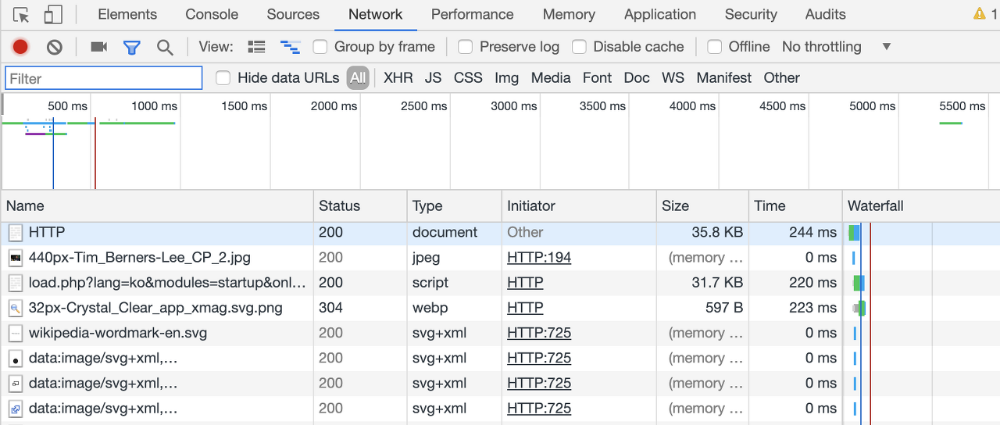
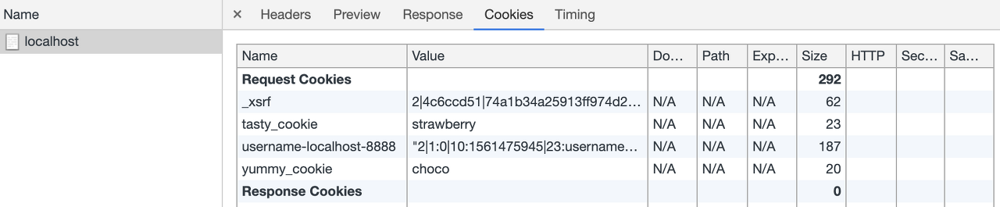

>  이 글은 ‘오픈튜토리얼스-생활코딩’의 Egoing님의 [강의](https://opentutorials.org/course/3385)를 정리했음을 먼저 밝힙니다.

 Cookie를 제대로 이해하기 위해서는 먼저 HTTP에 대해서 알고있어야 합니다. HTTP는 Hyper Text Transfer Protocol의 약자로 서버와 클라이언트간에 요청/응답 관계에 대한 통신 규약을 말합니다. HTTP는 크게 request와 response를 위한 메세지로 구분되어 있습니다. HTTP는 눈에 쉽게 보이지 않는 추상적인 개념이기 때문에 쉽게 파악하기 위해서 크롭 개발자 도구를 활용해서 학습해 보도록 하겠습니다.

 크롬 개발자도구를 켜서 networks에 들어가 보도록 하겠습니다. 그리고 새로고침 버튼을 누르면 아래와 같은 화면이 출력됩니다. (웹 페이지마다 다릅니다.) 여기에 출력되는 정보들은 클라이언트와 서버간에 주고받고있는 정보들을 의미합니다. 이렇게 서로 주고받는 정보를 확인하는 것은 웹과 관련된 작업을 하는데 있어서 굉장히 중요한 테크닉이 될 수 있습니다.



 이 중 하나를 클릭하여 header탭에 들어가 보면 이 정보에 대한 자세한 내용 또한 확인이 가능합니다.

### Cookie 생성

 쿠키는 HTTP 프로토콜에 속해있는 기술입니다. mozila재단에서 만든 쿠키에 대한 사용 설명서를 읽어보면 쿠키는 **session management**( 인증), **personality**(개인화), **tracking**(트래킹) 이렇게 세 가지 목적을 가지고 있다고 합니다. 그렇다면 쿠키는 어떻게 생성할 수 있는지 [예제](https://developer.mozilla.org/ko/docs/Web/HTTP/Cookies)와 함께 살펴보도록 하겠습니다.

```
HTTP/1.0 200 OK
Content-type: text/html
Set-Cookie: yummy_cookie=choco
Set-Cookie: tasty_cookie=strawberry

[page content]
```

 기본적인 형태는 `Set-Cookie: <cookie-name>=<cookie-value>` 입니다. 위의 예제에서 3번 째 줄은 'yummy cookie'라는 쿠키의 쿠키값이 'choco'라는 의미이고 4번 째 줄은 'tasty_cookie'쿠키의 쿠키값은 'strawberry'라는 의미이며 위의 코드는 이 두개의 쿠키를 생성하는 응답 메세지입니다. 

그럼 다음으로는 nodejs를 이용해서 쿠키를 생성 해 보도록 하겠습니다. 

```javascript
var http = require('http');
http.createServer(function(request, response){
     response.writeHead(200, {
         'Set-Cookie':['yummy_cookie=choco', 'tasty_cookie=strawberry']
     });
    response.end('Cookie!!');
}).listen(3000);
```

 `response.writeHead`코드를 사용하면 **응답하는 메세지를 조작**할 수 있습니다. 우리가 응답하는 메세지를 조작할 수 있다면, 이 응답 메세지에 Set-Cookie: 라는 메세지를 추가할 수 있게 되며 결국 쿠키를 생성하는 응답메세지를 최종적으로 생성할 수 있게 됩니다. 

 `response.writeHead`코드의 첫번 째 인자로는 status code가 들어가고 두번 째 인자로는 객체가 들어가도록 약속이 되어있습니다. 그런데 여기서 복수의 쿠키를 전달해야 할 때는 인자로 배열의 형태로 전해주도록 약속되어 있습니다. 자 그러면 이제는 위의 코드를 실행시킨 뒤에는 아래와 같이 코드를 다시 바꿔봅시다. 

```javascript
var http = require('http');
http.createServer(function(request, response){
    // response.writeHead(200, {
    //     'Set-Cookie':['yummy_cookie=choco', 'tasty_cookie=strawberry']
    // });
    response.end('Cookie!!');
}).listen(3000);
```

 이번에는 응답하는 메세지를 조작하지 않고 쿠키 값을 전달해주지 않았습니다. 하지만 크롬 개발자도구를 들어가서 파일의 헤더정보를 확인해 보면 request header에 이미 쿠키값이 심어져 있는 것을 볼 수 있습니다! 그리고 응답 헤더에서는 더 이상 쿠키를 전달하지 않는 것 또한 확인이 가능합니다. 



### Cookie 읽기

 생성한 쿠키를 다시 웹 브라우저가 웹 서버에게 요청 했을 때, 그것을 웹 애플리케이션 내에서 어떻게 알아 낼 수 있는지에 대해 알아봅시다. 예시 코드를 통해 설명을 진행하도록 하겠습니다. 

```javascript
var http = require('http');
var cookie = require('cookie');
http.createServer(function(request, response){
    var cookies = {};
    if(request.headers.cookie !== undefined){
        cookies = cookie.parse(request.headers.cookie);
    }
    response.writeHead(200, {
        'Set-Cookie':['yummy_cookie=choco', 'tasty_cookie=strawberry']
    });
    response.end('Cookie!!');
}).listen(3000);
```

 여기서 중요한 부분은 if문 입니다. `request.headers.cookie`는 request header의 쿠키에 대한 정보를 담고있습니다. 만약 여기에 정보가 하나라도 들어있다면 if문의 statement인 `cookies = cookie.parse(request.headers.cookie)` 코드가 실행되는데 `cookie.parse`코드는 `request.headers.cookie`의 객체화 해주고 이를 cookies라는 객체 변수에 담아준 것입니다.

 쿠키에 대한 정보를 객체에 담아주면, 객체에 담긴 키 값을 활용하여 쿠키 값을 우리 웹 애플리케이션에서 사용할 수 있습니다. `cookies.yummy_cookie`를 소스코드에 입력하면 choco라는 값을 사용하겠다는 의미처럼요

### HTTP request message

 웹 브라우저에서 웹 서버에 접속할 때, 크롬 개발자도구의 네트워크의 헤더에서 Request header에 적혀있는 정보들이 무엇을 의미하는지 알아보기 위해 구글에 http request header format라고 검색을 해 봅시다. 

- https://images.app.goo.gl/WsxVYpjhtQK1xqxK6

구글에서 http request message에 대해서 알기 쉽게 설명된 이미지를 찾았습니다. 먼저 제일 첫 부분에는 request line이 위치합니다. 그리고 그 아래에는 request header가 위치하며 이 둘을 합쳐서 request message header 라고 합니다. 그리고 한 줄을 띄운 그 아래의 메세지는 request message body입니다. 

 request line의 GET은 웹 브라우저와 웹 서버가 어떤 방식으로 소통할 지 나타내는 메소드입니다. 그 다음 /doc/test.html은 우리가 웹서버에 요청하고 있는 정보를 의미합니다. 마지막으로 HTTP/1.1은 현재 사용하고 있는 HTTP의 버전이 1.1임을 나타냅니다.  

아래는 request header에 대한 설명입니다.

- **host**는 우리가 요청하는 웹 서버의 주소를 나타냅니다.
- **user-agent**는 웹 브라우저의 다른 표현입니다. 지금 서버에 요청을 보내고 있는 웹 브라우저가 누구인가에 대한 정보를 나타냅니다. **Accept-encoding**은 정보를 압축해서 전달할 때 어떤 방식으로 압축 인코딩을 처리할 수 있는지를 나타냅니다. 
- **If-modified-since**는 내가 받은 파일이 마지막으로 언제 다운로드 된 것인지 나타내며, 웹 서버는 이 정보를 확인하여 업데이트가 필요 없는 경우엔 정보를 굳이 보내지 않아도 되기 떄문에 속도를 향상시키는데 사용할 수 있습니다. 

### HTTP response message

 이번에는 Response header에 적혀있는 정보들이 무엇을 의미하는지 알아보도록 하겠습니다.

- https://images.app.goo.gl/uxDNwxkCYP2Rr2J67

 제일 첫 줄은 status에 대한 정보가 출력됩니다. 차례대로 version, status code, phrase를 의미합니다. 예를 들어보면 'HTTP/1.1 200 0k'이런 형태입니다.

아래는 response header에 대한 설명입니다.

- **content-type**은 웹 브라우저가 서버에게 받은 파일을 어떤 형식으로 인식하여 해석할 지를 결정합니다.
- **content-length**는 받은 정보가 몇 바이트인지를 나타냅니다. 
- **content-encoding**은 어떤 방식을 통해 압축을 풀어 정보를 읽어들일지 결정합니다.
- **last-modified**는 마지막으로 언제 수정된 정보인지를 알려줍니다.  