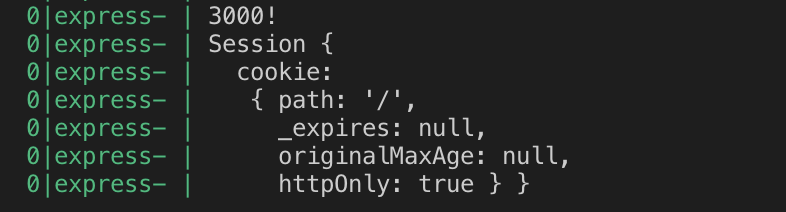
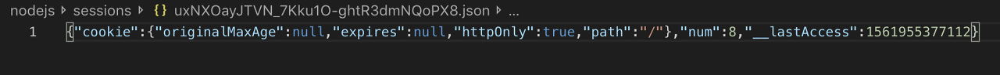

> 이 글은 ‘오픈튜토리얼스-생활코딩’의 Egoing님의 [강의](https://opentutorials.org/course/3400/21836)를 정리했음을 먼저 밝힙니다.

 쿠키가 등장하면서 요청과 응답만을 처리할 수 있었던 웹이, 이전의 통신 내용을 기억할 수 있게 되었습니다. 덕분에 개인화나 인증에 대한 발판이 만들어 졌습니다. 하지만 쿠키를 이용해서 인증을 이용하는 것은 매우매우 위험한 일입니다. 쿠키에 인증정보를 저장하는 순간 익명의 공격자나 웹 서비스를 운영하는 개발자 등의 사람들이 사용자의 인증정보를 쉽게 알아낼 수 있기 때문입니다. 그래서 인증 기능을 구현할 때 쿠키가 아닌 다른 방법이 필요하게 되었고, 이런 요구에 의해 생겨난 것이 session입니다.

```javascript
var express = require('express')
var session = require('express-session')
  
var app = express()
  
app.use(session({
  secret: 'asadlfkj!@#!@#dfgasdg',
  resave: false,
  saveUninitialized: true
}))
  
app.get('/', function (req, res, next) {
  res.send('Hello session');
})
 
app.listen(3000, function(){
    console.log('3000!');
});
```

 `npm install express`, `npm install -s express-session` 등 필요한 모듈을 모두 설치 후에 pm2나 nodemon을 통해 위의 코드를 실행시켜 보도록 하겠습니다.

 코드를 확인해보면 4번 째 줄의 `app.use(session( ... ))` 코드에 의해서 우리의 웹 애플리케이션이 실행 될 때마다 `app.use()`함수 안의 `session()` 함수가 실행되게 됩니다. 그리고 이 `session()`의 인자로는 객체를 전달 해 준 것을 확인할 수 있습니다. 이 session함수의 옵션들에 대해 알아보겠습니다.

- **secret:** 다른 사람들에게 노출되면 안되는 required option. Git같은 버전관리 시스템을 통해 소스코드를 관리 할 때는 이 값을 그대로 업로드하면 안되고 변수처리를 하거나 다른 사람들이 볼 수 없도록 다른 파일로 빼서 업로드 해야함
- **resave:** (false): 세션 데이터가 바뀌기 전까지는 세션 저장소에 값을 저장하지 않음
- **resave:** (true): 세션 데이터가 바뀌던 안바뀌던 세션 저장소에 값을 계속 저장을 함
- **saveUninitialized:** (true): 세션이 필요하기 전 까지는 세션을 구동시키지 않음

웬만하면 resave는 false, saveUninitialized는 true로 값을 두는게 좋습니다. 

### Session 객체

다음으로는 session 미들웨어를 소스코드 내 설치하고 `console.log(req.session)` 코드를 작성해보도록 하겠습니다. 

```javascript
var express = require('express')
var session = require('express-session')
var app = express()
 
app.use(session({
    secret: 'asadlfkj!@#!@#dfgasdg',
    resave: false,
    saveUninitialized: true
}))
 
app.get('/', function (req, res, next) {
    console.log(req.session);
    if(req.session.num === undefined){
        req.session.num = 1;
    } else {
        req.session.num =  req.session.num + 1;
    }
    res.send(`Views : ${req.session.num}`);
})
 
app.listen(3000, function () {
    console.log('3000!');
});
```



코드 내에서 session미들웨어를 사용하지 않으면 `req.session`을 출력하면 undefined라는 값이 출력됩니다. 즉, 이는 우리가 session 미들웨어를 사용하면 request의 property에 은밀하게 **session이라는 객체가 추가**된다는 것을 의미합니다.  

 이렇게 입력된 session에 대한 정보는 default값으로 memory에 저장됩니다. 하지만 이 memory 휘발성이기 때문에 웹 서버를 재부팅하면 저장된 정보가 다 사라지게 되고, 서버를 재부팅하는 순간 모든 사용자가 로그아웃되는 문제가 발생할 수 있습니다. 이런 문제를 해결하기 위해 사용되는 것이 바로 **session store** 입니다.

### Session Store

기존의 세션 저장소는 휘발성 메모리 형태였지만 웹 서버를 재부팅하더라도 세션 데이터가 유지되도록 세션 저장소를 변경 해 보도록 하겠습니다. compatible session store에 대한 다양한 모듈 중에서 file을 이용한 session store를 구현 해 보았습니다. 

```javascript
var express = require('express')
var session = require('express-session')
var FileStore = require('session-file-store')(session)
var app = express()
 
app.use(session({
    secret: 'asadlfkj!@#!@#dfgasdg',
    resave: false,
    saveUninitialized: true,
    store:new FileStore()
}))
 
app.get('/', function (req, res, next) {
    console.log(req.session);
    if(req.session.num === undefined){
        req.session.num = 1;
    } else {
        req.session.num =  req.session.num + 1;
    }
    res.send(`Views : ${req.session.num}`);
})
 
app.listen(3000, function () {
    console.log('3000!');
});
```

1. 먼저 사용자가 세션 아이디를 가지고 있는 상태에서 서버에 접속하면, express-session 미들웨어가 `request header`에 쿠키 값으로 세션 아이디를 전송합니다.
2. 또한 express-session 미들웨어는 아이디 값을 가지고 '세션 저장소'에서 그 아이디에 대응되는 파일을 읽고, 그 파일의 데이터 기반으로 request 속성에 session이라는 객체를 추가합니다.
3. 그래서 우리가 `req.session.num`과 같은 값을 수정하면, 그에 대한 데이터가 '세션 저장소'에 저장이 됩니다. 
4. 결국, 웹 서버가 재부팅 되더라도 세션에 대한 정보는 '세션 저장소'에 저장되어 있기 때문에 삭제되지 않고 유지됩니다.

- 세션 저장소를 위와 같이 FileStore가 아닌 MySQL로 바꾸면 MySQL을 세션 저장소로 활용할 수 있게 됩니다.



세션 저장소에는 위처럼 파일 형태로 데이터가 저장됩니다.