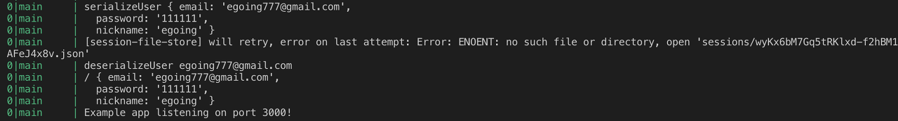

> 이 글은 ‘오픈튜토리얼스-생활코딩’의 Egoing님의 [강의](https://opentutorials.org/course/3402/21869)를 정리했음을 먼저 밝힙니다.

 로그인과 같은 인증 기능을 구현하기 위해서 우리가 직접 인증을 구현하는 것이 아니라 다른 개발 회사들이 구현한 인증방법을 우리가 빌려 사용 할 수 있습니다. 이 때 필요한 것이 passport.js입니다. 물론 이외에도 더 다양한 미들웨어가 존재하지만 passport.js가 가장 보편적으로 사용되는 미들웨어이기 때문에 이에 대해 공부해보도록 하겠습니다. 

### passport.js 설치

 passport.js는 우리가 로그인 방법을 확장해 나가는 방법들을 strategies(전략)이라는 단어로 구분짓습니다. 300가지 정도 되는 다양한 전략들이 있지만 일단은 아이디와 비밀번호를 통해서 로그인 및 회원가입을 진행하는 전통적 방식의 인증을 passport를 통해 구현해 보는것을 우선으로 공부 할 예정입니다. 

- passport 설치 방법: 터미널에서 `npm install passport` 명령어 입력
- 전통적 방식 로그인 구현: 터미널에서 `npm install passport-local` 명령어 입력
- 기본 형태: http://www.passportjs.org/packages/passport-local/

 

일단은 위의 세가지 작업을 모두 완료하였다면 기본적인 passport사용을 위한 설치는 마친 것 입니다. 여기서 passport미들웨어는 session을 내부적으로 사용하기 때문에 반드시 **express-session을 활성화 하는 코드의 아래**에 위치해야 합니다. 

### passport.js 인증 구현

 로그인 UI에 정보를 입력하고 submit버튼을 눌렀을 때, 로그인 정보를 /login_process 라는 path로 전송한다고 가정을 해 봅시다. 그러면 우리는 이 path가 post방식으로 받는 정보에 대해서 passport.js 버전으로 코드를 수정해 주어야 합니다. 

```javascript
var passport = require('passport'),
  LocalStrategy = require('passport-local').Strategy;

app.post('/auth/login_process',
  passport.authenticate('local', {
    successRedirect: '/',
    failureRedirect: '/auth/login'
  }));
```

 코드 중 passport.js 관련 부분만 떼어서 가져와 보았습니다. 일단 passport 홈페이지를 참고하여 passport모듈을 알맞은 코드 형태로 로드해주었고, 그 아래에 post방식으로 로그인 정보를 전송하는 코드입니다. post방식으로 /auth/login_process 경로로 정보가 전송 되며, 로그인이 성공하면 / 경로인 홈으로 리다이렉트 되고 로그인이 실패하면 /auth/login 경로로 리다이렉트 되는 코드입니다. 

### Passport.js 자격 확인

 코드 중 중요한 부분만 따로 떼어 보았습니다. 완벽히 이해하기 보다는 대충 감을 익히기 위한 정도로만 설명을 하겠습니다.

```javascript
router.get('/login', function (request, response) {
  var title = 'WEB - login';
  var list = template.list(request.list);
  var html = template.HTML(title, list, `
    <form action="/auth/login_process" method="post">
      <p><input type="text" name="email" placeholder="email"></p>
      <p><input type="password" name="pwd" placeholder="password"></p>
      <p>
        <input type="submit" value="login">
      </p>
    </form>
  `, '');
  response.send(html);
});
```

 위의 코드에서 저는 HTML form의 ID값의 이름은 email, 비밀번호 값의 이름은 pwd로 정보를 전송하고 있습니다. [이 곳](http://www.passportjs.org/packages/passport-local/ )에서 참고하여 작성한 로그인을 위한 자격확인 코드는 아래와 같습니다. 

```javascript
var passport = require('passport'),
  LocalStrategy = require('passport-local').Strategy;

passport.use(new LocalStrategy(
  {
    usernameField: 'email',
    passwordField: 'pwd'
  },
  function (username, password, done) {
    console.log('LocalStrategy', username, password);
  }
));
```

`passport.use(new LocalStrategy(...))` 함수의 첫 번째 인자로는 ID와 비밀번호 정보의 이름을 **객체**의 형태로 전달해 주고 그 다음 인자 부터는 콜백함수를 주는 형태입니다. 저는 각각 email, pwd라는 이름으로 form을 전송했으니 그와 동일하게 객체를 선언하였습니다. 그럼 여기서 코드를 좀 더 추가하겠습니다.

```javascript
passport.use(new LocalStrategy(
  {
    usernameField: 'email',
    passwordField: 'pwd'
  },
  function (username, password, done) {
    console.log('LocalStrategy', username, password);
    if(username === authData.email){
      console.log(1);
      if(password === authData.password){
        console.log(2);
        return done(null, authData);
      } else {
        console.log(3);
        return done(null, false, {
          message: 'Incorrect password.'
        });
      }
    } else {
      console.log(4);
      return done(null, false, {
        message: 'Incorrect username.'
      });
    }
  }
));
```

 이번에도 passport.js 홈페이지의 local에 대한 strategy 글을 참고한 코드입니다. (저는 이고잉님의 코드를 참고하였습니다.) 기본적으로는 아래의 두가지만 기억을 하면 됩니다. 

1. 로그인 정보 일치시: **done(null, 유저정보)** 를 리턴
2. 로그인 정보 불일치시: **done(null, false, 틀린 이유 메세지)** 를 리턴

 이를바탕으로 위의 코드를 해석해 보면 아래와 같습니다. 

- console.log(1)의 경우: 유저의 아이디가 일치
- console.log(2)의 경우: 유저의 아이디가 일치, 패스워드가 일치
- console.log(3)의 경우: 유저의 아이디는 일치하지만, 패스워드는 불일치
- console.log(4)의 경우: 유저의 아이디가 불일치

### Passport.js 세션 이용

 pm2, nodemon과 같은 자동 재시작 도구를 사용하는 경우 세션 정보가 저장이 안되는 현상이 발생할 수 있습니다. session 디렉토리에 파일이 추가되면 node가 재시작 되기 때문입니다. 이를 해결하기 위해서 sessions 디렉토리에 대해서는 재시작을 하지 않도록 조치해야 합니다.

이 문제를 해결하기 위해서는 main.js 파일을 실행 시킬 때 명령어를 `pm2 start main.js --watch --ignore-watch="data/* sessions/*" --no-daemon` 이렇게 입력하시면 됩니다. data디렉토리와 sessions디렉토리에 대해서는 watch를 무시하겠다는 명령어 입니다. 

 passport.js 는 내부적으로 express-session를 사용합니다. 이 두 개의 미들웨어를 연결하기 위해서 기본적으로 넣어줘야 하는 코드는 다음과 같습니다. 

```javascript
app.use(passport.initialize());
app.use(passport.session());
```

 또한 위의 코드만 입력하면 '사용자에 대한 정보를 session으로 저장을 해야하는데, session에 대한 세팅이 되어있지 않다. serialize하라.' 대충 이런 내용의 오류 문구가 뜹니다. 이를 해결하기 위해서 아래와 같은 코드 또한 넣어줍시다.

```javascript
passport.serializeUser(function (user, done) {
  console.log('serializeUser', user);
  done(null, user.email);
});

passport.deserializeUser(function (id, done) {
  console.log('deserializeUser', id);
  done(null, authData);
});
```

1. passport.js에서는 우리가 로그인을 성공 했을 때 리턴해준 `done(null,authData)`의 authData값을 `passport.serializeUser`의 콜백함수의 첫 번째 인자(user)로 넘겨주기로 약속되어 있습니다. 
2. `passport.serializeUse`함수의 콜백함수에서의 `done(null, user.email)`은 user.email에 대한 정보를 session데이터 내 passport로 전송합니다. 즉, 로그인에 성공했을 때 로그인에 성공했다는 정보를 session store에 저장하는 것이 serializeUser의 기능입니다. 그래서 로그인 성공시 딱 한번만 호출됩니다.
3. `passport.deserializeUser`함수는 페이지를 방문 할 때 마다 콜백함수를 실행시킵니다. 즉, 페이지를 방문할 때 마다 이 사람이 유효한 사용자인지 체크하는 것이 deserializeUser의 기능입니다. 그래서 이 함수는 웹 애플리케이션을 사용하는 동안 여러번 호출됩니다. 




### 총 정리

 너무 길고 복잡한 내용이기 때문에 다시 한번 순서대로 정리해보겠습니다.

1. passport모듈 설치, express에 passport설치, express-session을 passport내부적으로 사용하겠다고 선언 
2. passport.authenticate함수를 통해 사용자가 입력한 정보를 passport가 local전략으로 받도록 선언
3. passport.use함수에 LocalStrategy를 설치하고, passport.use함수의 콜백함수로 사용자의 아이디와 비밀번호 올바른지 확인, 이로인해서 done함수가 리턴됨
4. done함수에 의해 serializeUser의 콜백함수 호출
5. serializeUser의 콜백함수에 의해, 사용자의 식별자 값이 session store의 passport데이터로 저장됨
6. 웹 페이지를 옮겨다닐 때 마다 deserializeUser가 호출되어 인증된 사용자인지 확인

