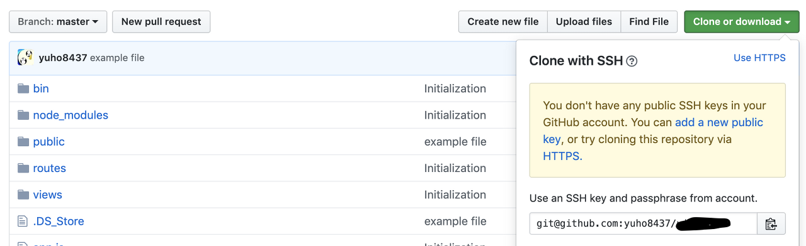

 자신이 제작하고 있는 웹 애플리케이션을 버전 관리 시스템으로 관리하고 싶다면, 자신이 사용하는 컴퓨터의 원하는 디렉토리 내에서 git clone명령어를 사용하여 github와 연동이 가능합니다. 하지만 만약에 이 컴퓨터가 내 로컬 컴퓨터가 아니라 AWS EC2 인스턴스 같은 서버 컴퓨터이고, 또한 내 repository가 다른사람에게는 공개되지 않은 private이라면 어떻게 해야할까요?

 현재 저는 서버 컴퓨터로 AWS EC2 우분투 인스턴스를 사용하고 있기 때문에 이와 관련한 방법을 알려드리겠습니다. 저와 다른 환경인 분들도 계시겠지만 내용은 거의 비슷하다고 생각하고 참고하시면 좋을 것 같습니다.  

1. 내 인스턴스 내에서 **ssh key-pair를 생성**합니다.

   이 [링크](http:// https//docs.gitlab.com/ee/ssh/#generating-a-new-ssh-key-pair)의 내용을 참고해서 key-pair를 생성하면 되는데, 저는 `ssh-keygen -o -t rsa -b 4096 -C "email@example.com"` 명령어를 사용하여 생성하였습니다. 뒤에 이메일은 공동작업 시 자신을 표현 할 수 있도록 원하는 이메일을 적어주시면 됩니다.

2. 홈 디렉토리에 **/.ssh/id_rsa.pub 파일이 생성되었는지 확인**합니다.

    `cd /home/<your-user-name>/.ssh` 후에 `ls -a` 명령어를 통해 id_rsa.pub이 존재하는 지 확인하는 방법도 있습니다.

3. `cat id_rsa.pub` 명령어를 사용하여 내 public key를 표출 한 뒤에 이를 ctrl+c로 복사해줍니다.

4. Github의 내 repositoy로 이동 후 setting - deploy key 카테고리에 복사 해 둔 내 **ssh public key를 등록**합니다.

5. 내 인스턴스 내에서 `git clone '아래 사진의 오른쪽 아래 부분 링크'` 명령어를 실행합니다. 

 위의 작업을 순차적으로 모두 진행하면, 내 인스턴스에서 private repository 연동이 완료됩니다 👊

