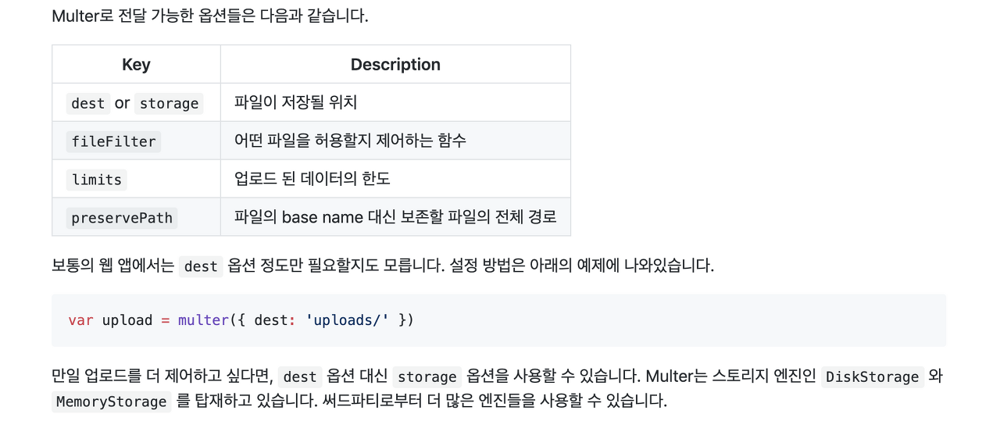

> 이 글은 ‘오픈튜토리얼스-생활코딩’의 Egoing님의 [강의](https://opentutorials.org/course/2136/11959)를 정리했음을 먼저 밝힙니다. 

 사용자가 업로드한 파일을 우리 서버컴퓨터의 원하는 디렉토리에 저장하는 기술을 express가 기본적으로 제공하고 있지는 않기 때문에, **multer**라는 모듈을 설치하여 이를 처리해야 합니다. `npm install --save multer` 명령어를 통해 우리 프로젝트에 multer모듈을 설치 해 줍시다. 그리고 노드파일 내 아래와 같이 소스코드를 추가하여 uploads라는 디렉토리에 사용자가 전달 한 파일이 저장되도록 설정합니다.

```javascript
var multer = require('multer')
var upload = multer({dest: 'uploads/'})
```

### 업로드 form

 pug파일의 형태로 업로드 폼을 만들어 보겠습니다. (저는 upload.pug라는 이름으로 생성하였습니다.)아래와 같이 코드를 작성해 주시면 됩니다. 여기서 method는 당연히 **post방식**으로 해야하며, `enctype='multipart/form-data'`를 꼭 적어넣어 주셔야 합니다. 그래야만 사용자가 전송한 파일 데이터를 서버로 전송 할 수 있습니다. 

```html
doctype html
html
    head
        meta(charset='utf-8')
    body
        form(action='upload' method='post' enctype='multipart/form-data')
            input(type='file' name='userfile')
            input(type='submit')
```

### multer

-  [multer 깃헙 홈페이지](https://github.com/expressjs/multer/blob/master/doc/README-ko.md)에 사용법이 자세히 설명되어있으니 참고하시길 바랍니다.

 우리가 위의 업로드 폼에서 upload라는 path에 post방식으로 파일을 보냈으니, upload라는 path에 post방식으로 들어온 이 정보를 라우터를 사용해서 받은 뒤, multer모듈을 사용해서 uploads라는 디렉토리로 보내주어야 합니다. 그럴 때에는 노드파일에 아래와 같이 소스코드를 작성 해 주면 됩니다.

```javascript
app.get('/upload', function(){
	res.render('upload')
});

app.post('/upload', upload.single('userfile')), function(){
	res.send('Uploaded')
});
```

app.post 함수의 실행 순서를 정리 해 보겠습니다.

1. 첫 번째로 라우터가 **/upload로 들어온 post정보**를 받습니다. 
2.  두 번째로 **multer미들웨어가 userfile이라는 name으로 들어온 파일정보를 upload디렉토리로 전송**합니다. 
3. 세 번째로는 `function(){res.send('Uploaded')}` **콜백함수가 실행**됩니다. 

 부가적으로, multer미들웨어를 사용하면 request객체에 사용자가 우리에게 전송한 파일에 대한 정보가 **req.file**의 형태로 담깁니다. req.file 객체 내에는 **fieldname, originalname, filename, path, size** 등의 정보가 담기기 때문에 이를 다양한 방법으로 활용 할 수 있습니다.

### multer의 활용



 multer 모듈의 깃헙 홈페이지에 나와있는 설명입니다. 저는 dest가 아닌 storage 옵션을 사용해보도록 하겠습니다. 그러기 위해서는 아래와 같이 모듈을 로드해야합니다. destination은 사용자가 전송한 파일을 어느 디렉토리에 저장하는지를 나타내고, filename은 그 디렉토리에 저장한 파일의 이름을 어떻게 할 것인가를 나타냅니다. 그래서 아래와 같이 모듈을 로드 한 뒤에 upload라는 변수를 사용하게되면, storage 변수가 가리키는 **destination에 filename의 이름으로 파일이 저장**됩니다. 

```javascript
var storage = multer.diskStorage({
  destination: function (req, file, cb) {
    cb(null, 'uploads/')
  },
  filename: function (req, file, cb) {
    cb(null, file.originalname)
  }
})

var upload = multer({storage: _storage})
```

 이 외 에도, 조건문이 포함 된 코드를 사용하면 이미지와 텍스트 파일을 서로 다른 디렉토리에 저장이 가능하며, 동일 이름의 파일이 존재 할 때에도 조건문을 통해 다르게 처리가 가능합니다. 그리고 이 내용과 같이 '정적파일'을 서비스 하는 방법도 공부하면 좋을 것 같습니다.

### 다중 업로드

 여러 개의 파일을 한 번에 올리고 싶다면 아래의 두 가지를 기억하시면 됩니다.

1. upload.single 이 아닌 **upload.array**를 사용한다!
2. HTML form에서 파일 업로드 부분에 **mutiple/ 속성**을 추가 해 준다!

```html
form(action="/create" method="post" enctype='multipart/form-data')
    input(type='file' name='userfile' multiple/)
    input(type="submit")
```