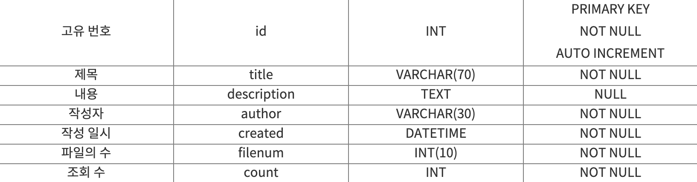
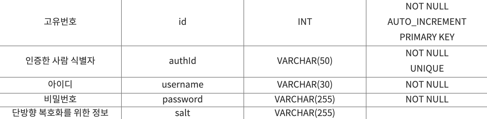
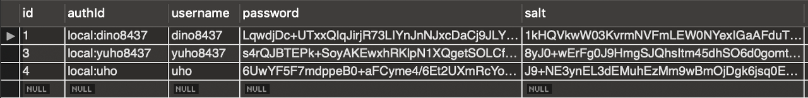

 mysql 데이터베이스를 이용한 글 읽기, 생성, 수정, 삭제가 가능한 게시판을 구현하기 위해서는 사용자가 작성하는 텍스트 정보들이 데이터베이스 서버 내 전달되어야 하고, 그러기 위해서는 데이터베이스에 테이블을 어떤 형태로 만들지 미리 모델링을 해놓아야 합니다. 그래서 이에 대해 찾아보던 중 공부한 내용을 바탕으로 이렇게 포스팅을 하게 되었습니다.

### 게시판 DB 모델링

게시판의 형태는 다양합니다. 이 중 저는 사용자가 글을 작성하고, 파일을 올릴 수 있는 게시판을 구현 한다고 가정하도록 하겠습니다. 그리고 이를 위한 아주 기본적인 정보들만 테이블에 담아보겠습니다. 이를 위해서는 **글에 대한 테이블** 하나와 **파일에 대한 테이블** 하나, 총 두 개의 테이블을 만들어야 합니다. **첨부파일이 여러 개**가 될 수 있기 때문에 테이블을 따로 만들어 주셔야 합니다.

 데이터베이스를 생성하기 전에 저는 아래와 같이 이 데이터베이스에 접근할 사용자를 mysql 내에서 생성 해 주었습니다. 그리고 아래의 사용자를 통해 mysql에 접속하려면 `./mysql -udev -p` 를 입력하면 됩니다. (사용자 이름이 dev이기 때문입니다.)

```sql
CREATE USER dev@127.0.0.1 IDENTIFIED BY '1234';
GRANT DELETE,INSERT,SELECT,UPDATE ON example.* TO dev@127.0.0.1;
```

#### 글에 대한 테이블 (tbl_board)



#### 파일에 대한 테이블 (tbl_files)


파일이름은 중복되면 오류가 날 수 있기 때문에, 파일을 저장 시 이름이 중복되지 않게 처리 해 주셔야 합니다.

위의 두 테이블을 아래의 코드로 구현 할 수 있습니다. 저는 price, state, class, location이라는 컬럼을 별도로 추가했으니 이 컬럼이 필요하지 않으신 분들은 이 부분 코드를 지우고 사용하시길 바랍니다.

```sql
CREATE TABLE tbl_board(
id INT AUTO_INCREMENT NOT NULL,
title VARCHAR(70) NOT NULL,
description TEXT NULL,
author VARCHAR(30) NOT NULL,
created DATETIME NOT NULL,
filenum INT(10) NOT NULL,
count INT NOT NULL,
class VARCHAR(30),
price INT, // networking에선 삭제
state TINYINT(2), // networking에선 TINYINT(1)
PRIMARY KEY(id)
);

CREATE TABLE tbl_files(
board_id INT NOT NULL,
file_id INT(10) NOT NULL,
filename VARCHAR(70)NOT NULL,
location TEXT
);
```

데이터베이스 내 사용자를 생성할 때, localhost와 127.0.0.1가 같은 접속이라고 생각하면 안 됩니다. 호스트를 둘 중 어느것으로 선택하느냐에 따라 패스워드가 달라지게 되므로 데이터베이스 서버 구축 시 함고하시길 바랍니다!

- https://jybaek.tistory.com/418
- https://dlong.tistory.com/m/133

### 회원 정보 DB 모델링

 우리는 아래와 같은 테이블을 만들어야 합니다. (저는 생활코딩 이고잉님의 [자료](https://opentutorials.org/course/2136/12257)를 참고하였습니다.)



 이를 소스코드로 작성하면 아래와 같습니다. 

```sql
CREATE TABLE users ( 
    id INT NOT NULL AUTO_INCREMENT , 
    authId VARCHAR(50) NOT NULL ,
    username VARCHAR(30) NOT NULL, 
    password VARCHAR(255) NOT NULL, 
    salt VARCHAR(255),
    PRIMARY KEY (id), 
    UNIQUE (authId)
) ENGINE = InnoDB;
```

 회원가입 시 DB에 아래와 같이 저장됩니다.

