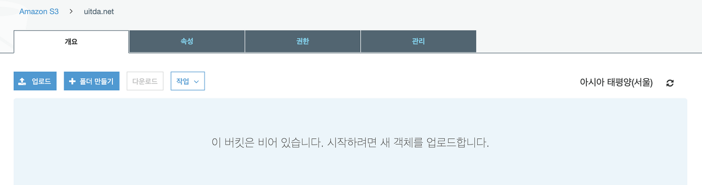
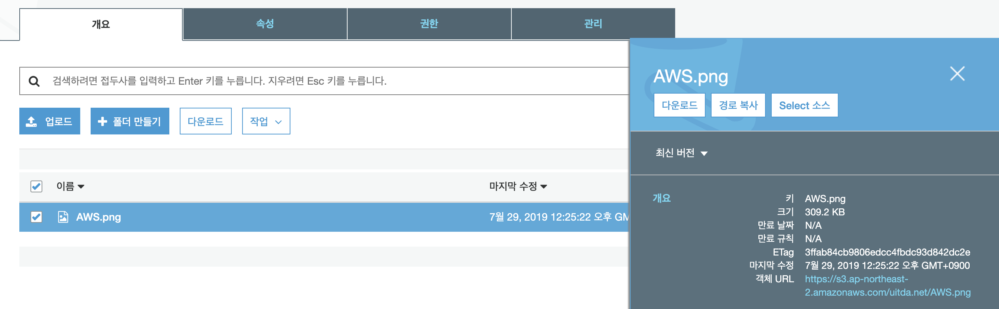
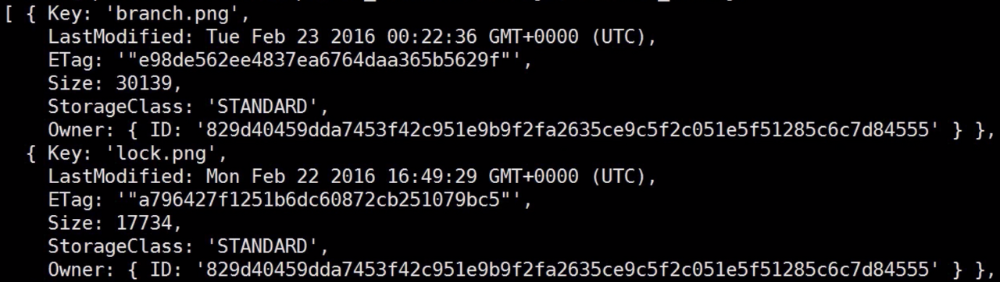

> 이 글은 ‘오픈튜토리얼스-생활코딩’의 egoing님 [강의](:https://www.opentutorials.org/course/2717/11344)를 정리했음을 먼저 밝힙니다.

 S3는 아마존 웹 서비스에서 제공하는 서비스 중 하나입니다. 풀어서 보면 Simplet Sotrage Service라는 의미를 가지고 있습니다. 즉, 어떠한 정보를 저장하는 서비스라는 말인데 그냥 쉽게 생각하면 파일을 저장하는 서비스라고 말할 수 있습니다. 물론 서버 컴퓨터에 파일을 직접 저장하는 방법도 있지만, S3를 사용하면 아주 많은 것들을 신경 쓰지 않고도 많은 양의 파일을 아주 안전하게 보관할 수 있다는 장점이 있습니다.

### S3를 사용하는 이유

- **내구성**: S3는 중요한 데이터를 저장 할 수 있고, 99.999999999%의 객체 내구성을 보장합니다. 데이터가 여러 시설과 각 시설의 여러 디바이스에 중복 저장됩니다. 
- **저렴한 비용**: S3를 사용하면 매우 저렴한 비용으로 대용량의 데이터를 저장할 수 있습니다. 사용하는 만큼 비용을 지불하면 되기 때문에 서비스의 비용 진입 장벽이 낮다고 말할 수 있습니다. 또한 접근 빈도에 따라 다른 방법으로 저장하여 비용을 절약합니다.
- **보안**: SSL을 통한 데이터 전송과 데이터 업로드 후 자동 암호화를 지원합니다. 
- **확장 가능**: S3의 서버가 마비되거나 죽을 것이라는 걱정을 할 필요가 없어집니다.
- **이벤트 알림 전송**: 다른 서비스의 트리거 역할로도 활용이 가능합니다. 

 위의 장점들 때문에 S3를 사용하며, 이와 더불어 S3를 사용하면 생기는 이점에는 콘텐츠 저장 및 배포, 빅 데이터 분석, 그리고 재해 복구 등이 있습니다. 

### 기본 조작

 아마존 웹 서비스 콘솔에서 S3를 조작 해 봅시다. 


 S3 콘솔에서 버킷만들기를 클릭하여 버킷을 생성합니다. '버킷'은 파일을 저장할 수 있는 공간 또는 저장 장치라고 생각하시면 됩니다. 여기서 주의할 점은 aws내 전체의 버킷과 중복되지 않는 고유 DNS 호환 이름을 설정해야 합니다. 자 그러면 아래와 같이 버킷이 생성되고 우리는 이 버킷에 파일을 업로드 할 수 있게 됩니다.






 위 처럼 업로드 버튼을 눌러 파일을 업로드 할 수도 있지만, 서버 내 미들웨어가 사용자의 요청을 받아 S3에 저장하도록 지시하는 방법 또한 사용이 가능합니다. 그리고 그 파일에 대한 정보는 S3 내에서 url링크의 형태로도 확인이 가능합니다.

### 업로드

 먼저 AWS SDK를 모듈의 형태로 가져오고 지역 설정을 서울(ap-northeast-2)로 설정하겠습니다. Express에 내장되어있는 File System(fs) 모듈 또한 필요하기 때문에 미리 로드 해 주었습니다. 

```javascript
var AWS = require('aws-sdk');
var fs = require('fs');
AWS.config.region = 'ap-northeast-2';
```

 그리고 아래와 같이 코드를 작성합니다.

```javascript
var s3 = new AWS.S3();
var param = {
    'Bucket':'example.net',
    'Key':'exp.png',
    'ACL':'public-read',
    'Body':fs.createReadStream('bigfile.png'),
    'ContentType':'image/png'
}
s3.upload(param, function(err, data){
    console.log(err);
    console.log(data);
})
```

- **Bucket**: 사용할 S3 버킷의 이름을 작성합니다.
- **key**: S3에 저장 될 파일의 이름을 작성합니다.
- **ACL**: 소유자만 쓰기가 가능하지만, 모든 사람이 읽을 수 있도록 public-read 권한 설정을 하였습니다.
- **Body**: 전송하는 방법에 대한 부분입니다. 
- **ContentType**: 업로드한 파일의 타입을 정의합니다. 

 Body파트는 Buffer, String_value, streamObject 세 가지 방법 중 하나를 선택하면 되는데 이 중 streamObject가 권장되는 방법입니다. 그래서 위 처럼 fs모듈 내 `createReadStream` 함수를 호출해서 bigfile이라는 파일을 조각조각 내서 담는 것을 실행한 뒤에, 이를 S3에 무리없이 전송하게 됩니다. 

파일 업로드 메소드에는 `upload`뿐 아니라 `putObject`라는 메소드 또한 존재합니다. 하지만 `putObject` 메소드에는 업로드 된 파일의 주소가 data에 담기지 않기 때문에, 이 주소가 필요 할 때에는 위 처럼 `upload`메소드를 사용 해 주시면 됩니다. 

### 목록

```javascript
s3.listObjects({Bucket: 'example.net'}).on('success', function handlePage(response) {
    for(var name in response.data.Contents){
        console.log(response.data.Contents[name].Key);
    }
    if (response.hasNextPage()) {
        response.nextPage().on('success', handlePage).send();
    }
}).send();
```

 위의 코드는 S3내 파일의 이름을 콘솔에 표시하는 소스코드입니다. 하나하나 살펴보도록 합시다.  

 일단 `listObjects` 메소드를 사용하고, 인자로는 자신이 사용할 버킷을 객체의 형태로 전달 해 줍니다. (저는 example.net이라는 버킷을 사용한다고 가정하였습니다.) 그리고 **이벤트 방식**인 `.on('success', function ...)` 형태의 코드를 작성합니다. 이는 `listObjects` 메소드를 통해 정보를 가져오는데 성공했다면 **success 뒤의 콜백함수를 실행**한다는 의미입니다. 

 그리고 정보를 한 번에 모두 가져오면 너무 많은 양이 한 번에 유입 될 수도 있기 때문에 페이징을 통해 순차적으로 정보를 가져오는데, 먼저 `response.hasNextPage()`를 통해 다음 페이지에 정보가 있는지 확인하고 정보가 있다면 `response.nextPage().on('success', handlePage).send()`를 통해 다음 페이지의 정보를 가져옵니다. 근데 여기서 인자로 `handlePage` 그 자체를 주었기 때문에 이는 **재귀함수**의 형태를 띄고 있다는 것을 알 수 있습니다. 

 마지막으로 `response.data.Contents`는 S3에 업로드 한 파일의 정보가 담기는 곳입니다.



`response.data.Contents` 에는 우리가 S3에 업로드 한 파일의 정보가 객체의 형태로 담겨있기 때문에 나중에 이를 웹 애플리케이션에 유용하게 적용 가능합니다. 

### 다운로드

```javascript
var file = require('fs').createWriteStream('logo.png');
var params = {Bucket:'example.net', Key:'logo.png'};
s3.getObject(params).createReadStream().pipe(file);
```

 기본적인 다운로드 방법으로는 Streaming requests 방법이 있습니다. 앞서 언급했듯이 데이터를 우리가 사용할 때 이 데이터의 용량이 굉장히 크면 우리의 컴퓨터가 마비가 될 우려가 있습니다. 때문에 파일을 통째로 사용하기 보다는 부분 부분 사용하는 것이 안정적이고 효율적이기 때문에 이 때 사용하는 방법이 Streaming 입니다. 

 우리는 현재 S3에 있는 정보를 읽어서, 그 읽은 정보를 우리의 컴퓨터 안에 다운로드 혹은 write 하는 중입니다. 그렇기 때문에 `createWriteStream`의 입력값으로 우리가 다운로드 받고 싶은 파일 이름을 넣어주고 file이라는 변수에 담아줍니다. 그리고 우리가 S3에서 읽어올 정보를 params에 담아 `s3.getObject(params).createReadStream()`로 읽어주고 이를 `pipe(file)`로 연결해줍니다. 

### 활용하기

Nodejs에 S3를 활용하기 위해서 일단 아래와 같이 필요한 모듈을 로드 해 줍시다. Express에 기본적으로 파일 업로드에 대한 기능이 내장되어 있지 않기 때문에 이를 구현하기 위해 **formidable**이라는 모듈을 로드 해 주었습니다. 

```javascript
var express = require('express');
var formidable = require('formidable');
var AWS = require('aws-sdk');
AWS.config.region = 'ap-northeast-2';
var app = express();
```

 그리고 파일을 업로드 하기 위한 form을 만들어 줍니다.

```javascript
app.get('/form', function(req, res){
    var output = `
<html>
<body>
    <form enctype="multipart/form-data" method="post" action="upload_receiver">
        <input type="file" name="userfile">
        <input type="submit">
    </form>
</body>
</html>
    `;
    res.send(output);
});
```

 upload_receiver라는 경로로 post방식으로 파일을 전송하였으니 이번에는 받는 쪽 코드를 아래에 작성하겠습니다.

```javascript
app.post('/upload_receiver', function(req, res){
   var form = new formidable.IncomingForm();
   form.parse(req, function(err, fields, files){
       var s3 = new AWS.S3();
       var params = {
            Bucket:'example.net',
            Key:files.userfile.name,
            ACL:'public-read',
            Body: require('fs').createReadStream(files.userfile.path)
       }
       s3.upload(params, function(err, data){
            var result='';
            if(err)
                result = 'Fail';
            else
                result = ``;
            res.send(`<html><body>${result}</body></html>`);
       });
   });
});
```

 전체 코드는 [여기](https://www.opentutorials.org/course/2717/11797)에 있습니다. 코드를 실행 했을 때 S3서버 컴퓨터에 잘 업로드가 된다면 성공입니다 😊

 