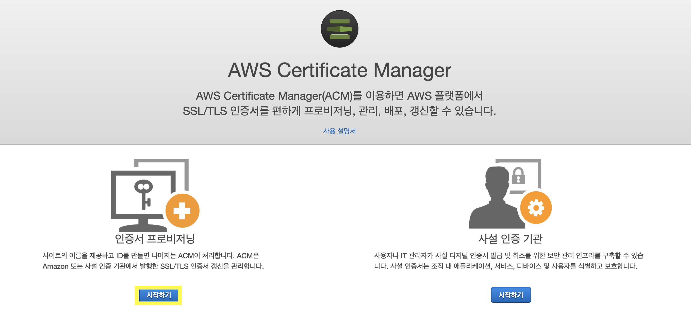
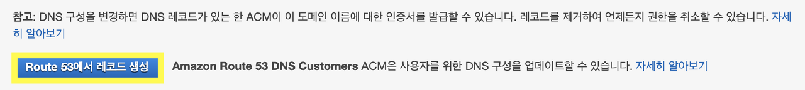

여러 웹 사이트를 돌아다니다 보면 어떤 사이트는 url주소가 http로 시작하고, 어떤 사이트는 https로 시작하는 것을 확인 할 수 있습니다. 이는 사용자와 서버가 주고받는 정보에 대해 데이터 무결성의 차이 때문인데 이 차이 때문에 https가 http보다 훨씬 안전한 접속이라는 것이 보장됩니다.

 https에 붙는 's'는 Secure Socket Layer를 의미하는데 이를 줄여서 **SSL**이나 **TLS**(Transport Layer Security)라고 부르며 SSL/TLS인증을 받아야 자신의 웹 사이트를 공격자로 부터 더 안전한 사이트로 만들 수 있습니다. AWS의 ACM에서는, AWS 기반 웹 사이트 및 애플리케이션에 대한 공인 SSL/TLS 인증서를 생성 및 관리하는 복잡한 과정을 처리할 수 있습니다. 이번 포스팅에서 ACM에 대해서 알아보기 전에 SSL/TLS에 대한 정의 먼저 살펴보도록 합시다.

### TLS (전송 계층 보안)

> 아래 내용은 [위키피디아](https://ko.wikipedia.org/wiki/전송_계층_보안)의 설명입니다.

 전송 계층 보안(Transport Layer Security, TLS)은 통신 보안을 제공하기 위해 설계된 암호 규약이다. 이 규약은 인터넷 같이 TCP/IP 네트워크를 사용하는 통신에 적용되며, 통신 과정에서 전송계층 종단간 보안과 데이터 무결성을 확보해준다. 이 규약은 웹 브라우징, 전자 메일, 인스턴트 메신저 같은 응용 부분에 적용되고 있다. 국제 인터넷 표준화 기구(IETF)에 의해 현재 구식(deprecate)으로 간주되어 있다. 최종 갱신은 RFC 5246이고, 최종 갱신 버전은 넷스케이프에서 만든 SSL 표준을 바탕으로 했다.

우선 첫 단계에서 서버와 클라이언트는 암호 스위트를 교환한다. 이 단계에서 키 교환과 인증에 사용될 암호화 방법, 메시지 인증 코드(MAC)가 결정된다. 키 교환과 인증 알고리즘은 공개키 방법을 사용하거나 미리 공유된 키(TLS-PSK)를 사용할 수도 있다. 메시지 인증 코드들은 HMAC 해시 함수로 만든다. SSL에서는 비표준 무작위 함수를 사용한다.

SSL 규약은 처음에 넷스케이프가 만들었다. 1.0 버전은 공개 된 적이 없고, 2.0 버전이 1995년 2월에 이르러서야 릴리스가 된다. 그러나 이 버전은 많은 보안 결함 때문에 3.0 버전으로 곧바로 이어진다. 3.0은 1996년 릴리스 된다. 결국 3.0 버전은 TLS 버전 1.0의 기초가 되고, IETF에서 1999년 1월에 RFC 2246 표준 규약으로 정의하게 된다.

### ACM (AWS Certificate Manager)

 HTTPS 인증은 인증서 발급기관에서 사이트 인증을 통해 인증서를 발급 해 주는 형태로 이루어집니다. 무료로 몇 개월 간 개인 웹 사이트에 인증서를 발급해 주는 기관도 존재하고 그게 아니라면 유료로 인증서를 발급 받는 방법도 있는데, 자신이 AWS를 사용하고 있다면 ACM을 통해 무료로 인증서를 발급받을 수 있습니다.

아마존에서는 다음과 같은 서비스를 제공한다고 합니다. 저는 이 중 ACM 인증서를 사용하려고 합니다.

> ACM에서 제공하는 공인 인증서(ACM 인증서) 또는 ACM으로 가져온 인증서를 사용할 수 있습니다. ACM 인증서는 도메인 이름과 도메인 내의 여러 이름을 보호할 수 있습니다. 또한 ACM을 사용하여 원하는 만큼의 하위 도메인을 보호할 수 있는 와일드카드 SSL 인증서를 생성할 수도 있습니다.

 ACM은 X.509 버전 3 인증서를 생성합니다. 각 인증서는 13개월 동안 유효하며 다음 확장이 포함됩니다.

- **기본 제약** - 인증서의 주체가 인증 기관(CA)인지 여부를 지정합니다.
- **기관 키 식별자** - 인증서에 서명하는 데 사용되는 프라이빗 키에 해당하는 퍼블릭 키를 식별할 수 있습니다.
- **주체 키 식별자** - 특정 퍼블릭 키가 포함된 인증서를 식별할 수 있습니다.
- **키 사용** - 인증서에 포함된 퍼블릭 키의 용도를 정의합니다.
- **확장 키 사용** - **키 사용** 확장에 지정된 용도에 추가하여 퍼블릭 키를 사용할 수 있는 하나 이상의 용도를 지정합니다.
- **CRL 배포 지점** - CRL 정보를 얻을 수 있는 위치를 지정합니다.

### 콘솔을 통한 공인 인증서 요청

 

1. ACM 콘솔에 로그인하여 인증서 프로비저닝 시작하기 버튼을 클릭합니다. 그리고 '공인인증서 요청'을 클릭합니다. 

2. 자신의 웹 사이트 도메인 이름을 입력합니다.

    www.example.com 같은 FQDN(Fully Qualified Domain Name)이나 example.com 같은 베어 또는 apex 도메인 이름을 사용할 수 있습니다. 맨 왼쪽에서 별표(*)를 와일드카드로 사용하여 동일한 도메인 내에서 여러 사이트 이름을 보호할 수도 있습니다. 

3. 도메인 DNS 구성을 수정할 권한을 가지고 있거나 얻을 수 있는 경우에는 'DNS 검증'을 선택하고, 그렇지 않을 경우 '이메일 검증'을 선택합니다. (저는 DNS 검증을 선택했습니다.)

 **DNS검증 방법**에 대해 설명하도록 하겠습니다. ACM은 CNAME(Canonical Name) 레코드를 사용하여 도메인에 대한 사용자의 소유권이나 제어 권한을 확인합니다. ACM은 사용자에게 DNS 데이터베이스에 삽입할 CNAME 레코드를 제공하는데, 생성된 각 레코드에는 이름과 값이 포함되어 있습니다. 값은 ACM에 소유권이 있고 ACM이 인증서를 자동 갱신하는 데 사용하는 도메인을 가리키는 별칭입니다. DNS 데이터베이스에 CNAME 레코드를 한 번만 추가하면 검증이 완료됩니다.

 만약 DNS공급자가 Amazon Route 53라면 아래 버튼을 통해 손쉽게 레코드를 생성할 수 있습니다.

 DNS 구성을 업데이트한 후 '계속'을 선택하면 ACM에 모든 인증서가 포함된 테이블 보기가 표시됩니다. 요청한 인증서와 그 상태가 표시됩니다. DNS 공급자가 레코드 업데이트를 전파한 후 ACM이 도메인 이름을 검증하고 인증서를 발급할 때까지 최대 몇 시간이 소요될 수 있습니다. 이 시간 동안 ACM은 '검증 보류'로 검증 상태를 표시합니다. 도메인 이름을 검증한 후 ACM은 '성공'으로 검증 상태를 변경합니다. AWS가 인증서를 발급하고 나면 ACM은 인증 상태를 'Issued'로 변경합니다.