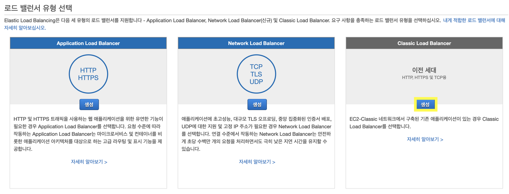
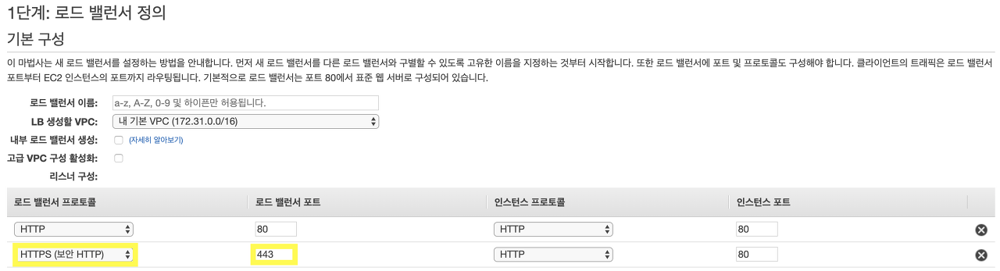
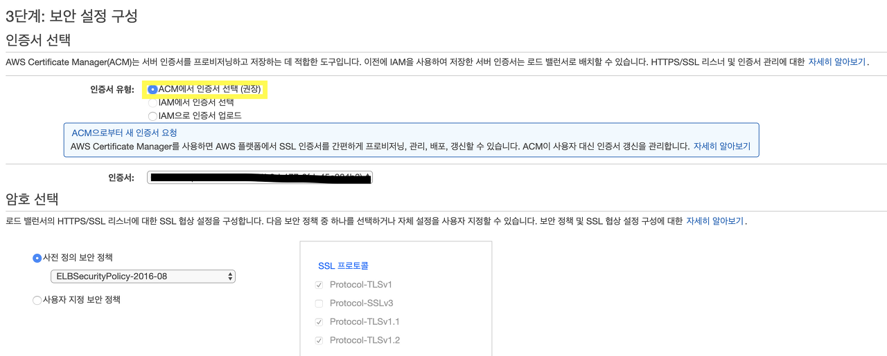
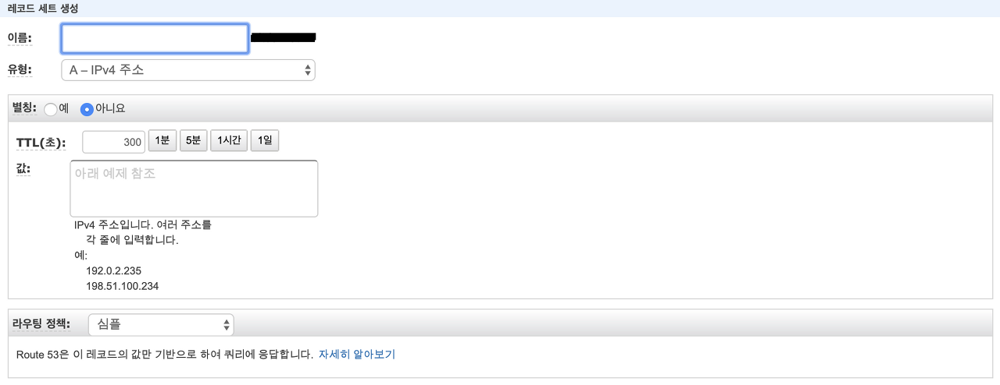
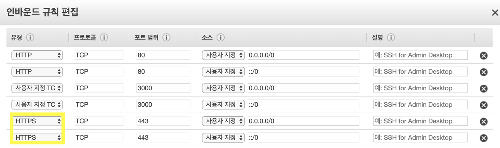

 저번 AWS ACM 포스팅에서는 Route53과 AWS EC2를 사용하고 있는 내 서버에 ACM을 통해 SSL 인증서를 발급받는 방법을 알아보았습니다. 이번 포스팅에서는 발급받은 SSL인증서를 ELB라는 것을 이용해서 비교적 쉽게 서버에 적용하는 방법을 알아보도록 하겠습니다.

### ELB란 무엇인가?

 ELB는 **Elastic Load Balancing**의 약자입니다. Load Balancing은 둘 혹은 셋 이상의 서버에게 작업을 나누는 것을 의미합니다. 이로써 가용성 및 응답시간을 최적화 시킬 수 있다는 장점을 가집니다. 또한 애플리케이션에 대한 요청의 전체적인 흐름을 방해하지 않고 필요에 따라 로드 밸런서에서 컴퓨팅 리소스를 추가 및 제거할 수도 있습니다. 아래의 서버 확장 방법 중 **스케일 아웃**의 경우에는 각 서버에 걸리는 부하를 균등하게 해주는 ‘로드밸런싱’이 필수적입니다.

- 스케일 아웃: 서버 컴퓨터를 여러 대로 증가시켜 시스템을 확장하는 방법
- 스케일 업: 서버 컴퓨터의 CPU, RAM 등을 고성능으로 업 그레이드 하는 방법

 AWS는 Application Load Balancer, Network Load Balancer, Classic Load Balancer의 세 가지 유형의 로드 밸런서를 지원합니다. 이 세가지 제품의 비교는 [이 링크](https://aws.amazon.com/ko/elasticloadbalancing/features/#compare)에서 확인 할 수 있습니다. 

### ELB 생성하기

 이전 포스팅의 방법대로 ACM 인증서를 생성했다고 가정하고 설명을 진행하겠습니다. 일단 EC2 콘솔에 접속한 뒤 왼쪽 메뉴에서 **'로드 밸런서 - 로드 밸런서 생성'** 버튼을 클릭하면 아래와 같은 화면이 나옵니다.



 여기서 **Classic Load Balancer 생성** 버튼을 클릭합니다. 



 1단계에서는 HTTPS 로드 밸런서 프로토콜을 추가하고, 로드 밸런서 이름에는 자신이 원하는 로드밸런서 이름을 설정합니다. 다음으로 가면 2단계에서는 보안그룹을 할당해야 하는데 여기서는 자신이 서버 컴퓨터에 사용하는 보안그룹을 할당하시면 됩니다.



 3단계는 사용 할 인증서를 선택하는 단계입니다. 우리는 ACM으로 인증서를 생성하였기 때문에 **ACM 인증서 선택**을 체크하고 다음단계로 넘어갑니다. 

 4단계에서는 원하는 상태구성을 자유롭게 설정하시면 되고, 5단계에서는 사용할 인스턴스를 선택하시면 됩니다. 그리고 태그 추가 및 검토를 하면 Classic Load Balancer가 성공적으로 생성됩니다. 로드 밸런서의 상태가 아래와 같이 In service 이면 정상 동작하는 것입니다.

### 도메인에 ELB 연결

 ELB를 생성했다면 이를 우리의 웹 사이트 도메인과 연결해야 합니다. Route53의 호스팅영역에 들어가서 자신이 사용하고 있는 도메인을 클릭합니다. 그리고 **레코드 세트 생성** 버튼을 클릭하면 아래와 같은 화면이 나타납니다.  



 여기서 **별칭을 '예'로 선택**하면 우리가 생성한 ELB를 선택 할 수 있습니다. 우리가 생성한 ELB 를 선택한 뒤 생성 버튼을 클릭합니다. 그리고 5분 정도 뒤에 도메인으로 접속해서 https가 제대로 접속되는지 확인하면 끝 입니다!

 혹여나 접속이 제대로 되지 않는 분 들은 서버 컴퓨터에 적용되어있는 **EC2 내 보안그룹**을 확인 해 보시길 바랍니다. 아래 처럼 HTTPS 접속이 허용되어 있어야 HTTPS 주소로 접속이 가능합니다.



### HTTP 접속을 HTTPS 로 변경하기

 HTTP접속을 HTTPS로 리다이렉트하는 코드를 작성하기 위해서는 먼저 연결에 사용한 프로토콜이 무엇이었는지 식별해야 합니다. AWS의 [ELB 사용설명서](https://docs.aws.amazon.com/ko_kr/elasticloadbalancing/latest/classic/x-forwarded-headers.html)를 참고하면 ELB의 Classic Load Balancer는 아래와 같은 X-Forwarded 헤더를 지원한다고 합니다. 저는 이 중 X-Forwarded-Proto 헤더를 이용하겠습니다.

- X-Forwarded-For : HTTP 또는 HTTPS 로드 밸런서를 사용할 때 클라이언트의 IP를 식별하는데 도움을 줌
- X-Forwarded-Proto : 클라이언트가 로드 밸런서 연결에 사용한 프로토콜(HTTP 또는 HTTPS)을 식별하는데 도움을 줌
- X-Forwarded-Port : 클라이언트가 로드 밸런서 연결에 사용한 대상 포트를 식별하는 데 도움을 줍니다.

 X-Forwarded 헤더를 이용하기 위해서 저는 Express의 request 객체 내 기본으로 내장된 `get()` 메소드를 활용해보도록 하겠습니다. request 객체에 대한 [Express 사용설명서](https://expressjs.com/ko/api.html#req.get)를 참고하여 아래와 같이 코드를 작성해 보았습니다.

```javascript
var app = express()

app.use(function(req, res, next) {
	var xForwarded = req.get('X-Forwarded-Proto');
	if(xForwarded !== 'https') {
    	res.redirect('https://' + req.get('Host') + req.url);
	}
});
```

 만약 우리가  `http://example.com/home` 으로 접속하면 xForwarded에는 http가 담기게 되고, 그렇기 때문에 if 문이 실행되어  `https://example.com/home` 으로 리다이렉트 됩니다.