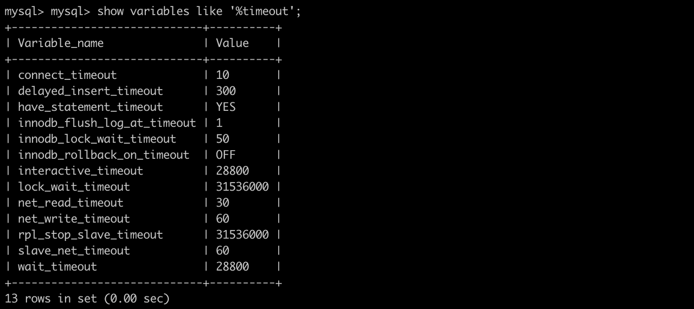

Node.js와 mysql, AWS EC2, S3, Nginx 등을 연동하여 백엔드 작업을 하고있는데 가끔씩 'Error: Connection lost: The server closed the connection.' 이라는 에러 로그가 뜨면서 웹 사이트에 접속이 되지 않을 때가 있습니다. 구글링을 통해 왜 이런 에러가 발생하는지, 어떤 방식으로 해결 할 수 있는지에 대해 알게 된 내용을 아래에 적어봅니다.

### Error의 원인



 구글링을 통해 발견한 [enchoyi 님의 포스팅](https://enchoyism.github.io/2018/02/02/nodejs-mysql-connection-lost/)을 통해 interactive_timeout, wati_timeout에 적혀있는 시간이 '활동하지 않는 커넥션을 끊을때까지 서버가 대기하는 시간'이라는 것을 알게 되었습니다.

 제 mysql의 경우에는 28800초로 8시간동안 활동을 하지 않으면 서버가 커넥션을 끊어버린다는 것을 확인할 수 있습니다. 제가 작업 중인 웹 사이트는 현재 저 혼자만 접속하기 때문에 이는 하루만 지나도 서버의 연결이 끊어진다는 것을 의미하며, 결국 이 때문에 에러가 발생했다는 것을 알 수 있었습니다. 

 그렇다면 이를 해결하기 위해 DB서버 연결이 끊긴 것을 자동으로 확인하고 다시 연결 시키려면 어떻게 해야할까요?

### Error 해결 코드

```javascript
var mysql = require('mysql');
var db = mysql.createConnection({
  host:'---',
  user:'---',
  password:'---',
  database:'---'
});

function handleDisconnect() {
  db.connect(function(err) {            
    if(err) {                            
      console.log('error when connecting to db:', err);
      setTimeout(handleDisconnect, 2000); 
    }                                   
  });                                 
                                         
  db.on('error', function(err) {
    console.log('db error', err);
    if(err.code === 'PROTOCOL_CONNECTION_LOST') { 
      return handleDisconnect();                      
    } else {                                    
      throw err;                              
    }
  });
}

handleDisconnect();
```

[stackoverflow에서 발견한 해결방법](https://stackoverflow.com/questions/20210522/nodejs-mysql-error-connection-lost-the-server-closed-the-connection)을 바탕으로 위와 같은 소스코드를 작성하였습니다. mysql모듈을 로드하고 createConnection메소드를 이용해서 연결한 DB서버의 정보를 입력하는 것 까지는 기존과 동일합니다. 주의해서 볼 내용은 아래의 `handleDisconnection` 함수 파트입니다.

 먼저 `db.connect`를 통해 db서버에 연결을 시도합니다. 그리고 `db.on`을 이용해서 DB서버와의 연결이 끊어졌는지 확인하고 연결이 끊어졌다면 `return handleDisconnect()` 코드를 통해 `handleDisconnect` 함수를 호출하여 다시 연결을 시도합니다. 