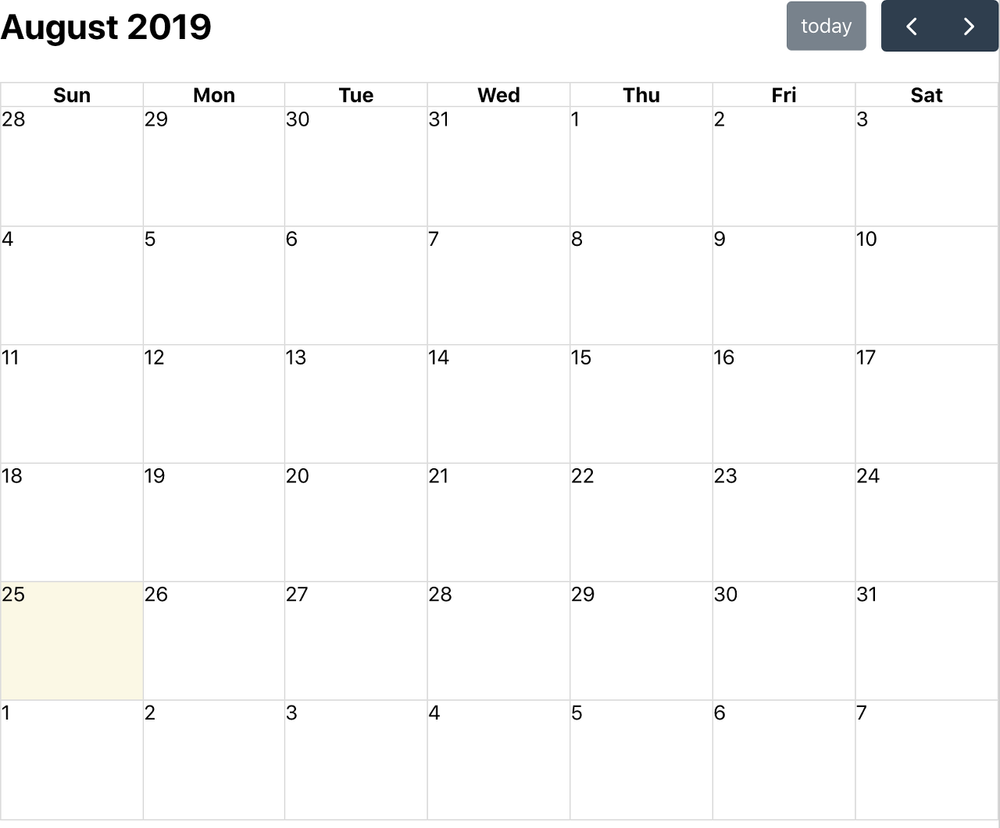
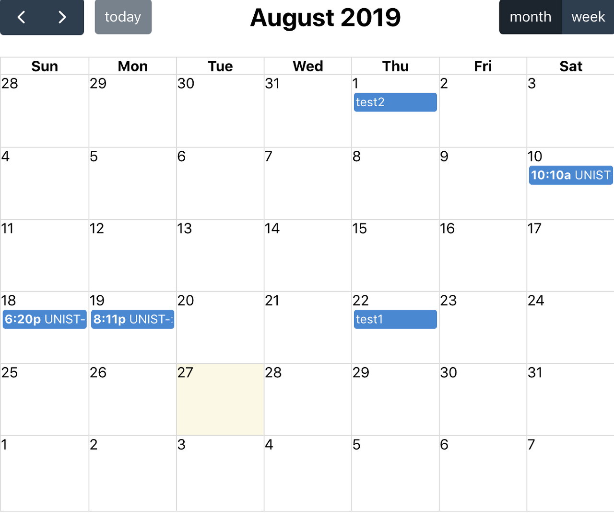

### React 설치, React 프로젝트 생성

 React를 사용해야하기 때문에 설치를 해 줍시다. 그리고 React 프로젝트를 원하는 디렉토리에 생성합니다.

```sh
npm install -g create-react-app
create-react-app '원하는 디렉토리'
```

 프로젝트가 제대로 작동하는지 확인하기 위해서 App.js 파일이 위치한 디렉토리의 터미널에서 npm start를 수행합니다. 웹 브라우저 주소창에 localhost:3000 을 입력했을 때 react의 마크가 빙글빙글 돌고있으면 성공입니다.

```sh
cd '프로젝트를 생성한 디렉토리'
npm start
```

### React 프로젝트에 FullCalendar모듈 설치

 FullCalendar를 react를 통해서 출력하기 위해서 아래 명령어를 통해 모듈을 설치합니다. 프로젝트의 node_modules 디렉토리 내 @fullcalendar라는 디렉토리와 파일들이 설치되면 성공입니다.

```sh
npm install --save @fullcalendar/react @fullcalendar/core @fullcalendar/daygrid
```

### App.js에 FullCalendar 로드

```javascript
import React, {Component} from 'react'
import FullCalendar from '@fullcalendar/react'
import dayGridPlugin from '@fullcalendar/daygrid'

import 'main.css 파일이 위치한 경로'

class App extends Component {

  render() {
    return (
      <div className="App">
        <FullCalendar 
          defaultView="dayGridMonth" 
          plugins={[ dayGridPlugin ]}
        />
      </div>
    );
  }

}

export default App;
```

 프로젝트 내 다른파일들은 건드리지 않고 App.js 파일만 위와 같이 수정해봅시다. 그러면 FullCalendar가 잘 출력되는 것을 확인할 수 있습니다.



React에 대해 공부를 많이 한 편은 아니어서 세부적으로 어떻게 작동하는지는 설명 드리지는 못하지만 제가 이해한 만큼만 설명 드리겠습니다. 아래는 FullCalendar에 대한 설명입니다.

1. import를 통해 이전에 설치한 FullCalendar와 dayGridPlugin 정보를 가져옵니다.
2. App 컴포넌트 내 FullCalendar 컴포넌트를 넣습니다.

FullCalendar를 넣은 App에 대한 설명입니다. 

1. 기본적으로 react 프로젝트를 생성하면 src 디렉토리 내 App.js 파일의 App이라는 컴포넌트를 index.js에서 렌더합니다.
2. 렌더한 내용은 public 디렉토리 내 index.html의, root라는 id값을 가진 div에 전달됩니다.
3. 결과적으로 localhost:3000에서는 App 컴포넌트에 담긴 FullCalendar 컴포넌트가 출력됩니다.

### React로 Events 띄우기

 Script로 Events를 띄우는 방법과 거의 똑같다고 보시면 됩니다. 이전 포스팅에서 React를 이용한 FullCalendar 출력을 성공하셨다면, FullCalendar 컴포넌트에 props로서 events 값을 그저 전달해주기만 하면 전달한 내용에 따라 캘린더에 events가 출력되는 것을 확인할 수 있습니다. 컴포넌트 코드 예시는 아래와 같습니다.

```javascript
<FullCalendar
  defaultView="dayGridMonth"
  plugins={calendarPlugins}
  weekends={false}
  events={[
    { title: 'event 1', date: '2019-04-01' },
    { title: 'event 2', date: '2019-04-02' }
  ]}
/>
```

### Back-End에서 JSON정보 전달하기

 저는 Node-Express 프레임워크를 활용해서 JSON 정보를 전달하였습니다. 아래는 Express 프로젝트의 index.js 라우터 코드입니다. DB 서버에 cal_events라는 테이블을 생성해서 이 테이블에서 정보를 가져오도록 했습니다. (db를 require하는 과정에 대해서는 따로 설명하지 않겠습니다. 글이 너무 길어질 것 같아서,,)

```javascript
var express = require('express');
var router = express.Router();

var db = require('../config/db');

router.get('/test', function(req,res){
  db.query(
    `SELECT * FROM cal_events`,
    function (error, events) {
      if (error) throw error;
      res.json(events);
    }
  );
});

module.exports = router;
```

 /test라는 url에 get요청이 들어오면 DB내 cal_events 테이블에 대한 정보를 res.json을 통해 응답하였습니다.

### React에서 JSON정보 받기

 Back-End에서 받은 정보를 받기 위해서는 일단 React를 Back-End서버의 프록시 서버로 설정해야합니다. React 프로젝트 내 package.json에 다음과 같은 내용을 추가해줍니다. (각자 Back-End서버의 포트번호를 알맞게 수정해서 적어주시길 바랍니다. 저는 3003번 포트를 이용하였습니다.)

```
"proxy":"http://localhost:3003/"
```

 코드가 그렇게 짧지는 않기때문에 나눠서 설명하도록 하겠습니다.

```javascript
import React, {Component} from 'react';
import FullCalendar from '@fullcalendar/react'
import dayGridPlugin from '@fullcalendar/daygrid'
import axios from 'axios';

import 'main.css의 경로'
```

 App.js의 앞부분이자 모듈을 import하는 부분입니다. 이전 포스팅에서 달라진 내용은 `import axios from 'axios'` 입니다. Back-End에서 보낸 데이터를 React가 받기위해서 사용됩니다.

```javascript
class App extends Component {

  state = {}

  componentDidMount() {
    this._getEvents();
  }

  _getEvents = async () => {
    const events = await this._axiosEvents();
    this.setState({
      events
    })
  } 

  _axiosEvents = () => {
    return axios.get('/test')
      .then(res => res.data)
  }


  render(){

    let {events} = this.state;

    return (
      <div className="App">
        {events ? 
        <FullCalendar 
          defaultView="dayGridMonth" 
          plugins={[ dayGridPlugin ]}
          events={this.state.events}
        /> :
        'loading'
      }
      </div>
    );
  }
}


export default App;
```

 `render()`, `_axiosEvents`, `_getEvents, componentDidMount` 순으로 코드 순서와 '반대로' 설명하겠습니다. (*소스코드는 저와 같이 공부 중인 친구가 작성했습니다.)

1. `render()`: 컴포넌트 내 state 값에 events 정보가 담겼는지 확인하고, 담겼다면 FullCalendar 컴포넌트를 출력하고 그렇지 않다면 loading을 출력합니다.
2. `_axiosEvents`: axios의 get 메소드를 통해 Back-End의 /test url에 정보를 요청하고, 그에 따른 res.data 응답을 리턴합니다.
3. `_getEvents`: _axiosEvents이 응답을 받을 때 까지 기다리고, 응답을 받는다면 setState 메소드를 호출하여 state 값에 events라는 데이터를 넣어줍니다.
4. `componentDidMount`: 위의 모든 과정은 componentDidMount에 의해, 컴포넌트가 만들어지고 첫 렌더링을 모두 끝낸 후 실행됩니다.
5. 결과적으로 state에는 Back-End에서 전송한 JSON 데이터가 events라는 이름으로 담깁니다.

 아래는 events가 FullCalendar에 정상적으로 출력된 화면입니다. 



 제가 설명을 적으면서도 참 어렵다는 생각이 드네요 허허허