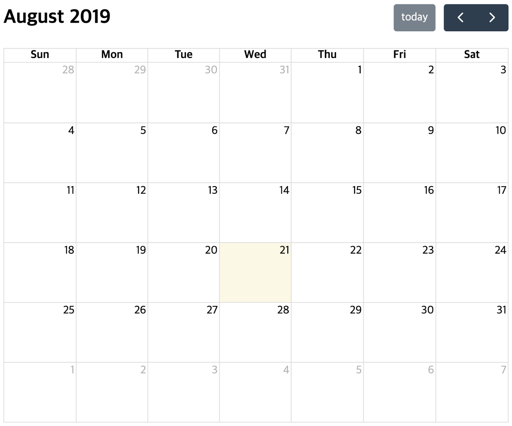
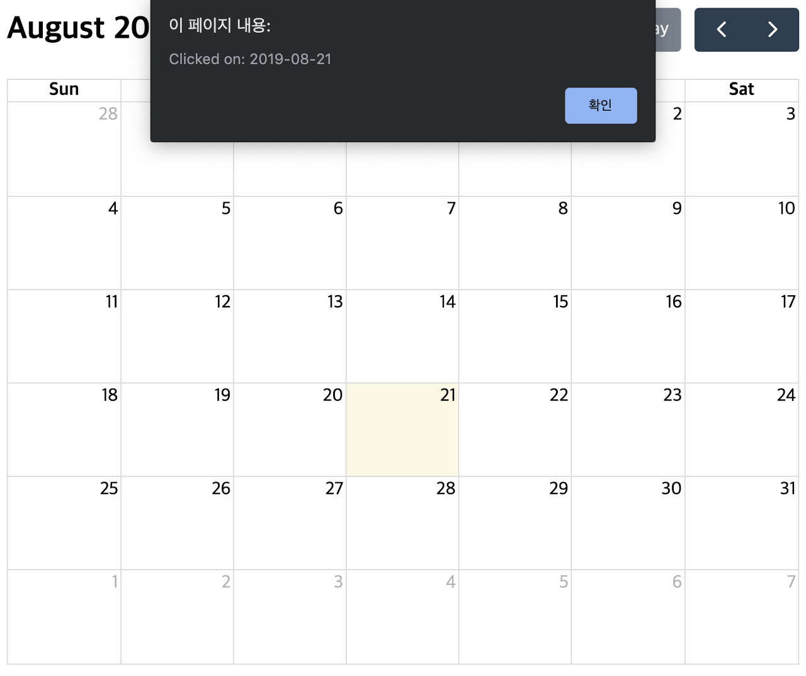
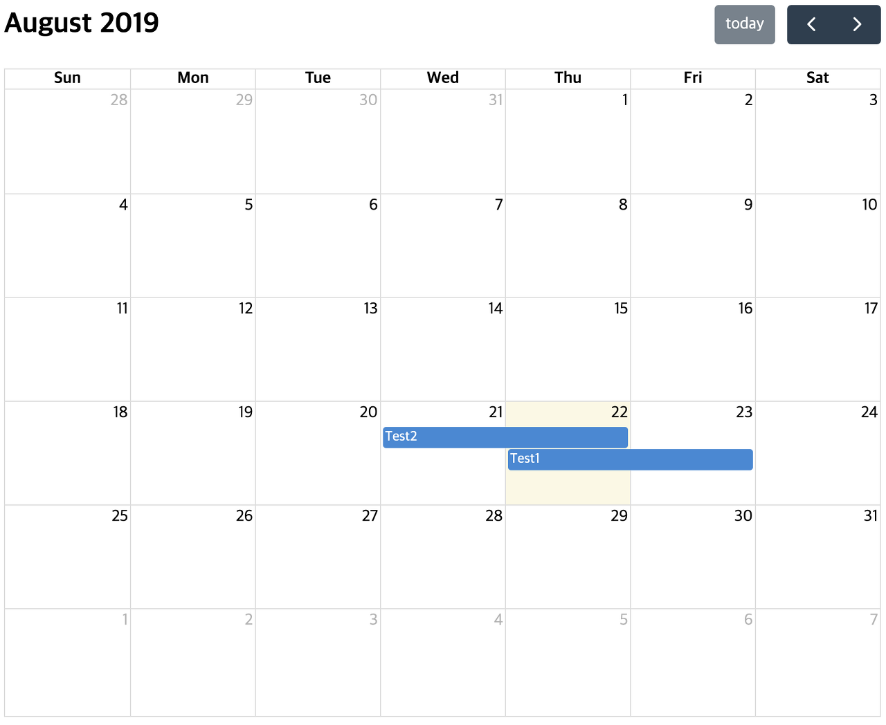
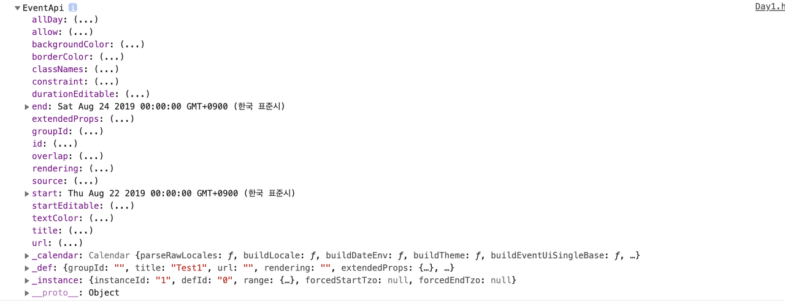

### FullCalendar 띄우기

 일단 자세한 사용법을 익히기 전에 FullCalendar를 화면에 띄워보는것부터 시작합시다. **Scrpit 태그를 통해 FullCalendar를 띄우는 방법**을 설명하고 있으니, ES6 빌드 시스템으로 띄우고 싶으신 분은 [여기](https://fullcalendar.io/docs/initialize-es6)를 참고하시길 바랍니다.

1. `npm install --save @fullcalendar/core @fullcalendar/daygrid`로 fullcalendar를 다운로드합니다.

2. html 파일을 하나 만들고 [테스트 코드](https://fullcalendar.io/docs/initialize-globals)를 붙여넣어 줍니다. 이 때 href 주소를 알맞게 설정해 주셔야 합니다.

   제 경우에는 html파일을 node_modules 폴더 밖에 생성했기 때문에href='./node_modules/@fullcalendar/core/main.css' 이런식으로 수정하였습니다.

3. 생성한 html파일을 브라우저를 통해 열어보면 다음과 같이 캘린더가 출력됩니다.




### 플러그인

 기본적인 세팅 말고 더 다양한 기능을 제공받고 싶다면, 플러그인을 설치한 뒤 *'plugins'* array 내 원하는 플러그인을 추가하시면 됩니다. [이곳](https://fullcalendar.io/docs/plugin-index)에서 fullcalendar에서 제공하는 플러그인 목록을 확인하실 수 있습니다.

`npm install --save @fullcalendar/'플러그인 이름'`의 형태로 플러그인을 설치한 뒤 html 파일에 아래와 같은 소스코드를 추가합니다. (저는 일단 dateClick 기능을 위해서 interaction, dayGrid 플러그인을 추가하였습니다.)

```javascript
<script src='./node_modules/@fullcalendar/core/main.js'></script>
<script src='./node_modules/@fullcalendar/daygrid/main.js'></script>
<script src='./node_modules/@fullcalendar/interaction/main.js'></script>

<script>
...
var calendar = new FullCalendar.Calendar(calendarEl, {
  plugins: [ 'dayGrid','interaction' ],
  dateClick: function (info) {
          alert('Clicked on: ' + info.dateStr);
  }
  ...
});
...
</script>
```

 이 결과로, 날짜 칸을 마우스로 클릭하면 alert창이 출력됩니다. 



### Handler

 왜 alert창이 출력되었는지를 이해하기 위해서는 Handler를 알아야합니다.

```javascript
var calendar = new FullCalendar.Calendar(calendarEl, {
        plugins: ['dayGrid', 'interaction'],
      dateClick: function (info) {
            alert('Clicked on: ' + info.dateStr);
    }
});
```

 핸들러는 일종의 옵션이지만, 특별한 일이 발생할 때마다 호출되는 함수를 말합니다. 위의 코드에서 `dateClick: function(info){…}` 파트가 핸들러이기 때문에 dateClick 이벤트가 발생했을 때 그에 알맞은 함수가 실행된 것입니다.

```javascript
calendar.on('dateClick', function (info) {
        alert('clicked on ' + info.dateStr);
});
```

이와 같이 on, off 메소드를 활용하여 동적으로 핸들러를 추가하는 방법 또한 존재합니다. 핸들러 뿐만 아니라 FullCallendar 내 메소드로도 캘린더를 제어할 수 있으니 [참고](https://fullcalendar.io/docs/Calendar-prev)하시기 바랍니다.

### Event 옵션

```javascript
var calendar = new FullCalendar.Calendar(calendarEl, {
plugins: ['dayGrid', 'interaction'],
events: [
	{
		id: 1,
		title: 'Test1',
		start: '2019-08-22',
		end: '2019-08-24'
	},
	{
		id: 2,
		title: 'Test2',
		start: '2019-08-21',
		end: '2019-08-23'
	}
]});
```

 events 라는 옵션을 추가하고, 객체 array 형태로 이벤트를 입력했습니다. 그리고 캘린더를 확인해봅시다.



 이렇게 캘린더에서 잘 출력되는 것을 확인할 수 있습니다. events 객체에 어떤 key와 value를 적어야 하는지에 대한 설명은 이 [링크](https://fullcalendar.io/docs/event-object)를 참고하시면 됩니다.

### getEventById 메소드

 events에 대한 정보는 getEventById메소드를 통해 가져올 수 있습니다. 인자로 원하는 Id에 대한 정보를 넣어주시면 됩니다. 한번 위의 소스코드 상태에서 `console.log( calendar.getEventById(1))` 를 실행 해 보겠습니다.



이렇게 'id : 1' 값을 가진 events 데이터에 대한 정보가 출력된 것을 확인할 수 있습니다.

### 참고자료

- [FullCalendar 공식 홈페이지](https://fullcalendar.io/)[Demo 확인](https://fullcalendar.io/#demos)

[
](https://fullcalendar.io/#demos)

