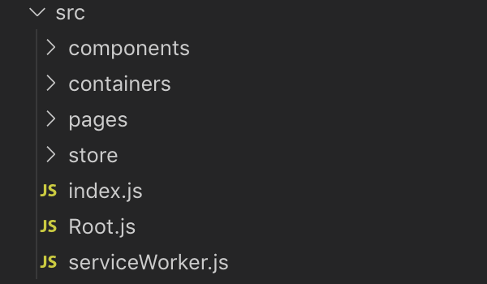

직접 프로젝트를 만들어보기 전에 다른 사람의 프로젝트 디렉토리 구조를 확인하여 어떤 식으로 디렉토리를 구성해야하는지 감을 잡아보도록 하겠습니다. 저의 경우에는 저보다 먼저 리액트를 공부한 친구의 디렉토리 구조를 참고하였으며, 디렉토리 구조는 사람마다 차이가 있기 때문에 참고만 하시길 바랍니다.

### React 프로젝트

- **build**: npm run build 커맨드를 통해 생성된 react 배포 폴더
- **node_modules**: npm install 을 통해 설치된 모듈들이 위치하는 폴더
- **public**: static 자원이 위치하는 폴더
- **src**: components / containers / pages / store 등이 위치하는 폴더
- package: version, dependencies, proxy 등의 정보가 들어있는 파일

 이 중 프론트엔드 작업이 주로 진행되는 src 폴더는 아래에서 더 자세히 살펴보겠습니다.

###  src 폴더

- **components**: 컴포넌트 파일들이 위치하는 폴더
- **containers**: 컨테이너 파일들이 위치하는 폴더, 주로 state를 props로 매핑하는 코드들이 위치
- **pages**: Routing을 위한 페이지 파일들이 위치하는 폴더
- **store**: redux 작업을 위한 폴더, 내부에 **actions, reducers** 폴더 존재

