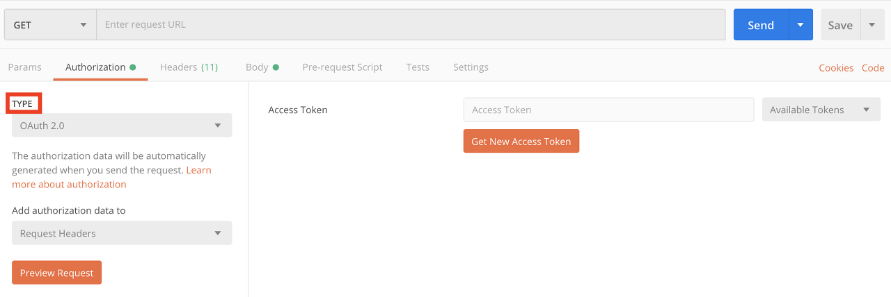
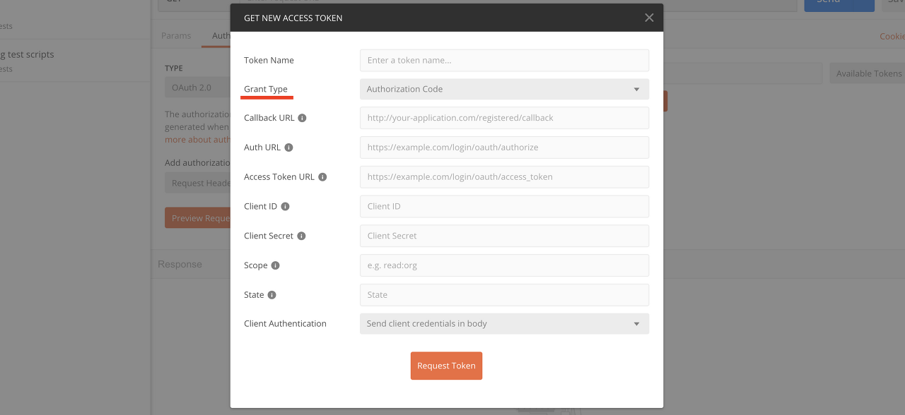
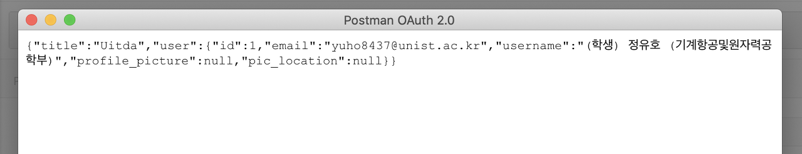

 웹 개발의 백엔드 파트는 DB에서 데이터를 가져오거나, 프론트엔드에서 데이터를 받고 다시 데이터를 보내주는 역할을 합니다. 가장 기본적으로는 HTTP의 GET과 POST 메소드를 사용하여 이런 작업을 수행하는데, 이 때 작업의 효율성을 파워풀하게 향상시켜주는 포스트맨이라는 프로그램이 있습니다. 

 제일 처음 백엔드 공부를 할 때는 pug 같은 템플릿 엔진 view파일을 통해서 내 코드에 문제가 없는지를 확인하곤 했는데 포스트맨을 사용하고 나서 부터는 그럴 필요가 없게 되었습니다. 저는 이 중 GET 요청과 POST 요청만 사용하지만 이는 간단히 사용할 수 있는 기능이기에 이 방법에 대한 설명은 생략하고, 포스트맨을 통해 access token을 받아 로그인을 하는 방법에 대해 알아보도록 하겠습니다. 

- [https://www.getpostman.com](https://www.getpostman.com/)

### Authorization type

 제일 먼저 본인이 어떤 **'로그인 전략(strategy)'**을 사용하고 있는지 확인해야 합니다. 예시를 들어보자면, 저는 Passport.js 라이브러리의 outlook 전략을 사용하여 로그인을 구현하였습니다. 제가 구현한 웹 사이트에서 로그인 버튼을 누르면 outlook 로그인창으로 이동하게 되고, outlook 로그인을하면 제 웹 사이트에서도 로그인이 되는 구조입니다. 

 두 번째로는 이 로그인 전략이 어떤 **'인증 타입(Authorization type)'**을 가지고 있는지 알아야합니다. 이는 자신이 사용하고 있는 로그인 전략의 홈페이지에 인증 타입에 대한 정보가 나와있을 것으로 예상됩니다. 제가 사용하는 Passport.js-outlook의 경우에는 OAuth 2.0 API를 사용하고 있습니다. 자 이렇게 인증 타입까지 확인하였다면, 포스트맨의 Authorization 버튼을 클릭하여 TYPE란에서 알맞은 타입을 체크하도록 합시다. 

### Access token

 인증 타입을 선택했다면 그 다음부터는 타입에 따라서 인증 요청(authorization request)을 보내는 방법이 각각 달라집니다. 이에 대한 자세한 내용은 [포스트맨 공식 사이트](https://learning.getpostman.com/docs/postman/sending-api-requests/authorization/)를 참고하면 되지만, 여기서는 OAuth 2.0 Access token을 얻는 방법에 대해서 살펴봅시다. 먼저 주황색 Get New Access Token 버튼을 클릭해보면 아래와 같은 창이 뜹니다.

 

여기서 우리가 먼저 해야하는 작업은 **'Grant type'**을 선택하는 것인데, 이 Grant type은 OAuth 2.0의 권한 승인 방식을 의미합니다. 이를 위해서는 우리가 웹 사이트에 구현한 로그인 전략이 어떤 승인 방식으로 우리에게 access token을 발급하고 있는지에 대해서 알아야합니다. Grant type에는 총 'Authorization code, Implicit, Password credentials, Client credentials' 네 가지 방식이 존재하는데, 이 중 내가 사용하고 있는 로그인 전략의 grant type을 선택하고 그에 따른 정보를 입력해주시면 됩니다.

 혹시 자신이 사용하는 로그인 전략의 grant type을 모르겠다면 이를 추측해 볼 수 있는 방법이 있습니다. 자신이 웹 사이트 로그인 기능을 구현하기 위해서 어떤 정보를 받아왔는지를 확인하는 것입니다. 저의 경우에는 로그인 기능 구현을 위해 'ClientID, ClientSecret' 을 outlook을 통해 얻어 왔고 'Callback URL, Auth URL'의 정보를 제가 설정해주었습니다. (Auth URL은 자신의 웹 사이트에서 로그인하는 파트의 url을 의미합니다.) 이 정보들만 가지고 로그인이 가능한 grant type은 implicit 뿐이기에 grant type이 implicit 방식이라는 것을 추측할 수 있었습니다.

 최종적으로 로그인에 성공하여 아래와 같은 결과가 출력되었습니다. 참고로 이 화면은 제가 **redirect 설정**을 해놓은 url 주소에서 출력된 화면이기 때문에 사람마다 차이가 있을 수 있습니다.

Grant type에 대해서 더 궁금하신 분은 이에 대해 잘 설명해주신 블로그 글이 있어서 링크로 공유합니다.

- https://cheese10yun.github.io/oauth2/