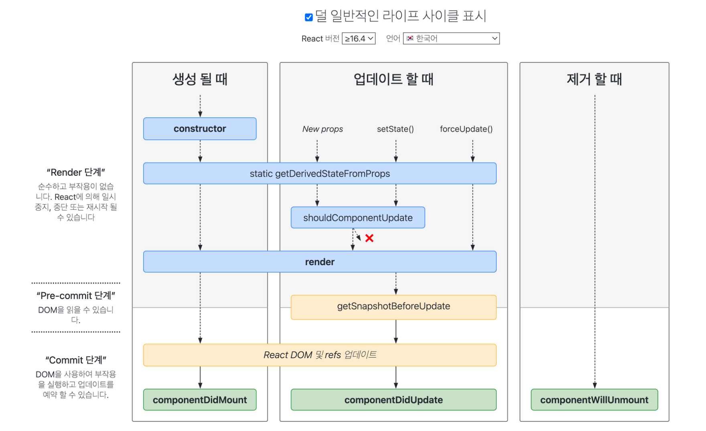

> React의 기본요소들부터, redux, hooks 까지, React를 사용하기 위한 기본적인 개념들을 한 곳에 정리합니다.

### Basics

- JS는 명령형 방식이지만 React는 선언형 방식. 원하는 상태를 정의하면 적절한 업데이트는 React가 처리
- JSX(Javascript Syntax eXtension): JS를 확장한 문법으로 React에서 UI 표현을 위해 사용
- **Component**: React의 가장 독립적 단위 모듈. 함수형 컴포넌트와 클래스형 컴포넌트 존재

```typescript
// function component (JavaScript)
function Welcome(props) {
  return <h1>Hello, {props.name}</h1>;
}

// class component (ES6 & JSX)
class Welcome extends React.Component {
  render() {
    return <h1>Hello, {this.props.name}</h1>;
  }
}
```

- **Props**: 상위 component가 하위 component에 전달하는 데이터 (Read-Only. 즉, 하위 컴포넌트는 값 변경하지 못하고 읽기만 가능)
- **State**: Component가 가지는 독립적 상태. State는 class component만 가질 수 있으며, React Component method인 `setState()`를 사용해야 함. `setState()`를 사용하여 state 변경시 component가 다시 렌더링(`render()`)됨
- **[Lifting state up](https://ko.legacy.reactjs.org/docs/lifting-state-up.html)**: React는 단방향 데이터 플로우를 가지고 있어 자식은 부모에게 데이터를 줄 수 없음. 하지만, 자식이 부모의 상태를 변경해야 하는 경우에 'Lifting state up' 사용
  1. 상위 컴포넌트에서 state을 변경시키는 함수를 생성 (e.g., `handleChange = () => {this.setState(...)}`)
  2. 해당 함수를 자식의 props로 전달. 자식이 해당 함수를 받아 사용하면 부모의 상태가 변경됨. 상태가 변경되므로 component도 다시 렌더링됨
  3. 상위 컴포넌트에서 this를 bind해서 넘겨야 하며, 다만 arrow function을 사용하면 실행 컨텍스트를 만들지 않아 binding 필요 없음
- **Container**: Component 일종이며 container와 component는 공식적으로 구분된 것은 아님. 다만 일반적으로 앱의 state를 제어하는 component를 container라고 부르며 redux 패턴에서는 component와 container를 구분해주는 것이 좋음
- **Redux pattern**: View $\to$ Action $\to$ Dispatcher $\to$ Store(Middleware $\to$ Reducer) $\to$ View
  - 각 component의 event를 page root(container)로 보내고 page에서 event를 처리한 다음 state를 수정함. 그러면 page는 다시 그 변경된 state를 읽고 component에 view를 그리기 적절하게 값을 수정해서 내려줌
  - **Async 작업**을 할 때에도 redux state로 데이터나 작업 진행 현황을 처리. async 함수의 단계별로 action을 발행해서 중간중간 state를 변경해주는데, 대표적인 예시로 버튼 클릭시 loading 창이 뜨다가 요청 완료시 완료 상태를 보여주는 UI


##### TypeScript

- JavaScript의 상위 집합으로 JavaScript의 모든 기능 존재
- TypeScript 컴파일러를 사용하여 ts(TypeScript)파일을 js(JavaScript) 파일로 변환하고 쉽게 통합
- 특징: 정적 유형 검사를 제공하고,  클래스 기반 객체를 만들 수 있고, 클래스 기반이므로 객체 지향 프로그래밍 언어로 상속/캡슐화/생성자를 지원
- JavaScript vs. TypeScript: JavaScript는 유연하고 빠르게 코드 작성이 가능하여 작은 프로젝트에 적합하지만, 프로젝트가 커지고 코드의 안정성이나 유지보수성을 높여야할 때는 TypeScript를 쓰는 것이 좋음
- **Type Alias**: 특정 타입이나 인터페이스를 참조할 수 있는 타입 변수. 타입 별칭은 새로운 타입 값을 하나 생성하는 것이 아니라 정의한 타입에 대해 나중에 참고할 수 있게 이름을 부여하는 것
- **Interface**: 타입 별칭과 인터페이스의 차이점은 타입의 확장 가능, 불가능 여부. 인터페이스는 확장이 가능한데 반해 타입 별칭은 확장이 불가능해서 웬만하면 interface 사용
- **extends** (ES6): extends를 통해 부모의 속성을 그대로 상속받을 수 있음. 다만 `super()` 사용 이후에야 부모 값 초기화
- **implements** (typescript): class의 interface에 만족하는지 여부를 체크할 때 사용

### Life Cycle

- [ZeroCho](https://www.zerocho.com/category/React/post/579b5ec26958781500ed9955)님의 블로그에 life cycle을 확인해보기 위한 코드가 잘 정리되어 있으니 참고하면 좋음
- https://projects.wojtekmaj.pl/react-lifecycle-methods-diagram/



### Redux

State를 이용해 웹 사이트 혹은 애플리케이션의 상태 관리를 해줄 목적으로 사용되는 JavaScript 상태관리 라이브러리. 특정 component만의 데이터 저장소가 아닌 모든 component에 영향을 끼치는 데이터 저장소

- [링크](https://redux.js.org/assets/images/ReduxDataFlowDiagram-49fa8c3968371d9ef6f2a1486bd40a26.gif) 통해 전반적인 flow 확인해볼 수 있음
- Store: 앱의 전체 state를 가지고 있는 중앙 저장소. 전체 앱에 대한 하나의 store가 존재 

```typescript
import { createStore } from 'redux';
import rootReducer from './reducers';
const store = createStore(rootReducer);
console.log(store.getState());
```

- Action: 상태 변화를 일으키기 위한 신호. `type`이라는 필수 속성을 가지고 있으며, 추가적으로 상태 변화를 설명하는 데이터(payload)를 가질 수 있음
  - Action creators: Action 객체를 생성하는 함수. 특정 액션을 생성하기 위한 로직을 캡슐화하여, Action 객체 생성을 더 간결하고 일관되게 만듦

```typescript
const incrementAction = {
  type: 'INCREMENT',
  payload: 1,
};
```

```typescript
function increment(value) {
  return {
    type: 'INCREMENT',
    payload: value,
  };
}
```

- Reducer: 현재 상태와 Action을 받아서 새로운 상태를 반환하는 함수. 상태 변화 로직이 들어 있으며, 순수 함수여야 함. 즉, 동일한 인풋에는 항상 동일한 아웃풋을 반환해야 하며, 인풋을 변경하지 않아야 함

```typescript
function counterReducer(state = 0, action) {
  switch (action.type) {
    case 'INCREMENT':
      return state + action.payload;
    case 'DECREMENT':
      return state - action.payload;
    default:
      return state;
  }
}
```

- Dispatch: Store의 메서드로, Action을 Reducer에게 전달하여 상태를 변경

```typescrip
store.dispatch(increment(1));
```

##### Advanced Topics

- Provider: 하위 컴포넌트들이 redux의 store에 접근할 수 있게 해주는 컴포넌트 
- Connect: 접근할 권한을 얻게 된 뒤에, store에 저장되어 있는 state를 이용하기 위해 컴포넌트들을 store에 연결시켜주는 함수
- mapStateToProps: store로 부터 state를 가져와 컴포넌트의 props로 전달
- mapDispatchToProps: dispatch를 컴포넌트의 props로 전달

```typescript
connect(mapStateToProps, mapDispatchToProps)(component);
```

### Hooks

다양한 React Hook에 대한 설명을 [이곳](https://ko.react.dev/reference/react/hooks)에서 확인할 수 있습니다. 

- useState, `const [state, setState] = useState(initialState)`: 컴포넌트에 state 변수를 추가
- useCallback, `const cachedFn = useCallback(fn, dependencies)`: 특정 함수를 새로 만들지 않고 재사용
- useRef, `const ref = useRef(initialValue)`: 렌더링에 필요하지 않은 값을 참조
- useEffect, `useEffect(setup, dependencies?)`: 컴포넌트가 렌더링 될 때마다 특정 작업을 실행

### Development

1. Typescript template으로 react app 생성

```shell
yarn create react-app my-app --template typescript
# or npx create-react-app my-app --template typescript
```

2. 필요한 라이브러리 설치
   - `yarn add <패키지명>`: 새로운 패키지를 추가
   - `yarn remove <패키지명>`: 패키지를 삭제
   - `yarn upgrade`: 프로젝트의 모든 의존성을 최신 버전으로 업그레이드
   - `yarn install`: `package.json` 파일에 정의된 모든 의존성을 설치
   - `yarn eject`: 프로젝트의 설정 파일들을 추출

```shell
yarn add react react-dom typescript
yarn add @types/react @types/react-dom @types/node @types/jest
```

3. (Optional) 필요한 VSCode 세팅들 설정: ESLint(`eslintrc.json`), ESLint config airbnb(`eslint-config-airbnb`), Prettier(`.prettierrc`), `tsconfig.json`, `settings.json`, etc

```
# Basic architecture of React with typescript template

my-app
├── node_modules
├── public
│   ├── ...
├── src
│   ├── App.css
│   ├── App.test.tsx
│   ├── App.tsx
│   ├── index.css
│   ├── index.tsx
│   ├── react-app-env.d.ts
│   ├── reportWebVitals.ts
│   ├── setupTests.ts
│   ├── ...
├── .gitignore
├── package.json
├── README.md
├── tsconfig.json
├── yarn.lock
```

- `yarn start`: development mode로 앱 실행 
- `yarn test`: 테스트 스위트를 실행. Jest 테스트 러너를 사용하여 테스트를 실행
  - Jest: JavaScript 애플리케이션을 위한 테스트 프레임워크
- `yarn build`: 애플리케이션을 배포 가능한 상태로 빌드. 프로덕션 환경에 배포할 수 있는 최적화된 정적 파일들을 생성

