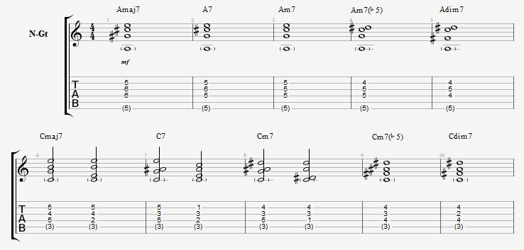
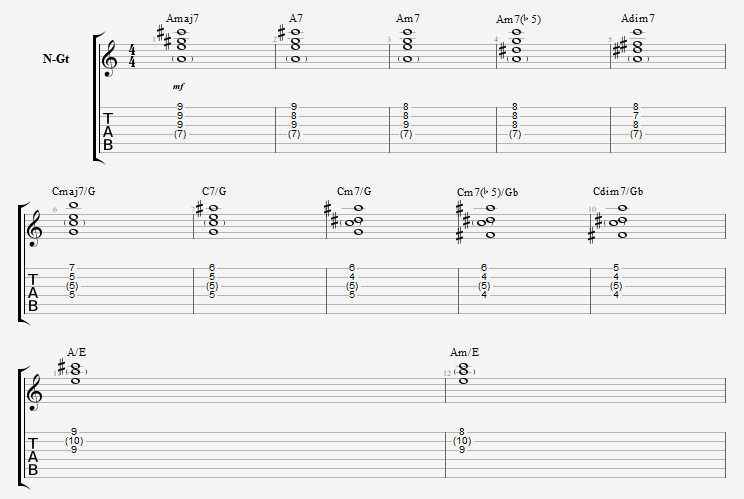

The basic chord shapes are shown in the photos below. By keeping the same shape and moving it along the frets, you can play any chord. Here are a few simple examples to illustrate this.

<i>- To play a B7 chord, just move the A7 shape shown below up by 2 frets.</i> 
<i>- To play a BbM7 chord, move the AM7 shape shown below up by 1 fret.</i>

Knowing some basic harmony theory is helpful when forming chords. (Normally you would distinguish between major and minor intervals by degree, but I'll skip that here for simplicity.)

<i>M chord: R, 3, 5</i> 
<i>m chord: R, b3, 5</i> 
<i>M7 chord: R, 3, 5, 7</i> 
<i>7 chord: R, 3 5 b7</i> 
<i>m7 chord: R, b3, 5, b7</i> 
<i>m7b5 chord: R, b3, b5, b7</i> 
<i>dim7 chord: R, b3, b5, bb7</i> 

 Playing major (M) and minor (m) chords — as opposed to four-note chords with a 7th — is not difficult either. Since one octave spans 8 degrees, you simply raise the 7th by a half step.
