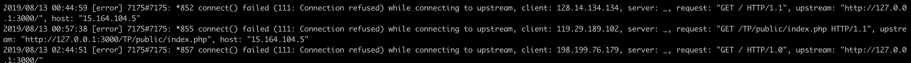

About four days ago, I had just obtained an ACM certificate on AWS and enabled HTTPS access for my website, which made me quite proud. While happily working on the backend with that sense of accomplishment, my website suddenly spat out an nginx 502: Bad Gateway error and became completely inaccessible.


 Since this was the same screen I'd seen before initially configuring nginx, I assumed it would be a problem I could solve within a day and calmly began reviewing the pm2 and nginx error logs one by one. But after hammering away at my laptop all day, the error remained unresolved. The next day, I Googled the log messages trying to fix the error, but couldn't find a suitable solution — and every time I fixed one error, another error log would appear.

<br>

**[Hypothesis 1] There must be a problem with the MySQL DB server connection.**

 The first thing I checked was the pm2 error log. Running the pm2 log command revealed the message *"Connection lost: The server closed the connection"*. This led me to suspect that the MySQL DB server had shut down or lost its connection, so I used [this method](https://uhou.tistory.com/125?category=834081) to add code to the project that would attempt to reconnect whenever the DB server connection was lost.

 However, the 502: Bad Gateway error persisted, and after investigating further, I realized it was unrelated to the DB server connection, so I started looking for other causes.

 <br>

**[Hypothesis 2] The nginx configuration related to the recently obtained SSL certificate must be wrong.**

 Since the last thing I had added to the project before the error occurred was SSL/HTTPS certification, the next thing I suspected was the nginx configuration. Normally, to accept HTTPS connections after obtaining an SSL certificate, you need to add configuration to nginx. I hadn't done that — not because I forgot, but because I'd heard that when you obtain a certificate through ACM and handle HTTPS via ELB, there's no need to add nginx configuration.

```
tail -f /var/log/nginx/error.log
```



 Checking the nginx error log with the command above revealed the message *"connect() failed (111: Connection refused) while connecting to upstream..."*. Since there are many possible causes for this, I followed nearly every solution I could find on Stack Overflow. But the 502: Bad Gateway problem still wasn't resolved, so I started suspecting the AWS ELB next.

 Oh, and through this process, I confirmed that "when you obtain a certificate through ACM and handle HTTPS via ELB, there's no need to add nginx configuration" is indeed correct!

 <br>

**[Hypothesis 3] There must be an error originating from the EC2 ELB.**

 While examining the nginx error logs, I focused on the 'GET / HTTP / 1.1..' portion and thought, "Is it failing to receive certain HTTP requests?" As it happened, AWS provides information about the causes and solutions for HTTP 502 errors that occur while using a Classic Load Balancer (ELB) at [this link](https://aws.amazon.com/ko/premiumsupport/knowledge-center/load-balancer-http-502-errors), and I figured one of those solutions would fix my error.

 However, since I had only been using AWS's load balancer as a tool for HTTPS connectivity and had never actually used it in a true load-balancing capacity, the content was much harder to understand than I expected. So I ultimately decided to just delete all the files on the server and the ELB, and start from scratch.

 <br>

**[Hypothesis 4] There must be a file error in the server's remote repository related to Git.**

 While deleting the files on the server, another suspicion crossed my mind. There had been a Git-related error that had been occurring since almost the very beginning when the server was first set up, and I wondered if that might be the root cause. It was an error that had been showing up daily, but since the website had never behaved abnormally because of it, I had been ignoring it. Still, hoping it might help, I cleanly deleted the git repository on the server and recreated the directory via git clone.

 And just like that, all the nginx, Git, and DB-related errors vanished completely, and the website worked perfectly. It turned out that I had modified some files in the repository on the server while only having a superficial understanding of how Git works, and that file modification was the cause of all the problems.

<br>

**[Conclusion] Lessons learned from debugging this error**

 The reason I'm writing this post is that I felt if I didn't document this experience, I'd end up running into a similar error next time. This incident also reinforced my belief that even when a small error appears, you should resolve it before moving on to the next step. What initially seemed like a trivial Git error snowballed like a butterfly effect into nginx errors and errors elsewhere. :(

 I also realized that I shouldn't carelessly modify or add files directly on the server. Since my current project isn't particularly complex yet, whenever something needed to be changed on the server, I had been making edits directly on the server machine. But doing this makes it hard to roll back when errors occur and hard to identify where and when an error originated, which is why I ended up struggling so much this time. From now on, I'll complete all work locally and limit the server to only pulling the finished results — treating the server machine with much more care.
