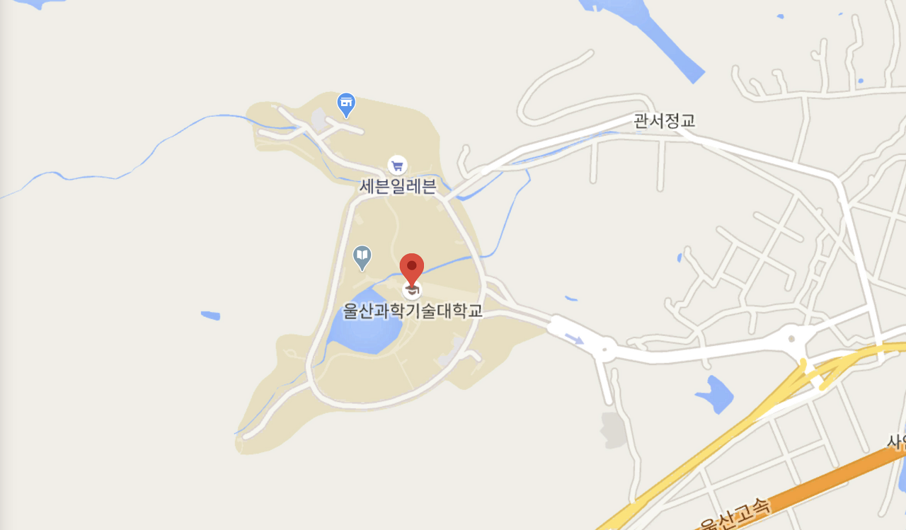
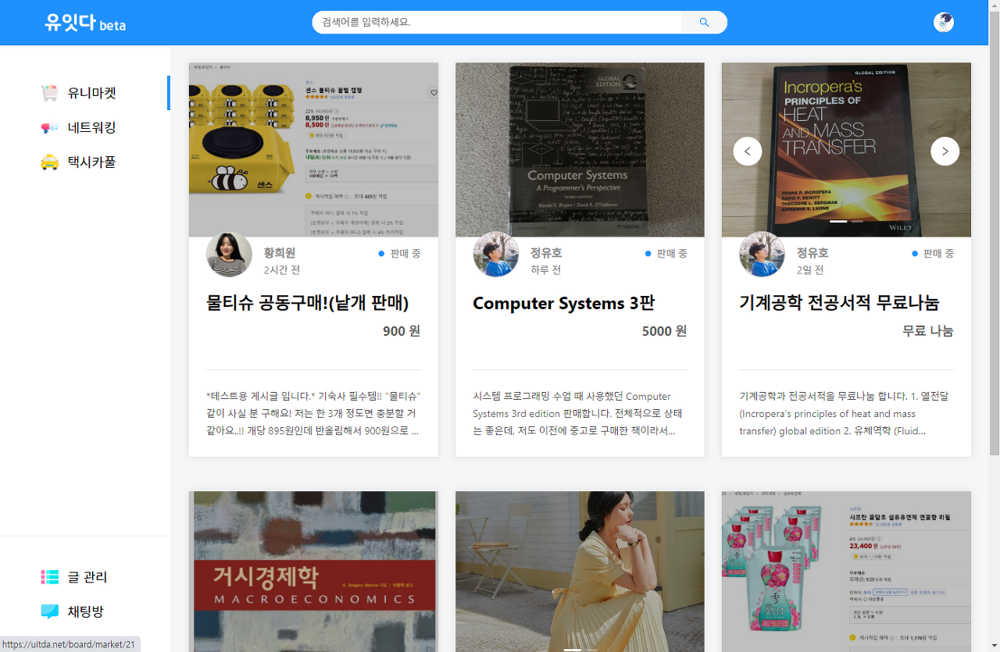
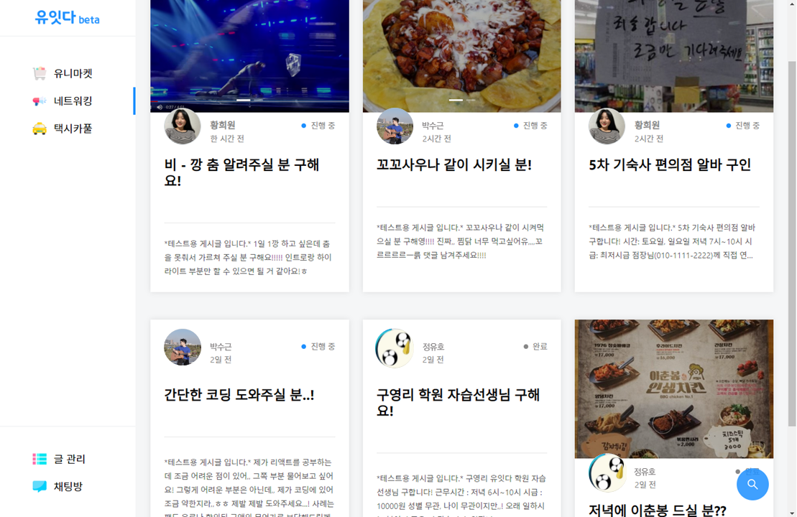
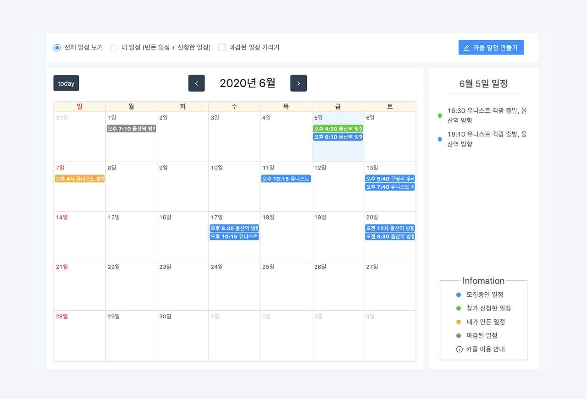
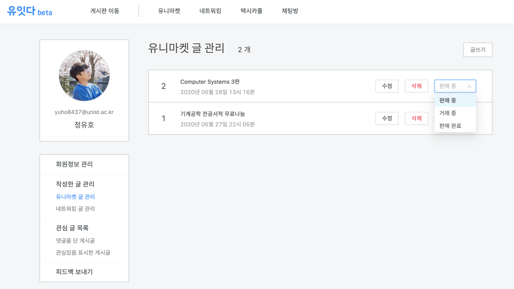
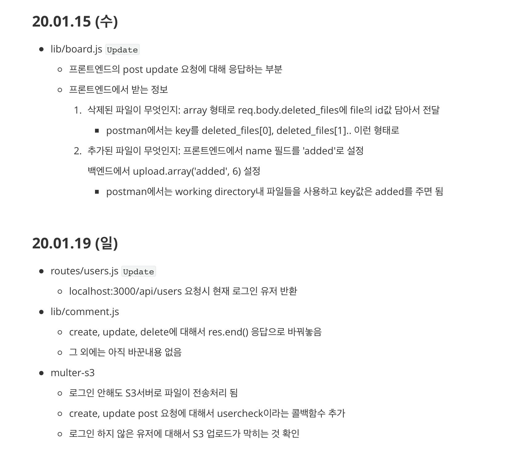

In February 2019, I started a project with friends from the campus Enactus club, and we wrapped it up in June 2020. At this point, having just finished the project, I'd like to document the past year and a half below.

### The Beginning of the Project

Our project is called "U-IT-DA." The name was created to signify connecting students of UNIST, the university I currently attend, through our web service.

UNIST is a university where most students live in dormitories on campus. The campus is located in the mountains, which makes it great for studying thanks to the clean air and quiet environment. However, there are virtually no stores or restaurants within walking distance, and it takes about 40 minutes by bus to reach the city center—the campus is quite isolated from the outside world.

With no convenient places to buy food or daily necessities, students inevitably end up relying on deliveries and convenience stores, leading to irrational spending. To address this, students frequently use campus Facebook groups to buy and sell used textbooks and goods, co-order delivery food, and share taxi rides. However, transactions and communications through Facebook groups were not intuitive, and there were several inconveniences—posts were not displayed in chronological order, and only one post was visible on the screen at a time.

So our team decided to start this project with the idea of improving the pain points of the services that students had been using on Facebook and providing them through an independent web/app with an intuitive UI.

### Beta Service

~~You can check out the U-IT-DA web service directly through this [link](https://uitda.net/).~~ (Our AWS free tier expired in July 2020, so the service is no longer available.)

The service is broadly divided into three categories: UniMarket, Networking, and Taxi Carpool. In the UniMarket category, students can sell items and trade used goods. Sellers can generate income by selling surplus items such as extra daily necessities, clothes that don't fit, and textbooks, while buyers can save money by purchasing products at lower prices.

The Networking category serves as a hub connecting students. By presenting various quests and rewards—such as co-ordering delivery food, requesting purchase proxies, recruiting lab experiment participants, and finding study group members—it helps students make the most of the material and human resources on campus.

In the Taxi Carpool category, students heading in the same direction can share rides. Due to the geographical conditions, many students have nearly identical routes when traveling off campus. This means there are plenty of students going the same way, and through carpooling, they can take taxis at a reduced cost.

In addition, we implemented pages such as post management and feedback submission to ensure the web service had the basic form of a complete platform.

### Backend Development Log

Three team members handled the development: one worked on the frontend, and the other two managed the backend, server, and database. I was responsible for the backend and server work. The overall development stack was as follows (there may be some omissions regarding the frontend):

- Framework: React (frontend), Node-Express.js (backend)
- Library & Modules: FullCalendar, ant.design, socket.io, Passport.js-outlook, S3-multer... etc.
- Database: MySQL, Sequilize.js (backend)
- Server: AWS EC2 with Nginx, AWS S3, AWS route53
- Postman, Github

Although the project started in February 2019, I didn't know what HTML or CSS was at the time, so the actual work didn't begin in earnest until around September. I started studying HTML and CSS alongside my coursework, and after finishing both, I moved on to JavaScript and Node.js. If I recall correctly, it was already past May by the time I finished studying Node.js. By around July, I had also completed studying Express and AWS.

Starting in September, I began writing actual code for the service. I kept a record of completed and upcoming tasks in a personal Markdown file organized by date, as shown in the image above, and exchanged feedback with my teammates. Whenever I hit a roadblock, I studied the topic on the spot and resolved it. Before September, all three team members had been studying the same material together, but from September onward, we split into frontend and backend roles and focused on studying and developing our respective areas.

We didn't set a specific roadmap for the project's completion—instead, we studied whatever was needed at the time. Through this continuous cycle of studying and developing, the web service eventually came together. Going through this process taught me the importance of knowing what needs to be done and setting goals for yourself. I also strongly felt that studying with others is a faster and more accurate way to learn than studying alone.

### Reflections

In the initial planning stage, we had intended to build an on-campus web community site like KOPA (Korea University) or SNULife (Seoul National University). After several meetings, we objectively assessed how much we could implement within a one-year timeframe and considered what kind of service would deliver the best results at that level—which led to the current form of the web service.

We also spent time going beyond just the project to brainstorm a business model. I felt that if the service were developed not only as a web platform but also as a mobile app, it could grow into something truly valuable. I believed there would be sufficient demand for secondhand trading, job matching, and carpooling among members of the same community, and that it could expand beyond UNIST to other universities or even companies. However, since I was more interested in fields other than web/app development, I realistically set my goal as completing the web version. (My teammate who worked on the development plans to continue and aims to complete the app version as well.)

From a personal perspective, I started this project because I wanted the experience of writing code that would actually be deployed as a live service. What I wanted to gain from this project was the experience of writing production code and receiving user feedback on the service. In that regard, I feel I largely achieved my personal goals.

Now that the project is wrapped up, I plan to focus on studying for graduate school. Over the course of this year, I gained a lot of web programming knowledge, but beyond that, I also learned a great deal about maintaining consistency over a long period and figuring out the right approach to studying. So for now, I intend to carry that mindset forward and dive deep into the subjects that interest me.

If I ever get the chance to do web development again, I'll close this post by listing a few things I'd like to study further:

> serverless, socket-chatting, Typescript, a thorough understanding of synchronous/asynchronous patterns and RESTful APIs, MongoDB, leveraging middleware
