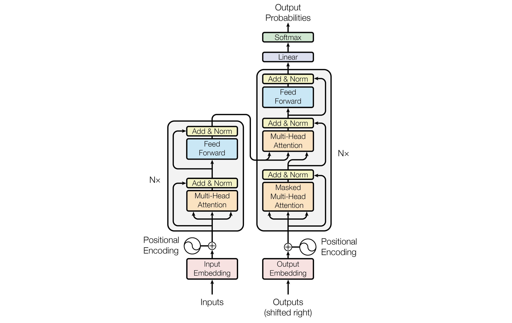

> A summary of Transformers based on Mary Phuong and Marcus Hutter, "Formal Algorithms for Transformers," and Vaswani, Ashish, et al., "Attention Is All You Need."

### Preliminaries

##### Attention

- A mechanism that updates **value vectors** based on **query vectors** and **key vectors**. More precisely, an attention score $\alpha$ is obtained based on the similarity between the query vector and the key vector, and $\alpha$ is then used to update the value.
  - i.e., $
    \alpha_{t}=\frac{\exp \left(\boldsymbol{q}^{\top} \boldsymbol{k}_{t} / \sqrt{d_{\mathrm{attn}}}\right)}{\sum_{u} \exp \left(\boldsymbol{q}^{\top} \boldsymbol{k}_{u} / \sqrt{d_{\mathrm{attn}}}\right)}
    $

##### Tasks

- Chunking: Since all transformer-based models for sequence modeling have a limited maximum input length, a single document given as input is chunked into multiple parts and fed to the model. Therefore, how the document is chunked can affect prediction performance.
- Seq2seq prediction: For data consisting of sequence pairs $(\mathrm z_n, \mathrm x_n)$, the goal is to learn (estimate) the conditional distribution $P(\mathrm x| \mathrm z)$. Uses an Encoder-Decoder architecture.
  - e.g., Translation, Question answering, Text-to-speech, etc.

- Classification: Since the goal is to predict the correct class for a given $\mathrm x$, the objective is to learn (estimate) the conditional distribution $P(c|\mathrm x)$. Uses an Encoder architecture.
  - e.g., Sentiment classification, Spam filtering, Toxicity classification, etc.
- Sequence modeling: The goal is to learn (estimate) an estimation $\hat{P}$ of the true distribution $P(x)$. Specifically, the objective is to learn the distribution over a single token $x[t]$ given $x[1:t-1]$. Uses a Decoder architecture.
  - e.g., Applied to sequential data prediction such as RL policy distillation, Language modeling, Music generation

##### Tokenization

- Token: A meaningful unit that is fed as input to the model
- Tokenization: The process of splitting a given sentence or document into units called tokens. There are various types such as character-level tokenization, word-level tokenization, and subword tokenization. Generally, subword tokenization is most commonly used (varies by task). A detailed explanation is available [here](https://wikidocs.net/86649)[^3].
- Vocabulary: A file that assigns an ID to each token to make them identifiable. Usually named `vocab.txt`.
  - Special token: mask\_token, bos\_token (beginning of sentence), eos\_token (end of sentence), etc.

### Transformer

- Token embedding: Converting a token into the form of a representation vector
- Positional embedding: Assigning position information within a sentence or document to a token. Learned positional embeddings may be added to token embeddings, but it is also common to add non-learned $\sin(a \cdot t), \cos(a \cdot t)$ values to the token embeddings.
  - i.e., $$\boldsymbol{e}=W_{e}[:, x[t]]+W_{p}[:, t]$$  where $W_{p}[2 i-1, t] =\sin \left(t / \ell_{\max }^{2 i / d_{\mathrm{e}}}\right)
    , \ W_{p}[2 i, t] =\cos \left(t / \ell_{\max }^{2 i / d_{\mathrm{e}}}\right)$

- Bidirectional self-attention (= Unmasked self-attention): A form of attention where the entire sentence or document is provided as input regardless of the current token's position. Since it is self-attention, the same data set is used for query, key, and value.
- Unidirectional self-attention (= Masked self-attention): A form of attention that masks tokens after the current token to create an auto-regressive structure, so they are not provided as model input.
- Cross-attention: When the data sources for query and key differ, as in sequence-to-sequence tasks.
- Layer normalization: A layer that normalizes the representations passed from the previous layer using mean and variance, then applies scaling and biasing. It is called layer normalization because it is not performed on a batch basis.
- Unembedding: Converting the final vector representation into a distribution over the vocabulary.

##### Model Architecture

<i>Figure 1. taken from Vaswani, Ashish, et al.</i>

##### The Transformer Family

- Encoder-Decoder Transformer: The originally proposed transformer architecture, used for seq2seq tasks.
- Encoder-Only Transformer, BERT: Trains the model through a task called masked language modeling, then applies the trained model to various NLP downstream tasks (e.g., NER, POS tagging, etc.). Compared to the original Transformer, one difference is that it uses GELU instead of ReLU as the activation function.
- Decoder-Only Transformer, GPT-2, GPT-3, and Gopher: Models designed for autoregressive language modeling, characterized by using unidirectional self-attention rather than bidirectional self-attention.

### References

[^ 1 ]:[Phuong, Mary, and Marcus Hutter. "Formal Algorithms for Transformers." *arXiv preprint arXiv:2207.09238* (2022).](https://arxiv.org/abs/2207.09238)
[^ 2 ]:[Vaswani, Ashish, et al. "Attention is all you need." *Advances in neural information processing systems* 30 (2017).](https://proceedings.neurips.cc/paper/2017/hash/3f5ee243547dee91fbd053c1c4a845aa-Abstract.html)
[^ 3 ]:Won Joon Yoo, Introduction to Deep Learning for Natural Language Processing, Wikidocs
