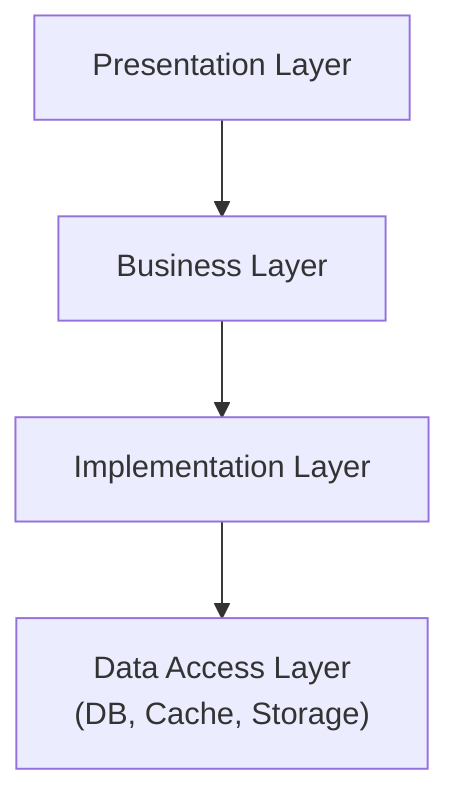

> Notes on topics I've studied related to software development.

### Versioning

- [SemVer(Semantic Versioning)](https://semver.org): A versioning system that assigns meaning using `{major}.{minor}.{patch}`. The most commonly used software versioning approach.
  - `major`: Incremented when there are incompatible API changes. For example, this may include changing the signature of existing functions or removing important features. It serves as a warning signal for 'breaking changes.'
  - `minor`: Incremented when features are added while maintaining backward compatibility. For example, when new functions or options are added, this version number increases.
  - `patch`: Incremented for bug fixes that maintain backward compatibility. This includes changes that fix existing feature behavior or improve performance.
  - Examples: Adding a new feature: 1.3.0 / Fixing a bug: 1.2.4 / Making a non-backward-compatible change: 2.0.0
- [HeadVer](https://techblog.lycorp.co.jp/ko/headver-new-versioning-system-for-product-teams): A versioning system using `{head}.{yearweek}.{build}`. It points out that SemVer is a versioning system designed for APIs, and instead offers a versioning approach that focuses more on the end-user. All apps within a company follow the same versioning rules. The name conveys the meaning: "The only thing you need to care about in this versioning is the Head. The rest is automatic."
  - `head`: Unlike SemVer, rapidly incrementing the first digit is recommended. It's suggested to increment it with each release that reaches users.
  - `yearweek`: Week number information. Set to auto-increment.
  - `build`: Build number. Set to auto-increment.
- GitHub release: Provides a way to easily distribute and manage specific versions of a project (e.g., v1.0, v2.1). A particular state of the software (typically a major version or significant update) is defined as a 'release,' and the source code at that point is provided along with release notes, binary files, and more.

##### Versioning for ML

- Labeling rule versioning: Use a git-based documentation tool like [GitBook](https://www.gitbook.com) to write labeling guideline documents, then version the labeling guideline repository. Using SemVer for the versioning system seems like a good approach.

- Data versioning: Tools like Data Version Control (DVC) or Delta Lake's Time Travel feature could be useful.

- Model versioning: Using MLflow Model Registry for versioning deployed models seems like a good approach.

### Exception

Exceptions are used to handle unexpected errors or abnormal situations. They prevent programs from terminating abruptly, and help the program either terminate safely or continue running by properly handling the error situation.

Since exceptions are meant for handling error situations and not for general program flow control, it is best not to use exception handling for flow control. In situations that can be adequately handled with conditional statements, exceptions should not be used.

##### Python Exceptions

Below are the types of Python exceptions.

- `Exception`: Used when you need to catch all exceptions without specifying a particular one.

- `ArithmeticError`: The base class for all arithmetic calculation errors. It is the parent class of `ZeroDivisionError`, `OverflowError`, `FloatingPointError`, etc. It is not used directly; its subclasses are primarily used.

- `ZeroDivisionError`: Raised when attempting to divide a number by zero.

- `ValueError`: Raised when a function or operator receives a value of the wrong kind. For example, passing a non-numeric string to `int()` will raise this error.

- `TypeError`: Raised when an operation or function receives an object of an incorrect type.

- `IndexError`: Raised when referencing an invalid index in a sequence such as a list or tuple.

- `KeyError`: Raised when referencing a key that does not exist in a dictionary.

- `AttributeError`: Raised when trying to access an attribute that does not exist on an object.

- `ImportError`: Raised when trying to import a module that doesn't exist or when referencing an object that doesn't exist within a module.

- `FileNotFoundError`: Raised when attempting to open a file that does not exist.

- `OSError`: A system-related error that occurs when interacting with the file system or operating system.

- `RuntimeError`: Represents general runtime errors that don't fall into other categories. Used when an error occurs that cannot be described by a more specific exception.

- `StopIteration`: Raised when the `next()` function can no longer return items. Primarily used to signal the end of an iterator.

- `KeyboardInterrupt`: Raised when the user presses Ctrl+C to forcefully terminate the program.

- `MemoryError`: Raised when the system can no longer allocate memory.

### Logging

##### Python Log Libraries

- loguru: Enables rapid setup of a logging system with an easy-to-use API and powerful built-in features. Since it is not part of the standard library, it requires adding a dependency.
- logging: Python's standard library that allows flexible configuration for complex requirements, but initial setup can be complicated.
- logbook: An alternative that reduces the complexity of `logging` while still providing powerful features. It is useful when asynchronous logging is needed (provides async logging by default, enabling high-performance logging).

##### Log Level

The log levels as defined in loguru are as follows:

- `TRACE(5)`: Low-level information about the program's logical flow
- `DEBUG(10)`: Information useful during debugging
- `INFO(20)`: Confirms that the application is working as expected
- `SUCCESS(25)`: Indicates that an operation succeeded
- `WARNING(30)`: Indicates issues that could cause problems in the application later
- `ERROR(40)`: Issues requiring immediate attention but not terminating the program
- `CRITICAL(50)`: Severe issues, such as OOM, that can terminate the program

You can configure the system to display only logs at or above a certain level, allowing different log levels for different environments such as debugging, dev, and production. Below are some additional useful references:

- [Hyangro - 1. Efficient Log Monitoring - Distinguishing Log Levels](https://jojoldu.tistory.com/712)
- [Hyangro - Good Exception Handling](https://jojoldu.tistory.com/734)
- [Hyangro - Separating Operational Logs and Debug Logs](https://jojoldu.tistory.com/773)

##### Sentry

Sentry is an open-source platform that provides error tracking and performance monitoring for applications. Through Sentry, you can detect and analyze errors and performance issues occurring in your application in real time.

- Error Tracking: Collects exceptions from code in real time and displays them on a dashboard. Automatically gathers stack traces, environment information, user information, etc.
- Release Health Monitoring: Tracks issues or performance degradation that occur in specific release versions. You can check crash-free rate, adoption rate, etc. for each release.
- Performance Monitoring: Tracks response times per transaction, query latency, API request bottlenecks, etc. Provides APM (Application Performance Monitoring) level capabilities.
- Alerting System: Can send notifications via Slack, email, MS Teams, Discord, etc. Allows alert configuration based on specific conditions (e.g., repeated identical errors, errors from specific users).
- Issue Grouping and Automation: Groups errors of the same type into a single issue for management. Supports tagging, priority setting, and assignee assignment for specific issues.

For example, if a JS error occurs when a user clicks a button on a website:

1. The error is automatically sent via the Sentry SDK
2. On the dashboard, you can see the error path, environment, user ID, etc.
3. An error notification is received via Slack
4. You can also trace which code change caused the problem by linking it to a specific commit

### Data Libraries

##### Encoding

UTF-8 (8-bit Unicode Transformation Format) is a type of character encoding that can represent virtually all characters worldwide using a variable-length encoding scheme. In Python, it is frequently used when converting between `str` and `bytes` types for encoding or decoding text data. Its characteristics are as follows:

- Variable-length encoding: ASCII characters use 1 byte, while other characters use 2 to 4 bytes
- Unicode compatible: UTF-8 supports all Unicode characters
- Backward compatible: Fully compatible with ASCII; ASCII strings are represented identically in UTF-8

##### Compression

blosc2 is a high-performance binary data compression library, particularly optimized for compressing and decompressing large-scale array data. It performs data compression very quickly and focuses on minimizing memory usage. It is useful for processing large-scale data in data analysis, machine learning, etc. Its characteristics are as follows:

- Streaming compression: Can efficiently compress continuous data streams
- Multiple compression codecs: Supports various codecs including LZ4, Zlib, and Zstandard
- Parallel processing support: Can compress and decompress data in parallel using multi-core CPUs

##### Serialization

orjson is a library that provides extremely fast JSON serialization and deserialization in Python. It operates much faster than the built-in `json` module and is particularly useful when processing large datasets. Its characteristics are as follows:

- High performance: Can serialize (encode) and deserialize (decode) JSON data extremely quickly
- Unicode support: Processes text data with UTF-8 encoding by default
- Accuracy: Supports accurate date and time serialization, IEEE 754 compliant floating-point representation, etc.

### Test Code

In unit testing, test doubles (all methods used in testing to substitute for real objects) that replace actual objects include mocks and stubs, among others. These differ slightly in terms of purpose and characteristics.

- Dummy Object: Does nothing and is used simply to fill a parameter slot when an instance is required. For example, a dummy object can be used when an object is required as a method parameter but is not actually used.

- Stub: An object that returns pre-defined values. It can be configured to return predictable results when specific methods are called.

- Spy: Similar to a stub, but a spy also has the ability to record additional information such as which methods were called and what arguments were passed. This allows you to verify after the test how many times a specific method was called or what arguments were passed.

- Mock: Mocks are used for behavior-based testing. You pre-configure which methods should be called, how many times, in what order, etc., and after the test completes, you verify that all these conditions were met.

- Fake: An object with a simplified implementation created for testing purposes rather than a real implementation. For example, you could implement a fake database that uses memory instead of an actual database, enabling lighter and faster testing.

##### Stub and Mock

Stubs are used to provide pre-defined responses for specific calls during testing. (State verification)

- Generally used to simulate the behavior of real components that a unit test interacts with
- For example, returns fixed values or triggers specific code paths. Does not track 'how' it is used.
- That is, it doesn't care about the number or order of calls; its main role is to 'return' expected results
- Therefore, stubs are used when the test should focus on the unit under test rather than on interactions between components

```python
class UserRepositoryStub:
    def get_user(self, user_id):
        return {"id": user_id, "name": "John Doe"}

def test_get_user():
    user_repo_stub = UserRepositoryStub()
    user_service = UserService(user_repo_stub)
    user = user_service.get_user(1)
    assert user == {"id": 1, "name": "John Doe"}
```

Mocks are used to verify interactions between the unit under test and its dependencies. (Behavior verification)

- Not only provides pre-defined responses but also records 'how' it was called
- Mocks verify whether specific methods were called a specific number of times, with specific arguments, in a specific order, etc.
- Therefore, mocks are used to confirm that the unit under test interacts correctly with other components

```python
from unittest.mock import Mock

def test_get_user():
    user_repo_mock = Mock()
    user_repo_mock.get_user.return_value = {"id": 1, "name": "John Doe"}
    user_service = UserService(user_repo_mock)
    user = user_service.get_user(1)
    user_repo_mock.get_user.assert_called_once_with(1)
    assert user == {"id": 1, "name": "John Doe"}
```

### Branching Strategy

##### GitFlow

GitFlow is a model proposed by Vincent Driessen, a highly structured branching strategy suitable for complex projects. The core of GitFlow is managing the state of code using multiple branches with clearly divided roles.

- `main`: The branch that maintains the final, stable deployed code. All deployed versions are managed from this branch.

- `develop`: The branch that holds the latest code under development. New features and fixes are merged into this branch, forming the basis for the next release.

- `feature`: Branches for developing new features. They branch off from develop, and once work is complete, they are merged back into develop.

- `release`: Branches for preparing the next release. They branch off from develop for testing and bug fixing, then merge into both main and develop.

- `hotfix`: Branches for urgently fixing bugs found in deployed code. They branch off from main, and after the fix, merge into both main and develop.

Using the branches above, development proceeds as follows:

1. New feature development: Create a `feature` branch from `develop` for the new feature. Once development is complete, merge the `feature` branch into `develop`.
2. Release preparation: When preparing a release, create a `release` branch from `develop`. Testing and bug fixes are performed on the release branch. Once all work is done, merge the `release` branch into both `main` and `develop`, and create a tag on the `main` branch.
3. Emergency bug fixes: If a critical bug occurs in a deployed version, create a `hotfix` branch from `main` to fix the bug. Once the fix is complete, merge the `hotfix` branch into both `main` and `develop`, and create a tag on the `main` branch.

##### Trunk-Based Development (TBD)

Trunk-Based Development (TBD) is a strategy with a simpler structure compared to GitFlow. In this approach, all developers frequently merge small units of work into a central branch (typically the `main` branch).

- Central Branch (Trunk): The `main` or `trunk` branch is the sole central branch where all code is merged.
- Short-lived branches: `feature` branches may exist but are maintained only for very short periods and are quickly merged into the `main` branch.
- Continuous Integration (CI): CI is essential in TBD. All changes are automatically built and tested through the CI pipeline, and code stability is verified before merging.

In TBD, development proceeds as follows:

1. New feature development: Create a short-lived `feature` branch for feature development. After development, quickly merge it into the `main` branch. Upon merging, the CI pipeline automatically performs builds and tests.
2. Continuous merging: All developers frequently merge their changes into the `main` branch. The merging cycle is very short, on the order of a day or a few days. Even large changes are broken into small units and merged incrementally.
3. Deployment: Since the `main` branch always remains in a deployable state, it can be deployed at any time. Deployments occur periodically or on a per-feature basis.

### Concurrecny and Parallelism

- Concurrency: Concurrency is the concept of making multiple tasks appear to run simultaneously. In reality, tasks are executed in an interleaved fashion, switching between them in short time slices. Multiple tasks may be started at the same time, but at any given moment, only one task may actually be executing.
- Parallelism: Parallelism is the concept of truly executing multiple tasks simultaneously. This is achieved by processing tasks concurrently across multiple CPU cores. Parallelism requires actual hardware support, with multiple CPU cores or systems working on tasks at the same time.

##### Multi-Threading

Multi-threading is an approach where multiple threads are created within a single process to execute tasks concurrently. Due to the GIL (Global Interpreter Lock), performance gains for CPU-bound tasks are limited, but I/O-bound tasks can benefit.

```python
import threading
import time

def task(name, delay):
    for i in range(3):
        time.sleep(delay)
        print(f"Task {name} running")

# Create threads
thread1 = threading.Thread(target=task, args=("A", 1))
thread2 = threading.Thread(target=task, args=("B", 2))

# Start threads
thread1.start()
thread2.start()

# Main thread waits for other threads to finish
thread1.join()
thread2.join()

print("All tasks completed.")

```

##### Multi-Processing

Multi-processing is an approach that uses multiple processes to execute tasks in parallel. Multi-processing provides significant performance benefits for CPU-bound tasks.

```python
import multiprocessing
import time

def task(name, delay):
    for i in range(3):
        time.sleep(delay)
        print(f"Process {name} running")

if __name__ == '__main__':
    # Create processes
    process1 = multiprocessing.Process(target=task, args=("A", 1))
    process2 = multiprocessing.Process(target=task, args=("B", 2))

    # Start processes
    process1.start()
    process2.start()

    # Main process waits for other processes to finish
    process1.join()
    process2.join()

    print("All processes completed.")

```

##### Multi-Threading vs. Multi-Processing

Due to the GIL, Python threads can only execute one thread's Python bytecode at a time. However, multi-threading is useful for I/O-bound tasks such as network request handling and file I/O. In contrast, multi-processing is not constrained by the GIL and can perform parallel processing, making it advantageous for CPU-bound tasks such as computation-intensive workloads.

##### Asyncio

Asyncio is a Python library that enables asynchronous programming. Instead of processing one task at a time, it pauses a task temporarily (e.g., while waiting for I/O) and processes other tasks during that time. Asyncio is not significantly affected by the GIL and is primarily suited for I/O-bound tasks. It is frequently used in web servers, network servers, and asynchronous file processing. Asyncio generally operates on a single thread and efficiently schedules a large number of tasks, but it is not as powerful as Multi-Processing for CPU-bound tasks.

### Database

##### CoackroachDB

CockroachDB is a **distributed SQL database** characterized by horizontal scalability, automatic replication and recovery, and strong consistency. As the name suggests, it aims to be a disaster-resilient system -- one that doesn't go down easily, like a cockroach. It was developed with inspiration from Google's Spanner and is written in Go.

- Distributed SQL: Uses SQL like traditional RDBMS, but data is distributed across multiple nodes. Uses the PostgreSQL wire protocol, making it compatible with PostgreSQL clients and ORMs.
- Strong Consistency: Uses the Raft consensus algorithm to maintain strong consistency across replicas between nodes. Both reads and writes are consistency-guaranteed, ensuring data integrity even in distributed environments.
- Auto-Sharding: Data is automatically split into ranges and distributed across multiple nodes. When a specific range grows too large, it is automatically split.
- Replication and Fault Recovery: Each range has at least 3 replicas by default, with decisions made by majority vote. If a specific node fails, automatic recovery is possible using the remaining nodes.
- Geo-Distribution Support: Supports deployment across multiple regions and provides region-based latency optimization and data locality (geo-partitioning) features.

Due to the characteristics above, it can be used for systems where high availability and resilience are important (e.g., finance, gaming, healthcare) / when multi-region or multi-datacenter environments are needed / when you want to maintain SQL functionality of traditional RDBMS while gaining the benefits of a distributed system.

```
+----------------+
|    SQL Layer   |   <- PostgreSQL-compatible SQL interface
+----------------+
+-------------------+
| Transaction Layer |   <- Distributed transactions, strong consistency (Raft + MVCC)
+-------------------+
+-----------------------+
|  Distributed KV Layer |  <- Range splitting, auto-sharding, replication management
+-----------------------+
+----------------------+
|     Storage Layer    |  <- RocksDB-based local storage
+----------------------+
```

##### DuckDB

A lightweight columnar database optimized for OLAP (Online Analytical Processing). It is mainly used for fast analytical query processing and has the following characteristics:

- Columnar Storage: Stores each column separately, allowing only the necessary columns to be read. Analytical query speeds are fast for large datasets. Advantageous for queries like `SELECT avg(salary) FROM employees`.
- Embedded Database: Can be embedded directly into applications as a library, like SQLite (runs without a server). Can be imported and used directly from various languages including Python, C++, and R.
- In-memory + Disk Storage: Operates quickly in memory while supporting a hybrid model that can store to or read from disk when needed.
- Support for Various Formats (Parquet, CSV, etc.): Especially strong integration with Parquet, allowing direct querying without importing data into DuckDB.
- Vectorized Execution Engine: Processes multiple values at once using SIMD and similar techniques for very fast query performance.
- Multi-thread Support: Executes queries in parallel for faster processing.

| Feature             | DuckDB     | SQLite    | Postgres  | BigQuery   |
| ------------------- | ---------- | --------- | --------- | ---------- |
| Storage Structure   | Columnar   | Row       | Row       | Columnar   |
| Execution Engine    | Vectorized | Row-based | Row-based | Vectorized |
| Analytical Query Perf | Very Fast | Slow      | Moderate  | Very Fast  |
| Setup & Execution   | Very Easy  | Very Easy | Complex   | Cloud      |
| Server Required     | No         | No        | Yes       | Yes        |
| Parallel Processing | Yes        | No        | Yes       | Yes        |

### Message Broker

##### RabbitMQ

- Advantage 1. Message Guarantees: RabbitMQ excels at message delivery, acknowledgment, retry, TTL (Time-to-Live) settings, and other message guarantee features.
- Advantage 2. Plugins and Management Tools: Provides various plugins and web-based management tools for convenient use and administration.
- Advantage 3. Maturity: As a long-standing project, it offers diverse community support and stability.

- Disadvantage 1. Higher Latency: Can have relatively higher latency compared to Kafka or RedisQ.
- Disadvantage 2. Complexity: Offering many features means configuration and usage can be relatively complex.
- Disadvantage 3. Scalability Limitations: While RabbitMQ is a highly scalable system, it is more limited in scalability compared to Kafka.

##### Kafka

- Advantage 1. Scalability: Has excellent scalability, capable of processing hundreds of terabytes of data.
- Advantage 2. High Performance: Optimized for real-time streaming data processing, making it outstanding in environments requiring high throughput.
- Advantage 3. Durability: Since messages are recorded in logs, the possibility of data loss is low.

- Disadvantage 1. Complexity: Initial setup and operations are complex, and cluster management can be challenging.
- Disadvantage 2. Steep Learning Curve: Effective use of Kafka requires significant learning and understanding.
- Disadvantage 3. Latency Tolerance: For scenarios requiring very low latency, RabbitMQ or RedisQ may be more suitable.

##### RedisQ

- Advantage 1. Speed: RedisQ provides very fast processing speeds because it is memory-based.
- Advantage 2. Simplicity: Redis itself is simple, making queue setup and usage very straightforward.
- Advantage 3. Diverse Data Structures: Redis provides various data structures beyond queues, enabling flexible use.

- Disadvantage 1. Data Persistence Issues: As an in-memory system by default, data persistence is not guaranteed, and data can be lost when the server restarts.
- Disadvantage 2. Scalability Limitations: Redis has limited horizontal scaling, and performance can degrade as data grows.
- Disadvantage 3. Feature Limitations: RedisQ has more limited features compared to other message brokers.

##### Summary

- RabbitMQ is suitable for applications requiring diverse features. It is stable with rich management tools, but is relatively complex with scalability limitations.

- Kafka is suitable for large-scale data streaming applications requiring high throughput and scalability. However, setup and operations can be complex.

- RedisQ is suitable when very fast performance and simple usage are needed, but may be inappropriate for applications where persistence is important.

### Celery

Celery is a distributed task queue system written in Python, designed as a tool for large-scale asynchronous task processing. It is primarily used in web applications or backend systems to handle time-consuming tasks asynchronously, execute multiple tasks in parallel, or schedule delayed tasks.

- Task: A function that can be executed by Celery. The task is executed asynchronously by a worker.
- Worker: A process that actually executes tasks in Celery. Typically, multiple workers operate simultaneously to process tasks in parallel.
- Broker: Operates by placing tasks in a queue, where workers pick up and process them. Common brokers include Redis and RabbitMQ.
- Backend: A system used to store task results. Redis, RabbitMQ, Memcached, or databases can be used as backends.

### Monitoring

##### Hardware Monitoring

Prometheus is the most commonly used open-source tool for system monitoring and alerting. Prometheus operates by directly pulling data from each target. It also uses Exporters to collect metrics from various systems, applications, and services.

Node Exporter is one of the most common exporters used with Prometheus, responsible for collecting server hardware and operating system metrics. Metrics that Prometheus can collect include CPU usage, memory usage, disk I/O, network traffic, and more.

A more detailed guide on hardware monitoring using Prometheus, Node Exporter, and Grafana is documented [here](https://github.com/yuhodots/monitoring).


### Deployment

##### ArgoCD

ArgoCD is a tool that automates application deployment and management in Kubernetes environments using a GitOps approach. With ArgoCD, you can automatically deploy applications to Kubernetes clusters based on application definitions (Manifests) stored in Git repositories, continuously monitor cluster state, and synchronize when the cluster state doesn't match the Git state.

- Application Object: An Application is the link between a Git repository and a Kubernetes cluster, containing the application definition, resources to be applied to the cluster, synchronization policies, etc.
- App Controller: Continuously monitors the state of both the Kubernetes cluster and the Git repository. If the two states differ, it performs synchronization to align the cluster state with the Git state.
- Repository Server: Responsible for accessing Git repositories and reading the resources needed for application deployment.
- Dex: An authentication service. ArgoCD integrates with external authentication systems (Google, GitHub, LDAP, etc.) to manage user authentication and permissions.

When a rollback is needed, you can check the deployed application's status on the ArgoCD UI, select a specific history entry (deployment record), and roll back to that version.

### Supabase

Supabase is an open-source Backend as a Service (BaaS) platform, frequently mentioned as an open-source alternative to Firebase. Supabase is built on PostgreSQL and helps you quickly build backends for modern web and mobile applications. Its main components are:

- PostgreSQL: A powerful relational database providing scalability and data integrity
- Realtime: Streams database changes in real time
- Authentication: Supports authentication via OAuth, email/password, magic link, etc.
- Storage: Supports file storage (images, videos, etc.)
- Edge Functions: Serverless functions, usable like Vercel's Edge Functions
- Auto API Generation: Automatically generates RESTful + GraphQL APIs based on the database schema

### Layered Architecture

> This section is based on the free Inflearn course '[Gemini's Development Practice](https://www.inflearn.com/course/지속-성장-가능한-소프트웨어).' It contains brief and useful content, so I recommend checking it out.

- Presentation Layer: The area that receives user requests and responds via API. In other words, the area responsible for API exposure, such as Controllers.
- Business Layer: The area that processes the application's core business logic.
- Implementation Layer: The area containing domain objects and utility classes used by the business logic.
- Data Access Layer: The area that communicates with external data stores such as databases and caches.



The rules to follow in this layered architecture are:

1. Layers should only reference downward, from top to bottom
2. The direction of layer references should never flow upward
3. Layer references should not skip lower layers
4. Layers at the same level should not reference each other. (However, the implementation layer is an exception)
   - This allows increased reusability of implementations without polluting the business layer

### Domain-Driven Development

A related development methodology is DDD, which is well explained in the [Kakaopay Tech Blog](https://tech.kakaopay.com/post/backend-domain-driven-design/).

- Layered Architecture: A design pattern that divides software into multiple roles (layers/tiers), with each layer having only specific responsibilities.
- Domain-Driven Development (DDD): A methodology that focuses on the 'business domain (core business)' when designing and implementing software.
- DDD recommends Layered Architecture and uses it as a foundation to keep domain models as clear as possible. In other words, in DDD, software is often designed following a Layered Architecture structure.
- DDD uses Layered Architecture to clearly separate the domain (business rules) from technical details and I/O, enabling effective implementation of complex business logic.
