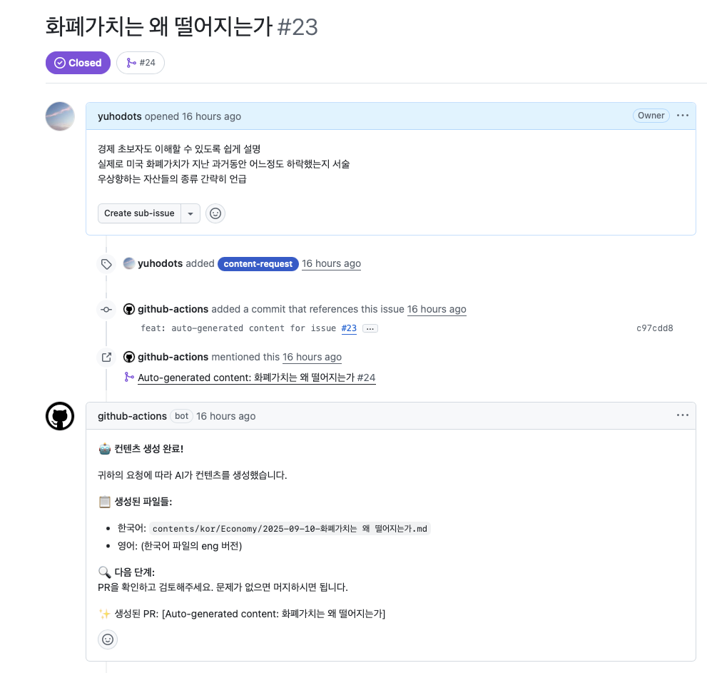
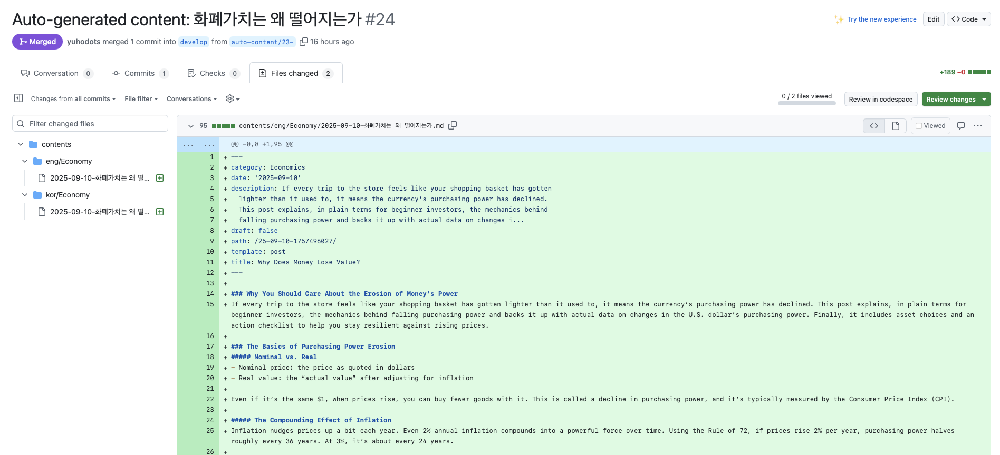
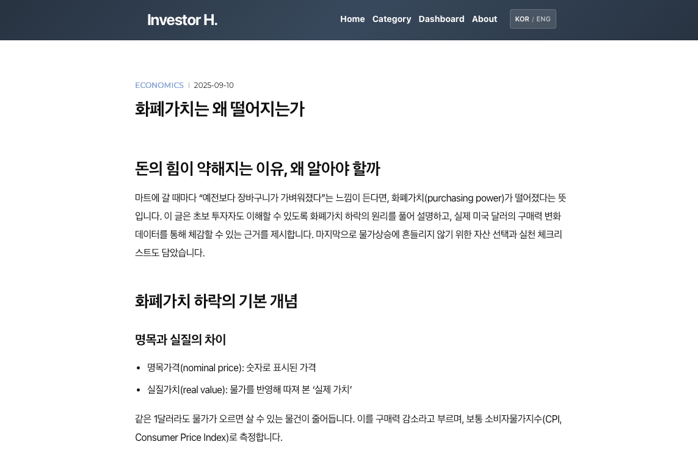

I recently spent a few days working on automating blog post writing with AI, and I'd like to share what I built. It's a pipeline where you simply create a GitHub Issue with a blog post title and brief content, and AI automatically writes the post, translates it, opens a PR, and ultimately deploys it to GitHub Pages.

I could have coded the whole thing myself, but honestly I didn't feel like putting in that much effort, so I delegated everything to Claude Code and just reviewed and fixed the parts that had errors along the way. I worked about 2 hours each evening after work, and it took about 3 days to complete the entire blog setup.

### Workflow Overview

The overall pipeline flow is as follows:

1. **GitHub Issue Creation**: The user creates an issue in the GitHub repository and attaches a specific label (`content-request`).
2. **AI Content Generation**: GitHub Actions detects the issue and runs a Python script. The Python script contains logic to automatically generate a Korean blog post using the OpenAI API.
3. **AI Translation**: The generated Korean blog post is translated into English.
4. **Automatic PR Creation**: The 2 markdown files generated by AI are submitted as a PR via GitHub Actions.
5. **Review and Merge**: Review the output, approve it, and merge.
6. **Automatic Deployment**: Once the merge is complete, the blog is built via GitHub Actions and automatically deployed to GitHub Pages.

### Example Results

When you write an issue like this:

- https://github.com/yuhodots/invest-notes/issues/23



AI generates blog posts in Korean & English and opens a PR:

- https://github.com/yuhodots/invest-notes/pull/24



Once you merge the PR, it's automatically deployed to the blog!

- https://yuhodots.github.io/invest-notes/kor/25-09-10-1757496027/
- https://yuhodots.github.io/invest-notes/eng/25-09-10-1757496027/



During my commute, I would register issues about topics I was personally curious about using the GitHub mobile app. When the posts were written and a PR came in, I'd get a notification right away on the app, making it very convenient to review.

Of course, the posts still clearly look AI-generated and are essentially no different from posting ChatGPT output to a blog. However, having a place where only the topics I'm curious about are recorded and uploaded makes me revisit them more often. I'm also thinking about adding Google AdSense to the blog later on.

### Pipeline

The full code is available at the https://github.com/yuhodots/invest-notes repository.

```
blog/
├── .github/
│   └── workflows/
│       ├── auto-content-generator.yml  # Content generation workflow (Korean & English translation)
│       └── deploy-blog.yml             # Blog deployment workflow
└── ai_workflows/
    ├── writer.py                       # AI writer module
    ├── translator.py                   # AI translator module
    └── prompts/                        # Prompt templates
```

##### Step 1: GitHub Issue Trigger Setup

The action file used for post generation is `.github/workflows/auto-content-generator.yml`.

- `[opened, labeled]`: Triggered when an issue is newly opened or a label is added.
- Only processes issues with the `content-request` label that were created by a specific user (`yuhodots`). Without this check, blog posts could be generated for issues created by other people, potentially consuming OpenAI credits, which is why this setting was added.

```yaml
name: Auto Content Generator

on:
  issues:
    types: [opened, labeled]

jobs:
  generate-content:
    if: |
      contains(github.event.issue.labels.*.name, 'content-request') &&
      (github.event.issue.user.login == 'yuhodots')
    runs-on: ubuntu-latest
```

##### Step 2: AI Content Generation

Install dependencies using uv.

```yaml
- name: Set up Python
  uses: actions/setup-python@v4
  with:
    python-version: '3.12'

- name: Install uv
  uses: astral-sh/setup-uv@v3
  with:
    version: "latest"

- name: Install dependencies
  run: uv sync --locked
```

Read the issue title and body. When I asked Claude Code to implement the code, it wrote it as follows:

- Multi-line issue bodies can be handled using the `EOF` delimiter.
- Extracted information is saved to GITHUB_ENV (for use in subsequent tasks).

```yaml
- name: Extract issue information
  id: issue-info
  run: |
    echo "ISSUE_TITLE=${{ github.event.issue.title }}" >> $GITHUB_ENV
    echo "ISSUE_NUMBER=${{ github.event.issue.number }}" >> $GITHUB_ENV

    # Multi-line variable for body
    echo "ISSUE_BODY<<EOF" >> $GITHUB_ENV
    echo "${{ github.event.issue.body }}" >> $GITHUB_ENV
    echo "EOF" >> $GITHUB_ENV

    # Create slug from issue title
    SLUG=$(echo "${{ github.event.issue.title }}" | tr '[:upper:]' '[:lower:]' | sed 's/[^a-z0-9가-힣]/-/g' | sed 's/--*/-/g' | sed 's/^-\|-$//g')
    echo "SLUG=$SLUG" >> $GITHUB_ENV
```

The code below is quite long so I've omitted parts in between, but the key point is that `ai_workflows/writer.py` actually generates the post using the extracted information, and `ai_workflows/translator.py` translates the generated post into English.

- The Korean file is saved at the GENERATED_FILE (KOREAN_FILE) path, and the English translation is saved at the ENGLISH_FILE path. For detailed code, please refer to the [code files](https://github.com/yuhodots/invest-notes/tree/develop/ai_workflows) directly.
- The OpenAI API Key must be pre-registered in GitHub secrets.

```yaml
    - name: Generate Korean content
      id: generate-korean
      run: |
			 ... content omitted

        # Run writer.py and capture the last line (file path)
        GENERATED_FILE=$(uv run python ai_workflows/writer.py \
          --title "${{ env.ISSUE_TITLE }}" \
          --body "${{ env.ISSUE_BODY }}" | tail -1)

       ... content omitted
      env:
        OPENAI_API_KEY: ${{ secrets.OPENAI_API_KEY }}

    - name: Generate English content
      run: |
        ... content omitted

        # Run translator from root directory
        uv run python ai_workflows/translator.py \
          --input "$KOREAN_FILE" \
          --output "$ENGLISH_FILE"
      env:
        OPENAI_API_KEY: ${{ secrets.OPENAI_API_KEY }}

```

##### Step 3: Automatic Pull Request Creation

The 2 markdown files generated by AI are submitted as a PR. For this to work, the following two settings are required in the repository:

- Settings/Actions/General - Read and write permissions
- Settings/Actions/General - Allow GitHub Actions to create and approve pull requests

```yaml
- name: Create Pull Request
  uses: peter-evans/create-pull-request@v5
  with:
    token: ${{ secrets.PAT_TOKEN || secrets.GITHUB_TOKEN }}
    commit-message: |
      feat: auto-generated content for issue #${{ env.ISSUE_NUMBER }}

      - Generated Korean content: ${{ env.DATE }}-${{ env.SLUG }}.md
      - Generated English content: ${{ env.DATE }}-${{ env.SLUG }}.md

      Closes #${{ env.ISSUE_NUMBER }}
    title: "Auto-generated content: ${{ env.ISSUE_TITLE }}"
    branch: auto-content/${{ env.ISSUE_NUMBER }}-${{ env.SLUG }}
    labels: |
      auto-generated
      content
    reviewers: |
      ${{ github.event.issue.user.login }}
```

##### Step 4: Deployment Workflow

My blog is built on Gatsby, and as you can see from the `package.json` file, deployment to GitHub Pages is done via the `yarn deploy` command.

So the deployment action `deploy-blog.yml` doesn't have anything particularly special either -- it essentially just specifies that when code changes are pushed to the develop branch, run `yarn deploy`.

```yaml
name: Deploy Blog

on:
  push:
    branches:
      - develop
    paths:
      - 'contents/**'
      - 'src/**'
      - 'package.json'
      - 'yarn.lock'

jobs:
  deploy:
    runs-on: ubuntu-latest

    steps:
    - name: Setup Node.js
      uses: actions/setup-node@v4
      with:
        node-version: '20'
        cache: 'yarn'

    - name: Install dependencies
      run: yarn install --frozen-lockfile

    - name: Deploy blog
      run: yarn deploy
```

### Conclusion

I preferred a workflow where AI writes blog posts according to my intent, but instead of deploying the results immediately, I review them first to make corrections or additions, and only upload approved content. This flow fits those requirements well. I think it's a decent approach in that it reflects the user's intent while also allowing for quality control and human feedback. Of course, I still have to manually edit the PR content for the draft, but in the future I could also add a feature where AI revises the PR based on feedback.

The biggest advantage I noticed from actually using it is that it's quite convenient to write GitHub blog posts, edit only the parts I want, and have everything deployed -- all just from my phone. The prompts still need more refinement, but if you're considering a similar pipeline, I'd recommend trying out AI blog automation using this as a reference. :)
