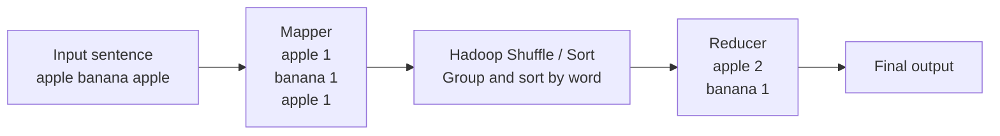
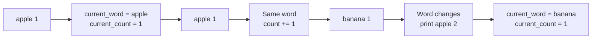
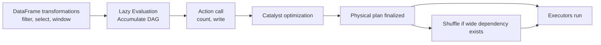

> This post explains, from the perspective of a single-node Python developer, why Hadoop appeared first, why Spark followed, and why Kafka became the layer in front of them. It ties together HDFS and YARN, Spark's DAG and Catalyst, and Kafka's zero-copy and exactly-once patterns in one flow. Drafted with Gemini Deep Research and refined with GPT-5.4.

The single-node Python ecosystem is powerful. With Pandas for data work, `asyncio` for non-blocking I/O, and `multiprocessing` for parallel CPU work, you can handle a surprisingly large amount of real-world workload.

The problem starts when data grows into the TB or PB range and millions of events start arriving every second. At that point, local constraints such as the GIL, a single machine's memory, and disk I/O matter less than distributed-systems concerns such as network shuffles, failure recovery, and the separation of storage and compute.

In that transition, Hadoop was the first answer. The industry needed a way to store and process data by tying together many low-cost commodity servers. But Hadoop MapReduce had to write intermediate results to disk at every stage, which made it too slow for iterative computation and interactive analytics. Spark was the engine that pushed past that limit. Then, as systems shifted toward microservices and real-time events, another layer became necessary: something that could reliably absorb events before computation even began. That role was filled by Kafka.

In modern data platforms, it is more accurate to think of these three as a division of responsibilities than as direct competitors.

- **Hadoop** established the **core philosophy of distributed storage and resource scheduling**.
- **Spark** made **large-scale distributed computation** much faster.
- **Kafka** became the log layer for **real-time event ingestion and replay**.

### Hadoop First

Hadoop was the first mainstream answer to the question, "Where do we store very large data, and how do we process it across many servers?" Its philosophy traces back to Google's GFS and MapReduce papers in the early 2000s, which became the foundation of the big-data ecosystem.

- Role: It stores and processes petabyte-scale data reliably by tying together low-cost commodity hardware.
- Core idea: Instead of moving data to the compute node, **you move computation to the node that already has the data**. In other words, **data locality** is the central idea.
- Current relevance: Today many teams use S3 or Apache Ozone instead of HDFS, and Spark or Flink instead of MapReduce, but the basic ideas of distributed storage and scheduling still start with Hadoop.

Hadoop's core design can be summarized like this.

- Large blocks: It uses a **large default block size of `128MB`**, much bigger than a typical file system, to reduce HDD seek cost and improve sequential read performance.
- Simplified write pattern: It is designed around **`Write Once, Read Many`**. It does not support modifying the middle of a file and instead assumes **append-oriented** writes.
- Replication-based fault tolerance: It treats hardware failure as a constant rather than an exception by storing data blocks with **triple replication**.
- Horizontal scaling on commodity servers: Instead of relying on expensive specialized hardware, it scales out across commodity machines.

Hadoop is usually split into `HDFS` and `YARN`.

- **HDFS: the distributed file system**
  - **`NameNode`** keeps metadata such as file names, permissions, and block mappings in **RAM**.
  - **`DataNode`** stores the actual data blocks.
  - Keeping metadata in memory makes lookups fast, but it also means **NameNode memory becomes an upper bound and a bottleneck** for total file count.
  - DataNodes report their health through **heartbeats**.
  - Replication is rack-aware. Copies are placed across the same rack and different racks so the system can survive physical failures such as switch-level outages.
- **YARN: the cluster resource manager**
  - `ResourceManager` oversees cluster-wide resources.
  - Internally, scheduling and application lifecycle responsibilities are separated.
  - Each worker runs a **`NodeManager`**, and work is assigned in **`Container` units**.
  - When a job arrives, an `ApplicationMaster` starts first, negotiates the required resources, and coordinates task execution.

Today, running Spark on Kubernetes generally feels more natural than running it on YARN.

| Comparison | Spark on YARN | Spark on Kubernetes |
| :---- | :---- | :---- |
| Dependency management | Python and libraries must be aligned ahead of time across all nodes | The whole environment can be packaged into a Docker image |
| Work isolation | Limited at the cluster level | Clean isolation with namespaces and containers |
| Version coexistence | Running multiple Spark/Python versions together is awkward | Multiple versions are easier to operate in one cluster |
| Cost / flexibility | Worse for idle resources and transient-cluster cost control | Easier autoscaling and finer-grained resource allocation |
| Observability | More dependent on Hadoop-specific tooling | Fits modern cloud-native tooling such as Prometheus and Fluentd |

Even though Hadoop is JVM-based, Python developers do not have to write Java. With `Hadoop Streaming`, you can plug ordinary Python scripts into Hadoop as mappers and reducers via standard input and output.

There is one important point here. The `mapper.py` and `reducer.py` scripts below are just Python scripts by themselves. If you look at them in isolation, they are not "Hadoop code." They become a Hadoop example because **Hadoop runs these scripts as mapper and reducer processes, and Hadoop itself handles input splitting, shuffle, sort, and distributed execution around them**.

- The mapper reads data from `stdin` and writes `key\tvalue` pairs to `stdout`.
- The framework sorts and shuffles the intermediate output.
- The reducer reads an already sorted stream, so it can aggregate without keeping a giant hash map in memory.

In other words, the Python code only contains the business logic. The distributed execution itself is handled by Hadoop.

It is also worth pausing on what MapReduce actually is. MapReduce is Hadoop's classic distributed processing model.

- Map: Read input and break it into `key-value` pairs.
- Shuffle / Sort: Hadoop automatically groups and sorts the same keys together.
- Reduce: Aggregate the values that belong to the same key.

In a Word Count example, it looks like this.

| Stage | What it does | Example result |
| :---- | :---- | :---- |
| Input | Read the raw sentence | `apple banana apple` |
| Map | Emit `(word, 1)` each time a word appears | `(apple, 1)`, `(banana, 1)`, `(apple, 1)` |
| Shuffle / Sort | Group identical words together | `apple -> [1, 1]`, `banana -> [1]` |
| Reduce | Add up the numbers for each word | `apple -> 2`, `banana -> 1` |

The word "Map" here is not the same thing as Python's built-in `map()`. "Reduce" also resembles `functools.reduce()`, but in this context it is better understood as "the distributed processing stage that combines values grouped under the same key."

The most basic Word Count example looks like this.

If the input is `"apple banana apple"`, the mapper does not count immediately. Instead, it emits intermediate results such as `apple\t1`, `banana\t1`, and `apple\t1`. Hadoop then groups and sorts identical words and passes that to the reducer, which adds the numbers to produce the final count.



`mapper.py`

`mapper.py` is better understood as "issue one ticket every time you see a word" than as "count words."

```python
#!/usr/bin/env python3
import sys


def run_mapper():
    for line in sys.stdin:
        line = line.strip()
        if not line:
            continue

        for word in line.split():
            print(f"{word}\t1")


if __name__ == "__main__":
    run_mapper()
```

`reducer.py`

By contrast, `reducer.py` reads input that Hadoop has already grouped by word, and computes the final totals by comparing the previous word with the current one.

The key point is that the reducer does not need to load the entire dataset into memory at once. As long as the input is sorted, it can keep only the current word and its current count while streaming forward.



```python
#!/usr/bin/env python3
import sys


def run_reducer():
    current_word = None
    current_count = 0

    for line in sys.stdin:
        line = line.strip()

        try:
            word, count = line.split("\t", 1)
            count = int(count)
        except ValueError:
            continue

        if current_word == word:
            current_count += count
        else:
            if current_word is not None:
                print(f"{current_word}\t{current_count}")
            current_word = word
            current_count = count

    if current_word is not None:
        print(f"{current_word}\t{current_count}")


if __name__ == "__main__":
    run_reducer()
```

So the overall flow of this example is `read sentence -> emit 1 per word -> Hadoop groups and sorts identical words -> add the numbers`.

In practice, you wire it up through Hadoop Streaming like this.

```bash
hadoop jar $HADOOP_HOME/share/hadoop/tools/lib/hadoop-streaming-*.jar \
  -input /data/input \
  -output /data/output \
  -mapper mapper.py \
  -reducer reducer.py \
  -file mapper.py \
  -file reducer.py
```

In that command, Hadoop does the following.

- Split the input file into many pieces.
- Run `mapper.py` against each piece.
- Collect mapper output and shuffle / sort it by key.
- Pass the grouped result to `reducer.py`.
- Save the final output to HDFS.

This pattern is great for understanding the concept, but it has process communication overhead and keeps writing intermediate results to disk. That limitation is exactly why Spark appears next.

### Spark Next

Spark was built to make distributed computation faster. The **biggest weakness of Hadoop MapReduce** was that **all intermediate results had to go through disk for shuffle**. That made the model too slow for iterative machine learning and low-latency interactive queries.

- Role: It is a general-purpose distributed compute engine built around in-memory processing.
- Why it mattered: By **keeping intermediate results in RAM**, it can run much faster than Hadoop MapReduce.
- Ecosystem: It unified batch processing, SQL, streaming, machine learning, and graph processing under a single API model.

What makes Spark important is not just that it is "fast." The bigger point is that it can behave like a general query engine regardless of whether the data lives in HDFS, S3, Iceberg, or Delta Lake. That is one reason the lakehouse architecture became standard.

When people first approach PySpark, they often assume their Python code will run directly as distributed Python processes on every node. In practice, that is not quite how it works.

- PySpark is closer to a declarative wrapper.
- You describe the result you want, and **the actual optimization and physical execution are handled by the JVM-based Spark engine**.
- The heart of that process is **`Catalyst Optimizer` and `Tungsten`**.

The lowest-level abstraction in Spark is **`RDD`** (`Resilient Distributed Dataset`).

- An RDD is an immutable distributed dataset.
- Spark does not execute transformations immediately. Instead, it accumulates them into a DAG.
- The actual execution plan is only fixed when an **action** such as `count()`, `collect()`, or `write()` is called.
- Narrow dependencies such as `map` and `filter` are relatively cheap, while wide dependencies such as `join` and `groupBy` trigger expensive shuffles.
- In distributed systems, reducing shuffle cost is one of the main performance concerns.

Catalyst roughly works through the following stages.

| Stage | What happens | Meaning |
| :---- | :---- | :---- |
| Unresolved Logical Plan | Parse the code into an AST-like structure | Check structural validity |
| Analyzed Logical Plan | Resolve table references, column names, and types using catalog and schema metadata | Bind abstract symbols to the actual data model |
| Optimized Logical Plan | Apply rule-based optimizations such as predicate pushdown, column pruning, and constant folding | Reduce logical cost and the amount of data read |
| Physical Plan / CBO | Compare multiple physical execution candidates and choose strategies such as broadcast joins | Pick the most efficient execution plan for distributed resources |

With `AQE` (`Adaptive Query Execution`) enabled, Spark can also refine the plan at runtime by looking at actual shuffle output, coalescing partitions, and mitigating skew.

If you simplify Spark's execution flow aggressively, it looks like this. The key point is that writing transformation code does not run anything immediately. The DAG keeps building until an action is called.



In PySpark, memory is one of the most common sources of practical trouble. Because Python processes and JVM processes move together, it is easy to hit OOM if you tune by instinct.

- `spark.executor.memoryOverhead`
  - This is where Python worker processes, network buffers, and framework overhead live.
  - The default is often not enough when Python UDFs or Pandas-based transformations are heavy.
- Unified Memory
  - Inside the JVM heap, Storage Memory and Execution Memory share space dynamically.
  - Cache competes with join/sort intermediate buffers.
- Spill
  - When execution memory is not enough, Spark spills to disk.
  - If performance suddenly collapses, this is one of the first things to check.

A very common real-world pattern is deduplication. In history-style tables, teams often need to "keep only the latest record for the same key." In that situation, relying on `dropDuplicates()` or solving it with a self-join can create unnecessary shuffle cost. In practice, `Window + row_number()` is usually clearer and more stable.

Here, a `window` can be understood as "the local range each row compares itself against." If `groupBy` collapses each group down to a single result, a window keeps the original rows and computes things like rank or latest value within each group.

```python
from pyspark.sql import SparkSession
from pyspark.sql.window import Window
import pyspark.sql.functions as F

spark = (
    SparkSession.builder
    .appName("Optimized_Deduplication_Pipeline")
    .config("spark.sql.adaptive.enabled", "true")
    .config("spark.sql.adaptive.coalescePartitions.enabled", "true")
    .getOrCreate()
)

df = spark.read.parquet("s3a://enterprise-data-lake/raw/transactions/")

window_spec = (
    Window.partitionBy("customer_id", "transaction_date")
    .orderBy(
        F.col("updated_timestamp").desc(),
        F.col("transaction_id").desc(),
    )
)

deduplicated_df = (
    df.withColumn("row_num", F.row_number().over(window_spec))
      .filter(F.col("row_num") == 1)
      .drop("row_num")
)

deduplicated_df.cache()

final_record_count = deduplicated_df.count()
print(f"Final valid transaction count after deduplication: {final_record_count}")

deduplicated_df.write.format("iceberg").mode("overwrite").save(
    "catalog.db.clean_transactions"
)
```

This pattern is useful because it lets the distributed engine solve the problem with a single clear shuffle-and-sort path.

When reading this code, the first three lines to focus on are these.

- `partitionBy(...)`: define which records belong to the same deduplication candidate group
- `orderBy(...)`: define what counts as the latest record within that group
- `row_number() == 1`: keep only the first-ranked record in each group

This is a valid real-world pattern, but it does not mean there is no shuffle at all. Window-based dedup still requires shuffle and sort. The point is not "no shuffle." The point is that compared with self-joins, the intent is clearer and the physical plan is usually easier to reason about.

But even though Spark is a fast compute engine, it does not solve the problem of storing incoming events for a long time and letting multiple consumers rewind and replay them. In a real-time system, you need a layer in front of compute. That is Kafka.

### Kafka Then

Kafka solved a different question: "How do we absorb a stream of real-time events reliably, while letting many systems consume them in a loosely coupled way?"

Traditional queue systems usually delete a message once it is consumed. Combinations like Celery + RabbitMQ or Redis are still useful, but at very large scale they have structural limits when you need replay, long retention, many consumer groups, and very high throughput at the same time.

Kafka's core contribution was to redefine messaging as a **distributed commit log**.

- Producers and consumers are loosely coupled.
- **Messages do not disappear immediately after they are consumed.**
- Data stays on disk until **retention policy** or **disk limits** say otherwise.
- That means you can rewind offsets and **reprocess historical events** after a failure.

Kafka is fast for reasons that live closer to **OS-kernel-level optimization than application-level tricks**.

- **Zero-Copy**
  - A traditional server copies data across disk buffers, user-space buffers, and socket buffers repeatedly.
  - Kafka minimizes user-space copying through system calls such as `sendfile`.
  - That reduces CPU overhead and memory-copy cost.
- **Page Cache**
  - Kafka avoids keeping large amounts of data in the JVM heap unnecessarily.
  - It writes to the **OS page cache**, and reads are often served directly from there.
  - That makes large-heap GC pauses less of a problem.

Its storage model is also simple but powerful.

- **Topic**: the **logical** stream of data
- **Partition**: the **physical** unit of parallelism
- **Offset**: the **monotonically increasing ID** inside a partition
- **Segment**: the log is split into **multiple log-file chunks**
- **Append-only**: the file is never modified in the middle, only appended to, which maximizes sequential write performance

Data integrity is protected through replication and the leader-follower model.

- **Each partition has one leader and multiple follower replicas.**
- The set of replicas that are sufficiently caught up with the leader is called **`ISR`** (`In-Sync Replicas`).
- The leader only advances the **`High Watermark`** up to the point that ISR replication has confirmed.
- Consumers can only read committed messages up to that watermark.

Another major change is **`KRaft`**.

- Older Kafka clusters depended on ZooKeeper for metadata management and leader election.
- Newer versions move to KRaft, Kafka's built-in Raft-based mode, and remove the ZooKeeper dependency.
- That reduces operational complexity and metadata bottlenecks.

You still need to keep a few core concepts straight.

- Topic / Partition
  - Ordering is guaranteed **only within a single partition**, not across the whole cluster.
  - If order matters for a key, that key must go to the same partition.
- Consumer Group
  - Multiple consumers sharing the same `group.id` act as one logical group.
  - A given partition is consumed by exactly one consumer inside that group.
  - This simplifies order handling and reduces duplicate-consumption problems.

When using Kafka, you also need to distinguish delivery guarantees clearly.

| Guarantee level | What it means | Behavior under failure |
| :---- | :---- | :---- |
| **At-most-once** | Do not wait for acknowledgment or retry | Messages can be lost |
| **At-least-once** | Retry until persistence is acknowledged | Messages can be processed more than once |
| **Exactly-once** | Even with retries and failures, the final result is reflected only once | Most complex, but important in domains such as payments and finance |

In Python, it is usually better to use **`confluent-kafka` built on top of `librdkafka`** than a pure-Python client when you care about async I/O, idempotence, and transactions.

Before looking at code, the simplified Kafka flow looks like this.


First, the idempotent producer pattern that prevents duplicate sends.

```python
import json
from confluent_kafka import Producer

conf = {
    "bootstrap.servers": "kafka-broker1:9092,kafka-broker2:9092",
    "client.id": "payment-idempotent-producer",
    "enable.idempotence": True,
    "acks": "all",
    "retries": 2147483647,
    "max.in.flight.requests.per.connection": 5,
}

producer = Producer(conf)


def delivery_report(err, msg):
    if err is not None:
        print(f"Warning: message delivery failed: {err}")
    else:
        print(
            f"Committed safely: topic {msg.topic()} "
            f"partition {msg.partition()} offset {msg.offset()}"
        )


payload = {
    "transaction_id": "TXN-2026-991A",
    "user_id": 4251,
    "amount": 150000.0,
}

producer.produce(
    topic="secure-payments-stream",
    key=str(payload["user_id"]),
    value=json.dumps(payload).encode("utf-8"),
    on_delivery=delivery_report,
)

producer.flush()
```

Three things matter most here.

- `enable.idempotence=True`: prevents the same message from being reflected twice because of retries
- `acks='all'`: wait until all ISR replicas have recorded the message
- Key design: send the same `user_id` to the same partition so ordering is preserved per user

Next comes the consumer side. One of the most common mistakes is committing offsets before business logic has actually finished. If the process crashes after the offset is committed, the message is effectively lost forever. That is why disabling auto-commit and committing only after external work succeeds is such a common pattern.

```python
import json
from confluent_kafka import Consumer, KafkaError, KafkaException

conf = {
    "bootstrap.servers": "kafka-broker1:9092,kafka-broker2:9092",
    "group.id": "payment-db-writer-group",
    "auto.offset.reset": "earliest",
    "enable.auto.commit": False,
    "isolation.level": "read_committed",
}

consumer = Consumer(conf)
consumer.subscribe(["secure-payments-stream"])

BATCH_SIZE = 100
message_buffer = []


def process_batch_transactions(messages):
    for msg in messages:
        payload = json.loads(msg.value().decode("utf-8"))
        # DB transaction / external API call
        pass


try:
    while True:
        msg = consumer.poll(timeout=1.0)

        if msg is None:
            if not message_buffer:
                continue
        elif msg.error():
            if msg.error().code() == KafkaError._PARTITION_EOF:
                continue
            raise KafkaException(msg.error())
        else:
            message_buffer.append(msg)

        if len(message_buffer) >= BATCH_SIZE or (msg is None and message_buffer):
            try:
                process_batch_transactions(message_buffer)
                consumer.commit(asynchronous=False)
            except Exception as e:
                print(f"Fatal error during persistence, skipping commit: {e}")
                raise
            finally:
                message_buffer = []
except KeyboardInterrupt:
    print("Shutdown sequence started")
finally:
    consumer.close()
```

The key points of this pattern are simple.

- `enable.auto.commit=False`: the application keeps control
- Commit only after business logic succeeds: if it fails, do not commit and let the message be replayed
- `read_committed`: do not read transactionally aborted messages
- In other words, not "commit as soon as you read," but "commit only after external work has actually completed"

That said, this is **not** a strict end-to-end EOS example that includes the external database. Up to this point, it is better understood as a Kafka-safety pattern or an at-least-once pattern that reduces data loss risk. To get closer to true exactly-once behavior across an external DB, you still need additional design pieces such as idempotent upserts, uniqueness constraints, or a transaction strategy that coordinates offset progression with DB persistence.

So the right way to classify this example is:

- Producer example: a valid idempotent-producer example
- Consumer example: a valid manual-commit safe-consumer pattern
- Strict EOS example across the external DB: no

This is still a strong foundation. From here, you can extend toward real end-to-end EOS by combining Spark Structured Streaming, Kafka transactions, and idempotent sinks.

### One Pipeline

Now put the three together and the picture becomes much simpler.

1. `Kafka` absorbs the burst of incoming events at the front.
2. `Spark` reads those events and performs real-time aggregation, cleanup, feature extraction, or batch analysis.
3. The final output lands in distributed storage shaped by Hadoop's philosophy, such as HDFS or object storage like S3/Ozone, typically with a table format such as Iceberg or Delta Lake on top.


In other words, modern data platforms often let Kafka handle ingestion, Spark handle computation, and Hadoop survive as the underlying philosophy behind storage and scheduling.

For a Python developer moving beyond the single-node world, the important thing is not memorizing APIs. It is internalizing the concepts below.

- Data locality and shuffle cost
- Lazy evaluation and DAG-based execution
- Memory overhead and spill
- Append-only logs and offsets
- Replication, idempotence, manual commits, and replay

Once those ideas click, you move beyond simply calling libraries and start being able to design pipelines that survive failures and traffic spikes.

### References

#### Hadoop

- [hadoop - hdfs and yarn - CSA - IISc Bangalore](https://www.csa.iisc.ac.in/~raghavan/pods2024/hadoop-2024.pdf)
- [Hadoop YARN Architecture - GeeksforGeeks](https://www.geeksforgeeks.org/big-data/hadoop-yarn-architecture/)
- [Is Hadoop still in use in 2025? - Reddit](https://www.reddit.com/r/ExperiencedDevs/comments/1in669d/is_hadoop_still_in_use_in_2025/)
- [The 2025 & 2026 Ultimate Guide to the Data Lakehouse and the Data Lakehouse Ecosystem - DEV Community](https://dev.to/alexmercedcoder/the-2025-2026-ultimate-guide-to-the-data-lakehouse-and-the-data-lakehouse-ecosystem-dig)
- [Data Formats vs Table Formats: Hudi vs Iceberg vs Delta Lake vs Parquet vs Avro vs ORC - Medium](https://medium.com/@moshahriari/data-formats-vs-table-formats-hudi-vs-iceberg-vs-delta-lake-vs-parquet-vs-avro-vs-orc-c9190cab7051)
- [Is Hadoop still relevant to the modern Data Engineering world? - Reddit](https://www.reddit.com/r/dataengineering/comments/1e66tce/is_hadoop_still_relevant_to_the_modern_data/)
- [Documentation for Apache Ozone](https://ozone.apache.org/docs/2.0.0/)
- [Apache Hadoop YARN](https://hadoop.apache.org/docs/stable/hadoop-yarn/hadoop-yarn-site/YARN.html)
- [Move from Spark on YARN to Kubernetes | Future-Proof Your Data](https://www.acceldata.io/blog/why-move-from-spark-on-yarn-to-kubernetes)
- [Internals of YARN architecture. Overview - Medium](https://karthiksharma1227.medium.com/internals-of-yarn-architecture-c16abf93c)
- [Apache Spark vs Apache Hadoop: 10 crucial differences (2026) - Flexera](https://www.flexera.com/blog/finops/apache-spark-vs-apache-hadoop/)
- [Spark on yarn vs Spark on kubernetes - Medium](https://medium.com/@ahmed.missaoui.pro_79577/spark-on-yarn-vs-park-on-kubernetes-4d2e34d42518)
- [MapReduce Tutorial - Apache Hadoop 3.5.0](https://hadoop.apache.org/docs/current/hadoop-mapreduce-client/hadoop-mapreduce-client-core/MapReduceTutorial.html)
- [Hadoop Streaming Using Python - Word Count Problem - GeeksforGeeks](https://www.geeksforgeeks.org/python/hadoop-streaming-using-python-word-count-problem/)
- [Guide To Hadoop Streaming: Examples & Alternatives - Macrometa](https://www.macrometa.com/event-stream-processing/hadoop-streaming)
- [Getting maximum occurred word in Hadoop Mapreduce word count - Stack Overflow](https://stackoverflow.com/questions/43057596/getting-maximum-occurred-word-in-hadoop-mapreduce-word-count)

#### Spark

- [Tuning - Spark 4.1.1 Documentation - Apache Spark](https://spark.apache.org/docs/latest/tuning.html)
- [Unpacking Apache Spark's Internal Workings - Broadwayinfosys](https://ftp.broadwayinfosys.com/blog/unpacking-apache-sparks-internal-workings-1764802288)
- [Building a Modern Data Lake Using Open Source Tools - OpenMetal](https://openmetal.io/resources/blog/building-a-modern-data-lake-using-open-source-tools/)
- [Apache Iceberg vs Delta Lake: Which is right for your lakehouse? - Dremio](https://www.dremio.com/blog/apache-iceberg-vs-delta-lake/)
- [How to Optimize PySpark Jobs: Real-World Scenarios for Apache Spark - freeCodeCamp](https://www.freecodecamp.org/news/how-to-optimize-pyspark-jobs-handbook/)
- [Key topics in Apache Spark - AWS Documentation](https://docs.aws.amazon.com/prescriptive-guidance/latest/tuning-aws-glue-for-apache-spark/key-topics-apache-spark.html)
- [Deep Dive into Apache Spark Internals - Medium](https://medium.com/@CodeKrafter/internal-understanding-of-apache-spark-07690827fab8)
- [Apache Spark Internals: RDDs, Pipelining, Narrow & Wide Dependencies - YouTube](https://www.youtube.com/watch?v=RrTFrtH6x1E)
- [Mastering Spark DAGs - Dev Genius](https://blog.devgenius.io/mastering-spark-dags-the-ultimate-guide-to-understanding-execution-ce6683ae785b)
- [Spark Memory Configuration Notes - GitHub](https://github.com/LucaCanali/Miscellaneous/blob/master/Spark_Notes/Spark_Memory_Configuration.md)
- [Apache Spark Memory Management: A Practical Guide - Medium](https://medium.com/@mohammadshoaib_74869/demystifying-apache-spark-memory-management-a-practical-guide-6c88c4187fa6)
- [PySpark Window Functions: A Practical Guide for Cleaner Aggregations - Medium](https://medium.com/@daveshpandey/pyspark-window-functions-a-practical-guide-for-cleaner-aggregations-50eae3a325ba)
- [Ensuring Data Quality in PySpark: Deduplication Methods - Diggibyte](https://diggibyte.com/ensuring-data-quality-in-pyspark/)
- [Are window functions more performant than self joins? - Databricks Community](https://community.databricks.com/t5/data-engineering/are-window-functions-more-performant-than-self-joins/td-p/7370)
- [Spark Window aggregation vs. Group By/Join performance - Stack Overflow](https://stackoverflow.com/questions/62430518/spark-window-aggregation-vs-group-by-join-performance)
- [Stop Using dropDuplicates()! Here's the Right Way to Remove Duplicates - Reddit](https://www.reddit.com/r/dataengineering/comments/1izl8e3/stop_using_dropduplicates_heres_the_right_way_to/)
- [pyspark.sql.functions.row_number - Apache Spark](https://spark.apache.org/docs/latest/api/python/reference/pyspark.sql/api/pyspark.sql.functions.row_number.html)
- [Mastering PySpark Window Functions: 6 Real-World Use Cases Revisited with Spark Connect - Medium](https://medium.com/@2twitme/mastering-pyspark-window-functions-6-real-world-use-cases-revisited-with-spark-connect-4b907027c59d)
- [How to Remove Duplicate Records in PySpark - YouTube](https://www.youtube.com/watch?v=wN3pWE0QZFY)
- [How to remove duplicates from a spark data frame while retaining the latest? - Stack Overflow](https://stackoverflow.com/questions/55660085/how-to-remove-duplicates-from-a-spark-data-frame-while-retaining-the-latest)

#### Kafka

- [Apache Kafka Internals - engineering.cred.club](https://engineering.cred.club/kafka-internals-47e594e3f006)
- [Kafka Consumers - Full Deep Dive - Medium](https://medium.com/@anil.goyal0057/kafka-consumers-full-deep-dive-basic-advanced-606908f60d2f)
- [Exactly-once Semantics is Possible: Here's How Apache Kafka Does it - Confluent](https://www.confluent.io/blog/exactly-once-semantics-are-possible-heres-how-apache-kafka-does-it/)
- [Apache Kafka Architecture Deep Dive - Confluent Developer](https://developer.confluent.io/courses/architecture/get-started/)
- [High Water Mark (HWM) in Kafka Offsets - Level Up Coding](https://levelup.gitconnected.com/high-water-mark-hwm-in-kafka-offsets-5593025576ac)
- [Exactly-once semantics with Kafka transactions - Strimzi](https://strimzi.io/blog/2023/05/03/kafka-transactions/)
- [A deep dive into Apache Kafka's KRaft protocol - Red Hat Developer](https://developers.redhat.com/articles/2025/09/17/deep-dive-apache-kafkas-kraft-protocol)
- [confluent_kafka API - Confluent documentation](https://docs.confluent.io/platform/current/clients/confluent-kafka-python/html/index.html)
- [Best Practices For Kafka in Python - DEV Community](https://dev.to/sats268842/best-practices-for-kafka-in-python-2me5)
- [confluent-kafka-python examples - GitHub](https://github.com/confluentinc/confluent-kafka-python/blob/master/examples/README.md)
- [How to Configure Kafka Consumer for Exactly-Once Processing - OneUptime](https://oneuptime.com/blog/post/2026-01-24-kafka-exactly-once-processing/view)
- [How to Use Apache Kafka with Python (confluent-kafka) - OneUptime](https://oneuptime.com/blog/post/2026-02-02-python-confluent-kafka/view)
- [Kafka Transactional Support: How It Enables Exactly-Once Semantics - Confluent Developer](https://developer.confluent.io/courses/architecture/transactions/)
