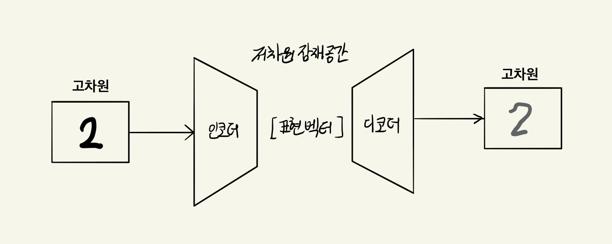
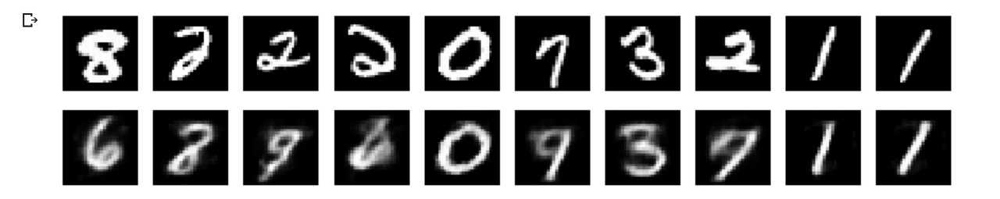
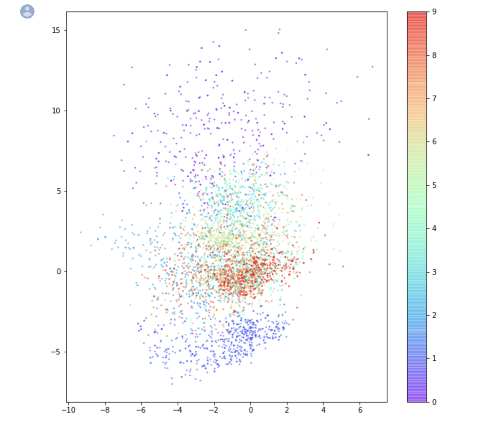

Let's explore the autoencoder, which is the most fundamental building block for studying deep learning generative models. This post is based on what I learned from the book 'Generative Deep Learning' (O'REILLY).

### Autoencoder?

<center><p><i>https://blog.keras.io/building-autoencoders-in-keras.html</i></p></center>

An autoencoder encodes input data into a lower-dimensional representation. It then decodes the lower-dimensional encoded data back to reconstruct the original input. In other words, the encoder performs dimensionality reduction on the input data, and the decoder restores it back to the original dimensionality.

As shown in the image above, when the model receives an image of the number 2 as input, it outputs the same image of the number 2. The model is trained to find weights that **minimize the loss between the input image and the reconstructed image**. Since the target value is the same as the input data, this is sometimes referred to as self-supervised learning.

#### Characteristics of Autoencoders

An autoencoder can only accept input data that is **similar to the data it was trained on**. Encoding data into a lower dimension does not mean the same thing as file compression algorithms. For example, image compression algorithms generally compress images in general, but they are not designed to compress only specific types of images. A model trained to compress images of the number 2 cannot properly compress images like human face photos. Additionally, the final decoded output is generally **blurrier** than the original image.

While autoencoders alone are not widely used in practical applications, they are employed in relevant fields because autoencoders have the advantages of **data denoising** and **dimensionality reduction**.

#### High Dimension and Latent Space

To properly understand autoencoders, it is essential to understand the terms **high dimension and latent space**.

Suppose we have a single photo that is 100x100 pixels. This data is a 100x100x3 array. Since it is [100, 100, 3], it becomes 3-dimensional data with 30,000 numbers, and we can view this single photo as a single point in a 30,000-dimensional space. In a space with 30,000 axes (= a 30,000-dimensional space), a single photo consists of 30,000 numbers, so it can be located as a single point based on those numbers. This 30,000-dimensional space is called the high dimension, and the point where a single photo is located becomes the data point.



Now, looking at the autoencoder from this perspective, the input data for an autoencoder model that learns images of the number 2 is essentially a single point in a 28x28-dimensional space. The encoder learns to **map a single point in the 28x28-dimensional space to a single point in a lower-dimensional latent space**, and the decoder learns to **map a single point in the lower-dimensional latent space back to a point in the 28x28-dimensional space**. Through this process, the autoencoder achieves the effects of dimensionality reduction and noise removal. The lower-dimensional latent space is called the **latent space**, and a single point in this latent space is called the **representation vector**.

### Code-level Implementation

Let's train an autoencoder at the code level using the [Keras code](https://github.com/davidADSP/GDL_code) provided on GitHub by the author of 'Generative Deep Learning' (O'REILLY). Rather than going through all the code, let's pick out the important parts and see what structure they have. Since implementation code can vary by developer, I recommend just getting a general sense of the structure. (The **MNIST** dataset was used.)

1. This method loads the input data and adjusts the scale for stable training.

```python
def load_mnist():
    (x_train, y_train), (x_test, y_test) = mnist.load_data()

    x_train = x_train.astype('float32') / 255.
    x_train = x_train.reshape(x_train.shape + (1,))
    x_test = x_test.astype('float32') / 255.
    x_test = x_test.reshape(x_test.shape + (1,))

    return (x_train, y_train), (x_test, y_test)
```

2. This is the encoder structure. The model is built by repeatedly using convolutional neural networks and LeakyReLU activation functions. The output of the final convolution is flattened and connected to a Dense layer of size z_dim to represent the z_dim-dimensional latent space.

```python
### THE ENCODER
        encoder_input = Input(shape=self.input_dim, name='encoder_input')
        x = encoder_input
        x = Conv2D(filters=self.encoder_conv_filters[0],
                   kernel_size=self.encoder_conv_kernel_size[0],
                   strides=self.encoder_conv_strides[0],
                   padding='same',
                   name='encoder_conv_' + str(0) )(x)
        x = LeakyReLU()(x)
        x = Conv2D(filters=self.encoder_conv_filters[1],
                   kernel_size=self.encoder_conv_kernel_size[1],
                   strides=self.encoder_conv_strides[1],
                   padding='same',
                   name='encoder_conv_' + str(1) )(x)
        x = LeakyReLU()(x)
        x = Conv2D(filters=self.encoder_conv_filters[2],
                   kernel_size=self.encoder_conv_kernel_size[2],
                   strides=self.encoder_conv_strides[2],
                   padding='same',
                   name='encoder_conv_' + str(2))(x)
        x = LeakyReLU()(x)
        x = Conv2D(filters=self.encoder_conv_filters[3],
                   kernel_size=self.encoder_conv_kernel_size[3],
                   strides=self.encoder_conv_strides[3],
                   padding='same',
                   name='encoder_conv_' + str(3))(x)
        x = LeakyReLU()(x)
        shape_before_flattening = K.int_shape(x)[1:]
        x = Flatten()(x)
        encoder_output = Dense(self.z_dim, name='encoder_output')(x)

        self.encoder = tf.keras.Model(encoder_input, encoder_output)
```

3. This is the decoder structure. The model is built by repeatedly using transposed convolutional neural networks (conv transpose) and LeakyReLU activation functions. The decoder does not need to have the exact opposite structure of the encoder; any structure is possible as long as the final output layer matches the size of the input data.

```python
 ### THE DECODER
        decoder_input = Input(shape=(self.z_dim,), name='decoder_input')
        x = Dense(np.prod(shape_before_flattening))(decoder_input)
        x = Reshape(shape_before_flattening)(x)
        x = Conv2DTranspose(filters=self.decoder_conv_t_filters[0],
                            kernel_size=self.decoder_conv_t_kernel_size[0],
                            strides=self.decoder_conv_t_strides[0],
                            padding='same',
                            name='decoder_conv_t_' + str(0) )(x)
        x = LeakyReLU()(x)
        x = Conv2DTranspose(filters=self.decoder_conv_t_filters[1],
                            kernel_size=self.decoder_conv_t_kernel_size[1],
                            strides=self.decoder_conv_t_strides[1],
                            padding='same',
                            name='decoder_conv_t_' + str(1) )(x)
        x = LeakyReLU()(x)
        x = Conv2DTranspose(filters=self.decoder_conv_t_filters[2],
                            kernel_size=self.decoder_conv_t_kernel_size[2],
                            strides=self.decoder_conv_t_strides[2],
                            padding='same',
                            name='decoder_conv_t_' + str(2) )(x)
        x = LeakyReLU()(x)
        x = Conv2DTranspose(filters=self.decoder_conv_t_filters[3],
                            kernel_size=self.decoder_conv_t_kernel_size[3],
                            strides=self.decoder_conv_t_strides[3],
                            padding='same',
                            name='decoder_conv_t_' + str(3) )(x)
        x = Activation('sigmoid')(x)
        decoder_output = x

        self.decoder = tf.keras.Model(decoder_input, decoder_output)
```

### Limitations of Autoencoders



After training the entire model using the Keras code, we obtained the results shown above. Since I mapped the 784-dimensional high-dimensional image data to a 2-dimensional latent space, the output may appear poor, but if you set the latent space dimension to around 10, you can obtain output values that closely resemble the input values.

<center><p><i>https://github.com/davidADSP/GDL_code</i></p></center>

This is a **scatter plot** showing the representation vectors that MNIST dataset original images were mapped to in the latent space by the encoder. Since the encoder in our example code mapped image data to 2-dimensional vectors, we were able to visualize them on this 2-dimensional plot.

When trying to map these representation vectors in the latent space through the decoder to restore them to the original image dimension, there are several issues to consider.

1. There is **no clear method for selecting random points** in the latent space.
2. There is a **lack of diversity in generated images**. For example, since the region for the number 1 is much larger than the region for the number 8, randomly selecting points is more likely to produce 1s.
3. The **quality of generated images can be quite poor** in some cases.

This problem occurs because the autoencoder **does not make the latent space continuous**. Just because the point (1, 1) was decoded excellently does not guarantee that (1.1, 1.1) will also be decoded well. Therefore, we need to make the latent space continuous. This will be explored in the next post on Variational Autoencoders.

### Reference

- Saedong Nam's [Facebook post](https://www.facebook.com/dgtgrade/posts/1598044216921105) (Very helpful for understanding high-dimensional data)
- David Foster - Generative Deep Learning (O'REILLY)
- [The Keras Blog](https://blog.keras.io/building-autoencoders-in-keras.html)