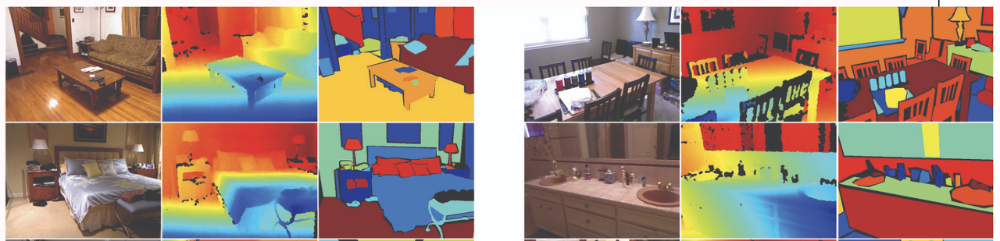
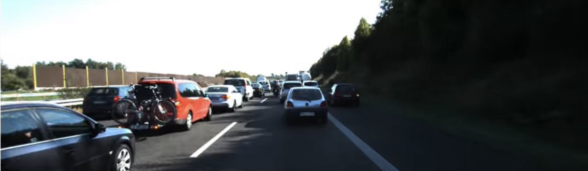
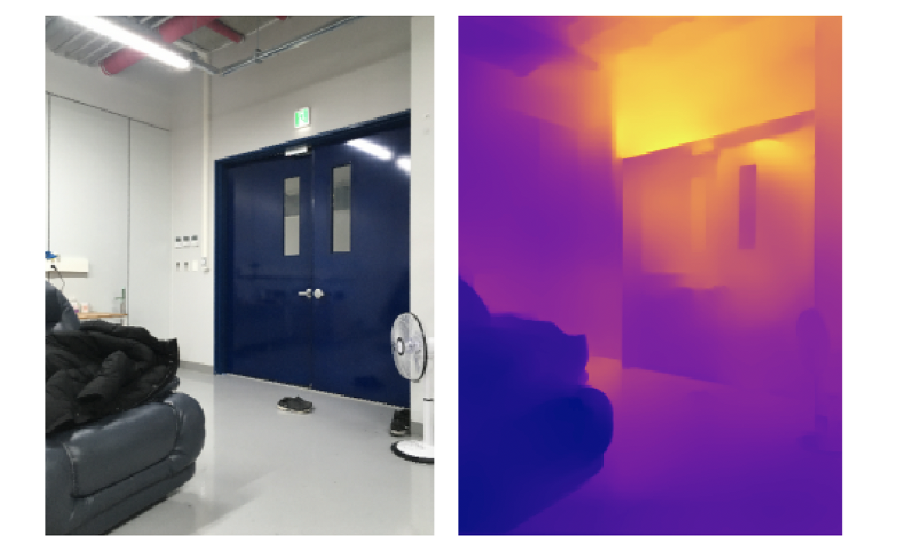
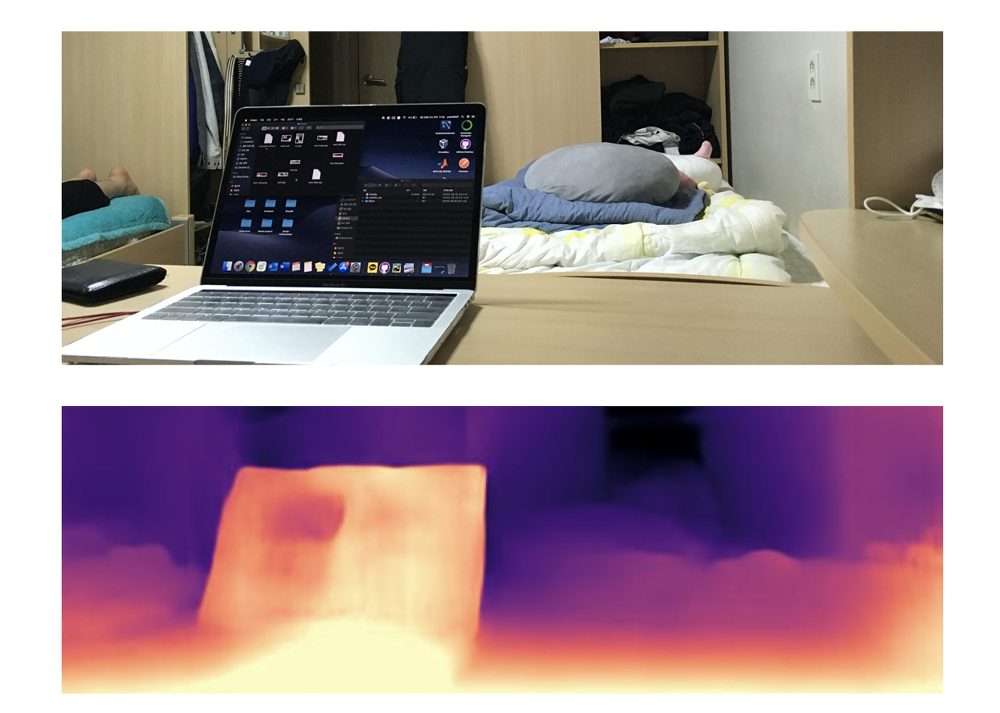

Recently, I had the chance to run depth estimation code for an experiment in my lab, which led me to study depth estimation briefly. In this post, I will share what I learned and the paper code I referenced.

### Depth estimation

Depth estimation refers to the task where we feed a 2D image as input to a model, and the model **outputs the depth values of the image**. Training is typically conducted using **images with depth values as labels**, and the model uses a supervised learning approach where it estimates depth values for images without given depth labels and updates weights by comparing the predictions against the actual labels.

### Datasets

Datasets for training depth estimation models are collected using depth cameras. The most commonly used datasets are the NYU dataset and the KITTI dataset.

#### NYU2 dataset

<i>https://cs.nyu.edu/~silberman/datasets/nyu_depth_v2.html</i>

The NYU dataset contains still images and depth values from **indoor spaces**. It also includes class labels for individual pieces of furniture. A detailed description of the dataset is available on the [original site](https://cs.nyu.edu/~silberman/datasets/nyu_depth_v2.html).

#### KITTI dataset

<i>http://www.cvlibs.net/datasets/kitti/index.php</i>

The KITTI dataset contains **street video footage** captured by mounting a camera on a moving car, along with the corresponding depth values. A detailed description of the dataset is available on the [original site](http://www.cvlibs.net/datasets/kitti/).

### Depth estimation models

I found depth estimation code on GitHub and ran it at the code level. First, I used Python OpenCV to load photos I had taken and predicted depth results for them.

In addition to photos, I also wanted to try real-time prediction on videos, so I loaded videos and ran predictions frame by frame. However, the prediction speed for videos was too slow, so I ended up being satisfied with predicting on photos only. (I was hoping for around 15 frames per second on GPU, but the code below did not achieve that speed.)

#### Densedepth

- https://github.com/ialhashim/DenseDepth

The Densedepth code was introduced in the paper ['High Quality Monocular Depth Estimation via Transfer Learning'](https://arxiv.org/abs/1812.11941). The overall model architecture uses a **standard encoder-decoder architecture** based on CNNs, and employs a **transfer learning** approach using DenseNet pre-trained on the ImageNet dataset as the encoder's pre-trained network. My understanding of this paper's contribution is that 'a network using transfer learning performed depth estimation remarkably well.'

This code provides models trained on both the NYU2 dataset and the KITTI dataset, and offers both TensorFlow and PyTorch implementations. Below are the output results obtained by feeding in photos I took myself.

#### monodepth2

- https://github.com/nianticlabs/monodepth2

For the monodepth2 code, I only ran it at the code level without reading the paper. This code only provides a model trained on the KITTI dataset, and the code is implemented in PyTorch. Below are the output results obtained by feeding in photos I took myself.

If you know of any better models worth trying, I would appreciate your recommendations.

### Related Resources

- Google's Depth Prediction: https://ai.googleblog.com/2019/05/moving-camera-moving-people-deep.html?fbclid=IwAR12YTuDS99mvPse-T0Jmn9TQKwskpxIUcWLQrJmg3J-ZdcRwLbiRVcEBa4
- Research paper by Google AI and Google Robotics: https://arxiv.org/pdf/1904.04998.pdf
- Single View Stereo Matching: https://github.com/lawy623/SVS?fbclid=IwAR1xN_ClQ2vO6Xnmcrnmn_433KW2G96B-VtpIuYNwomq0LEGkbe1Q1M_y4o
- Google PAIR depth maps art and illusions: https://pair-code.github.io/depth-maps-art-and-illusions/art_history_vis/blogpost/blogpost_1.html?fbclid=IwAR2ZKvVTFoxh0f7cFC6_09QsAdKUsxPIZF-rmKAWQqkrndlV_cf_V7cntZE