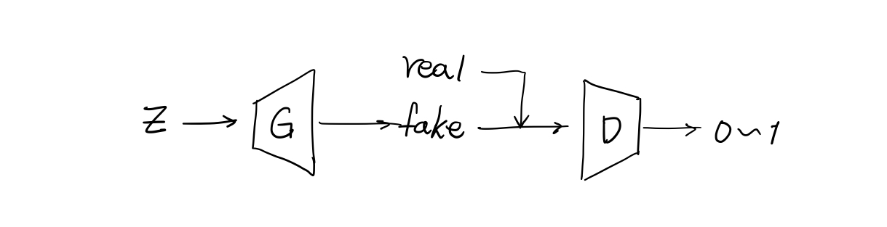
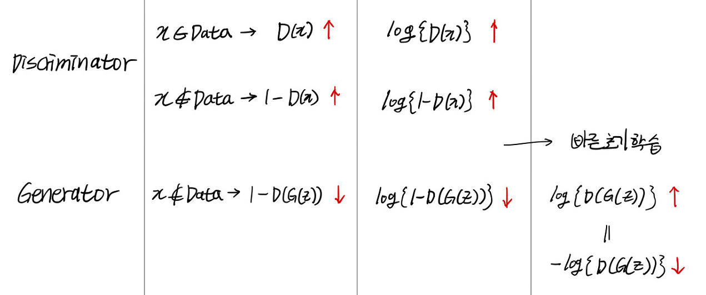

Let's explore Generative Adversarial Networks (GANs), the most well-known deep learning generative model. The references I used for studying this topic are listed in the reference section below.

### Generative Adversarial Networks

##### Structure of GAN

GANs were first introduced in Ian Goodfellow's 2014 paper. A GAN consists of two neural networks: a Generator and a Discriminator. The Discriminator's goal is to correctly determine whether an image produced by the Generator is real or fake, while the Generator's goal is to produce images that the Discriminator classifies as real. Because the Discriminator and Generator have opposing goals and train adversarially to generate images, this model is called a Generative Adversarial Network.

The overall algorithm of a GAN is as follows:

1. A random vector 'z' is passed to the Generator.
2. The Generator produces a fake image.
3. The Discriminator receives both real images and fake images, and outputs a probability value between 0 and 1.

Here, a probability value close to 1 means the image was classified as real, while a value close to 0 means it was classified as fake.

##### Difference from VAE Regarding z

In the case of VAE, the z value is generated by the encoder. Since z is created by feeding in the data we want to generate as input, you can think of z as a latent value that captures the features of the data we want to generate well. This is why it is called a **latent vector** or **representation vector**.

However, the z value in GANs is somewhat different. In GANs, z is commonly called a **random vector** or **random noise**, meaning that unlike VAE, z does not describe the data we want to generate well. At the beginning of training, the Generator has no idea what kind of data it needs to create. Regardless, the Generator must produce data. So it receives meaningless z as input and generates data through dimensionality expansion. Then, based on the Discriminator's feedback, it updates its weights and learns to create meaningful data (data that receives high scores from the Discriminator).

### Understanding GAN Through Equations

##### Discriminator's Objective Function

The Discriminator receives either a real image or a fake image and outputs a probability between 0 and 1 indicating whether the input data is real. If it outputs a value close to 1 for real inputs and close to 0 for fake inputs, we can say the Discriminator is well-trained. If we denote the **output probability for input x as D(x)**, then the Discriminator should **maximize D(x) for real data and maximize 1-D(x) for fake data**.

##### Generator's Objective Function

The Generator must ensure that its fake images receive high output values from the Discriminator. Since the Generator always produces only fake images, this means it must minimize 1-D(x) when x=G(z). In other words, it means **minimizing 1-D(G(z))**.

Below is a summary of GAN's objective function. The reasons for taking the log of the basic objective function and making slight modifications for faster initial training are well explained in other blogs and lecture materials, so please refer to those if you are interested. I understood this through [Yoonje Choi's Naver D2 presentation](https://www.youtube.com/watch?v=odpjk7_tGY0) and [Kwangmin Choi's blog post](https://learnai.tistory.com/3?category=699199).

+ By referring to Hwalseok Lee's [GitHub repository README](https://github.com/hwalsuklee/tensorflow-generative-model-collections), you can get an overview of various GAN objective functions at a glance.

### Reference

- David Foster 'Generative Deep Learning' (O'Reilly)
- [A Beginner's Guide to Generative Adversarial Networks (GANs)](https://pathmind.com/kr/wiki/generative-adversarial-network-gan)
- [Taehoon Kim's PyCon presentation](https://www.youtube.com/watch?v=soJ-wDOSCf4)
- [Kwangmin Choi's blog post 1](https://learnai.tistory.com/3?category=699199)
- [Yoonje Choi's Naver D2 presentation](https://www.youtube.com/watch?v=odpjk7_tGY0)
- [Hwalseok Lee's GitHub repository](https://github.com/hwalsuklee/tensorflow-generative-model-collections)