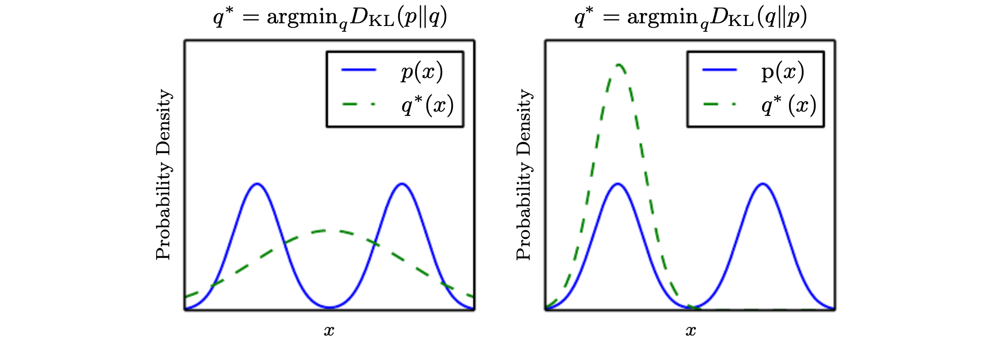

This post is a translated summary based on the Deep Learning book by Ian Goodfellow. Please note that some content may have been added or omitted based on my personal understanding. I welcome any corrections on inaccuracies.

### Information Theory

If we study information theory, we can learn how to design optimal codes and how to calculate the size of various types of information with specific probability distributions.

The most basic intuition of information theory is that **unlikely events carry more information**. As a simple example, let's say we consider the event of me going to the gym today. Suppose the probability of me not going to the gym today is 0.9. Then the probability of going to the gym is 0.1. From an information-theoretic perspective, the event of me going to the gym carries more information.

Given the properties that (1) likely events have low information, (2) less likely events have higher information, and (3) independent events have additive information, we can define the information content of an event x as follows:
$$
{I(x) = -logP(x)= log_e \frac 1 {P(x)}}
$$
This is called the **self-information** of the event $\mathrm x = x$. You can simply think of it as **'the information content of event $\mathrm x=x$'**, information gain, or the amount of acquired information. The value of $I(x)$ is inversely proportional to $P(x)$: the more unlikely an event is, the smaller $P(x)$ becomes, and the larger the information content $I(x)$ grows.

### Shannon Entropy

Self-information deals with only a single event. The information content of an entire probability distribution, rather than a single event, can be obtained through **Shannon entropy**.
$$
H(P) = H(\mathrm x)  =  \mathbb E_{\mathrm x ~\sim P}[I(x)] = - \mathbb E_{\mathrm x ~\sim P}[logP(x)]
$$

$$
= - \sum P(x) logP(x)
$$

Shannon entropy represents the expected value of information content when events occur in a given probability distribution. In short, you can think of it as **'the expected information content of event x'**. A highly deterministic distribution has low entropy, while a very uniform distribution has high entropy. If x is continuous rather than discrete, Shannon entropy is also called **differential entropy**.

The formula above uses the natural logarithm (base e), so the unit is nats. If base 2 is used instead, the unit becomes bits (or shannons), and the information content is related to the lower bound of the number of bits needed to encode the information. For more details, please refer to [Terry's video](https://www.youtube.com/watch?v=zJmbkp9TCXY).

### Cross-Entropy

$$
H(P,Q) = - \mathbb E_{\mathrm x\sim P}[log Q(x)]
$$

$$
= -\sum P(x) log Q(x)
$$

Cross-entropy represents **'the entropy obtained through a non-optimal probability distribution'**. If we consider the optimal probability distribution to be P, then Q is the non-optimal distribution we are estimating (one that differs from the optimal P). Therefore, the cross-entropy value computed via the formula $H(P, Q)$ above will be greater than Shannon entropy, which is the entropy of the optimal probability distribution.

### Kullback-Leibler Divergence

A concept closely related to cross-entropy is KL Divergence, and its formula is as follows:
$$
D_{KL}(P||Q) = \mathbb E_{\mathrm x\sim P}[log \frac{P(x)}{Q(x)} ] = \mathbb E_{\mathrm x \sim P}[logP(x) - log Q(x)]
$$

$$
= -\sum P(x)logQ(x) + \sum P(x)logP(x)
$$

$$
\therefore H(P,Q) - H(P)
$$

$$
= CrossEntropy - ShannonEntropy
$$

The Kullback-Leibler Divergence represents the difference between two probability distributions P and Q. You can think of it as 'the difference between the entropy obtained through a non-optimal probability distribution and the entropy obtained through the optimal probability distribution.' Therefore, if the KL divergence between P and Q is 0, it is equivalent to saying that P and Q have the same distribution. Since we stated that cross-entropy is greater than Shannon entropy, KLD, which has the form of cross-entropy minus Shannon entropy, always has a **non-negative** value.

Although KLD represents the difference between two probability distributions, it does not represent a distance. If it were a distance value, $D_{KL}(P||Q)$ would need to equal $D_{KL}(Q||P)$, but in practice, computing them shows they are not equal. This means that the KLD value changes depending on the order of P and Q (**not symmetric**), and this is best understood visually.

<i>Ian Goodfellow, Deep Learning</i>

The direction of KLD varies depending on the problem being solved (**problem-dependent**). Suppose the probability density function of P has two or more modes as shown in the figure. If we estimate Q by minimizing $D_{KL}(P||Q)$, the result looks like the left figure. In this case, it optimizes such that **when P has high probability, Q also has high probability**. Q chooses to blur across modes in order to give high influence to all modes of P.

Conversely, if we estimate Q by minimizing $D_{KL}(Q||P)$, the result looks like the right figure. In this case, it optimizes such that **when P has low probability, Q also has low probability**. Q avoids regions where P has low probability by selecting only one mode. As a result, if the problem requires considering all of the data's distribution well, use $D_{KL}(P||Q)$, and if good results from even a single mode are acceptable (as in generation problems), use $D_{KL}(Q||P)$.

One additional point: **minimizing cross-entropy with respect to Q is equivalent to minimizing KL divergence with respect to Q**. The KL divergence formula has the form of cross-entropy minus Shannon entropy. When we minimize the KL divergence of P with respect to Q, the term $H(P)$ is completely unrelated to Q and therefore does not change during the minimization process. Consequently, minimizing the cross-entropy of distribution P with respect to distribution Q is equivalent to minimizing the KL divergence with respect to Q.

### Reference

- Ian Goodfellow, Yoshua Bengio, and Aaron Courville, Deep Learning (The MIT Press), Chapter 3.13
- [Terry TaeWoong Um's YouTube channel](https://www.youtube.com/watch?v=zJmbkp9TCXY)
