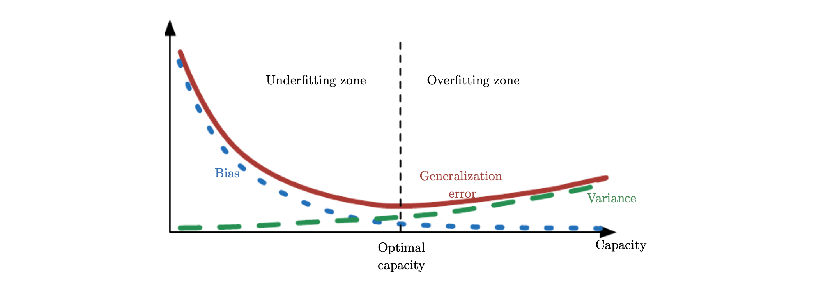

This post is a translation of Chapter 5.4 of Ian Goodfellow's Deep Learning book. Please note that some content may have been added or omitted based on my personal understanding. I welcome any corrections on inaccuracies.

This chapter primarily covers concepts related to statistics. Understanding the following statistics concepts can be useful when analyzing generalization, underfitting, and overfitting.

### Estimator

Making a single best prediction for a value we want to estimate is called **point estimation**. For example, in the case of parametric models, we estimate a parameter vector commonly called weights. The point estimation here becomes a prediction for the parameter called weight.

The ultimate target value we want to find through point estimation is the parameter $\theta$. It is a fixed value, but it is **unknown**. Therefore, we estimate the parameter $\hat\theta$, which is the closest approximation to the true value, using the data points {$x^{(1)},\cdots,x^{(m)}$} we have. We can express $\hat\theta$ through the following formula, and this is called a **point estimator**.
$$
\hat\theta_m = g(x^{(1)},\cdots,x^{(m)})
$$

A point estimator is interpreted as an output value generated by feeding data points as input to a function. However, since data is derived through a random process, i.e., generated through a data generation process, **$\hat\theta$ is ultimately a random variable**.

### Bias of Estimator

The **bias of an estimator** is defined as follows:
$$
bias(\hat\theta_m) = \mathbb E(\hat\theta_m)-\theta
$$
This represents how much the expected value of the estimator differs from the true $\theta$. If $bias(\hat\theta_m)$ is 0, it is called **unbiased**, and if $lim_{m \to \infin}bias(\hat\theta_m)$ is 0, it is called **asymptotically unbiased**. These correspond to the cases where the expected value of the estimator equals the true $\theta$, and where the expected value of the estimator equals the true $\theta$ when infinitely many data points are sampled, respectively.

#### Example

Let's examine the scenario of **estimating the variance ($\sigma^2$) of a Gaussian distribution** as an example. In this case, the parameter $\theta$ we want to estimate is $\sigma^2$.
$$
\hat\sigma^2_m = \frac 1 m \sum_{i=1}^m (x^{(i)}-\hat\mu_m)^2
$$
First, we set the estimator to the above value, called the sample variance, and attempted to estimate the variance of a Gaussian distribution. To check the bias of this estimator, we need to compute the equation $bias(\hat\sigma^2_m) = \mathbb E[\hat\sigma^2_m]-\sigma^2$. Expanding $\mathbb E[\hat\sigma^2_m]$ yields $\frac {m-1}{m}\sigma^2$, so ultimately $bias(\hat\sigma^2_m)$ equals $-\sigma^2/m$. In other words, this estimator is a biased estimator.
$$
\tilde\sigma^2_m = \frac 1 {m-1} \sum_{i=1}^m (x^{(i)}-\hat\mu_m)^2
$$
Second, we set the estimator to the above value, called the unbiased sample variance, and attempted to estimate the variance of a Gaussian distribution. To check the bias of this estimator, we need to compute the equation $bias(\tilde\sigma^2_m) = \mathbb E[\tilde\sigma^2_m]-\sigma^2$. Expanding $\mathbb E[\tilde\sigma^2_m]$ yields $\sigma^2$, so ultimately $bias(\tilde\sigma^2_m)$ equals 0. In other words, this estimator is an unbiased estimator.

In this problem, we set variance as the parameter we want to find, defined estimators for it, and checked whether those estimators were biased or unbiased. While finding an unbiased estimator may seem preferable, it is not always the best estimator depending on the nature of the problem. For a supplementary explanation of why the denominator of the unbiased estimator for a Gaussian distribution is m-1 rather than m, please refer to the explanations by [Gongdori's Math Notes](https://www.youtube.com/watch?v=UWh6fmb5btY) and [The Essence of Statistics](https://www.youtube.com/watch?v=faVIwae-wkw).

### Variance and Standard Error of Estimator

The **variance of an estimator** and the **standard error of an estimator** are denoted as **$Var(\hat\theta)$** and **$SE(\hat\theta)$** respectively, and are computed exactly as their notation suggests (using the [variance formula](https://ko.wikipedia.org/wiki/분산) / taking the square root of the variance formula). The variance and standard error of an estimator tell us how much the current estimate might differ when data is resampled through the data generating process.

#### Usefulness of SEM

If we want to compute the standard error of the mean (SEM), it can be obtained through the following formula:
$$
SE(\hat\mu_m) = \sqrt{Var[\frac 1 m \sum^m_{i=1}x^{(i)}]} = \frac {\sigma} {\sqrt m}
$$

The standard error of the mean (SEM) is particularly useful in machine learning experiments. Generally, the generalization error of a machine learning model is measured based on the error on the test set. Therefore, the test set has a significant impact on measuring a model's performance, but since the test set is a subset sampled from the entire dataset, it carries some degree of uncertainty. In such cases, we can use the standard error of the mean to establish a **confidence interval**. For example, the 95% confidence interval centered on $\hat\mu_m$ has the following values:
$$
(\hat\mu_m-1.96SE(\hat\mu_m), \hat\mu_m+1.96SE(\hat\mu_m))
$$
In machine learning experiments, based on this, it is common to say that **if the upper bound of algorithm A's error at the 95% confidence interval is less than the lower bound of algorithm B's error at the 95% confidence interval, then algorithm A is better than B**.

The process of establishing confidence intervals is grounded in the **Central Limit Theorem**. The Central Limit Theorem states that 'the distribution of the mean of n independent random variables with the same probability distribution approaches a normal distribution when n is sufficiently large.' More intuitive explanations of this can be found on YouTube, so I will skip further discussion for now.

#### Bias vs. Variance

Bias measures the expected deviation from the true value of the parameter, while Variance provides a measure of the deviation from the expected estimator value that a particular sampling of data may cause (I admit the book's explanation is not very intuitive on this point either). So how should we decide between an estimator with high bias and one with high variance?

**Cross-validation** is commonly used as a method for selecting an estimator that balances bias and variance. Another simple approach is to use **mean squared error (MSE)**. Let's write the MSE between our estimated value $\hat\theta_m$ and the true parameter $\theta$ as follows:
$$
MSE = \mathbb E[(\hat\theta_m - \theta)^2]
$$

$$
= Bias(\hat\theta_m)^2 + Var(\hat\theta_m)
$$

Based on the final derived formula, minimizing MSE in machine learning can be interpreted from a statistical perspective as **training the model while appropriately considering both bias and variance**. Additionally, when measuring generalization error using MSE, as shown in the figure below, **increasing capacity tends to increase variance while decreasing bias**.

  <i>Ian Goodfellow, Yoshua Bengio, and Aaron Courville, Deep Learning (The MIT Press), Chapter 5.4</i>
  

### Reference

- Ian Goodfellow, Yoshua Bengio, and Aaron Courville, Deep Learning (The MIT Press), Chapter 5.4
- [The Essence of Statistics YouTube channel](https://www.youtube.com/watch?v=faVIwae-wkw)
- [Gongdori's Math Notes YouTube channel](https://www.youtube.com/watch?v=UWh6fmb5btY)

