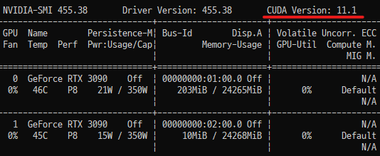
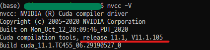
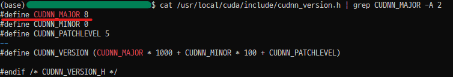
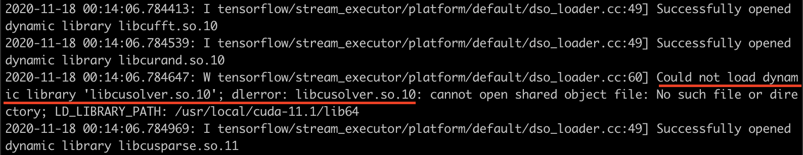

We installed a GeForce RTX 3090 in our lab workstation server. I didn't physically replace the GPU myself — a technician came and handled the installation. After the GPU was mounted, I set up the experiment environment on the Ubuntu 18.04 x86_64 operating system. Below I share the steps I followed.

1. Remove CUDA toolkit and driver
2. Install CUDA toolkit 11
3. Install cuDNN 8
4. Install tf-nightly 2.5.0
5. Resolve the libcusolver.so.10 error

The RTX 30 series is only compatible with CUDA 11 or later, which in turn requires cuDNN 8 or later and TensorFlow 2.5 or later. That is why the installation was carried out in this order.

### Installation Steps

##### 1. Remove CUDA Toolkit and Driver

To install a new version of the CUDA toolkit, the previous version must be removed first. Even if only the driver API is present without the CUDA toolkit, leftover files from a previous version can frequently cause the installation to be cancelled. For this reason, I removed both the CUDA toolkit and the driver.

```shell
sudo apt-get --purge -y remove 'cuda*'
sudo apt-get --purge -y remove 'nvidia*'
```

Alternatively, you can remove the CUDA toolkit using the commands below. If any cuda-related directories remain under `/usr/local/`, delete those as well. *Be sure to replace the x placeholders with the version numbers that match your environment.*

```shell
sudo /usr/local/cuda/bin/uninstall_cuda_x.x.pl

rm -rf /usr/local/cuda
rm -rf /usr/local/cuda-x.x
```

You can check for remaining NVIDIA-related files with the following command. Remove any leftovers using `apt-get --purge remove` as well.

```shell
dpkg -l | grep -i nvidia
```

##### 2. Install CUDA Toolkit 11

Next, install version 11 using the commands below. Once installation is complete, a `cuda-11` directory will be created under `/usr/local/`, and the driver API will be installed automatically.

*Note: The commands below are for the Ubuntu 18.04 x86_64 operating system. If you are using a different OS, please refer to the [official website](https://developer.nvidia.com/cuda-11.0-download-archive).*

```shell
wget https://developer.download.nvidia.com/compute/cuda/repos/ubuntu1804/x86_64/cuda-ubuntu1804.pin
sudo mv cuda-ubuntu1804.pin /etc/apt/preferences.d/cuda-repository-pin-600
wget http://developer.download.nvidia.com/compute/cuda/11.0.2/local_installers/cuda-repo-ubuntu1804-11-0-local_11.0.2-450.51.05-1_amd64.deb
sudo dpkg -i cuda-repo-ubuntu1804-11-0-local_11.0.2-450.51.05-1_amd64.deb
sudo apt-key add /var/cuda-repo-ubuntu1804-11-0-local/7fa2af80.pub
sudo apt-get update
sudo apt-get -y install cuda
```

After installation, verify that the driver API and CUDA toolkit are both correctly recognized as version 11. You can check the driver API version using the `nvidia-smi` command.



You can check the CUDA toolkit version using the `nvcc -V` command. (I installed 11.0, but 11.1 ended up being installed... hmm.) *For an explanation of why `nvidia-smi` and `nvcc -V` may show different versions, see [this Stack Overflow thread](https://stackoverflow.com/questions/53422407/different-cuda-versions-shown-by-nvcc-and-nvidia-smi).*



If running `nvcc -V` does not display the version as expected, you need to update the PATH in your account's `.bashrc` file so that the new version's path is correctly recognized. First, open the `.bashrc` file with an editor.

```shell
vim ~/.bashrc
```

Then add the following lines at the bottom of the `.bashrc` file.

```shell
# NVIDIA CUDA toolkit
export PATH=/usr/local/cuda-11/bin:$PATH
export LD_LIBRARY_PATH=/usr/local/cuda-11/lib64
```

Finally, apply the changes to the `.bashrc` file.

```shell
source ~/.bashrc
```

##### 3. Install cuDNN 8

To use CUDA 11 or later, cuDNN 8 or later is also required. Download the cuDNN library from the [official website](https://developer.nvidia.com/cudnn) (an NVIDIA account is required). After downloading the cuDNN library tgz file that matches your environment, extract it. *Be sure to replace the x placeholders with the version numbers that match your environment.*

```shell
tar -xzvf cudnn-x.x-linux-x64-v8.x.x.x.tgz
```

Then copy the extracted cuDNN files to the CUDA directory and update the permissions.

```shell
sudo cp cuda/include/cudnn*.h /usr/local/cuda/include
sudo cp cuda/lib64/libcudnn* /usr/local/cuda/lib64
sudo chmod a+r /usr/local/cuda/include/cudnn*.h /usr/local/cuda/lib64/libcudnn*
```

Verify the cuDNN version. If `CUDNN_MAJOR 8` is printed, the installation is complete.

```shell
cat /usr/local/cuda/include/cudnn_version.h | grep CUDNN_MAJOR -A 2
```



##### 4. Install tf-nightly

At the time of writing, the official TensorFlow version is 2.3.0, but CUDA 11 is supported starting from TensorFlow 2.5.0. Therefore, you need to install tf-nightly instead of the stable TensorFlow release.

```shell
pip install tf-nightly==2.5.0.dev20201116
```

Think of tf-nightly as the version of TensorFlow that is actively being developed each day. While it supports the very latest features, the downside is that it can be unstable. *The `dev2020xxxx` portion may differ depending on the development date.*

##### 5. Resolve the libcusolver.so.10 Error

<center><i>If you do not encounter this error, you can skip this entire section.</i></center><br>

When trying to use tf-nightly 2.5.0 with CUDA 11, you may see the error log shown below. This error occurs because the system cannot load the `libcusolver.so.10` file that exists in CUDA toolkit 10.1. (We removed CUDA 10 and installed 11, and now it wants us to install 10.1 again...?) In addition, there are cases where files belonging to cuDNN 8 also fail to load properly.



If you use Anaconda virtual environments, you can easily resolve this issue with the commands below. Installing within a virtual environment is less likely to cause conflicts and is easier to clean up if something goes wrong, so I recommend this approach whenever possible. *However, you will need to install these packages in each new conda environment you create.*

```shell
conda install cudatoolkit		# Resolves CUDA file-related errors
conda install -c nvidia cudnn	# Resolves cuDNN 8 file-related errors
```

<center><i>If you resolved the error using an Anaconda virtual environment, you can skip the section below.</i></center><br>

If you are not using an Anaconda virtual environment, you can install CUDA toolkit 10.1 so that the `libcusolver.so.10` file can be found. This is a workaround, and I plan to reinstall CUDA once the version stabilizes. *Alternatively, you may find [this guide](http://ejklike.github.io/2019/08/19/insatall-tensorflow-2.0.0-beta1-in-ubuntu-with-cuda-10-1.html) helpful.*

Run the following commands to install CUDA toolkit 10.1. During installation, when asked whether to update the cuda folder, I selected NO to avoid potential conflicts.

*Note: The commands below are for the Ubuntu 18.04 x86_64 operating system. If you are using a different OS, please refer to the [official website](https://developer.nvidia.com/cuda-10.1-download-archive-base).*

```shell
wget https://developer.nvidia.com/compute/cuda/10.1/Prod/local_installers/cuda_10.1.105_418.39_linux.run
sudo sh cuda_10.1.105_418.39_linux.run
```

Update the PATH in the `.bashrc` file so that CUDA toolkit 10.1 is correctly recognized. First, open the `.bashrc` file with an editor.

```shell
vim ~/.bashrc
```

Then add the following line below the CUDA 11 PATH entry in the `.bashrc` file.

```shell
export LD_LIBRARY_PATH=${LD_LIBRARY_PATH}:/usr/local/cuda-10.1/lib64
```

Finally, apply the changes to the `.bashrc` file. If you have completed everything up to this point, you are almost done.

```shell
source ~/.bashrc
```

### Testing

Now let's verify that the RTX 3090 GPU works properly with tf-nightly 2.5.0. You can check GPU availability using the following code. I tested this on both Python 3.8 and 3.6, and everything worked correctly.

```python
import tensorflow as tf
from tensorflow.python.client import device_lib

tf.test.is_gpu_available()		# Check if a GPU is available: True
device_lib.list_local_devices()	# Print all available devices: shows RTX 3090 info
```

If you want to simply print the GPU device numbers instead of listing all devices, you can use the code below ([reference](https://stackoverflow.com/questions/38559755/how-to-get-current-available-gpus-in-tensorflow)).

```python
from tensorflow.python.client import device_lib

def get_available_gpus():
    local_device_protos = device_lib.list_local_devices()
    return [x.name for x in local_device_protos if x.device_type == 'GPU']

get_available_gpus()
```

Beyond this, I recommend running some simple training scripts to compare how much faster training is compared to your previous GPU and to confirm that the GPU is being fully utilized. I ran the example code from the [Hands-On Machine Learning](https://github.com/ageron/handson-ml2/blob/master/10_neural_nets_with_keras.ipynb) book and confirmed that everything worked correctly.

If the debugging logs are too verbose, you can suppress them using Python's `os` module.

```python
import os
os.environ['TF_CPP_MIN_LOG_LEVEL'] = '3'
import tensorflow as tf
```

- 0 = all messages are logged (default behavior)
- 1 = INFO messages are not printed
- 2 = INFO and WARNING messages are not printed
- 3 = INFO, WARNING, and ERROR messages are not printed

You are now ready to use the RTX 3090 for deep learning experiments!

>(21.01.06) I discovered cases where `tf.test.is_gpu_available()` returns True, but running actual example code throws errors. So after setting up the environment, I recommend running real code to verify that the GPU is being utilized properly. I used the [TensorFlow benchmark](https://github.com/tensorflow/benchmarks/tree/master/scripts/tf_cnn_benchmarks) code to check whether the GPU was being used correctly and how fast it was processing data. Detailed usage instructions can be found in the repository's README and on [HiSEON's blog](http://hiseon.me/data-analytics/tensorflow/tensorflow-benchmark/). Feel free to refer to these if needed.

### Reference

- [NVIDIA cudnn documentation](https://docs.nvidia.com/deeplearning/cudnn/install-guide/index.html)
- [The Simple Guide: Deep Learning with RTX 3090 (CUDA, cuDNN, Tensorflow, Keras, PyTorch)](https://medium.com/@dun.chwong/the-simple-guide-deep-learning-with-rtx-3090-cuda-cudnn-tensorflow-keras-pytorch-e88a2a8249bc)
- [Different CUDA versions shown by nvcc and NVIDIA-smi](https://stackoverflow.com/questions/53422407/different-cuda-versions-shown-by-nvcc-and-nvidia-smi)
- [Disable Tensorflow debugging information](https://stackoverflow.com/questions/35911252/disable-tensorflow-debugging-information)
- [How to get current available GPUs in tensorflow?](https://stackoverflow.com/questions/38559755/how-to-get-current-available-gpus-in-tensorflow)
