This post reviews the paper [Learning to Propagate Labels: Transductive Propagation Network for Few-shot Learning](https://arxiv.org/pdf/1805.10002.pdf), published at ICLR 2019. I originally prepared this as a script for a lab seminar and decided to turn it into a blog post as well.

Looking at the title first, the algorithm proposed in this paper "learns how to propagate labels." The network that learns label propagation is called the Transductive Propagation Network (TPN), and from the title we can infer that the goal is to better solve the few-shot learning problem. Moreover, it seems likely that the model leverages something called "transductive" inference to learn how to propagate labels.

Before diving in, let me briefly introduce what few-shot learning is, and then discuss the algorithm and novelty proposed in this paper.

### Introduction

AI technology has advanced to the point where it is now used in most fields. However, despite this progress, there remain several limitations, such as *difficulty in continual learning*, *difficulty in interpreting results*, *the requirement for large amounts of data*, and *a lack of ability to explain causal relationships*. Various research efforts are underway to find breakthroughs for these challenges, and few-shot learning is one such research area aimed at overcoming these limitations.

Few-shot learning focuses on **generalization performance relative to the amount of data** available for training, which is one of the key limitations of deep learning mentioned above. In general, when a deep learning model is given only a very small amount of data for a new task, we cannot optimize the model quickly and accurately. However, humans can rapidly learn and classify new concepts or images from just a few examples. This is because humans have very high generalization ability. Few-shot learning is a research area with the goal of building deep learning models that exhibit human-like adaptability to new tasks given only a few examples. So how are recent studies approaching this goal?

Most few-shot learning studies define the problem setting as follows.

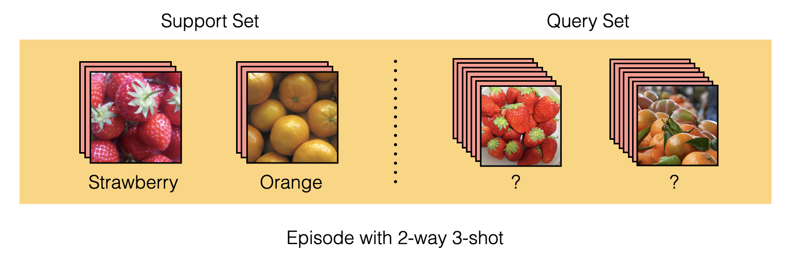

In few-shot learning, the training dataset is provided in the form of episodes consisting of a support set and a query set. This setup is called **N-way K-shot** episodic learning, where N is the number of classes and K is the number of input samples provided per class. In the figure above, there are 2 classes with 3 images per class, making it a 2-way 3-shot setting. Most studies use 5-way 1-shot or 5-way 5-shot as their benchmarks.

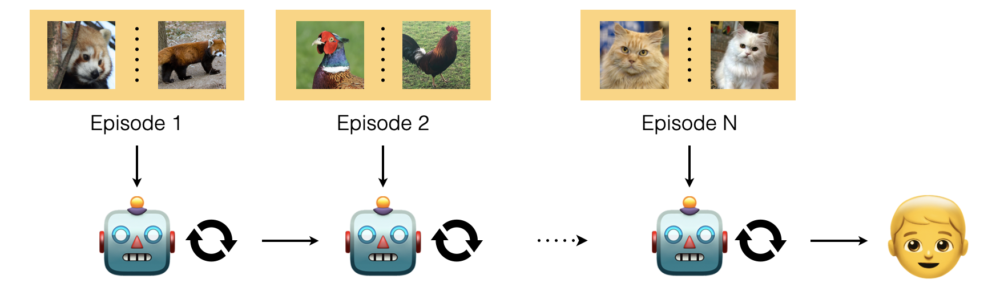

First, the support set is provided as input to the model. The model then recognizes what classes exist in this episode and what the data for each class roughly looks like. Next, the query set is provided — it shares the same classes as the support set but contains data the model has never seen in the support set. The loss is then computed based on how well the model performs on the query set (e.g., cross-entropy for classification tasks), and the model is optimized accordingly.

The same training procedure continues for subsequent episodes — a few-shot support set introduces previously unseen classes, and the model is optimized by computing the loss on the query set.

Prior works for solving few-shot problems have primarily used **distance-based** and **optimization-based** learning approaches.

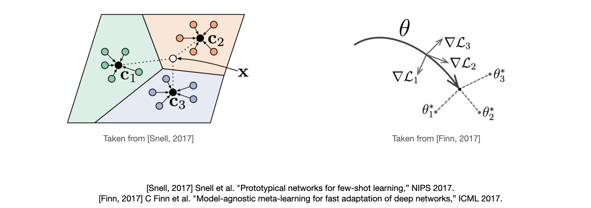

In distance-based learning, the support set is passed through the model to produce feature vectors in an embedding space. The model then observes these feature vectors and infers which label the query set belongs to based on distance. *(left figure)*

In optimization-based learning, the model's parameters are fine-tuned using the support set, and then the model is trained to correctly classify the query set using these fine-tuned parameters. Training in this manner enables the model to quickly find task-appropriate parameters even when fine-tuning with only a small number of data points. In other words, the trained model obtains a good initial parameter point for new tasks. *(right figure)*

While these approaches have solved the few-shot problem reasonably well, there are still a few shortcomings that can be improved. First, these methods observe the relationship between the support set and query set but do not directly observe **relationships between individual samples**. Relationship information may be implicitly learned during training, but there is room to explicitly provide it as input.

Second, the few-shot setting itself — where the support set is used as a clue for query set inference and the query set is used only to compute the training loss — is a drawback (the paper uses the wording "fundamental difficulty"). Since inference relies on very few support samples, the data distribution inferred from these few samples may differ significantly from the actual distribution. In other words, because only support samples are used for model inference on each task, the **query set as a potential clue is wasted**. For example, if 5-way 5-shot data is provided as the support set and then 75 unlabeled query set samples are used only for computing the loss, 75 potentially useful clues are being wasted.

To overcome these shortcomings, recent research has actively explored using covariance information or graph structures for training, as well as methods that leverage not only the support set but also the query set during model inference. TPN is one such method proposed to address the above shortcomings.

That concludes the introduction to few-shot learning and the background behind TPN. Now let us dive into the details of the TPN paper.

### Proposed Model

This paper proposes the Transductive Propagation Network as an attempt to address the fundamental difficulty of having to infer queries from very few support samples, and to leverage relationship information between sample nodes for inference.

The model operates roughly as follows.

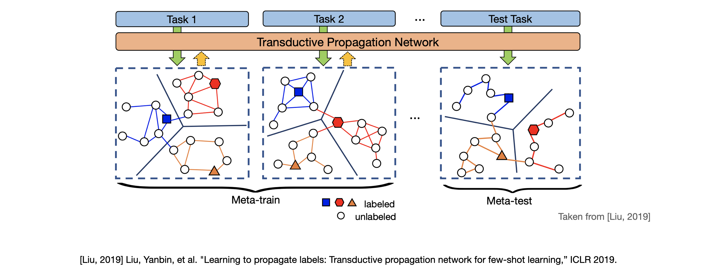

First, an episode (task 1) consisting of a support set and query set is provided as input. TPN then constructs a graph with one node per input sample. Label vectors are assigned to each node: one-hot encoding for support set labels and all-zero vectors for the query set. Therefore, colored nodes in the figure represent nodes created from the support set, and uncolored nodes represent nodes created from the query set. After constructing the graph, the support set node labels are iteratively propagated to the query set nodes through label propagation computation.

Let us examine the model's mechanism in more detail using the following figure.

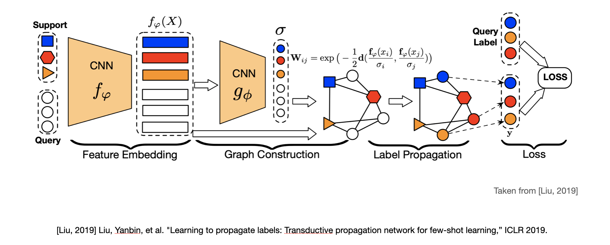

The paper describes the algorithm in four stages: **feature embedding**, **graph construction**, **label propagation**, and **loss**.

In the feature embedding stage, all images from the episode (support set and query set) are passed through a CNN ${f_\varphi}$ to extract key features in the form of feature vectors. The feature extractor itself uses the same architecture employed by prior few-shot learning studies to ensure a fair comparison.

In the graph construction stage, the feature vectors obtained from the previous stage are fed into another CNN ${g_\varphi}$ to produce **sigma** (${\sigma}$), an **example-wise length-scale parameter**. This sigma is used to compute a similarity matrix representing the similarity between nodes. TPN modifies the commonly used Gaussian similarity function ${W_{ij} = \exp(-\frac{d(x_i,x_j)}{2\sigma^2})}$ into the form ${W_{ij}} = \exp(-\frac{1}{2}d(\frac{f_\varphi(x_i)}{\sigma_i},\frac{f_\varphi(x_j)}{\sigma_j}))$.

Looking at the modified formula, similarity is computed based on distances between nodes (feature vectors), but instead of using the raw node distances, the scaling parameter sigma adjusts the node values appropriately for the task before computing similarity. In other words, ${g_\varphi}$ in this stage can be understood as having the mechanism: "Given these features, I should produce sigma values like this to adjust the features and construct the graph for this task."

The resulting similarity matrix is then subjected to normalized graph Laplacian, yielding the final form ${S = D^{-1/2}WD^{-1/2}}$. Here $D$ is a diagonal matrix whose (i, i) entry is the sum of the i-th row of $W$.

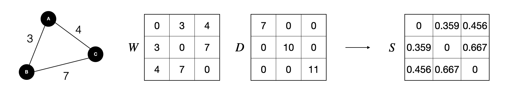

The Laplacian matrix represents a graph using its similarity and degree information. It is defined as ${L  = D-W}$, and its normalized form is ${L= I-D^{-1/2}WD^{-1/2}}$. The normalized graph Laplacian formula used in TPN differs slightly from the standard one because it directly adopts the label propagation formula from Zhou et al., "Learning with Local and Global Consistency" (2004). I personally speculate that this is also because $D$ means different things — the degree matrix vs. the row sums of $W$ — and it is used solely for the purpose of normalizing the similarity matrix.

The resulting $S$ becomes a symmetric matrix with eigenvalues equal to or **less than 1** (a detailed explanation is in the Appendix). While the process is complex, a simplified understanding is that the similarity matrix has been expressed in a normalized form.

In the label propagation stage, the **normalized graph Laplacian** $S$ obtained from the previous stage is used to propagate the support set node labels to the unlabeled query set nodes. Label propagation is carried out through the computation below, and a notable characteristic of this stage is that it contains no trainable parameters.
$$
F_{t+1} = \alpha SF_t + (1-\alpha)Y
$$
Let $\mathcal F$ be a set of $(N\times K + T)\times N$ matrices with positive entries. $Y \in \mathcal F$ is a label matrix where the entry is 1 when $x_i$ belongs to the support set and $y_i = j$, and $F_t \in \mathcal F$ is the predicted label matrix at timestep $t$. $\alpha$ is a hyperparameter between 0 and 1 that controls the amount of propagated information, determining how much of the current timestep's predicted label values ($F_t$) and the support label values ($Y$) are passed to the next timestep. In the actual experiments, $\alpha$ was set to 0.99.

Let us denote the value of $F_t$ after a sufficient number of timesteps as $F^*$ and reformulate the equation.
$$
\begin{aligned}
F^* &= lim_{t→\infin} F_t \\
&=(1-\alpha)(1-\alpha S)^{-1}Y \\ \\
\therefore F^* &= (1-\alpha S)^{-1}Y\text{,  for classification}
\end{aligned}
$$
When $\alpha$ is between 0 and 1 and the absolute eigenvalues of $S$ are less than 1, after sufficient timesteps $F_t$ converges to the expression on the second line (see the Appendix for details). For classification problems, since we only need to pick the highest predicted value, the constant $(1-\alpha)$ multiplied across all entries can be removed without changing the solution. Therefore, the closed-form label propagation formula $F^* = (1-\alpha S)^{-1}Y$ is derived, allowing $F^*$ to be computed directly without iteration. Ultimately, the $F^*$ we seek can be interpreted as applying the linear transformation $(1-\alpha S)^{-1}$ to the label matrix $Y$, where $(1-\alpha S)^{-1}$ is referred to as a **graph kernel** or **diffusion kernel** in the "Learning with Local and Global Consistency" paper. I do not yet fully understand graph kernels and diffusion kernels, so if you have insights on this topic, I would appreciate it if you shared them in the comments. (My current thinking is that they use this terminology because, given the situation where we must infer $F^*$ from $Y$ which contains less information, finding an optimal $S$ is the key challenge.)

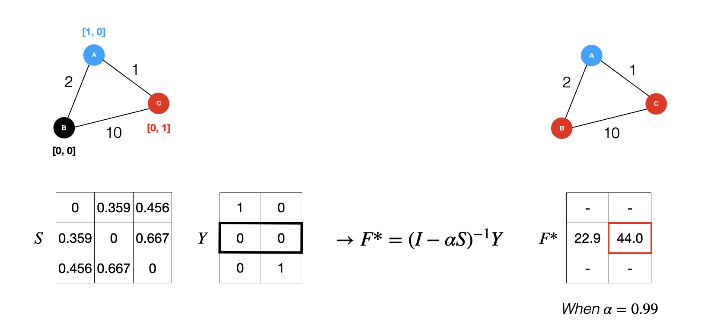

Matrix inversion has a time complexity of $O(n^3)$, which is computationally expensive, but in few-shot learning n is very small (around 100), so this was not a significant issue.

Finally, in the loss stage, the $F^*$ computed during label propagation is compared with ground-truth labels to compute the cross-entropy loss. I personally found it interesting that the loss is computed not just from query set labels but also includes the support set labels. Conventional few-shot learning studies use the support set only as clues for inference and compute the loss exclusively from the query set. However, TPN uses both the support set and query set as clues for inference and also uses both for loss computation, which I found remarkable. I was also curious about what would happen if the loss were computed using only query labels. Since the paper does not mention this, I suspect that either the performance was not good or there was no significant difference, so the authors chose not to discuss it.

To recap the entire process: the feature embedding stage extracts feature vectors that well describe the images; the graph construction stage produces sigma values to adjust features appropriately for the task and constructs the graph via a similarity matrix; the label propagation stage uses the constructed graph and support set labels to assign predicted labels to unlabeled query set nodes; and finally, the predicted labels assigned to all nodes are compared with ground-truth labels to optimize the model.

### Contribution

Let us examine the three main contributions mentioned in the paper.

1. This is the first paper to explicitly use transductive inference in few-shot learning. While Nichol's 2018 paper conducted experiments in a transductive setting, it did not propose an explicit transductive model — it merely shared information between test (query) examples through batch normalization.
2. The paper proposes a label propagation graph that learns how to propagate labels to unseen classes through episodic meta-learning under transductive inference. It significantly outperforms the naive heuristic-based label propagation methods presented in Zhou et al. (2004).
3. The model achieves state-of-the-art performance on mini-ImageNet and tiered-ImageNet classification, which are benchmarks in few-shot learning research, and also demonstrates strong performance in semi-supervised learning experiments.

In the Introduction, I mentioned that the few-shot setting — where the support set is used as a clue for query inference and the query set is used only for loss computation — is a fundamental difficulty of few-shot learning research. This relates directly to the first contribution regarding transduction.

- **Induction** *is reasoning from observed training cases to general rules, which are then applied to the test cases.*
- **Transduction** *is reasoning from observed, specific (training) cases to specific (test) cases.*

Induction corresponds to what we typically understand as supervised learning. As stated in the definition, the model learns **general rules** from observed training cases, and at test time uses these learned general rules to infer previously unseen test cases. Thus, when a machine learning model shows good generalization on test cases, we can say the model has learned the inductive bias well. Transduction differs slightly. Rather than using some general rule for inference, transduction refers to the process of inferring specific (test) cases using observed specific (training) cases.

Applying this to the few-shot learning setting: models that classify query sets (which are unseen in the support set but share the same classes) using clues derived from the support set perform inductive inference. Models like TPN, where query set inference depends not only on the support set but also on the query set itself, perform transductive inference. Using the transductive approach, when there are 25 support set samples and 75 query set samples, 75 additional clues can be used compared to inductive inference, leading to better performance.

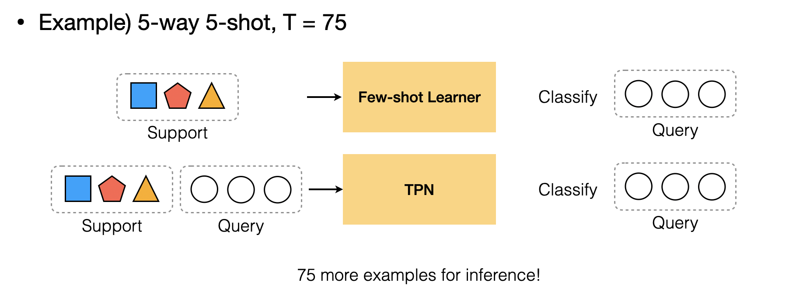

The second and third contributions mentioned in the paper relate to model performance, so let us move on to the Experiment section.

### Experiment

The performance experiments for TPN used the **miniImageNet** and **tieredImageNet** datasets, which are benchmark datasets in few-shot learning research. The miniImageNet dataset consists of 100 classes with 600 samples per class, and the tieredImageNet dataset consists of 600 classes with an average of 1,281 samples per class.

Performance comparisons were divided into three categories based on transduction: non-transduction, BN, and transduction. I believe this categorization was used to emphasize the novelty of applying transduction to few-shot learning and to highlight that TPN achieves the best performance among transductive methods.

In practice, since different authors interpret the definition of transduction slightly differently, it is difficult to clearly delineate whether a model is transductive or inductive. However, in this paper, the distinction is based on **whether query set inference depends only on support samples or not**. For non-transduction, query set inference is performed individually for each query sample, while for transduction, inference is performed simultaneously over all support and query samples.

BN follows the experimental setting from Nichol et al., "On first-order meta-learning algorithms." The batch normalization statistics are computed using information from not only the support set but all query set samples as well. In this case, it can be interpreted that query set inference leverages query set information through batch normalization. However, since this is not an explicit use of transduction, the authors classified it separately under the keyword BN.

MAML+Transduction is a new experimental setting proposed in TPN. It adds a transductive regularization term ${\Sigma^{N\times K+T}_{i,j=1}W_{i,j}}\lVert \hat{y_i} - \hat{y_j}\rVert^2_2$ to MAML's cross-entropy loss. This loss term enforces that when the similarity between two samples is high, the difference between $y_i$ and $y_j$ should be small, and when the difference between $y_i$ and $y_j$ is large, the similarity should be small.

The experimental results are as follows.

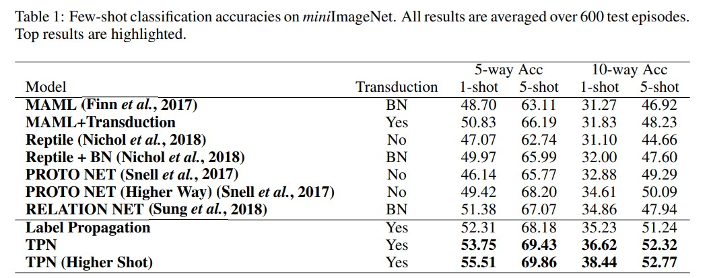

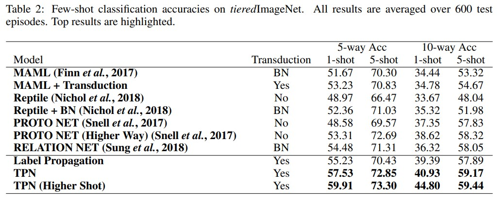

The semi-supervised version also demonstrated strong performance compared to prior semi-supervised few-shot learning studies. Semi-supervised here means additionally providing unlabeled samples in the support set.

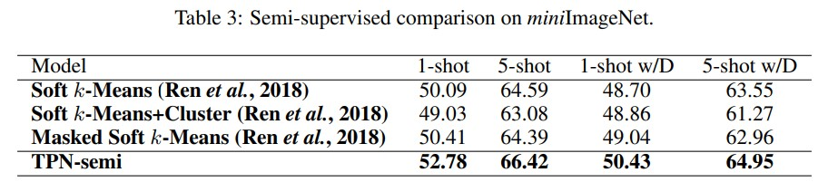

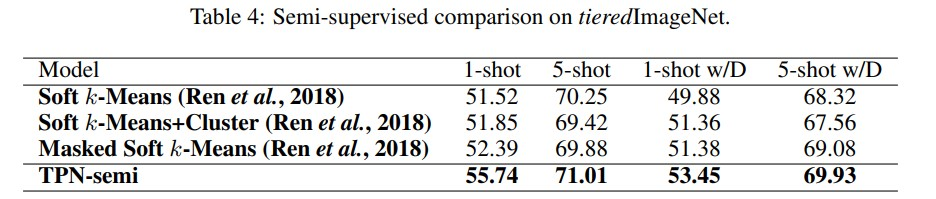

### Conclusion

Prior propagation-related algorithms assume that samples are evenly distributed in the data space and perform label propagation by adjusting a fixed sigma value. However, in few-shot learning, data is limited and not evenly distributed. For this reason, existing label propagation algorithms could not be directly applied. This paper addresses this problem effectively by defining sigma as a learnable parameter rather than a hyperparameter, allowing the model to find the optimal sigma for the given data.

Furthermore, through transduction, the paper proposes a method that uses not only the support set but also the query set as clues for inference, addressing the fundamental difficulty of few-shot learning. I believe this has increased the potential for follow-up research on transduction and few-shot learning.

Compared to typical GNNs, TPN does not update nodes or edges through model parameters, nor does it embed neural networks within the graph structure. Therefore, it is debatable whether TPN qualifies as a GNN model; I understand it more as an attempt to apply graph theory to few-shot learning. I also thought it would be interesting to combine TPN's ideas with the characteristics of modern GNNs to further improve label propagation.

### Appendix

##### Higher-shot

Similar to ProtoNet's "higher-way" training approach, TPN also conducted experiments on "higher-shot." For transduction, providing more samples means more clues, so this experiment answers the question: how does performance change as the number of clues continues to increase?

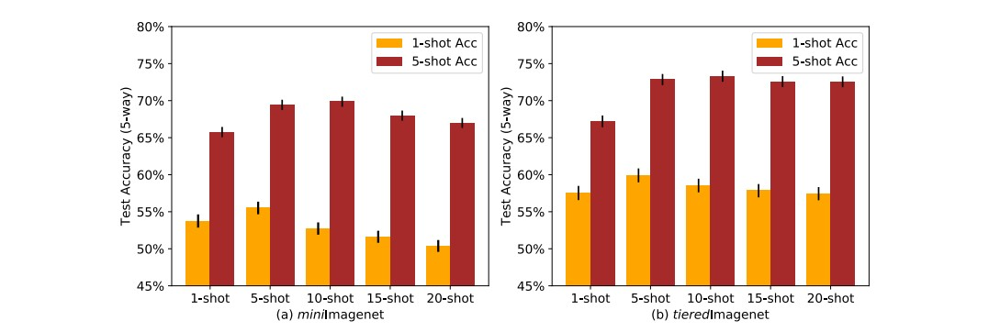

##### Loss

The values of $F^*$ are converted to probability values through softmax, then computed as negative log-likelihood cross-entropy.
$$
P(\tilde{y_i} = j | \mathrm x_i) = \frac{\exp(F^*_{ij})}{\Sigma^N_{j=1}\exp(F^*_{ij})} \\
J(\varphi,\phi) = \Sigma^{N\times K + T}_{i=1}\Sigma^N_{j=1} - \mathbb I(y_i == j)log(P(\tilde{y_i}=j)|\mathrm x_i)
$$

##### Proof that |eigenvalue of $S$| < 1

In linear algebra, two similar matrices have the same eigenvalues. And given the equation below, if $v$ is an eigenvector of $A$, then $P^{-1}v$ is an eigenvector of $B$.

$B = P^{-1}AP \ \Longleftrightarrow \ PBP^{-1} = A$. If $Av = \lambda v$, then $PBP^{-1}v = \lambda v \ \Longrightarrow \ BP^{-1}v = \lambda P^{-1}v$

Based on this, let us prove that |eigenvalue of $S$| < 1.
$$
S \text{ is similiar with } A = D^{-1}W \\
\text{Meaning of similarity: } B = P^{-1}AP\\
A = D^{-1}W = D^{-1/2}SD^{1/2}
$$

$S = D^{-1/2}WD^{-1/2}$ can be rewritten as $D^{-1}W = D^{-1/2}SD^{1/2}$. This means that $S$ and $D^{-1}W$ are similar, and therefore $S$ has the same eigenvalues as $D^{-1}W$.

Here, $D^{-1}W$ is a **Markov matrix (stochastic matrix)**. A Markov matrix always has one eigenvalue of 1 and all remaining eigenvalues with absolute values less than 1, so all eigenvalues of $S$ have absolute values less than 1.

##### Convergence of $F_t$

$$
F_0= Y, \text{ and}\ \ F_{t+ 1}= \alpha SF_t+ (1− \alpha )Y \\

F_t = ( \alpha S)^{t−1}Y + (1 −  \alpha )\Sigma^{t−1}_{i=0}( \alpha S)^iY
$$

Given $0 < \alpha < 1 $ and |eigenvalue of $S$| < 1, the following expressions hold.
$$
\lim_{t \to \infin}( \alpha S)^{t−1}=0 ,\text{ and  }\lim_{t \to \infin}\Sigma^{t−1}_{i=0}( \alpha S)^i = (1-\alpha S)^{-1}
$$
Therefore, $F^*$ converges to the following result.
$$
F^* = lim_{t→\infin} F_t
=(1-\alpha)(1-\alpha S)^{-1}Y
$$

##### Normalized graph Laplacian

$$
\begin{aligned}
L &= D-A \\
D^{-\frac{1}{2}}LD^{-\frac{1}{2}} &= D^{-\frac{1}{2}}(D-A)D^{-\frac{1}{2}} \\
&= D^{-\frac{1}{2}}(D^{\frac{1}{2}} -AD^{-\frac{1}{2}}) \\
&= I - D^{-\frac{1}{2}}AD^{-\frac{1}{2}}
\end{aligned}
$$

##### Transductive Experimental Setting

For a detailed explanation, refer to the Experiments section (Section 6) of Nichol et al., "On first-order meta-learning algorithms."

- MAML: In the original experiment, MAML computed batch normalization using the information (mean, variance) from support set samples and all query samples *(BN)*
- MAML + Transduction: A new setting proposed by TPN. Adds transductive regularization to MAML's loss function
- Reptile No: Computes batch normalization using only the support set samples and the single query being inferred (mean, variance)
- Reptile + BN: Computes batch normalization using the support set samples and all query samples (mean, variance)
- ProtoNet No: Computes batch normalization using only the support set samples and the single query being inferred (mean, variance)

##### Definition of Graph Kernel

In structure mining, a graph kernel is a kernel function that computes an inner product on graphs. Graph kernels can be intuitively understood as functions measuring the similarity of pairs of graphs.

### Reference

- [Zhou et al. Learning with Local and Global Consistency (NIPS 2003)](https://proceedings.neurips.cc/paper/2003/file/87682805257e619d49b8e0dfdc14affa-Paper.pdf)
- [Liu et al. Learning to Propagate Labels: Transductive Propagation Network for Few-shot Learning (ICLR 2019)](https://arxiv.org/abs/1805.10002)
- [Inductive vs. Transductive Learning](https://towardsdatascience.com/inductive-vs-transductive-learning-e608e786f7d)
- [Nichol, et al. On first-order meta-learning algorithms](https://arxiv.org/abs/1803.02999)
