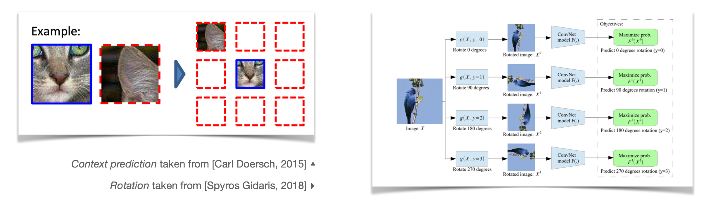
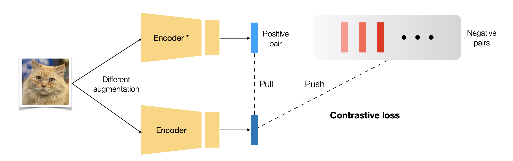
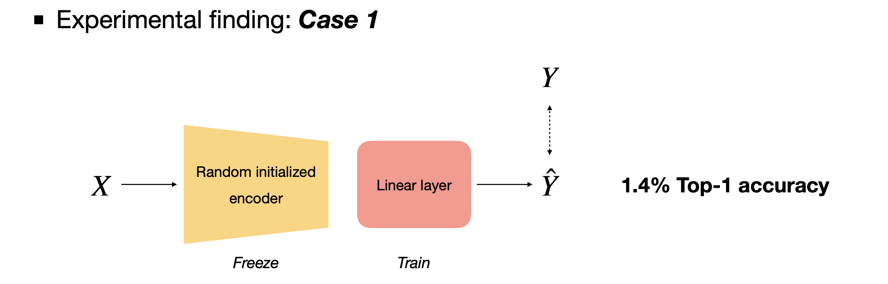
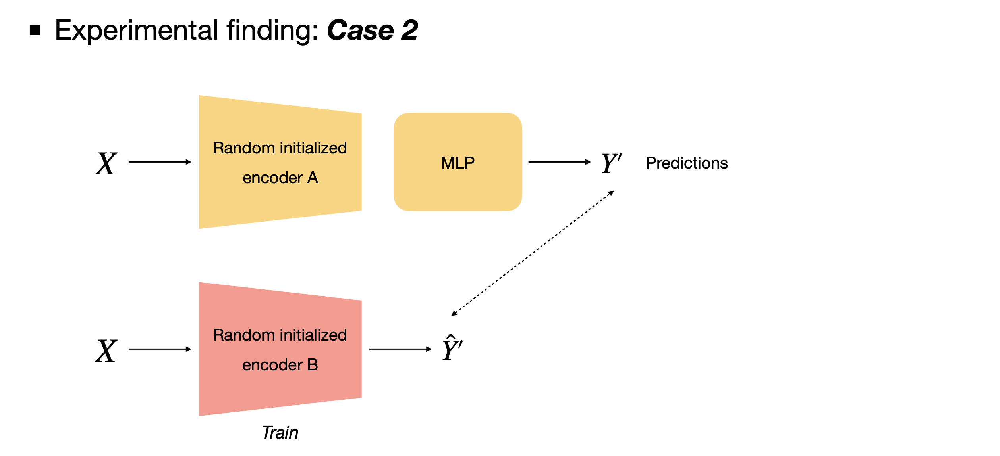
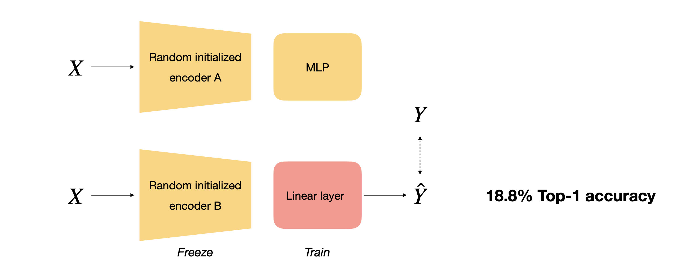
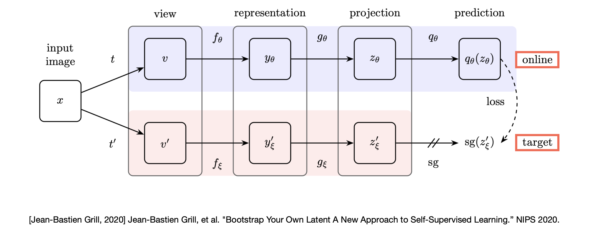
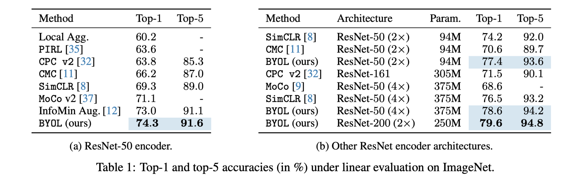
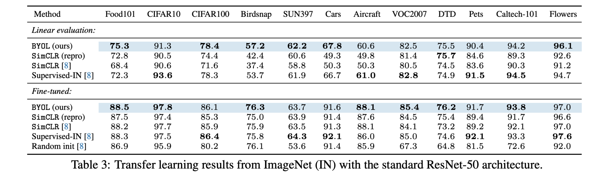
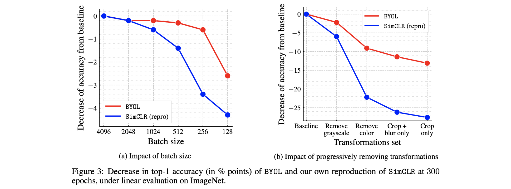

This post reviews the [Bootstrap your own latent: A new approach to self-supervised Learning](https://arxiv.org/abs/2006.07733) paper by the DeepMind team, published at NeurIPS 2020.

About two days before reading this paper, I had been imagining a new deep learning algorithm on my own. It consisted of two models — a "mate" model and a "main" model — where the mate model served as a running mate to boost the main model's performance. While browsing self-supervised learning papers for a seminar, I came across the BYOL paper and was pleasantly surprised to find a similar model architecture to what I had been thinking. I read the paper in a single day and immediately decided to present it at the seminar.

### Self-supervised Learning

Training AI models requires large amounts of data. Here, "data" refers not only to the raw data itself — such as images or audio — but also to the labels needed to verify whether the model's predictions are correct or not. Obtaining vast amounts of raw data is already a laborious task, but labeling each individual data point with its correct answer is even more laborious and costly.

To overcome these problems with conventional supervised learning, various research directions have emerged, including semi-supervised learning (where only a subset of data is labeled) and unsupervised learning (which uses unlabeled data for training). Self-supervised learning is another branch of research that uses unlabeled data for training.

Because it uses unlabeled data, self-supervised learning is sometimes considered a subset of unsupervised learning research. However, while typical unsupervised learning deals with methods like clustering and dimensionality reduction, self-supervised learning generates its own supervision to compute loss and learn, which distinguishes it from unsupervised learning where no supervision exists at all.

To perform self-supervised learning, we first need to define a new problem and answer for the unlabeled data. Taking the simplest classification example: an image is rotated by 90 degrees, and then the encoder is trained to predict how many degrees the image has been rotated (without seeing the original image). The parameters of this trained encoder are then transferred to fine-tune the model on the classification problem we originally wanted to solve, using supervised learning.

By training the encoder to solve the rotation prediction problem, the encoder develops a good understanding of the characteristics of the data in the dataset. Through this process, even if we have relatively few labeled samples, we can effectively train the encoder to perform well on our target task.

The label-free problem defined in this example is called the **pretext task**, and the problem we actually want to solve by applying transfer learning to the model obtained from the pretext task is called the **downstream task**.

##### Related works

Early research focused extensively on how to define the pretext task. The following topics are good references on this subject.

- `Exemplar (NIPS 2014)`, `Context prediction (ICCV 2015)`, `Jigsaw puzzle (ECCV 2016)`, `Count (ICCV 2017)`, `Rotation (ICLR 2018)`

Recently, research in **contrastive learning** has been very active. In typical supervised learning, the model learns whether an image belongs to a specific class through label values of 1 or 0. Even though the model is not trained with any semantic labels, the classes with high prediction probabilities can be visually confirmed to be similar to the actual ground-truth class. Contrastive learning actively exploits this property.

When different data augmentations are applied to a single image and each is passed through the encoder, two representation vectors are produced. If we call one the anchor and the other the positive pair representation, the core logic of contrastive learning is that the encoder should be trained so that the similarity between anchor and positive pair representations is high, while the similarity with representations from other images (negative pairs) is low. The following papers are good references on this topic.

- `NPID (CVPR 2018)`, `MoCo (CVPR 2020)`, `SimCLR (ICML 2020)`

However, contrastive learning algorithms suffer from issues such as large performance variations depending on the data augmentation method and the need to carefully select negative pairs. Consequently, research into new approaches has been progressing, and BYOL, which we examine in this post, is a representative example.

### BYOL

As briefly discussed, contrastive learning has the drawback that negative pairs must be carefully selected for training to work well. Yet if negative pairs are not used at all, the model may output only constant vectors — the loss decreases, but the model learns nothing meaningful from the data (collapse). To prevent this, both positive and negative samples are typically used together in training.

However, the Bootstrap Your Own Latent (BYOL) paper proposes a new self-supervised learning algorithm that does not use negative pairs. (The paper title itself states "A new approach to self-supervised Learning.") The authors also argue that BYOL's advantage of being robust to data augmentation choices compared to contrastive learning stems from the fact that it does not use negative pairs. So how exactly can it avoid collapse without using negative pairs and even outperform contrastive learning methods?

##### Motivation

The authors introduce an experimental finding that served as the core motivation for the BYOL algorithm.

In Case 1, a randomly initialized encoder is frozen, and then linear evaluation — a standard benchmark procedure in self-supervised learning — is performed. Since the encoder is randomly initialized and only the final linear layer is trained, a very low top-1 accuracy of 1.4% is recorded.

Case 2 uses two networks. The first network uses the same encoder architecture as in Case 1, and an image is fed through this network to produce a prediction $y'$. This $y'$ is then used as the target: the second network is trained to output $y'$ when the same image is provided as input. Remarkably, this achieves a top-1 accuracy of 18.8% — a significant improvement over Case 1.

It is still not clear to me how this can work — passing image data through a completely untrained network to obtain $y'$ and then using it as a target to train another network seems almost like magic. Nevertheless, the authors used this finding to develop the BYOL algorithm.

##### Architecture

The paper proposes two networks: the **target network** and the **online network**.

The online network consists of an **encoder $f_\theta$, projector $g_\theta$, and predictor $q_\theta$**, while the target network has the same structure minus the predictor, consisting of $f_\xi$ and $g_\xi$. For a fair comparison with other algorithms, both networks use ResNet-50 as their encoder, which is the benchmark in self-supervised settings. (Experiments with deeper architectures — ResNet-101, 152, and 200 — were also conducted.)

Connecting this to the core motivation: the target network outputs a prediction $y'$ when an image is provided as input, and the online network is trained to output this $y'$ when the same image is given. The images provided to the two networks are not exactly the same — they have been modified through different data augmentation methods. To clarify, $y'$ is not a **probability value between 0 and 1, but a 256-dimensional vector**.

The online network is trained based on $y'$, but the target network does not undergo gradient descent-based training. However, since keeping the target network's parameters fixed would limit the top-1 accuracy to 18%, the online network's parameters are transferred to the target network using an **exponential moving average (EMA)** formula. By repeating this process, the target network gradually produces better predictions, and the online network also benefits from training with these improved predictions $y'$, resulting in progressively improved model performance.

##### Weight update

The loss is computed by applying L2-normalization to both the online network's prediction and the target network's projection, then computing the mean squared error between them. In other words, the MSE between the normalized prediction and normalized target projection is computed, which is proportional to the cosine distance.
$$
\begin{aligned}
	\mathcal L_{\theta, \xi}
	& \triangleq \lVert \bar{q_\theta}(z_\theta) - \bar{z_\xi'}\rVert^2_2 \\
    &= 2- 2 \cdot \frac{\langle q_\theta(z_\theta),z'_\xi \rangle}{\lVert{q_\theta(z_\theta)}\rVert_2 \cdot \lVert{z'_\xi}\rVert_2}\\
    &= 2-2 \cdot \text{cos}{(q_\theta(z_\theta),z'_\xi )}
\end{aligned}
$$
Since the data augmentation methods applied to the online and target networks are different, the authors symmetrized the loss by swapping the augmentation combinations and computing the loss once more. The resulting $\mathcal L^{BYOL}_{\theta, \xi}$ is used to update the online network's parameters $\theta$.
$$
\mathcal L^{BYOL}_{\theta, \xi} = \mathcal L_{\theta, \xi} + \tilde{\mathcal L}_{\theta, \xi}
$$
$$
\theta \gets \text{optimizer}(\theta, \nabla_{\theta}\mathcal L^{BYOL}_{\theta, \xi}, \eta)
$$

The target network's parameters $\xi$ are updated using the exponential moving average (EMA) formula. The parameter $\xi$ is updated as a weighted average of past model parameters, where $\tau$ starts at 0.996 and approaches 1 as training progresses.
$$
\xi \gets \tau \xi + (1-\tau)\theta
$$

$$
\tau_{base} = 0.996, \tau \triangleq 1 - (1-\tau_{base})\cdot\frac{\text{cos}(\frac{\pi k}{K})+1}{2}
$$

This type of formula is sometimes called a weighted average (since the new $\xi$ is a weighted average of $\xi$ and $\theta$) or mean teacher (since the weighted average serves as the teacher network during training). The only difference from the momentum update in MoCo ($\theta_t = \alpha\theta_{t-1} + (1-\alpha)\theta_t$) is that $\tau$ is not a constant but a value that changes through cosine annealing.

### Experiment

In the final evaluation stage, only the online network's encoder $f_\theta$ is extracted and evaluated on downstream tasks. As with other self-supervised learning algorithms, experiments were conducted on linear evaluation with the ImageNet dataset, as well as dataset transfer and task transfer.

Additionally, ablation studies demonstrated that performance degrades less with smaller batch sizes and that performance is better maintained when augmentation methods change compared to contrastive learning.

### Conclusion

The authors attribute BYOL's resistance to collapse despite the absence of negative pairs to the presence of the predictor, the very careful adjustment of the exponential moving average, and the fact that the target network's parameters $\xi$ are not updated in the direction of the loss gradient. However, it appeared that even the authors themselves do not yet fully understand the precise reason.

BYOL was trained on the ImageNet dataset with ResNet-50 and a batch size of 4096 using 512 Cloud TPUs for 8 hours. Thinking about why such enormous computation was required, I suspect it is due to several factors: the image augmentation multiplied the effective size of the ImageNet dataset by several times, the additional predictor and target network were added on top of the base encoder, and training ran for 1,000 epochs. Consequently, while it should be possible to directly use the encoder parameters from BYOL's results in other domains, I had doubts about whether the idea itself could be practically applied at the research stage.

That said, the paper was impressive in that it conducted experiments with a truly diverse range of settings and hyperparameter adjustments — the appendix alone exceeds 20 pages — and also reproduced other models at improved performance levels for fairer comparisons. The effort to clearly address readers' various questions was commendable.

### Appendix

##### Meaning of Bootstrap

The word "bootstrap" in the paper is not used in the statistical sense but rather in an idiomatic sense. A bootstrap refers to the loop at the back of a shoe, and the expression originates from the idea of pulling oneself up into the air by one's own bootstraps. Therefore, it can mean "an impossible feat" or "self-sustaining processes that proceed without external help."

Since BYOL is an algorithm that improves itself without any external help, I believe this is why the authors chose the term "bootstrap" for the paper.

### Reference

- [Grill, Jean-Bastien, et al. "Bootstrap your own latent: A new approach to self-supervised learning." *arXiv preprint arXiv:2006.07733* (2020).](https://arxiv.org/abs/2006.07733)
- [HOYA012'S RESEARCH BLOG - Bootstrap Your Own Latent: A New Approach to Self-Supervised Learning Review](https://hoya012.github.io/blog/byol/)
- [Yannic Kilcher YOUTUBE - BYOL: Bootstrap Your Own Latent: A New Approach to Self-Supervised Learning (Paper Explained)](https://www.youtube.com/watch?v=YPfUiOMYOEE)
- https://en.wikipedia.org/wiki/Bootstrapping
