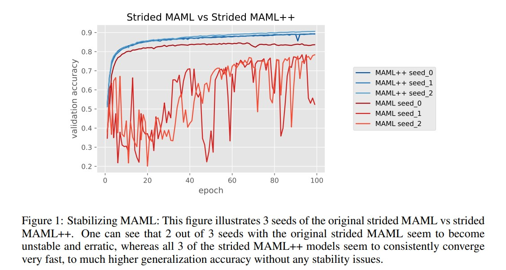
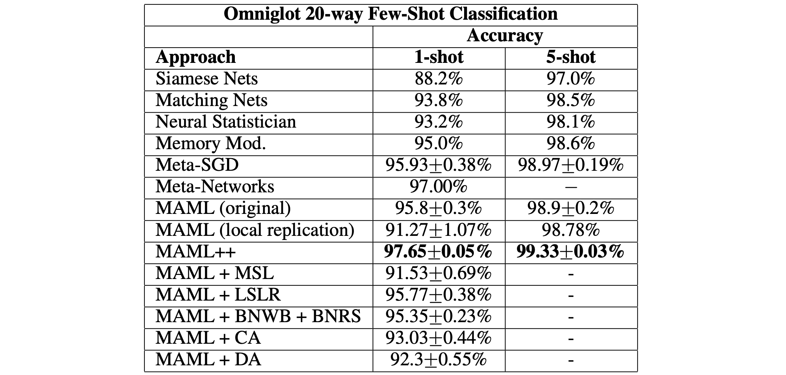

> A brief summary of the paper "How to Train Your MAML," accepted at ICLR 2019.

["Model-Agnostic Meta-Learning for Fast Adaptation of Deep Networks"](https://arxiv.org/abs/1703.03400) (hereafter MAML), accepted at ICML 2017, is the most prominent algorithm in meta-learning research and is practically synonymous with the term meta-learning. While it is an important paper, directly implementing the ideas from the MAML paper in code introduces several issues.

While trying to incorporate MAML's ideas into other research, I encountered several of these issues myself and have been modifying and supplementing the MAML code by consulting various references. During this process, I read the "How to Train Your MAML" paper and share below a brief summary of what I learned.

### MAML++

##### Issue 1. Training Instability

During backpropagation, passing all gradients through multiple convolution layers without skip connections can cause gradient degradation, such as gradient explosion and vanishing.

MAML performs roughly 5 rounds of fine-tuning with the support set, then takes the target loss only from the final fine-tuned model to optimize the overall model. This means that the gradients from the final fine-tuned model must propagate all the way back to the initial model before fine-tuning, which appears to be the source of training instability.

##### Solution: Multi-Step Loss Optimization (MSL)

The authors argue that instead of computing the query loss only from the final fine-tuned model, the target loss should be computed after every fine-tuning step on the support set. They claim that summing the target losses from all steps and using this total for optimization improves training stability.

##### Issue 2. Second-Order Derivative Cost

MAML allows choosing whether to use the second-order derivative terms that arise during the fine-tuning process or to treat them as constants via stop gradient, computing only first-order derivative terms. Using second-order derivatives can improve generalization, but at a significantly greater time cost compared to using only first-order derivatives.

##### Solution: Derivative-Order Annealing (DA)

Derivative-Order Annealing (DA) was proposed to balance computational cost and generalization performance. The idea is to use only first-order derivatives for the first 50 epochs and then switch to second-order derivatives afterwards.

The authors report that using DA eliminated gradient exploding and diminishing gradient problems, and even achieved more stable training than using second-order derivatives exclusively.

##### Issue 3. Absence of Batch Normalization Statistic Accumulation & Shared (across step) Batch Normalization Bias

Standard batch normalization with running statistics assumes convergence to global mean and global standard deviation. MAML does not use running statistics but instead uses the statistics of the current batch. Since parameters must adapt to the mean and standard deviation across diverse tasks, batch normalization becomes ineffective.

Additionally, MAML learns a single set of biases at each layer. This assumes that the distribution of features passing through the network is the same at all steps, which is not a valid assumption.

##### Solution: Per-Step Batch Normalization Running Statistics (BNRS) & Per-Step Batch Normalization Weights and Biases (BNWB)

> This section is still being revised as I feel my understanding is not yet complete.

The simplest alternative is to use running batch statistics for the inputs in the inner loop. However, this introduces several issues in terms of optimization and computational cost.

A better approach is to maintain separate running mean and running standard deviation for each inner loop step and update the running statistics independently. Using this per-step batch normalization method can improve both optimization speed and generalization performance. Biases are also learned separately per step.

##### Issue 4. Shared Inner Loop Learning Rate

Using the same learning rate $\alpha$ for all gradients in the inner loop step requires extensive hyperparameter search and yields poor generalization performance.

##### Solution: Learning Per-Layer Per-Step Learning Rates and Gradient Direction (LSLR)

One element that can be used to enhance generalization over data fitting is "learn a learning rate." A related prior work is Meta-SGD, where $\alpha$ is not a constant but a learnable parameter of the same size as the gradients, and the gradient and $\alpha$ are multiplied element-wise.

However, this approach doubles the number of parameters, requiring significantly more memory and computation. As an alternative, instead of assigning a learning rate per individual gradient, different learning rates can be used per layer. The authors set up different learning rates for each of L layers and N steps, adding LN additional parameters.

##### Issue 5. Fixed Outer Loop Learning Rate

MAML uses a static outer loop learning rate.

##### Solution: Cosine Annealing of Meta-Optimizer Learning Rate (CA)

Since annealing learning rate schedules have been frequently shown to improve generalization in other papers, the authors adopted cosine annealing. This indeed improved generalization performance and also reduced the time needed for hyperparameter tuning.

### Reference

- [OpenAI, "Reptile: A Scalable Meta- Learning Algorithm."](https://openai.com/blog/reptile/)
- [Sherwin Chen, "How to Train MAML(Model-Agnostic Meta-Learning)."](https://pub.towardsai.net/how-to-train-maml-model-agnostic-meta-learning-90aa093f8e46)
- [Finn et al., "Model-Agnostic Meta-Learning for Fast Adaptation of Deep Networks."](https://arxiv.org/abs/1703.03400)
- [Antoniou et al., "How to train your maml."](https://arxiv.org/abs/1810.09502)
