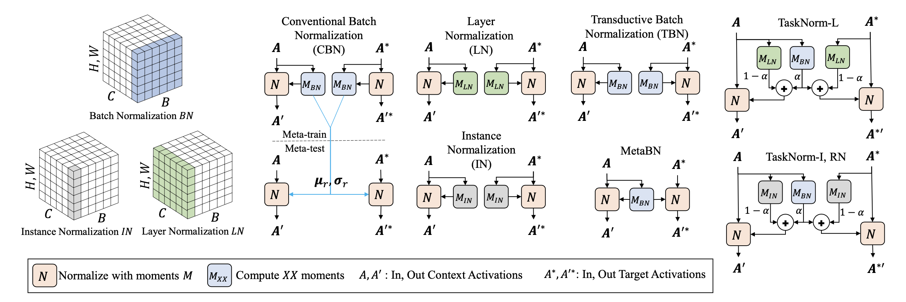
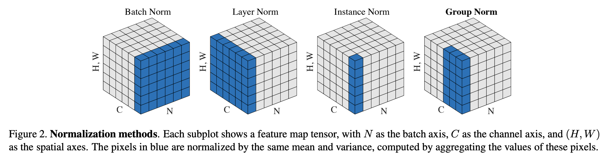
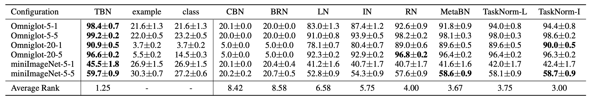

> This post introduces the concept of batch normalization and discusses which normalization methods are appropriate in a meta-learning setting.

### Batch normalization

Batch normalization (hereafter BatchNorm) is a technique proposed in a 2015 paper by Sergey Ioffe and Christian Szegedy[^1]. Using BatchNorm significantly improves performance in most models, and there is no need to standardize the training dataset before feeding it to the model. It also reduces the gradient vanishing problem, enabling the use of larger learning rates, and acts as a regularizer, reducing the need for other regularization techniques.

In the paper, the authors state that BatchNorm reduces internal covariate shift — a phenomenon where the input distribution of a given layer changes due to parameter updates in preceding layers during training. For a long time, this was believed to be the reason why models train well with BatchNorm. However, recent research suggests that BatchNorm does not actually reduce internal covariate shift but rather smooths the objective function, which improves performance. The true reason behind BatchNorm's effectiveness is still under debate.

The BatchNorm operation centers the input at the origin, normalizes it, and then applies scaling and biasing (shifting) using two new parameters.
$$
\mu_B = \frac{1}{m_B}\Sigma^{m_B}_{i=1}{\mathbf x_i}, \;\;
\sigma^2_B = \frac{1}{m_B}\Sigma^{m_B}_{i=1}{(\mathbf x_i-\mu_B)^2} \tag{1}
$$

$$
\mathbf{\hat x_i}^{(k)} = \frac{\mathbf{x_i}^{(k)}-\mu_{B}^{(k)}}{\sqrt{{\sigma^{(k)}_{B}}^2 + \varepsilon}} \tag{2}
$$

$$
\mathbf{z_i}^{(k)} = \gamma^{(k)} \otimes \hat{\mathbf x_i}^{(k)} + \beta^{(k)} \tag{3}
$$

Equation (1) computes the mean and standard deviation of the current mini-batch input. These values will be referred to as "moments." Equation (2) uses these moments to center the input at the origin and normalize it. Here, $\varepsilon$ is a small number on the order of $10^{-5}$ to prevent the denominator from being zero. Equation (3) uses two parameters, $\gamma$ and $\beta$, for scaling and biasing to produce the final BatchNorm output $z^{(i)}$.

The entire process can be expressed as $\mathbf z^{(k)} = BN_{\gamma^{(k)},\beta^{(k)}}(\mathbf x^{(k)})$ [^2].

##### Moving average

While using $\mu_{B}, \sigma_{B}$ as moments during the training phase is unproblematic, at test time, if a single sample is given as input, there is no way to compute the moments. Even if inputs are provided in batch form, using very small batches would reduce the reliability of the statistical estimates.

To solve this problem at test time, instead of deriving moments from the batch, we can feed the entire training dataset through the model and use the resulting mean and standard deviation. However, in practice, a moving average of $\mu$ and $\sigma$ for each layer is typically computed during training and then used at test time.
$$
\mu = \frac{1}{n}\Sigma\mu_{B},\;\; \sigma = \frac{1}{n}\Sigma\sigma_{B}
$$
Among various moving average methods, exponential moving average is most commonly used. In the formula below, the hyperparameter $\alpha$ is called the momentum, and its default value in TensorFlow is 0.99.
$$
\mu = \alpha\mu + (1-\alpha)\mu_{B},\;\; \sigma = \alpha\sigma + (1-\alpha)\sigma_{B}
$$

### Meta-learning scenario

In standard supervised learning, the data distribution is assumed to be i.i.d., so applying the moving average of moments obtained from training data to testing is considered appropriate. However, in a meta-learning setting, the i.i.d. assumption can only be made for a specific task, making the use of such running statistics (moving averages) inappropriate. Therefore, in meta-learning settings, one must reconsider which moments to use for normalization computations.

##### i.i.d assumption[^3]

In machine learning theory, i.i.d. assumption is often made for training datasets to imply that all samples stem from the same generative process and that the generative process is assumed to have no memory of past generated samples.

### Normalization methods

The terminology in this section follows the wording from the TaskNorm paper[^4]. In this section, standard BatchNorm will be referred to as CBN.

##### Transductive Batch Normalization (TBN)

The simplest way to carry over the BatchNorm concept to a meta-learning setting is to use TBN. Since the entire batch cannot be assumed to be i.i.d. in a meta-learning setting, TBN uses the moments (mean, standard deviation) of the specific task for the normalization operation. In other words, it uses the moments of the current episode for normalization, and therefore there is no need to track a moving average. When implementing this directly in TensorFlow, there is no need to update the `moving_mean` and `moving_variance` parameters (they are not used at all).

It is called "transductive" because query set information is also used to infer the query set. MAML uses this approach. It generally produces better performance than non-transductive methods, but it is sensitive to the query set's data distribution and is more limited in applicability compared to non-transductive approaches. It is also criticized for not being a fair comparison since it uses additional information compared to non-transductive methods.

##### Instance-Based Normalization

Instance-based normalization methods perform normalization on a per-sample basis rather than a per-batch basis. Since the normalization result is completely independent of the batch, it is one of the useful normalization alternatives that can replace CBN in meta-learning settings.

Instance-based normalization methods include Layer Normalization (LN), Instance Normalization (IN), and Group Normalization (GN). The figure from the GN paper[^5] below provides an easy-to-understand illustration of how moments are computed for each normalization method. However, instance-based normalization methods suffer from insufficient performance and are less efficient in terms of training compared to CBN.

##### TaskNorm

TaskNorm was introduced at ICML 2020 and was designed to address the problems of existing normalization methods in meta-learning settings. Before examining TaskNorm in detail, let us first look at MetaBN, which is introduced in the paper.

MetaBN can be thought of as a modification of CBN that allows it to be used in a non-transductive manner in meta-learning settings. MetaBN computes moments using only the support set data, and these moments are then used identically for normalizing both the support set and the query set. Naturally, when the support set contains only a small number of samples, this approach does not yield sufficient performance. Therefore, TaskNorm applies one additional modification to MetaBN: the introduction of secondary moments.

MetaBN's normalization result is influenced by the data distribution of the support set samples. However, when samples are scarce, the data distribution may not be informative. TaskNorm therefore uses the moments from an instance-based normalization method — which is independent of data distribution — as secondary moments. In other words, TaskNorm can be described as a normalization method that considers both the support set data distribution and the individual characteristics of each sample in a certain proportion. The formula is as follows:
$$
\mu_{TN} = \alpha \mu_{BN} +(1−\alpha)\mu_+  \\
\sigma^2_{TN} =\alpha( \sigma_{BN}^2 +(\mu_{BN} − \mu_{TN} )^2) + (1−\alpha)(\sigma_+^2 +(\mu_+ −\mu_{TN})^2)
$$

$$
\alpha = SIGMOID(SCALE|D^\tau | + OFFSET)
$$

$\alpha$ determines the ratio at which the support set moments and secondary moments are used. Here, $D^\tau$ denotes the support set size, and SCALE and OFFSET are parameters learned during meta-training. The model sets the appropriate normalization ratio for the task based on the support set size along with the SCALE and OFFSET values, and performs the normalization operation using this result.

Below are the experimental results on the Omniglot and miniImageNet datasets.

### References

[^1]: Ioffe, Sergey, and Christian Szegedy. "Batch normalization: Accelerating deep network training by reducing internal covariate shift." International conference on machine learning. PMLR, 2015
[^2]: Wikipedia contributors. (2021, April 13). Batch normalization. In Wikipedia, The Free Encyclopedia. Retrieved 04:59, May 5, 2021, from https://en.wikipedia.org/w/index.php?title=Batch_normalization&oldid=1017569708
[^3]: Wikipedia contributors. (2021, April 11). Independent and identically distributed random variables. In Wikipedia, The Free Encyclopedia. Retrieved 05:26, May 19, 2021, from https://en.wikipedia.org/w/index.php?title=Independent_and_identically_distributed_random_variables&oldid=1017206855
[^4]: Bronskill, John, et al. "Tasknorm: Rethinking batch normalization for meta-learning." International Conference on Machine Learning. PMLR, 2020.
[^5]: Wu, Yuxin, and Kaiming He. "Group normalization." Proceedings of the European conference on computer vision (ECCV). 2018.APA
[^6]: Géron, Aurélien. Hands-on machine learning with Scikit-Learn, Keras, and TensorFlow: Concepts, tools, and techniques to build intelligent systems. O'Reilly Media, 2019.
