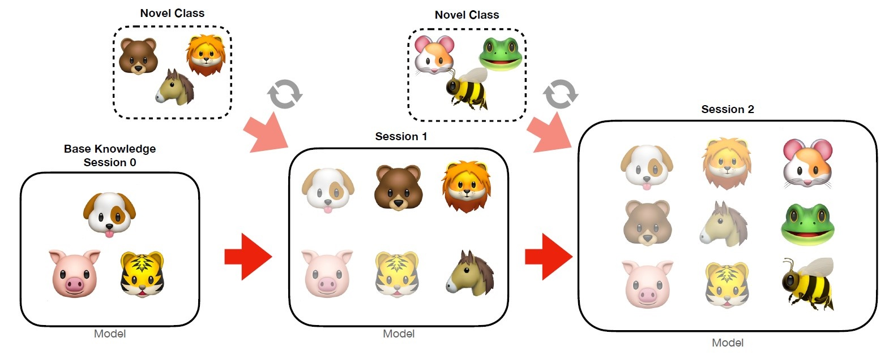
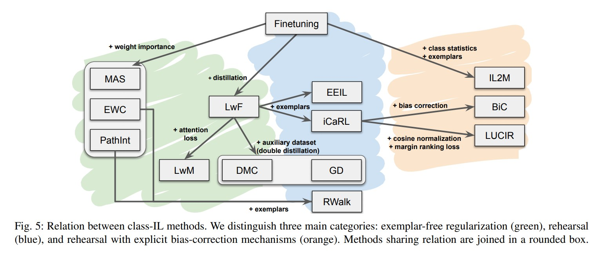
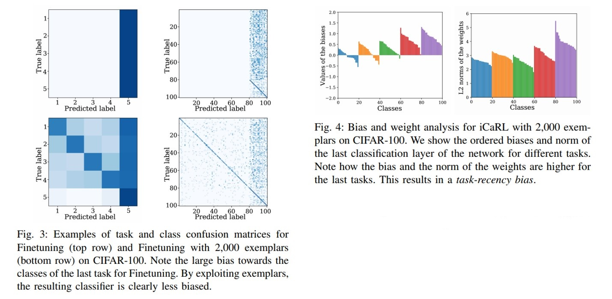

>This post summarizes continual lifelong learning, referencing Parisi, German I., et al.'s Continual Lifelong Learning survey[^1], Masana, Marc, et al.'s Class Incremental Learning survey[^2], and Liu, Bing's Learning on the Job[^3] paper. Among the various research branches, this post primarily focuses on **class-incremental learning**[^2].
>

### Introduction

Throughout their lives, humans acquire diverse knowledge and skills across various environments, continuously refine that knowledge and those skills, and quickly adapt to unfamiliar situations based on what they have learned so far. This ability and learning process is referred to as lifelong learning.

However, compared to humans, current artificial intelligence lacks lifelong learning capabilities. Continual lifelong learning research operates under the fundamental premise that **previously learned tasks cannot be revisited**. If a model is simply fine-tuned on a new task under this constraint, it tends to severely forget previously learned knowledge. This phenomenon is called **catastrophic forgetting**, and the core theme of continual lifelong learning research is preventing catastrophic forgetting -- that is, "not forgetting previously learned tasks while learning the current task."

Equipping artificial intelligence with continual lifelong learning capabilities has importance beyond merely creating human-like AI. The simplest example is an autonomous agent. An autonomous agent must continuously learn new knowledge while interacting with its external environment. Even after completing initial training, it is natural for the agent to leverage existing knowledge to acquire new knowledge when encountering entirely new environments, and to refine existing knowledge based on newly acquired knowledge.

Even for general machine learning models beyond agents, continual lifelong learning offers the following advantages:

- Resolving storage limitations for previously learned knowledge (*Memory restrictions*)
- Enabling local data not to be permanently stored on a central server to maintain model performance (*Data security / Privacy restrictions*)
- Reducing computational costs by only training on new data without retraining on the entire dataset (*Sustainable ICT*)

<i>Class-incremental learning (made by <href src='https://github.com/solangii'>solang</href>)</i>

### Definitions

Before examining the actual research, let us clarify what continual learning, lifelong learning, and incremental learning each mean, borrowing expressions from the papers. To state the conclusion first: '**All three terms are frequently used interchangeably, and researchers do not clearly distinguish between them either**.'

What all three learning paradigms aim to achieve is the same: learning new tasks well without forgetting past models. However, according to Liu[^3]'s paper, there are some subtle differences.

First, **lifelong learning** focuses on learning a new $T_{N+1}$ well based on knowledge accumulated so far ($T_1, T_2, ..., T_N$). After training begins, the learner learns $N$ sequence of tasks $T_1, T_2, ..., T_N$, and when it encounters the $(N+1)$-th task $T_{N+1}$, it should be able to utilize the knowledge base to learn $T_{N+1}$. The knowledge base is a space that maintains and accumulates knowledge from the previous $N$ tasks, and newly acquired knowledge is updated to the knowledge base after learning $T_{N+1}$.

In contrast, **continual learning** focuses on preventing catastrophic forgetting. In the deep learning community, the term continual learning is more commonly used. This is presumably because research on preventing the forgetting of previously learned knowledge during the process of learning new knowledge is more prevalent than research on extending to new knowledge based on previously learned knowledge.

The term **incremental learning** also appears frequently. According to Masana, Marc, et al.[^2], incremental learning is a type of continual learning -- while continual learning is used not only for supervised data but also in RL, incremental learning mainly deals with supervised data. However, these terms are also frequently used interchangeably and are difficult to clearly distinguish. Personally, from reviewing various papers, I have observed that the terms continual learning and incremental learning are used interchangeably when starting from zero base, while the term incremental learning is more commonly used when starting from a specific pretrained point and expanding knowledge.

Additionally, it is helpful to know the term **knowledge transfer**. Knowledge transfer is divided into forward knowledge transfer and backward knowledge transfer. Forward knowledge transfer refers to the situation where learning previous tasks helps with the learning of subsequent tasks, while backward knowledge transfer refers to the situation where learning subsequent tasks improves performance on previous tasks.

### Setup

Among the various research branches in continual learning, lifelong learning, and incremental learning, I wrote this post focusing on **class-incremental learning**, where the number of classes increases sequentially. The basic setup for class-incremental learning research is as follows:

- **Task**: A set of classes. Must be disjoint from classes of other tasks.

- **Session**: The learner can only access data from the single task of the current session. However, for exemplar-based methods, accessing data from other sessions is allowed within a certain memory budget. Within the current training session, processing (training/iterating) the current task's training data multiple times is permitted. This differs from some online learning settings where each data sample can only be seen once.

- Cross-entropy calculation: For exemplar-based methods, (1) is natural, while for exemplar-free methods, (2) helps prevent forgetting.

  1. Compute cross-entropy for current session data samples against all class candidates, then backpropagate.
  2. Compute cross-entropy for current session data samples against only the novel class candidates of the current session, then backpropagate.

- Datasets: CIFAR-100, Oxford Flowers, MIT Indoor Scenes, CUB-200-2011 Birds, Stanford Cars, FGVC Aircraft, Stanford Actions, VGGFace2, ImageNet dataset (and reduced ImageNet-subset), etc.
- Metrics: Generally, average accuracy is used, which considers all classes equally.

- Experimental scenarios (using CIFAR-100 as an example):
  1. Zero-base start: For CIFAR-100 with 100 classes, construct 10 tasks with 10 classes each.
  2. Start after pretraining: For CIFAR-100 with 100 classes, the first task consists of 50 classes, and the remaining 50 classes are organized into 10 tasks of 5 classes each.

### Approaches

Existing SOTA models learn representations through stationary batches. However, learning from non-stationary data, as in continual learning, lifelong learning, and incremental learning scenarios, causes catastrophic forgetting. Masana, Marc, et al.[^2] explain the causes of catastrophic forgetting as follows:

1. Network weights related to old tasks are updated in the direction of reducing new task loss, leading to performance degradation on previous tasks (*Weight drift*).
2. Similar to weight drift, changes in weights cause changes in activations, which in turn cause changes in network output (*Activation drift*).
3. The goal is to handle all tasks learned so far, but since previous and current tasks are not jointly trained, network weights cannot optimally handle all tasks (*Inter-task confusion*).
4. There is a tendency to predict recent task classes regardless of the input (*Task-recency bias*).

To address these problems, the following lines of research have been conducted:

1. **Regularization-based**: Methods that minimize changes to elements that were important for previous tasks while learning new tasks.
2. **Exemplar-based**: Methods that store a small number of images or feature vectors from previous tasks and provide them during new task learning to prevent forgetting.
3. **Bias-correction method**: Methods that primarily address the task-recency bias problem.

<i>Relation between class-IL methods. Taken from [Masana, Marc, et al., 2020]</i>

##### Regularization approaches

Regularization approaches refer to the strategy of imposing certain constraints to avoid modifying information that was important for previous tasks as much as possible while learning new tasks. They can broadly be divided into weight regularization methods and data regularization methods.

1. Weight regularization: After training on each task, evaluate the importance of each weight and constrain these weights from changing significantly during subsequent training - `EWC`, `PathInt`, `MAS`, `RWalk`, etc.

2. Data regularization: Methods based on knowledge distillation to prevent activation drift. For inputs from the current session, the outputs for classes from previous sessions should remain as similar as possible before and after training. Representations from layers preceding the classifier, not just output logits, are also used for distillation loss computation - `LwF`, `LFL`, etc.
3. Recent developments in regularization - `LwM`, `DMC`, `GD`, etc.

##### Rehearsal approaches

Rehearsal approaches refer to the strategy of preventing forgetting by storing a few exemplars and inserting them during new task learning (exemplar rehearsal), or generating images similar to those from previous tasks (pseudo-rehearsal). In other words, these methods prevent forgetting by repeatedly replaying stored or generated data from previous tasks.

An exemplar refers to either the actual image from a previous task or its feature vector. The concept of exemplar rehearsal in class-incremental learning was first introduced in iCaRL[^4].

- Memory type: In the continual setting, since access to previously learned task data is restricted, only a very small number of exemplars can be used. Therefore, the following options are available regarding memory size:
  - Fixed memory: The maximum memory capacity is fixed. Therefore, some exemplars must be removed to accommodate new data.
  - Growing memory: Memory capacity is allowed to grow. However, only the addition of new samples from the current task is permitted. In this case, memory cost increases linearly.

  In both cases, an equal number of exemplars per class is enforced to ensure equal representation for all classes.

- Sampling strategies: The following options are available for selecting a few exemplars from previous tasks:
  - Random: Random sampling. Has the advantage of low computational cost.
  - **Herding**: Carefully selecting exemplars according to certain rules (typically by analyzing characteristics in feature space). In iCaRL[^4], exemplars are selected such that the exemplar mean is as close as possible to the real class mean. Better performance than random but with increased computational cost.

Methods that generate virtual images rather than storing actual data as exemplars are called pseudo-rehearsal. However, since most papers using pseudo-rehearsal evaluated on datasets with relatively low complexity such as MNIST, there are questions about whether they can scale up to more complex domains.

##### Bias-correction approaches

Bias-correction approaches are strategies aimed at solving the task-recency bias problem. Task-recency bias refers to the phenomenon where the network becomes biased toward the most recently learned task, and this phenomenon worsens at the end of training. Analyzing the classifier reveals that it has large norm values for new classes and tends to predict the most recent task's classes regardless of the input.

<i>Task-receny bias problem. Taken from [Masana, Marc, et al., 2020]</i>

To address this, methods have been proposed such as re-training on previous tasks using exemplars after training on new tasks, modifying output logits, and applying specific normalization to outputs - `EEIL`, `BiC`, `LUCIR`, `IL2M`, etc.

##### Others

Methods that modify and expand the network architecture whenever a new task is added also exist.

Progressive Neural Network[^5] proposed an algorithm that adds layers in parallel (lateral connections) whenever a new task is added, allowing the model to learn new tasks without modifying the weights learned for previous tasks. However, since this method freezes weights for previous tasks, backward knowledge transfer does not occur.

Dynamically Expandable Network[^6] dynamically modifies the network structure based on predefined rules whenever a new task is added. Unlike PNN, it can modify existing layer weights (selective retraining), add layers in parallel like PNN if the loss for the new task is too high (dynamic expansion), and duplicate existing layer weights to create new hidden units if they have changed too much (split and duplication).

### Conclusion

- Among exemplar-free methods, data regularization methods performed better than weight regularization methods.
- While exemplar-free methods are difficult to match in performance against exemplar rehearsal methods, they have greater flexibility in memory settings, so it is better to compare them separately.
- Fine-tuning with exemplars was much simpler and performed well compared to many complex methods.
- In some cases, combining weight regularization with exemplars outperformed data regularization.
- Herding was better than random sampling for longer sequences of tasks but not for short sequences of tasks.
- Network architecture significantly affects class-IL performance, particularly the presence or absence of skip connections.

### References

[^1]: Parisi, German I., et al. "Continual lifelong learning with neural networks: A review." *Neural Networks* 113 (2019): 54-71.
[^2]: Masana, Marc, et al. "Class-incremental learning: survey and performance evaluation." *arXiv preprint arXiv:2010.15277* (2020).
[^3]: Liu, Bing. "Learning on the job: Online lifelong and continual learning." *Proceedings of the AAAI Conference on Artificial Intelligence*. Vol. 34. No. 09. 2020.
[^4]: Rebuffi, Sylvestre-Alvise, et al. "icarl: Incremental classifier and representation learning." *Proceedings of the IEEE conference on Computer Vision and Pattern Recognition*. 2017.
[^5]: Rusu, Andrei A., et al. "Progressive neural networks." *arXiv preprint arXiv:1606.04671* (2016).
[^6]: Yoon, Jaehong, et al. "Lifelong learning with dynamically expandable networks." *arXiv preprint arXiv:1708.01547* (2017).
