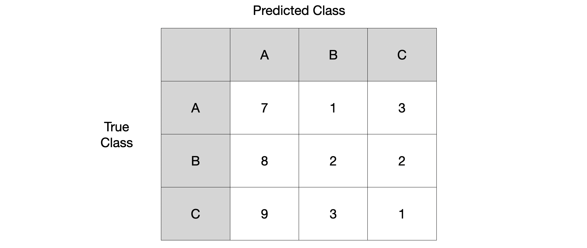
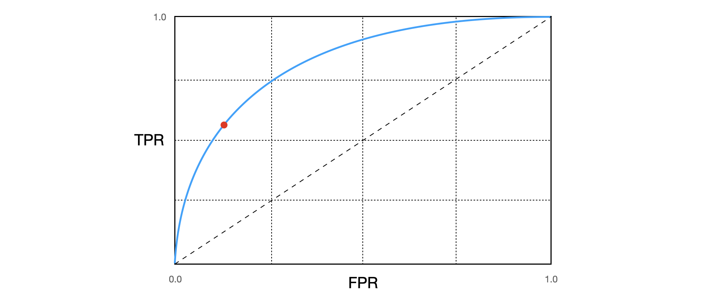

> This post briefly covers classifier performance evaluation metrics including confusion matrix, precision, recall, sensitivity, F1-score, ROC curve, and AUC. Written with reference to Hands-On Machine Learning 2nd edition, along with additional sources listed in the references.

### Confusion Matrix

A confusion matrix can be analyzed using the following four elements:

- **True Positive (TP)**: Correctly (True) classifying a target class instance as the target class (Positive).
- **True Negative (TN)**: Correctly (True) classifying a non-target class instance as not the target class (Negative).
- **False Positive (FP):** Incorrectly (False) classifying a non-target class instance as the target class (Positive).
- **False Negative (FN)**: Incorrectly (False) classifying a target class instance as not the target class (Negative).

Let us look at a confusion matrix example[^1] in a multi-class scenario.

Let us calculate the TP, TN, FP, and FN results for Class A.

- True Positive (TP): Cases where class A is predicted as A = $7$
- True Negative (TN): Cases where non-A classes are predicted as not A = $(2+3+2+1) = 8$
- False Positive (FP): Cases where non-A classes are predicted as A = $(8+9)=17$
- False Negative (FN): Cases where class A is predicted as not A = $(1+3) = 4$

##### Precision

Precision refers to the ratio of instances that are actually the target class among those classified as the target class by the classifier. It can also be understood as *the accuracy of positive predictions*.
$$
\text{Precision} = \frac{TP}{TP + FP}
$$
Let us calculate the Precision for Class A.
$$
\text{Precision}= \frac{TP}{TP + FP} = 7/(7+8+9) = 0.29
$$

##### Recall (Sensitivity, TPR)

Since Precision can be very high (1/1=100%) by predicting just one certain positive sample, it is better to also use the Recall metric, which considers $FN$.

Recall refers to the ratio of target class instances that the classifier correctly classified out of all target class samples. It can also be understood as *the proportion of positive samples that the classifier correctly detected*. It is also called sensitivity or True Positive Rate (TPR).
$$
\text{Recall} = \frac{TP}{TP + FN}
$$
Let us calculate the Recall for Class A.

$$
\text{Recall} = \frac{TP}{TP + FN} = 7/(7+1+3) = 0.64
$$

##### F1-score

It is often convenient to combine Precision and Recall into a single number called the F1-score, especially when comparing two classifiers. **F1-score is the harmonic mean of Precision and Recall**, and is expressed as follows:
$$
F_1 \text{ score} = \frac{2}{\frac{1}{\text{Precision}} + \frac{1}{\text{Recall}}} = 2\times\frac{\text{Precision}\times\text{Recall}}{\text{Precision}+\text{Recall}} = \frac{TP}{TP + \frac{FN+FP}{2}}
$$
Let us calculate the F1-score for Class A.

$$
F_1 \text{ score} = \frac{2}{\frac{1}{\text{Precision}} + \frac{1}{\text{Recall}}} = \frac{2}{\frac{1}{0.29} + \frac{1}{0.64}} = 0.40
$$

### ROC curve

ROC stands for Receiver Operating Characteristic and has the following meaning:

- ROC curve: **TPR (True Positive Rate)** vs. **FPR (False Positive Rate)**
- ROC curve: **Recall (Sensitivity)** vs. **1 - Specificity**
- $FPR = \frac{FP}{FP + TN} = 1- \frac{TN}{FP + TN} = 1-TNR$

If we increase the TPR by only moving the decision threshold while keeping the classifier's performance fixed, the FPR also increases, creating a trade-off. Additionally, by measuring the **area under the curve (AUC)** of the ROC curve, we can compare classifiers. **A perfect classifier has an ROC AUC of 1, while a random classifier has 0.5**.

Additionally, a well-organized article explaining the meaning of the red dot on the ROC curve and the degree of curvature of the chord has been linked in the references[^3]. I highly recommend checking it out.

### References

[^1]:[Joydwip Mohajon, Confusion Matrix for Your Multi-Class Machine Learning Model](https://towardsdatascience.com/confusion-matrix-for-your-multi-class-machine-learning-model-ff9aa3bf7826)
[^2]: Geron, Aurelien. *Hands-on machine learning with Scikit-Learn, Keras, and TensorFlow: Concepts, tools, and techniques to build intelligent systems*. O'Reilly Media, 2019.
[^3]: Engineering Mathematics Notes, ROC curve. https://angeloyeo.github.io/2020/08/05/ROC.html
