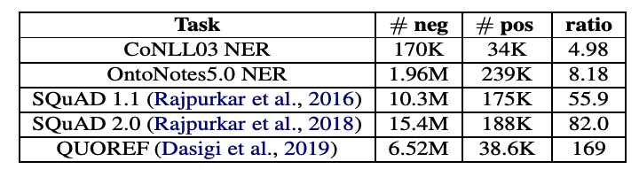

> This post summarizes Li, Xiaoya, et al. "Dice loss for data-imbalanced NLP tasks."[^1] presented at ACL 2020. Due to limited time for writing posts recently, this article focuses briefly on the key content.
>

### Preliminaries

When measuring classification performance for class A among classes A, B, and C:

- Positive examples: Data samples of class A (target class data)
- Negative examples: Data samples of classes B and C (non-target class data)
- Easy-negative examples: Negatives clearly different from A (data easy to predict as negative)
- Hard-negative examples: Negatives similar to A (data that could be confused as positive)
- True positive (TP): Cases predicted as positive that are actually positive
- False positive (FP): Cases predicted as positive that are actually not positive
- False negative (FN): Cases predicted as negative that are actually not negative

- Precision = TP / (TP + FP): The ratio of instances that are actually the target class among those predicted as the target class
- Recall = TP / (TP + FN): The ratio of target class instances correctly classified out of all target class samples. The proportion of positive samples that the classifier correctly detected
- $F_1$ score: The harmonic mean of precision and recall
- $F_\beta$ score: $F_1$ score assigns equal weight to precision and recall, while $F_\beta$ score assigns a specific weight value $\beta$. For details, refer to the [link](https://en.wikipedia.org/wiki/F-score)

##### Focal loss

Focal loss[^3] is a loss function widely used in the object detection task in computer vision. The focal loss formula has the effect of assigning more weight to hard examples than to easy negative examples.

$$
\begin{aligned}
&\text { Cross Entropy }=-\log \left(p_{t}\right) \\
&\text { Focal Loss }=-\left(1-p_{t}\right)^{\gamma} \log \left(p_{t}\right)
\end{aligned}
$$

### Introduction

In NLP tasks, data-imbalanced situations frequently occur where negative examples vastly outnumber positive examples.

<i>Number of positive and negative examples for different data-imbalanced NLP tasks. Taken from Li, Xiaoya, et al.</i>

For the <CoNLL, OntoNotes> NER (named entity recognition) datasets, #neg in the table represents the number of 'O' label data, and #pos represents the count of all other data. (This differs from the negative/positive meaning mentioned in the preliminaries, but since 'O' is always negative, this representation seems to have been used.) In practice, the relatively less important 'O' label accounts for 5 to 8 times more than other labels.

This problem becomes more severe in MRC (machine reading comprehension) tasks. MRC tasks are designed to find the 'start position' and 'end position' of the answer sentence in a passage, so only 2 tokens in the entire document are positive. In the <SQuAD, QUOREF> MRC datasets, negative examples account for more than 55 times the number of positives.

This data-imbalance situation causes the following two problems:

1. **The training-test discrepancy**: CE considers all samples equally, but in data-imbalanced NLP tasks where negatives are abundant (e.g., 'O' label), this diverges from the objective of F1 score at test time.
2. **The overwhelming effect of easy-negative examples**: Since easy-negatives dominate among negatives, the model cannot sufficiently learn the differences between positives and hard-negatives.

To address these two problems, this paper proposes the following methods:

1. **Using Dice loss instead of CE**
   - Dice loss is a soft version of F1 score (I understand that "soft" here means it is designed with probability values, similar to soft-kNN)
   - $\operatorname{DSC}\left(x_{i}\right)=\frac{2 p_{i 1} y_{i 1}}{p_{i 1}+y_{i 1}}$,  $\mathrm{F} 1\left(x_{i}\right)=2 \frac{\mathbb{I}\left(p_{i 1}>0.5\right) y_{i 1}}{\mathbb{I}\left(p_{i 1}>0.5\right)+y_{i 1}}$
2. **Dynamic weight adjusting strategy**: To reduce the influence of easy-negatives during training, a loss term that can assign weights to individual data samples is devised.

### Related Work

##### Data resampling

- Importance sampling: Modifying the data distribution by assigning weights to individual samples
- Boosting: Assigning weights to hard examples (low confidence or misclassified data) in subsequent training
- Downsampling: Sampling less from overwhelming data to balance data ratios
- Oversampling: Generating more of the minority data to balance data ratios (e.g., SMOTE)
- Recent works include methods that assign weights to individual data based on training loss

### Proposed Methods

The authors explained all formulas in a binary classification (class 0 or 1) setting to aid understanding.

##### Notation

- $p_{i0}$: The model's probability for class 0 given the i-th sample as input
- $p_{i1}$: The model's probability for class 1 given the i-th sample as input
- $y_{i0}$: 1 (True) if the i-th sample is class 0, 0 (False) if class 1
- $y_{i1}$: 0 (False) if the i-th sample is class 0, 1 (True) if class 1

##### Sorensen-Dice coefficient

The individual sample-level Sorensen-Dice coefficient (DSC) is defined as follows:
$$
\operatorname{DSC}\left(x_{i}\right)=\frac{2 p_{i 1} y_{i 1}}{p_{i 1}+y_{i 1}}
$$
Adding $\gamma$ to both the numerator and denominator for smoothing purposes, it can be expressed as:
$$
\operatorname{DSC}\left(x_{i}\right)=\frac{2 p_{i 1} y_{i 1}+\gamma}{p_{i 1}+y_{i 1}+\gamma}
$$

##### Dice Loss version 1.

Since a higher DSC value is better, the loss is designed so that the model increases the DSC value. Therefore, by adding a minus sign to the DSC formula, the loss is designed to minimize -DSC.

Additionally, since Milletari et al. (2016) [paper](https://arxiv.org/pdf/1606.04797.pdf)[^4] proposed that changing the denominator to a square form leads to faster convergence, this approach was also adopted.
$$
\mathrm{DL}=\frac{1}{N} \sum_{i}\left[1-\frac{2 p_{i 1} y_{i 1}+\gamma}{p_{i 1}^{2}+y_{i 1}^{2}+\gamma}\right]
$$

##### Dice Loss version 2.

To simplify optimization, the formula was modified to the following form:
$$
\mathrm{DL}=1-\frac{2 \sum_{i} p_{i 1} y_{i 1}+\gamma}{\sum_{i} p_{i 1}^{2}+\sum_{i} y_{i 1}^{2}+\gamma}
$$

##### Self-adjusting Dice Loss

Additionally, to achieve the same effect as focal loss in the DSC formula $\frac{2 p_{i 1} y_{i 1}+\gamma}{p_{i 1}+y_{i 1}+\gamma}$, the DSC formula was modified as follows. Here as well, since -DSC needs to be reduced, a loss of the form 1-DSC is used.
$$
\operatorname{DSC}\left(x_{i}\right)=\frac{2\left(1-p_{i 1}\right)^{\alpha} p_{i 1} \cdot y_{i 1}+\gamma}{\left(1-p_{i 1}\right)^{\alpha} p_{i 1}+y_{i 1}+\gamma}
$$
As a result, a new loss was devised that can reduce both the training-test discrepancy and the influence of easy-negatives.

### Experiments

The following four NLP tasks all have data-imbalance problems.

- POS tagging: Part-of-speech tagging (e.g., noun, verb, adjective)
- NER (named entity recognition): Named entity recognition
- MRC (machine reading comprehension): Finding the optimal answer from sentences in a document given a question
- PI (paraphrase identification): Given two sentences, determining whether they have the same meaning or different meanings

When fine-tuning on these four NLP tasks using a BERT pre-trained LM, the results using CE were compared with the results using the proposed method, and the proposed method achieved the best performance in all cases. Detailed results tables can be found in the paper.

### Conclusion

To summarize this paper:

1. Among NLP tasks, POS tagging, NER, MRC, and PI tasks have severe data-imbalance problems. That is, **negative examples vastly outnumber positive examples**.
2. **Cross-entropy, commonly used in model training, is not a suitable objective** for solving data-imbalance problems.
   - Cross-entropy is an accuracy-oriented measure, and using this objective (CE) in training creates a discrepancy between training and testing.
   - Training is conducted using many easy-negative examples, but test performance relies on F1 score, which is heavily influenced by positive examples.
3. Therefore, **a new loss suitable for data-imbalanced situations is proposed**, along with **a sample-wise weight method** to better account for hard-negatives that are difficult to classify.

Indeed, the data-imbalance problem is an important issue in NLP tasks like NER, and I had thought that training with CE while measuring performance with F1 score was not optimal. This paper seems to have recognized and effectively addressed this problem.

### References

[^1]: Li, Xiaoya, et al. "Dice Loss for Data-imbalanced NLP Tasks." *Proceedings of the 58th Annual Meeting of the Association for Computational Linguistics*. 2020.
[^ 2]: Wikipedia contributors. (2022, January 29). F-score. In *Wikipedia, The Free Encyclopedia*. Retrieved 09:57, February 19, 2022, from https://en.wikipedia.org/w/index.php?title=F-score&oldid=1068716174
[^3]: Lin, Tsung-Yi, et al. "Focal loss for dense object detection." *Proceedings of the IEEE international conference on computer vision*. 2017.
[^4]: Milletari, Fausto, Nassir Navab, and Seyed-Ahmad Ahmadi. "V-net: Fully convolutional neural networks for volumetric medical image segmentation." *2016 fourth international conference on 3D vision (3DV)*. IEEE, 2016
