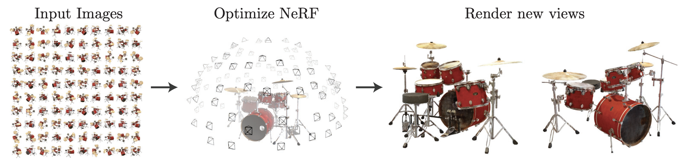
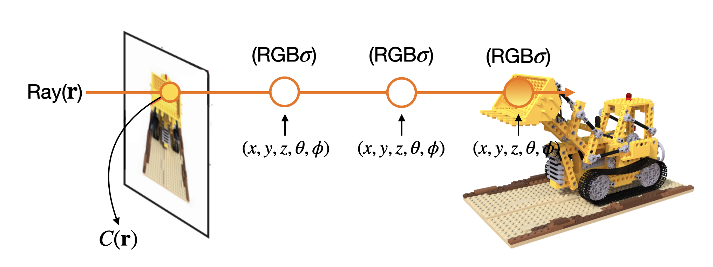
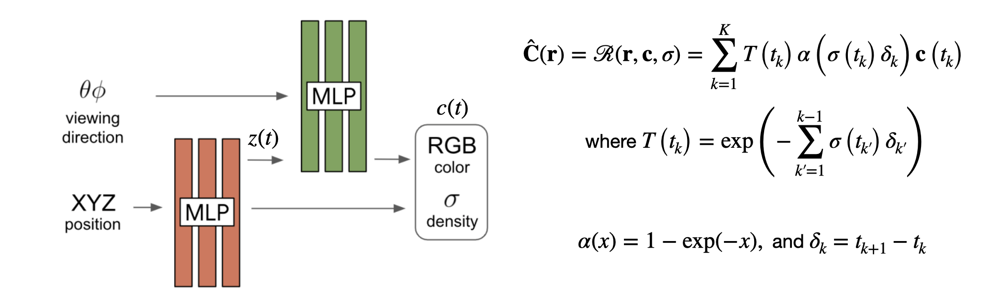
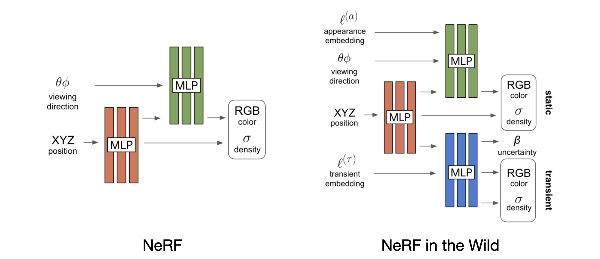
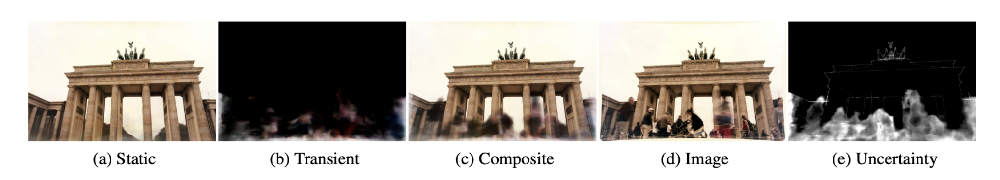
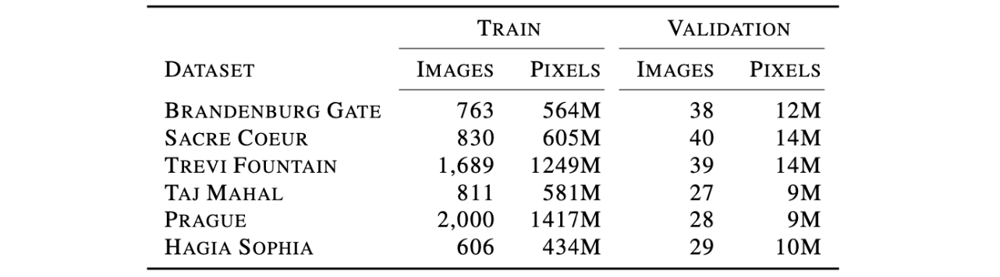
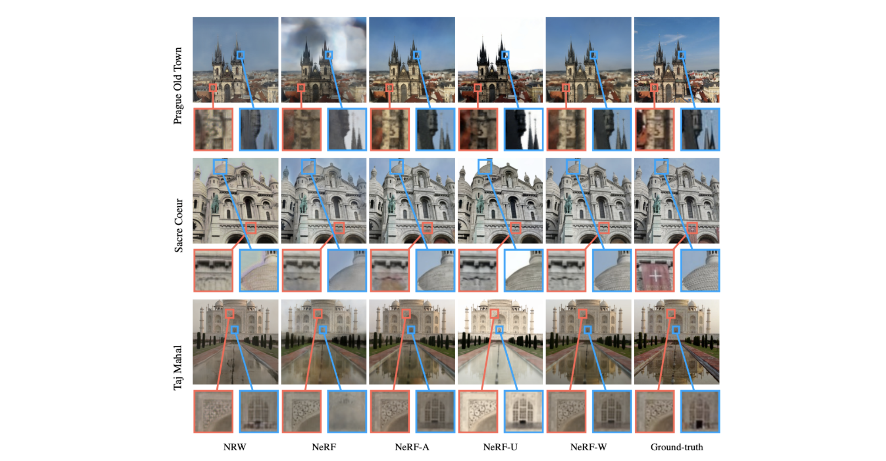
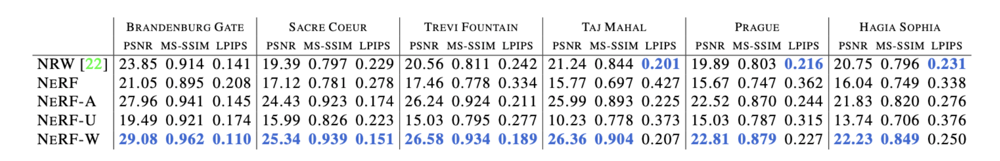

> This post covers NeRF in the Wild (NeRF-W), published by the Google Research team in August 2020 and presented as an oral paper at CVPR 2021. The paper points out that NeRF, an algorithm for the View Synthesis task, cannot handle in-the-wild datasets that contain photometric variations and transient objects, and proposes an advanced version of NeRF to address this limitation.

### Introduction

##### Implicit Neural Representation

A typical neural network model outputs a single value with a specific meaning given a data input. For example, an image recognition model outputs a prediction result such as dog or cat, and a word embedding model outputs a word embedding vector corresponding to the input token -- the model's output carries some specific meaning.

However, implicit neural representation (INR) differs slightly from this. The most representative example commonly cited is a model that takes an image position $(x, y)$ value as input and outputs a pixel $(R,G,B)$ value.

Suppose we represent a single image as a neural network function. Then this function takes a position $(x, y)$ value as input and outputs a pixel $(R,G,B)$ value. While each individual RGB value obtained from the model given a position input does not carry a specific meaning, overall, the image signal information is embedded in a continuous neural network function.

By designing models in this way, we can learn not only images but also physical fields, PDE solvers, 3D object representations, and more. NeRF and NeRF in the Wild (hereafter NeRF-W), which I introduce today, are also representative examples of implicit neural representation.

##### View Synthesis

The task that NeRF and NeRF-W aim to solve is the novel view synthesis task.

Given 2D images taken from various angles of a single scene, the model is trained using the 2D training images, and at test time, the goal is to synthesize images of the scene viewed from new directions never seen during training -- this is the novel view synthesis task.

By training the model on sparsely given training images and synthesizing the views in between, one can create video-like effects from photographs, as shown in this [link](https://www.matthewtancik.com/nerf).

<i>Taken from B. Mildenhall, P. P. Srinivasan, M. Tancik et al.</i>

### NeRF: Neural Radiance Field

NeRF[^2] is an algorithm that solves the novel view synthesis task, using the idea of implicit neural representation. As mentioned earlier, implicit representation can model not only images but also physical fields, and NeRF models what is called a Radiance Field.

Radiance refers to how much light is being reflected when light hits a particular particle. As shown in the figure below, NeRF considers a ray -- a straight line connecting the camera and a point on an object -- and models how much $RGB$ light is being emitted with what density $\sigma$ at each $(x,y,z,\theta,\phi)$ coordinate of particles along the ray.

After computing all $RGB\sigma$ values for each coordinate along the ray, performing a weighted sum of all $RGB$ values of particles along the ray direction, proportional to the density $\sigma$, enables rendering a single pixel $RGB$ value in the image.

Expressing this in equation form:
$$
C(\mathbf{r})=\int_{t_{n}}^{t_{f}} T(t) \sigma(\mathbf{r}(t)) \mathbf{c}(\mathbf{r}(t), \mathbf{d}) d t, \text { where } T(t)=\exp \left(-\int_{t_{n}}^{t} \sigma(\mathbf{r}(s)) d s\right)
$$
$c$ is color and $\sigma$ is density. And $T$ represents how much other particles are interfering between the camera and the particle at point $t$.

Looking at the $T$ formula, it is the value obtained by integrating the density of other particles between the particle at point $t$ and $t_n$, then taking the negative exponential. It means that the density between $t_n$ and $t$ must not be high for the color at point $t$ to be significantly considered. This can be understood as: the color at the target point can only be substantially reflected if there are no obstacles between the camera and the target particle.

The architecture uses an MLP structure, where $(x, y, z)$ is used to obtain $\sigma$ and a $z(t)$ embedding vector, and $\theta, \phi, z(t)$ are used to obtain $RGB$.

The original rendering formula contains an integral term, but since integral terms cannot be used in neural network computation, it was changed to a quadrature using $\Sigma$ in the rendering equation. You can see that the $\sigma$ value has been changed to a value using $\alpha$, which references Max, N. "Optical models for direct volume rendering."[^1].

The loss uses squared l2 loss so that the ground truth pixel $RGB$ and predicted pixel $RGB$ match. The reason there are two squared l2 loss terms is due to the hierarchical volume sampling method used in NeRF, which will be briefly covered at the end of this post.
$$
\text { Loss }=\sum_{i j}\left\|\mathbf{C}\left(\mathbf{r}_{i j}\right)-\hat{\mathbf{C}}^{c}\left(\mathbf{r}_{i j}\right)\right\|_{2}^{2}+\left\|\mathbf{C}\left(\mathbf{r}_{i j}\right)-\hat{\mathbf{C}}^{f}\left(\mathbf{r}_{i j}\right)\right\|_{2}^{2}
$$
Up to this point, we have covered NeRF, which is a prior work of NeRF in the Wild. From here, we discuss NeRF in the Wild.

### NeRF in the Wild

##### Motivation

The original NeRF only works well in highly controlled environments, with two fundamental constraints.

The first is that all camera images of a scene must be taken nearly simultaneously so that the lighting effects across all images are consistent. Since modeling the radiance field well is NeRF's core idea, this is arguably a natural constraint.

The second is that all objects in the scene must be static. That is, only the camera's position and direction change, while objects within the scene must not move. Objects that move or change are called transient, and such transient elements must not exist.

If these two conditions are not met, NeRF's novel view synthesis performance degrades significantly. However, in the real world, satisfying these two constraints is not easy. Depending on weather, camera settings, and other factors, the lighting effects of images can vary, and transient objects such as pedestrians or vehicles may appear in photographs.

Therefore, the authors of NeRF-W[^3] extended the original NeRF to handle photometric variations and transient objects. They report that by applying their proposed algorithm to photographs of famous buildings obtained from the internet, they were able to create a NeRF that works in real-world scenarios.

Let us examine the overall model architecture of NeRF-W. An appearance embedding and a transient component part have been added to the original NeRF architecture.

<i>Figure 3: NeRF-W model architecture taken from Martin-Brualla, Ricardo, et al.</i>

##### Latent Appearance Modeling

First, the appearance embedding is explained. This is a method for handling photometric variation, and borrows the idea of Generative Latent Optimization (GLO)[^4].

GLO replaces the random noise that was provided as a latent vector in generative networks with learnable parameters, removing the discriminator. It creates a learnable latent vector per individual image and optimizes the generator and latent variable together, which can be viewed as an "encoderless" autoencoder or a "discriminator-less" GAN. NeRF-W similarly creates per-image latent vectors and optimizes them along with the rest of the model.

By adding appearance embedding, the radiance output that was image-independent in the original NeRF becomes image-dependent. Therefore, the scene now has degrees of freedom not only for geometry information but also for the camera settings of individual images, weather, atmosphere, and so forth.
$$
\begin{gathered}
\hat{\mathbf{C}}_{i}(\mathbf{r})=\mathcal{R}\left(\mathbf{r}, \mathbf{c}_{i}, \sigma\right) \\
\mathbf{c}_{i}(t)=\operatorname{MLP}_{\theta_{2}}\left(\mathbf{z}(t), \gamma_{\mathbf{d}}(\mathbf{d}), \ell_{i}^{(a)}\right)
\end{gathered}
$$

##### Transient Objects

To handle transient objects, the authors add $MLP_{\theta_3}$, which can render occluders separately -- that is, it outputs the color and density of transient objects.

Similar to the appearance embedding, per-image transient embeddings are created for this network and passed as input along with z(t) to extract the color and density of transient elements.

<i>Figure 4. taken from Martin-Brualla, Ricardo, et al.</i>

As shown in the figure, the model's static component renders only static elements without occluders, while the transient component renders the occluders. The composite image combining both becomes similar to the actual training ground truth image. Rather than creating two separate images for static and transient and then adding them together, the rendering equation is formulated to combine them from the start.

$$
\begin{gathered}
\hat{\mathbf{C}}_{i}(\mathbf{r})=\sum_{k=1}^{K} T_{i}\left(t_{k}\right)\left(\alpha\left(\sigma\left(t_{k}\right) \delta_{k}\right) \mathbf{c}_{i}\left(t_{k}\right)+\alpha\left(\sigma_{i}^{(\tau)}\left(t_{k}\right) \delta_{k}\right) \mathbf{c}_{i}^{(\tau)}\left(t_{k}\right)\right) \\
\text { where } T_{i}\left(t_{k}\right)=\exp \left(-\sum_{k^{\prime}=1}^{k-1}\left(\sigma\left(t_{k^{\prime}}\right)+\sigma_{i}^{(\tau)}\left(t_{k^{\prime}}\right)\right) \delta_{k^{\prime}}\right)
\end{gathered}
$$
However, $MLP_{\theta_3}$ additionally outputs an uncertainty $\beta$ value beyond color and density.

Under the assumption that not all pixels are equally reliable in loss computation, the authors scale the loss based on the uncertainty value output by the transient component. Since learning the static elements well is far more important than learning obstacle information well, the loss for pixels with high uncertainty is set to be less reflected. Therefore, the loss equation is written as follows:

$$
L_{i}(\mathbf{r})=\frac{\left\|\mathbf{C}_{i}(\mathbf{r})-\hat{\mathbf{C}}_{i}(\mathbf{r})\right\|_{2}^{2}}{2 \beta_{i}(\mathbf{r})^{2}}+\frac{\log \beta_{i}(\mathbf{r})^{2}}{2}+\frac{\lambda_{u}}{K} \sum_{k=1}^{K} \sigma_{i}^{(\tau)}\left(t_{k}\right)
$$
First, the first and second terms of the loss are identical to the negative log likelihood of a normal distribution with $C_i$ as the mean and $\beta_i^2$ as the variance. (It is not exactly identical since $\frac{1}{2} \log(2\pi)$ should be added, so it can be called a shifted negative log likelihood.)

The idea is to view a single pixel value as a normal distribution with mean $C_i$ and variance $\beta_i^2$, and design the loss to maximize the log likelihood of this normal distribution. While the rendered predicted pixel color should basically be close to the ground truth pixel color, if the uncertainty $\beta$ value is large, then the predicted pixel color is allowed to deviate somewhat from the ground truth. This appears to incorporate the Bayesian principle that higher variance in a normal distribution indicates higher uncertainty into the loss equation. Since it is a loss, it is designed to minimize negative log likelihood rather than maximize log likelihood.

The third term is an L1 regularizer on the transient density. When explaining transient rendering above, I glossed over it as if the transient part naturally separates and renders only the occluders excluding the static elements. In reality, since there is no supervision, it would not be easy for the transient component to learn to render only transient objects. Therefore, the authors state that they used L1 regularizer for the third term to prevent the transient density from explaining static phenomena.

L1 regularizer has the effect of keeping important values and driving unimportant values to 0. Therefore, applying L1 regularizer to the transient density is intended to drive the density to 0 for all parts except those important for transient rendering, so that most of the rendered pixels become RGB=0, and even when the transient component is removed during testing, the important parts of the static component are preserved.

As in NeRF, the model is duplicated into a coarse model and a fine model, and both are optimized simultaneously. However, in NeRF-W, the coarse model was not created for the transient component.
$$
\text { NeRF-W loss }=\sum_{i j} L_{i}\left(\mathbf{r}_{i j}\right)+\frac{1}{2}\left\|\mathbf{C}\left(\mathbf{r}_{i j}\right)-\hat{\mathbf{C}}_{i}^{c}\left(\mathbf{r}_{i j}\right)\right\|_{2}^{2}
$$

### Experiments

##### Phototourism dataset

<i>Table 2: Number of images and pixels per Phototourism scene taken from Martin-Brualla, Ricardo, et al.</i>

The dataset was obtained from actual online photo-sharing sites, and images where occluders occupied more than 80% were removed during preprocessing. The training and test data were split manually because while training data can have many transient elements, the test objective is to synthesize only the static elements well with minimal photometric variation and no transient objects. Therefore, only images without transient elements and with minimal photometric effects were selected for testing.

Since the camera $(x,y,z,\theta,\phi)$ information is not actually available, estimated values were obtained using COLMAP, an algorithm that constructs 3D information from 2D images.

##### Qualitative result

<i>Figure 7: Qualitative results on the Phototourism dataset taken from Martin-Brualla, Ricardo, et al.</i>

NRW is one of the prior works called Neural Rendering in the Wild, NeRF-A is NeRF-W without the transient component, and NeRF-U is NeRF-W without the appearance embedding.

The authors confirmed that NeRF does not work well on real-world data, that without the transient component high-frequency details are not well captured, and that without appearance embedding photometric effects cannot be captured. Thus, they verified that each model component functions as hypothesized in the paper. Video results can be viewed at this [link](https://nerf-w.github.io/).

##### Quantitative results

Hyperparameters were selected to maximize PSNR. During testing, only the static part was used for rendering, excluding the transient and uncertainty parts.

An unavoidable aspect for quantitative evaluation was that since NeRF-W's appearance embedding is optimized per individual image, appearance embedding optimization also needed to be performed for test images to properly reflect photometric effects. Therefore, the left half of each image was used to optimize the appearance embedding and the right half was used for evaluation. NeRF-W performed well across most cases.

<i>Table 1: Quantitative results on the Phototourism dataset taken from Martin-Brualla, Ricardo, et al.</i>

### Conclusion

NeRF-W was able to handle photometric variation by learning per-image latent embeddings, and also proposed an architecture that can decompose static and transient elements.

A thought that came to mind while reading the paper is that -- this is actually a limitation of NeRF itself -- it is unfortunate that the camera $(x,y,z,\theta,\phi)$ information must be fully provided for the algorithm to work. Although this paper used estimated values through COLMAP, it would be even better if NeRF could work with just images. Looking into this, I found a related algorithm called Self-Calibrating Neural Radiance Fields that jointly learns NeRF and camera viewpoints, which seems worth examining together.

Additionally, it was somewhat surprising yet not fully understood how the static and transient components are separated and rendered so well without any supervision.

### Appendix

NeRF uses two tricks for model training: positional encoding and hierarchical volume sampling.

Positional encoding is the process of increasing the dimensionality of the model input $(x,y,z,\theta,\phi)$, since the input is low-dimensional (5 or 6 dimensions).

Hierarchical volume sampling improves sample efficiency in NeRF training by duplicating the model into two networks -- a coarse model and a fine model. The coarse network samples points along the ray from a uniform distribution, and then the density distribution information from the coarse network is used to determine the quadrature sampling points for the fine network. The strategy is to sample more from regions with high density, since information from high-density areas is more important for pixel rendering.

### References

[^1]:Max, Nelson. "Optical models for direct volume rendering." *IEEE Transactions on Visualization and Computer Graphics* 1.2 (1995): 99-108
[^2]: Mildenhall, Ben, et al. "Nerf: Representing scenes as neural radiance fields for view synthesis." *European conference on computer vision*. Springer, Cham, 2020.
[^3]: Martin-Brualla, Ricardo, et al. "Nerf in the wild: Neural radiance fields for unconstrained photo collections." *Proceedings of the IEEE/CVF Conference on Computer Vision and Pattern Recognition*. 2021.
[^4]: Bojanowski, Piotr, et al. "Optimizing the Latent Space of Generative Networks." *International Conference on Machine Learning*. PMLR, 2018.
