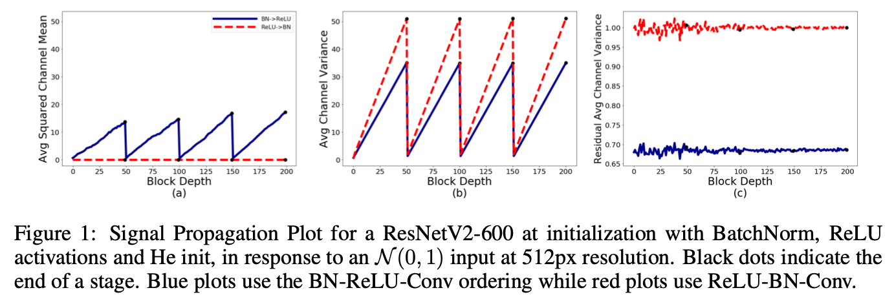

> This post reviews two Normalizer-Free ResNets papers published by DeepMind in 2021. While BatchNorm has several issues, it has been continuously used due to its significant impact on model performance. These papers propose methods that maintain performance even without BatchNorm.

### Introduction

BatchNorm is a type of normalization layer used in most models with convolutional layers. First proposed in 2015, the detailed formula can be found in a [previous blog post](https://yuhodots.github.io/deeplearning/21-05-19/).

Using BatchNorm has advantages such as fast convergence early in training and significantly improved performance for models using convolutional layers. However, since it is dependent on batch size, performance issues arise when the batch size is very large or very small. Additionally, the running mean and variance within BatchNorm create differences in model behavior between training and inference, which can lead to implementation errors when using BatchNorm without proper understanding.

Although alternative normalization methods such as LayerNorm, InstanceNorm, and GroupNorm have been proposed as alternatives to BatchNorm, each has its own drawbacks, and BatchNorm still shows superior performance. Thus, no method has been proposed that can completely replace BatchNorm.

Therefore, this paper aims to address these issues by proposing methods that maintain model performance comparable to using BatchNorm while not actually using it.

### NF-ResNets[^1]

##### Signal Propagation Plot (SPP)

The authors first analyzed existing ResNets by feeding random Gaussian or actual training images as input and visualizing the statistics of hidden activations. They introduce this as Signal Propagation Plots (SPPs), which helped identify bugs during training and gain insights for designing NF-ResNets.

There are three types of plots in SPP. (Tensor dimensions are denoted as $NHWC$.)

1. Average Channel Squared Mean: The mean of $NHW$ activation values is squared, then averaged over the $C$ axis. The squaring step is necessary because different channels $C$ may have opposite signs. This value is assumed to be close to 0 when the network has good signal propagation.
2. Average Channel Variance: The variance of $NHW$ activation values is computed, then averaged over the $C$ axis. This value is used to observe signal explosion or attenuation.
3. Average Channel Variance on the end of the residual branch: The variance of the residual branch activation values before merging with the skip path is observed. This value is used to verify whether the residual branch is properly initialized.

<i>Taken from Brock, Andrew, Soham De, and Samuel L. Smith.</i>

Various SPP experiments were conducted, and the paper introduces two representative cases. The first is the most commonly used ResNet with BN-RELU-Conv order, and the second is the less commonly used ResNet with RELU-BN-Conv order.

For reference, the input to the $\ell^{\text{th}}$ block is denoted as $x_\ell$, the $\ell^{\text{th}}$ residual branch as $f_\ell$, and the residual block as $x_{\ell+1}=f_{\ell}\left(x_{\ell}\right)+x_{\ell}$. The model input in experiments uses a unit Gaussian distribution, and the observed phenomena are as follows:

1. Average Channel Variance values increase linearly with depth. This phenomenon occurs because variance satisfies $\text{Var}(x_{\ell + 1}) = \text{Var}(x_{\ell}) + \text{Var}(f_\ell(x_\ell))$. At transition blocks, variance is reset close to 1 because transition blocks use normalized convolution operations instead of skip paths.
   - In the RELU-BN-Conv structure, when a skip path exists, the variance equation can be thought of as $\text{Var}(x_{\ell + 1}) = \text{Var}(x_{\ell}) + 1$.
2. In the BN-RELU-Conv structure, Average Channel Squared Mean increases linearly due to RELU. This phenomenon is called "mean-shift," and simply removing the normalization layer in this structure causes problems. More detailed reasons are explained in the next section.
3. In contrast, in the RELU-BN-Conv structure, normalization is performed after RELU, which avoids the mean-shift problem, and $\text{Var}(f_{\ell}(x_\ell)) \approx 1$ can be achieved for all $\ell$.

##### Normalizer-Free ResNets

Looking at the SPP results from ResNet:

1. We can see that BatchNorm plays the role of downscaling the input of residual blocks proportionally to the standard deviation of the input signal,
   - because the input that came in as $\text{Var}(x_{\ell})$ is reduced to 1 (RELU-BN-Conv order) or 0.68 (BN-RELU-Conv order) after passing through BN.
2. We can see that residual blocks increase the signal's variance by a constant amount.

Based on these two insights from SPP, the authors design the initialization formula for the residual block of NF-ResNets (with BN removed) as follows:
$$
x_{\ell+1}=x_{\ell}+\alpha f_{\ell}\left(x_{\ell} / \beta_{\ell}\right)
$$

1. Since $\text{Var}(f_{\ell}(z)) = \text{Var}(z)$ should hold for the residual branch, the input $x_\ell$ to the residual branch is divided by a fixed scalar $\beta_\ell = \sqrt{\text{Var}(x_\ell)}$.
2. $\alpha$ is a scalar hyperparameter that controls the degree of variance growth between blocks.
3. The phenomenon of variance being reset to 1 at transition layers is handled by using $(x_\ell/\beta_\ell)$ instead of $x_\ell$ at the transition layer to reset it to 1.

While this initialization was expected to produce SPP results identical to those with BatchNorm, two unexpected problems actually occurred:

1. Average Channel Squared Mean values increased very rapidly with depth ("mean shift")
2. As seen in the BN-RELU-Conv ResNet results, Average Channel Variance on the end of the residual branch had values less than 1.

The authors conducted experiments with ResNet structures without RELU for cause analysis. They confirmed that Average Channel Squared Mean values remained close to 0 at all block depths, which led them to question why ResNets with RELU activation experience the mean shift phenomenon.

First, consider the transformation $z=Wg(x)$.

$W$ is arbitrary and fixed, and $g(\cdot)$ denotes an activation function. When the statistics of activation $g(x)$ are $\mathbb{E}\left(g\left(x_{i}\right)\right)=\mu_{g} $ and $\operatorname{Var}\left(g\left(x_{i}\right)\right)=\sigma_{g}^{2}$, the expected mean and variance of single unit $i$ of the output $z_{i}=\sum_{j}^{N} W_{i, j} g\left(x_{j}\right)$ are computed as follows. ($j$ denotes the input index so $N$ can be seen as fan-in, and $i$ denotes the output index.)
$$
\mathbb{E}\left(z_{i}\right)=N \mu_{g} \mu_{W_{i, \cdot}}, \quad \text { and } \quad \operatorname{Var}\left(z_{i}\right)=N \sigma_{g}^{2}\left(\sigma_{W_{i, \cdot}}^{2}+\mu_{W_{i, .}}^{2}\right)
$$

$$
\mu_{W_{i, \cdot}}=\frac{1}{N} \sum_{j}^{N} W_{i, j}, \quad \text { and } \quad \sigma_{W_{i, \cdot}}^{2}=\frac{1}{N} \sum_{j}^{N} W_{i, j}^{2}-\mu_{W_{i,}}^{2}
$$

If $g(\cdot)$ is the RELU activation function $g(x) = \max(x,0)$ and $x_i \sim N(0,1)$ for all $i$, then $\mu_g$ becomes $1/\sqrt{2\pi}$. That is, if $\mu_{W_i}$ is non-zero, then since $\mu_g > 0$, the output $z_i$ of the transformation will also have a non-zero mean.

Even though we sample the parameter $W$ from a zero-centered distribution, the actual empirical mean is non-zero in most cases, and consequently the output of the residual branch often has a non-zero mean value. (I found this is related to measure theory, but I haven't studied it in more detail.) Therefore, the authors argue that this is the cause of model instability in NF-ResNets using He-initialized weights.

##### Scaled Weight Standardization (Scaled WS)

To solve this problem, this paper uses Scaled Weight Standardization (Scaled WS), a modification of Weight normalization[^3]. Convolutional parameters are re-parameterized using the following formula:

$$
\hat{W}_{i, j}=\gamma \cdot \frac{W_{i, j}-\mu_{W_{i, \cdot}}}{\sigma_{W_{i,},} \sqrt{N}}
$$

- $\gamma$ is a fixed constant.
- This constraint is maintained throughout the training process.
- The reason for computing mean and variance over fan-in is that input activations are multiplied by the $j$-axis values of the weight matrix $W_{i,j}$ to produce $i$ outputs, so standardization must be performed to eliminate the $j$ axis.

Since Scaled WS performs standardization using empirical mean and variance, $\mathbb{E}(z_i) = 0$ for $z=\hat W g(x)$, thus eliminating the mean shift phenomenon. Furthermore, by setting an appropriate $\gamma$ according to $g$ for $\text{Var}(z_i) = \gamma^2\sigma^2_g$, variance preservation is also possible. The SPP results confirm that Average Channel Squared Mean does not increase, and Figure 2 in the paper shows that the SPP output takes the same form as the RELU-BN-Conv structure.

##### Determining Nonlinearity-Specific Constants

$\gamma$ must be carefully selected so that variances of the hidden activations on the residual branch are close to 1 at initialization, and this value can be obtained through mathematical computation.

When an input $x$ is sampled from $\mathcal N(0,1)$, the variance of the RELU output is computed as $\sigma_{g}^{2}=(1 / 2)(1-(1 / \pi))$[^4]. Therefore $\text{Var}(\hat W g(x))=\gamma^2\sigma^2_g$, and to set $\text{Var}(\hat W g(x))$ to 1, we use $\gamma=1 / \sigma_{g}=\frac{\sqrt{2}}{\sqrt{1-\frac{1}{\pi}}}$.

Additional methods used can be found in Appendix C of the paper.

##### Experimental results

The NF-ResNets method, which removes BatchNorm from ResNet, achieved performance comparable to BN-ResNets, and with the addition of stochastic depth and dropout, NF-ResNets showed better performance than BN-ResNets.

Since the structure has no BatchNorm at all, when the batch size was set very small (such as 8 or 4), BN-ResNets' performance collapsed, but NF-ResNets was able to maintain performance.

### NF-ResNets for Large-Scale Datasets[^2]

So far, we've introduced the paper "Characterizing signal propagation to close the performance gap in unnormalized ResNets" published at ICLR 2021.

In this section, we briefly introduce the paper "High-performance large-scale image recognition without normalization" by the same authors, which identifies problems when applying NF-ResNets to large-scale datasets and proposes methods to overcome them.

##### Limitations of NF-ResNets

The NF-ResNets introduced above has several limitations.

- It cannot train stably with large learning rates or strong data augmentation.
- This makes it difficult to apply to large-scale dataset experiments. While it reaches BN-ResNet performance up to batch size 1024, performance degrades at batch sizes of 4096 or larger. Therefore, it couldn't match the performance of EfficientNets, which was SOTA at the time.

##### Adaptive Gradient Clipping (AGC)

Standard gradient clipping works by clipping when the gradient norm exceeds a hyperparameter $\lambda$.
$$
G \rightarrow \begin{cases}\lambda \frac{G}{\|G\|} & \text { if }\|G\|>\lambda \\ G & \text { otherwise }\end{cases}
$$

However, it was experimentally discovered that training stability is very sensitive to this $\lambda$ value, so this paper proposes Adaptive Gradient Clipping (AGC) to overcome this.

$\left\|W^{\ell}\right\|_{F}=\sqrt{\sum_{i}^{N} \sum_{j}^{M}\left(W_{i, j}^{\ell}\right)^{2}}$ denotes the Frobenius norm, and checking $\frac{\left\|G^{\ell}\right\|_{F}}{\left\|W^{\ell}\right\|_{F}}$ provides a rough idea of how much a single gradient descent step will change the original weight $W$. For example, in the case of SGD without momentum, where $h$ is the learning rate, it means $\frac{\left\|\Delta W^{\ell}\right\|}{\left\|W^{\ell}\right\|}=h \frac{\left\|G^{\ell}\right\|_{F}}{\left\|W^{\ell}\right\|_{F}}$.

Intuitively, if $\left(\left\|\Delta W^{\ell}\right\| /\left\|W^{\ell}\right\|\right)$ becomes too large, weights would change too drastically and training would become unstable. Therefore, the authors decided to use $\frac{\left\|G^{\ell}\right\|_{F}}{\left\|W^{\ell}\right\|_{F}}$ as the criterion for gradient clipping. They found that unit-wise norm ratios performed better than layer-wise norm ratios, ultimately adopting the following clipping scheme. ($\left\|W_{i}\right\|_{F}^{\star}$ denotes $\max \left(\left\|W_{i}\right\|_{F}, \epsilon\right)$.)
$$
G_{i}^{\ell} \rightarrow \begin{cases}\lambda \frac{\left\|W_{i}^{\ell}\right\|_{F}^{\star}}{\left\|G_{i}^{\ell}\right\|_{F}} G_{i}^{\ell} & \text { if } \frac{\left\|G_{i}^{\ell}\right\|_{F}}{\left\|W_{i}^{\ell}\right\|_{F}^{\star}}>\lambda \\ G_{i}^{\ell} & \text { otherwise }\end{cases}
$$

Using AGC enabled NF-ResNets to train stably even at large batch sizes of 4096 and above, and there were no issues when using strong data augmentation methods like RandAugment.

---

*I found code implementing SPPs and NF-ResNets in PyTorch and verified the results [here](https://github.com/yuhodots/SPPs)! Currently, the NF-ResNet101 isn't producing the expected results, so it seems I might be missing something...*

### References

[^1]:Brock, Andrew, Soham De, and Samuel L. Smith. "Characterizing signal propagation to close the performance gap in unnormalized ResNets." ICLR 2021.
[^2]: Brock, Andy, et al. "High-performance large-scale image recognition without normalization." *International Conference on Machine Learning*. PMLR, 2021.
[^3]: Salimans, Tim, and Durk P. Kingma. "Weight normalization: A simple reparameterization to accelerate training of deep neural networks." *Advances in neural information processing systems*29 (2016).
[^4]: Devansh Arpit, Yingbo Zhou, Bhargava Kota, and Venu Govindaraju. Normalization propagation: A parametric technique for removing internal covariate shift in deep networks. In *International Conference on Machine Learning*, pp. 1168–1176, 2016
