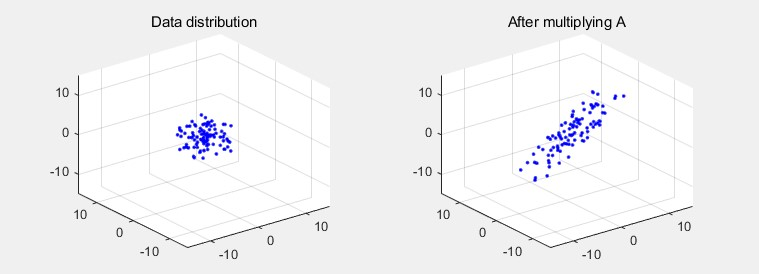
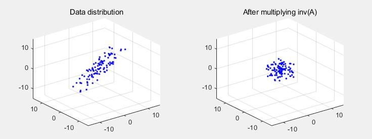
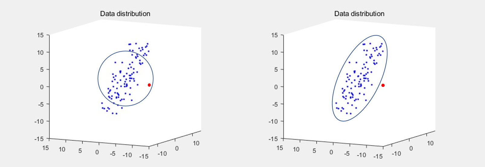

> Mahalanobis distance is a useful tool for computing distances while taking data distribution into account. Understanding the formula requires knowledge of what the covariance matrix and its inverse represent, so this post explains and visualizes Mahalanobis distance step by step.

### Inverse matrix

For some data distribution $D_a$, multiplying by a matrix $A$ gives the most fundamental form of linear algebra: $AD_a = B$. The left side of the image represents $D_a$, the data distribution, and the right side shows the result ($B$) of applying a linear transformation $A$ to this data distribution.

Conversely, multiplying a data distribution $D_b$ by $A^{-1}$ can be interpreted as reverting the data distribution back to its state before the transformation $A$.

### Variance and Covariance

**Variance** measures how far data is spread from the expected value along a single axis.
$$
\begin{aligned}
Var[X]
&= \mathbb E[(X-\mathbb E[X])^2] = \mathbb E[(X-\mu)^2]
\end{aligned}
$$
**Covariance** is a value that represents the **correlation** between two axes in the data. For example, when observing a 2-dimensional data distribution, if the data shows an increasing trend along the x-axis while also increasing along the y-axis, it has a positive covariance value.
$$
\begin{aligned}Cov[X,Y] &= \mathbb E[(X-\mathbb E[X])(Y-\mathbb E[Y])] = \mathbb E[(X-\mu_x)(Y-\mu_y)] \end{aligned}
$$
Let's examine the **covariance matrix** with a 2-dimensional (having x and y axes) data example.
$$
D (\mu = 0, v=0) = \begin{bmatrix}
-6 & 8 \\
4 & -10\\
2 & 2
\end{bmatrix} \\
Then, D^TD = \begin{bmatrix}
Cov(X,X) & Cov(X,Y) \\
Cov(Y,X) & Cov(Y,Y)
\end{bmatrix}
= \begin{bmatrix}
56 & -84 \\
-84 & 168
\end{bmatrix}
$$
Looking at the formula, we can see that the covariance matrix is 'a matrix containing covariance information for all pairs of axes across all axes of the data.' This ultimately serves to describe the overall shape of data in space.

### Mahalanobis distance

The simplest tool for measuring similarity between two points is Euclidean distance. However, depending on how the data is distributed, measuring similarity with Euclidean distance may not yield good performance. Consider the image below as an example.

The left side of the image shows points within Euclidean distance $d$ from the mean of the data distribution. (The radius of the circle is $d$.) In the left image, the red point actually belongs to a different class from the blue points, yet it could be incorrectly inferred to have a higher probability of being the blue data class than the blue points located at the periphery.
$$
d(\vec{x},\vec{y}) = \sqrt{(\vec{x}-\vec{y})^T(\vec{x}-\vec{y})}
$$
While the spatial separation shown on the right seems more logical, the Euclidean distance formula doesn't consider how data is distributed in space (to be precise, it assumes the data distribution is Gaussian), making it impossible to achieve similarity measurements like the right image.

For such problem situations, we can use Mahalanobis distance to compute distances considering data distribution. The formula is as follows:
$$
d(\vec{x},\vec{y}) = \sqrt{(\vec{x}-\vec{y})^T\Sigma^{-1}(\vec{x}-\vec{y})}
$$
The form is identical to the Euclidean distance formula, except that the **inverse of the covariance matrix** is inserted in the middle. Understanding what the inverse of the covariance matrix means can be aided by the inverse matrix explanation at the very beginning of this post.

The covariance matrix describes the shape and spread of data in space. Taking the inverse of this covariance matrix and inserting it into the distance calculation formula means that values previously measured by Euclidean distance are stretched or compressed according to the data distribution shape. In other words, it tolerates some spread of data along directions with large covariance, while restricting data from spreading too much along directions with small covariance.

### Mahalanobis distance for singular covariance matrix

However, Mahalanobis distance cannot be applied to all data. If the covariance matrix of our data is a singular matrix, we cannot compute the inverse of the covariance matrix and thus cannot use Mahalanobis distance.

Let the zero-centered dataset be $\tilde X$, and when $\tilde X$ is an $n \times m$ matrix, if $n$ is smaller than $m$, the covariance matrix of that dataset has no inverse. Expanding the covariance matrix formula using Singular Value Decomposition gives $\tilde X^\top \tilde X = VS^\top U^\top U S V^\top = V S^\top S V^\top$, where the $m \times m$ matrix $S^\top S$ is not full-rank and therefore not invertible. Consequently, when the number of data samples $n$ is smaller than the feature dimension $m$, the inverse of the covariance matrix does not exist. However, this situation occurs very frequently in practice, which is why Mahalanobis distance is not commonly used for solving real-world problems.

That said, there are still ways to utilize the idea of Mahalanobis distance.

##### 1. Diagonal Mahalanobis distance

The simplest method is to use only the diagonal terms (variance terms) of the covariance matrix.

Keeping only the variance terms from the covariance matrix results in $\sigma = \begin{bmatrix}
    d_1 & 0 & \dots  & 0 \\
    0 & d_2  & \dots  & 0 \\
    \vdots & \vdots  & \ddots & \vdots \\
    0 & 0  & \dots  & d_m
\end{bmatrix}$, an $m \times m$ matrix, and its inverse $\sigma^{-1} = \begin{bmatrix}
    1/d_1 & 0 & \dots  & 0 \\
    0 & 1/d_2  & \dots  & 0 \\
    \vdots & \vdots  & \ddots & \vdots \\
    0 & 0  & \dots  & 1/d_m
\end{bmatrix}$ is placed at the $\Sigma^{-1}$ position in the Mahalanobis distance formula. However, since all covariance terms from the original matrix are removed, this cannot be considered a distance calculation that fully accounts for data distribution.

##### 2. Mahalanobis distance with Moore-Penrose inverse

The second method uses the Moore-Penrose inverse (pseudo inverse).

The Moore–Penrose inverse is useful as a substitute for the inverse when solving linear systems of the form $A\mathrm  x =\mathrm b$ where $A$ is a singular matrix. First, applying Singular Value Decomposition to $A$ yields:
$$
A \mathrm x = b \\
U S V^\top \mathrm  x =\mathrm b \\
V S ^{-1} U^\top U S V^\top \mathrm  x =V S ^{-1} U^\top \mathrm b \\
\mathrm x = V S ^{-1} U^\top \mathrm b := A^+ \mathrm  b
$$
If $A$ is an invertible matrix, we can obtain the solution $\mathrm x$ as $A^{-1}\mathrm b = V S ^{-1} U^\top \mathrm b$, but if $A$ is not invertible, we can obtain the solution $A^+\mathrm b = V S ^+ U^\top \mathrm b$ instead. When $S = \text{diag}_{n,m}(\lambda_1, \cdots, \lambda_{\min\{ n, m \}})$, $S^+ = \text{diag}_{m,n}(\lambda_1^+, \cdots, \lambda^+_{\min\{ n, m \}})$ where $\lambda^+=
\begin{cases}
    \lambda^{-1},& \lambda \neq 0 \\
    0,              & \lambda = 0
\end{cases}$, and $A^+ = VS^+U^\top$ is called the Moore–Penrose inverse of $A$.

Now let's apply the Moore–Penrose inverse to computing the inverse of the covariance matrix. Since the covariance matrix $\Sigma$ is symmetric, i.e., orthogonally diagonalizable, it can be written as $P^\top D P$ (where P is an orthogonal matrix). The matrix not being invertible means that the matrix $D$ has the form $D = \begin{bmatrix}
    d_1 & 0 & \dots  & 0 \\
    0 & d_2  & \dots  & 0 \\
    \vdots & \vdots  & \ddots & \vdots \\
    0 & 0  & \dots  & 0
\end{bmatrix}$, indicating that eigenvalues of 0 exist (positive semi-definite). Therefore, computing the inverse of $D$ in the covariance matrix inverse $\Sigma ^{-1} = (P ^\top D P)^{-1}$ becomes impossible. However, similar to $S^+$ in the Moore–Penrose inverse formula mentioned above, we can use $D^+ = \begin{bmatrix}
    1/d_1 & 0 & \dots  & 0 \\
    0 & 1/d_2  & \dots  & 0 \\
    \vdots & \vdots  & \ddots & \vdots \\
    0 & 0  & \dots  & 0
\end{bmatrix}$ instead of $D^{-1}$. Consequently, we can apply $\Sigma ^+ = P ^\top D^+ P$ instead of $\Sigma ^{-1}$ in the Mahalanobis distance formula. Thinking about what this method means, it can be understood as completely excluding feature axes with eigenvalue 0 from the distance calculation (since the information on that axis is multiplied by 0 and disappears).

##### 3. Regularized covariance

Finally, there is a method to convert a positive semi-definite covariance matrix to a positive definite one.

A positive semi-definite $m \times m$ matrix cannot have its inverse computed when an eigenvalue of 0 exists. However, for positive definite matrices, the inverse can be computed and the determinant is also greater than 0. Here we can use the property that "adding a positive definite matrix to a positive semi-definite matrix yields a positive definite matrix." This can be simply proven through the equation $x^\top(A+B)x = x^\top Ax + x^\top B x > 0$ for $0 \neq x \in \mathbb R^n$ when A is positive definite and B is positive semi-definite.

This method is introduced as "Covariance shrinkage" in the paper ["Time Series Classification by Class-Based Mahalanobis Distances"](https://www.researchgate.net/publication/229024971_Time_Series_Classification_by_Class-Based_Mahalanobis_Distances) and as "Regularized covariance" in the paper ["Classification with Kernel Mahalanobis Distance Classifiers"](http://pnp.mathematik.uni-stuttgart.de/ians/haasdonk/publications/HP08b.pdf).

Both methods force inverse computation to be possible by additionally adding a positive definite matrix to the existing positive semi-definite covariance matrix. The positive definite matrix used is either a matrix composed only of the diagonal terms of the covariance matrix or a matrix of the form $\sigma^2 I$. For more details, please refer to the papers directly.

### Appendix

- For writing this post, I referenced [this source](https://www.researchgate.net/post/Is_there_any_advantage_of_taking_pseudoinverse_of_a_covariance_matrix/5458b382d4c11854448b4603/citation/download), the paper ["Time Series Classification by Class-Based Mahalanobis Distances"](https://www.researchgate.net/publication/229024971_Time_Series_Classification_by_Class-Based_Mahalanobis_Distances), and the paper ["The Mahalanobis classifier with the generalized inverse approach for automated analysis of imagery texture data"](https://www.sciencedirect.com/science/article/pii/0146664X79900522). Since these sources have very few citations and there is a lack of properly explained materials, I would appreciate comments if there is any incorrect content, additional content to add, or additional reference materials.
- Besides the three methods introduced above, there is also an approach of using Mahalanobis distance after performing dimensionality reduction to make the feature dimension smaller than the number of data samples.
