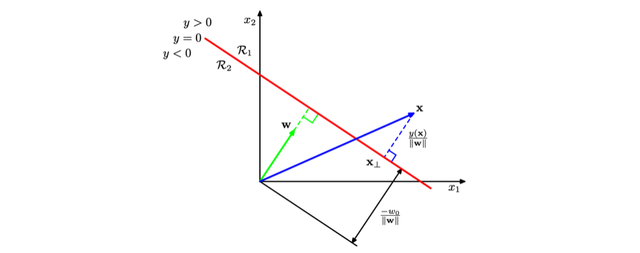
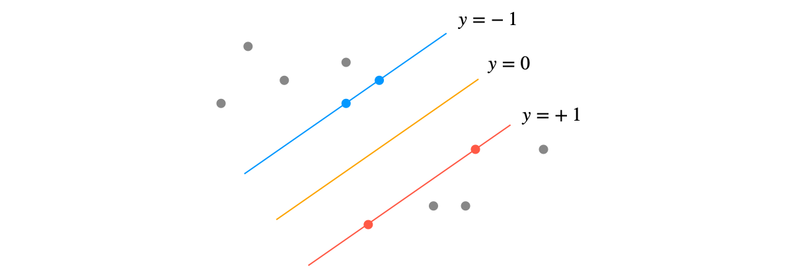

> Selected topics from Bishop, "Pattern Recognition and Machine Learning." that I personally wanted to organize into a post. The textbook is available [here](https://www.microsoft.com/en-us/research/people/cmbishop/#prml-book?from=http%3A%2F%2Fresearch.microsoft.com%2Fen-us%2Fum%2Fpeople%2Fcmbishop%2F), and additional content beyond the textbook has been added as needed. Content is continuously updated as study progresses.

### Information Theory

##### Relative Entropy

- Identical concept to **Kullback-Leibler Divergence**

$$
\begin{aligned}
\mathrm{KL}(p||q)
&= -\int p(\mathbf x) \ln q(\mathbf x) \mathrm d \mathbf x  - \left(-\int p(\mathbf x) \ln p(\mathbf x) \mathrm d \mathbf x \right) \\
&=-\int p(\mathbf x) \ln \left\{ \frac{q(\mathbf x)}{p(\mathbf x)} \right\} \mathrm d \mathbf x
\end{aligned}
$$

- Takes the form of Cross Entropy - Shannon Entropy

##### Jensen's Inequality

- **Convexity**: A function $f$ is convex if for all $a$ and $b$, $f(\lambda a + (1-\lambda)b) \leqslant \lambda f(a) + (1-\lambda)f(b)$
- Using mathematical induction, it can be proven that a convex function $f(x)$ satisfies the following (proof omitted). This is known as **Jensen's Inequality**

$$
f\left(\sum^M_{i=1} \lambda_i x_i \right) \leqslant \sum^M_{i=1} \lambda_i f(x_i)
$$

- Interpreting $\lambda_i$ as a probability distribution over a discrete variable $x$, the above can be rewritten as follows

$$
f(\mathbb E[x]) \leqslant \mathbb E[f(x)]
$$

- Jensen's Inequality for continuous variables takes the following form

$$
f\left(\int \mathbf x p(\mathbf x)\mathrm d \mathbf x \right) \leqslant \int f(\mathbf x)p(\mathbf x)\mathrm d \mathbf x
$$

- Applying Jensen's Inequality to the Kullback-Leibler Divergence formula, we can **confirm that KLD always takes a value of 0 or greater**
  - Setting $f(x) = -\ln(\frac{q(\mathbf x)}{p(\mathbf x)})$ and using the fact that $\int q(\mathbf x)\mathrm d \mathbf x = 1$, i.e., $-\ln\int q(\mathbf x)\mathrm d \mathbf x = 0$

$$
\mathrm{KL}(p||q) = - \int p({\bf x})\ln\left\{\dfrac{q({\bf x})}{p({\bf x})}\right\}\mathrm d \mathbf x \geqslant - \ln \int q({\bf x})\mathrm d \mathbf x = 0
$$

##### Mutual Information

- Mutual information helps us **determine how independent two variables $\mathbf x, \mathbf y$ are from each other**
- Since two completely independent variables would satisfy $p(\mathbf x, \mathbf y) = p(\mathbf x)p(\mathbf y)$, this is verified by **computing the KLD between $p(\mathbf x, \mathbf y)$ and $ p(\mathbf x)p(\mathbf y)$**
  - When $\mathrm{KL}( p(\mathbf x, \mathbf y) || p(\mathbf x)p(\mathbf y))=0$, the two variables $\mathbf x, \mathbf y$ are independent
  - **Independence**: One event's probability does not affect the probability of another event

$$
\mathbf I[{\bf x}, {\bf y}] \equiv \mathrm{KL}(p({\bf x}, {\bf y})||p({\bf x})p({\bf y})) = - \iint p({\bf x}, {\bf y})\ln\left(\dfrac{p({\bf x})p({\bf y})}{p({\bf x}, {\bf y})}\right)\mathrm d \mathbf x \mathrm d \mathbf y
$$

- Applying the sum and product rules of probability, it can be expressed as follows
  - Interpretation 1: **Expresses the uncertainty about ${\bf x}$ when ${\bf y}$ is known** (or vice versa)
  - Interpretation 2: From a Bayesian perspective, $p(\mathbf x)$ can be viewed as the prior distribution of $\mathbf x$, and $p(\mathbf x | \mathbf y)$ as the posterior distribution after observing new data $\mathbf y$. Thus, **mutual information represents the reduction in uncertainty about $\mathbf x$ as a result of the new observation $\mathbf y$**

$$
\mathbf I[{\bf x}, {\bf y}] = \mathbf H[{\bf x}] - \mathbf H[{\bf x}|{\bf y}] = \mathbf H[{\bf y}] - \mathbf H[{\bf y}|{\bf x}]
$$

### Convex Optimization

- This section was written with reference to the "Convex Optimization for All" [repository](https://github.com/convex-optimization-for-all/convex-optimization-for-all.github.io) and [this resource](https://www.stat.cmu.edu/~ryantibs/convexopt-F16/).

##### Dual Problem

- Linear Programming (LP): An optimization problem where both the objective function and constraint functions are given as linear functions
- Quadratic Programming (QP): An optimization problem where the objective function is convex quadratic and the constraint functions are given as linear functions
- What is '*Duality*'?: The concept that a single optimization problem can be viewed from two perspectives: **primal problem** and **dual problem**
  - A primal problem of finding a lower bound can be converted into a dual problem of maximizing the lower bound

##### Lagrangian

$$
\begin{aligned}
\text{minimize} & \quad f(x)  \\
\text{s.t.}   & \quad h_i(x) \leq 0, i = 1,\dots,m \\
       & \quad l_j(x) = 0, j=1,\dots,r
\end{aligned}
$$

- The Lagrangian for the above optimization problem is expressed as follows

$$
L(x,u,v) = f(x) + \sum_{i=1}^m u_i h_i(x) + \sum_{j=1}^r v_j l_j(x)
$$

- In general, when solving **constraint convex optimization** problems, the dual problem (i.e., the Lagrangian dual function) is solved rather than the primal problem
  - $\inf$ in the formula denotes the infimum

$$
\begin{aligned}
g(u,v)
&= \inf L(x,u,v) \\
&= \inf \left( f(x) + \sum_{i=1}^m u_i h_i(x) + \sum_{j=1}^r v_j l_j(x) \right)
\end{aligned}
$$

- **Lower bound property**: When $u$ is greater than 0 and $f^*$ is the solution to the primal problem, $g(u,v) \le f^\ast$. That is, the solution of the Lagrangian is less than or equal to $f^*$
  - Generally expressed in the form $f(x) -f^* \le f(x) - g(u,v)$
- **Duality gap**: $f(x) - g(u,v)$
  - Since $f(x) -f^* \le f(x) - g(u,v)$, if the duality gap is 0, then $x$ is the solution to the primal problem and $u, v$ are solutions to the dual problem

- **Strong dual**: In a standard convex problem, when $g(u,v)= f^*$. In this case, the duality gap is 0

##### Karsh-Kuhn-Tucker Conditions

- Necessity: If $x$ and $u, v$ are primal and dual solutions with zero duality gap, then $x, u, v$ satisfy the KKT conditions.
- Sufficiency: If $x$ and $u, v$ satisfy the KKT conditions, then $x$ and $u, v$ are primal and dual solutions.
- Therefore, for problems satisfying strong duality, the following relationship holds

$$
\text{$x,u,v$가 KKT condition을 만족} \iff \text{$x$는 primal solution이고 $u,v$는 dual solution}
$$

1. **Primal feasibility**: $h_i(x) \le 0, \ l_j(x) = 0 \text{ for all } i, j$
2. **Dual feasibility**: $u_i \ge 0 \text{ for all } i$
3. **Complementary slackness**: $u_ih_i(x) = 0 \text{ for all } i, j$
   - Either $u_i$ or $h_i$ must be 0
4. **Stationarity** (Gradient of Lagrangian w.r.t $x$ vanishes): $0 \in \partial \big( f(x) + \sum_{i=1}^{m} u_i h_i(x) + \sum_{j=1}^{r} v_j l_j(x) \big)$

### Maximum Margin Classifiers

##### Linear Discriminant

- The simplest linear discriminant function is expressed as $y(\mathbf x) = \mathbf w^\top\mathbf x + b$
- Properties of $\mathbf w$: For two points $\mathbf x_A$ and $\mathbf x_B$ on the decision surface, **since $y(\mathbf x_A) - y(\mathbf x_B) = 0$, we have $\mathbf w^\top(\mathbf x_A - \mathbf x_B)=0$, meaning vector $\mathbf w$ is orthogonal to all vectors on the decision surface**
- **Deriving the perpendicular distance $r$ between a point $\mathbf x$ and the decision surface** follows this process:

1. $\mathbf x= \mathbf x_{\perp} + r \frac{\mathbf w}{|| \mathbf w ||}$ ($\frac{\mathbf w}{|| \mathbf w ||}$ is the unit direction vector of $\mathbf w$)
2. Multiplying both sides by $\mathbf w^\top$ and adding $b$, $\mathbf w^\top\mathbf x + b = \mathbf w^\top(\mathbf x_{\perp} + r \frac{\mathbf w}{|| \mathbf w ||}) + b$
3. Rearranging, $\mathbf w^\top\mathbf x + b = \mathbf w^\top\mathbf x_{\perp} + b+ r \frac{\mathbf w^\top \mathbf w}{|| \mathbf w ||} $. Therefore, $y(\mathbf x) = 0 + r \frac{||\mathbf w||^2}{|| \mathbf w ||}$
4. $\therefore r = \frac{y(\mathbf x)}{||\mathbf w||}$

##### Support Vector Machine

- If $r$ is the perpendicular distance between a support vector and the decision surface, then the margin between support vectors is $2r = \frac{2}{||\mathbf w||}$
- Therefore, the optimization problem for SVM reduces to **simply maximizing $||\mathbf w||^{-1}$**. This is equivalent to **minimizing $||\mathbf w||^{2}$ (quadratic programming)**
  - By arbitrarily setting $t_n\cdot(\mathbf w^\top\mathbf x + b)=1$ for support vectors, the constraint $t_n\cdot(\mathbf w^\top\mathbf x + b) \ge 1, \quad n=1,...,N$ is satisfied for all data points
  - The goal is to find $\mathbf w, b$ satisfying the optimization below

$$
\begin{aligned}
\text{minimize} & \quad \frac{1}{2}\mathbf w^\top \mathbf w \\
\text{s.t.}   & \quad t_n \cdot(\mathbf w^\top\mathbf x + b) \ge 1, \quad n=1,...,N
\end{aligned}
$$

##### Dual Representation of SVM

- *Resume from PRML p.367*
