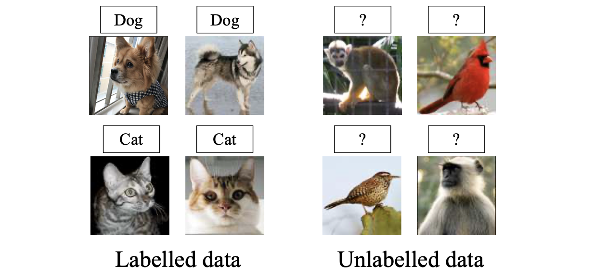
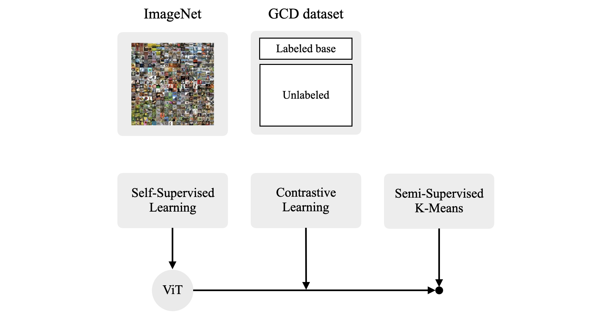
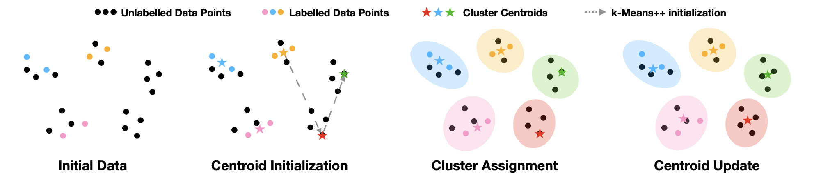
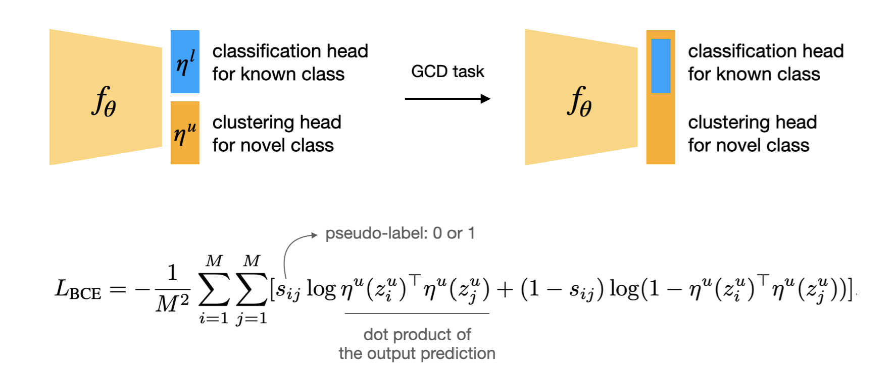
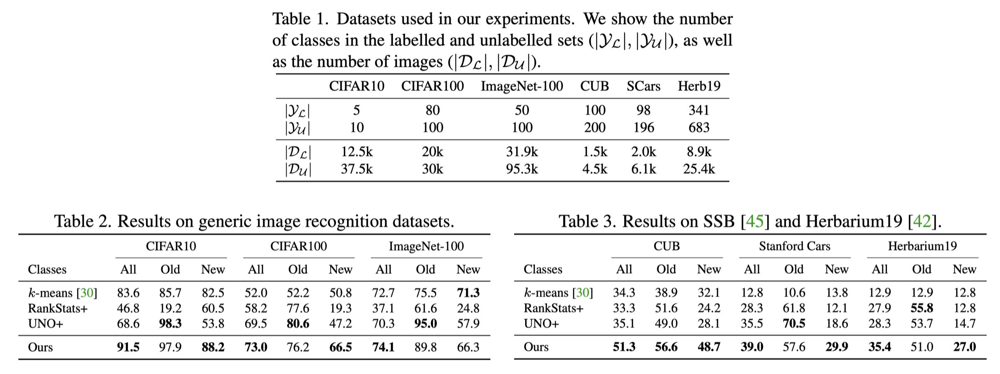
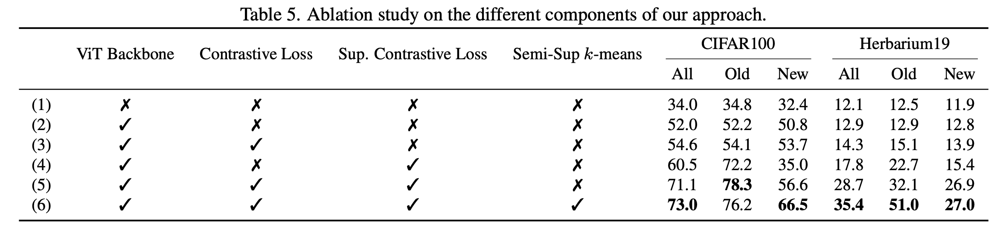

> This post summarizes the "Generalized Category Discovery" paper presented at CVPR 2022. The paper defines a new task called Generalized Category Discovery (GCD). The previously existing Novel Category Discovery (NCD) task assumes that the unlabeled dataset contains only previously unseen novel classes, but since this assumption is at odds with real-world scenarios, GCD was proposed to generalize the NCD setting.

### Background

##### Open-World Setting

The typical supervised learning setting that we are familiar with assumes a closed-world setting where only classes seen during training time are presented at test time. Although many AI models built under this assumption actually perform well in practice, in reality there are frequent situations where this assumption does not hold. That is, at test time (= deployment), data from classes never seen during training (i.e., novel classes) can be encountered, and a setting that considers such situations is called an open-world setting.

In the case of models that assume a closed-world (for a classification task), the number of weight vectors in the classification head is set equal to the number of data classes seen during training. Therefore, when novel class data exists at test time, predictions for those novel class data will inevitably always fail. Accordingly, various tasks have been defined along with related algorithms proposed to enable model predictions even in open-world settings.

While several tasks exist with different names, the well-known ones include 'a binary classification problem that separates known classes from novel classes at test time,' 'an open classification problem that performs classification of known classes well while also detecting novel classes,' and 'a problem that discovers new categories by performing clustering on novel classes.' The third task is called *Novel Category Discovery* (hereafter NCD), and the Generalized Category Discovery[^1] (hereafter GCD) introduced today was proposed based on the NCD setting.

One point worth noting is that incremental learning, while being a learning task that progressively learns new classes, is not considered open-world learning. This is because it lacks a mechanism for rejecting novel classes and still aims for knowledge expansion for new classes without full retraining while assuming a closed world. Similarly, when specific labels for novel classes are pre-assigned during training time, it can still be considered a closed-world setting.

##### Novel Category Discovery

Let me first introduce the NCD task, which served as the background for the GCD task proposal. In the NCD task, the dataset is divided into a labeled dataset and an unlabeled dataset. The **classes in the labeled dataset and those in the unlabeled dataset are disjoint**. Classes in the labeled dataset are called known classes, while classes in the unlabeled dataset are called unseen classes or novel classes.

The goal of the NCD task is to train a backbone model using the labeled dataset (or also utilizing the unlabeled dataset), and then use that backbone model to cluster the novel classes present in the unlabeled dataset. Since a model trained on known class data is used to automatically distinguish novel classes, it is called Novel Category Discovery. Because a pre-trained backbone is used to solve problems from a different distribution than the training distribution, NCD can be viewed as a form of **transfer clustering**. The figure below should give you a good sense of this.

<i>Taken from Kai Han, et al. "AutoNovel: Automatically Discovering and Learning Novel Visual Categories."</i>

Note that in the NCD task, as is common in general clustering problems, the number of novel classes is provided as a prior. Some papers additionally propose algorithms for estimating the number of novel classes.

Although the NCD task was defined relatively recently, there are still awkward aspects within the task itself. In particular, the assumption that the classes of the labeled and unlabeled datasets are disjoint, and that the unlabeled dataset contains only previously unseen novel classes, is somewhat unrealistic. In real-world scenarios, the unlabeled dataset is naturally not composed entirely of novel classes; rather, **known classes and novel classes are mixed together within the unlabeled dataset**. In this case, the model must be able to determine whether incoming unlabeled data belongs to a known class or a novel class, and simultaneously identify which specific cluster it belongs to among the novel classes. This is a considerably more challenging problem compared to the conventional NCD task. This is precisely the background that led to the GCD paper introduced in the next section.

### Generalized Category Discovery

##### Problem Statements

The general form of the GCD task is shown in the figure below. Unlike the NCD task, you can see that known classes such as elephant and bird are mixed within the unlabeled dataset marked with question marks (?). That is, for such a data collection, the model must be able to determine whether incoming unlabeled data is a known class or a novel class, and simultaneously identify which specific cluster it belongs to among the novel classes. The Oxford VGG research group first defined this type of task using the name *Generalized Category Discovery* in this paper, and also provided a simple method for solving GCD.

<i>Taken from Vaze, Sagar, et al. "Generalized Category Discovery."</i>

- $\mathcal{D}_{\mathcal{L}} =\left\{\left(\mathbf{x}_i, y_i\right)\right\}_{i=1}^N \in \mathcal{X} \times \mathcal{Y}_{\mathcal{L}} $ and $\mathcal{D}_{\mathcal{U}}=\left\{\left(\mathbf{x}_i, y_i\right)\right\}_{i=1}^M \in \mathcal{X} \times \mathcal{Y}_{\mathcal{U}}$ where $\mathcal{Y}_{\mathcal{L}} \subset \mathcal{Y}_{\mathcal{U}}$
- The labels of $\mathcal{D}_{\mathcal{U}}$ are unknown during training time, and the objective is to predict the labels of $\mathcal{D}_{\mathcal{U}}$ at test time
- The validation set is $\mathcal{D}_{\mathcal{V}}=\left\{\left(\mathbf{x}_i, y_i\right)\right\}_{i=1}^{N^{\prime}} \in \mathcal{X} \times \mathcal{Y}_{\mathcal{L}}$, which has the same classes as the labeled dataset but the data itself is disjoint
- As in NCD, the number of novel classes is given as a prior

### Proposed Method

<i>Overall learning framework of GCD</i>

##### Representation Learning

This paper uses the key insight of **removing the parametric classification head** to solve the GCD task. Instead, it performs non-parametric prototype-based clustering in feature space to distinguish all classes present in the unlabeled dataset. If semi-supervised learning using the unlabeled dataset is performed with a learnable classification head in place, performance would naturally become biased toward known classes (as the known class heads are strengthened), resulting in poor performance on novel classes for which no training labels exist.

Additionally, the authors adopt a **self-supervised learning approach and ViT architecture**. This is because previous papers solving the NCD task frequently used self-supervised learning as a pre-training strategy to learn robust representations, and because a recent paper, "Emerging Properties in Self-Supervised Vision Transformers"[^3], showed that ViT models trained with self-supervised learning are useful when employing nearest neighbor classifiers (a non-parametric method). Therefore, the representation approach in this paper is carried out in two main stages.

First, a ViT backbone pre-trained with DINO self-supervision, proposed in "Emerging Properties in Self-Supervised Vision Transformers," is used. DINO trains the model using only Mean Teacher self-distillation without labels, identical to [BYOL](https://yuhodots.github.io/deeplearning/21-04-04/), differing only in the similarity matching loss. As mentioned above, the DINO model is used because it produces a powerful nearest neighbor classifier, which is expected to pair well with the non-parametric clustering approach.

Next, downstream task tuning must be performed on the target GCD dataset. Here, supervised contrastive learning on the labeled dataset and self-supervised contrastive learning on the entire dataset are used. For the feature backbone $f$, projection head $\phi$, and projected vector $\mathbf z_i=\phi(f(\mathbf x_i))$, the contrastive loss is defined as follows:

- $\mathcal{L}_i^s=-\frac{1}{|\mathcal{N}(i)|} \sum_{q \in \mathcal{N}(i)} \log \frac{\exp \left(\mathbf{z}_i \cdot \mathbf{z}_q / \tau\right)}{\sum_n \mathbb{1}_{[n \neq i]} \exp \left(\mathbf{z}_i \cdot \mathbf{z}_n / \tau\right)}$
- $\mathcal{L}_i^u=-\log \frac{\exp \left(\mathbf{z}_i \cdot \mathbf{z}_i^{\prime} / \tau\right)}{\sum_n \mathbb{1}_{[n \neq i]} \exp \left(\mathbf{z}_i \cdot \mathbf{z}_n / \tau\right)}$
- $\mathcal{L}^t=(1-\lambda) \sum_{i \in B} \mathcal{L}_i^u+\lambda \sum_{i \in B_{\mathcal{L}}} \mathcal{L}_i^s$

The authors state that by using only a contrastive framework instead of cross-entropy loss as the objective function, labeled and unlabeled data are treated equally. Here, "treating equally" can be understood as "being careful not to create an imbalance between the two data splits by applying the same form of objective."

##### Semi-Supervised $K$-Means

After representation learning is complete, cluster (or class) labels must be assigned to the unlabeled dataset, which is the goal of the GCD task. As mentioned earlier, the authors use $k$-means clustering, a non-parametric method. In the $k$-means clustering, the initial prototypes for known classes are the class-wise average of feature vectors from the labeled dataset. Since there is no labeled data for novel classes, class-wise averaged prototypes cannot be used, so a method called $k$-means++[^4] is employed instead.

The paper's appendix provides a rough illustration of the $k$-means++ operation. The $k$-means++ method in the GCD setting starts with class-wise averages already computed for the labeled dataset. Then, probability values proportional to distance are assigned to all unlabeled feature vectors based on the most recently obtained prototype (= a probability distribution with higher values for points farther from the reference prototype). One point is sampled from this probability distribution, and the sampled point is selected as the next prototype. This process repeats until the number of initialized prototypes equals the total number of clusters, after which the semi-supervised $k$-means clustering process described above is performed.

<i>Taken from Vaze, Sagar, et al. "Generalized Category Discovery."</i>

After prototype initialization, $k$-means clustering is performed on feature vectors from the entire dataset. However, during the update and cluster assignment cycles of $k$-means clustering, the labeled dataset is constrained to always belong to the same cluster. Finally, after this semi-supervised $k$-means process has converged to some degree, the cluster labels assigned to unlabeled data are examined to measure clustering accuracy.

### Experiments

##### Two Strong Baselines from the NCD Methods

Since the GCD task was newly proposed in this paper, no prior work exists. Therefore, the authors adapted RS[^5] and UNO[^6], algorithms proposed for the NCD task, to fit the GCD task, naming them RS+ and UNO+ respectively. Consequently, the algorithm proposed in this paper was compared against simple $k$-means clustering as well as RS+ and UNO+ for performance verification. Both RS+ and UNO+ have classification heads in the form of learnable parameters. RS utilizes **pairwise pseudo-labels** commonly used in deep clustering methods, while UNO utilizes **SwAV[^7] manner pseudo-labels** to train their respective models. For details, please refer directly to the papers.

##### Comparative Results

For comparative experiments, 3 generic image recognition datasets and 3 fine-grained datasets were used, totaling 6 datasets. For each dataset, 50% of the known classes were allocated to the labeled dataset, the remaining 50% to the unlabeled dataset, and all novel classes were allocated to the unlabeled dataset. While some methods perform better on known classes (Old), the method proposed in this paper achieves the best overall performance.

<i>Taken from Vaze, Sagar, et al. "Generalized Category Discovery."</i>

##### Ablation Study

Results of the ablation study on proposed components. For the case where semi-sup $k$-means is marked with X, I was unable to find a detailed explanation in the paper and have not yet fully understood how this experiment was conducted.

<i>Taken from Vaze, Sagar, et al. "Generalized Category Discovery."</i>

### Conclusion

This paper is meaningful in that it formulated a problem commonly encountered in the real world as an actual task, and it was commendable that appropriate structures suited for GCD were proposed rather than simply applying existing NCD algorithms to the GCD task. However, it was somewhat disappointing that each proposed component was already an existing method, assembled into a single algorithm, with no newly proposed method within the paper.

Personally, while reading NCD algorithm papers earlier this year, I wondered why a setting like GCD did not yet exist. Seeing this paper proposed just a few months later was fascinating, and I could sense the rapidly growing research interest in open-world settings. Relatedly, at ECCV 2022, a more generalized setting called *NCD without Forgetting* (NCDwF) was proposed by adding constraints from continual learning (i.e., the inability to jointly train labeled and unlabeled datasets) to the GCD task. I recommend interested readers to check it out.

### References

[^1]:Vaze, Sagar, et al. "Generalized category discovery." *Proceedings of the IEEE/CVF Conference on Computer Vision and Pattern Recognition*. 2022.
[^2]:Han, Kai, et al. "Autonovel: Automatically discovering and learning novel visual categories." *IEEE Transactions on Pattern Analysis and Machine Intelligence* (2021).
[^3]:Caron, Mathilde, et al. "Emerging properties in self-supervised vision transformers." *Proceedings of the IEEE/CVF International Conference on Computer Vision*. 2021.
[^4]: Arthur, D.; Vassilvitskii, S. (2007). ["*k*-means++: the advantages of careful seeding"](http://ilpubs.stanford.edu:8090/778/1/2006-13.pdf) (PDF). *Proceedings of the eighteenth annual ACM-SIAM symposium on Discrete algorithms*. Society for Industrial and Applied Mathematics Philadelphia, PA, USA. pp. 1027–1035.
[^5]:Han, Kai, et al. "Automatically Discovering and Learning New Visual Categories with Ranking Statistics." *International Conference on Learning Representations*. 2020.
[^6]:Fini, Enrico, et al. "A unified objective for novel class discovery." *Proceedings of the IEEE/CVF International Conference on Computer Vision*. 2021.
[^7]: Caron, Mathilde, et al. "Unsupervised learning of visual features by contrasting cluster assignments." *Advances in Neural Information Processing Systems* 33 (2020): 9912-9924.
