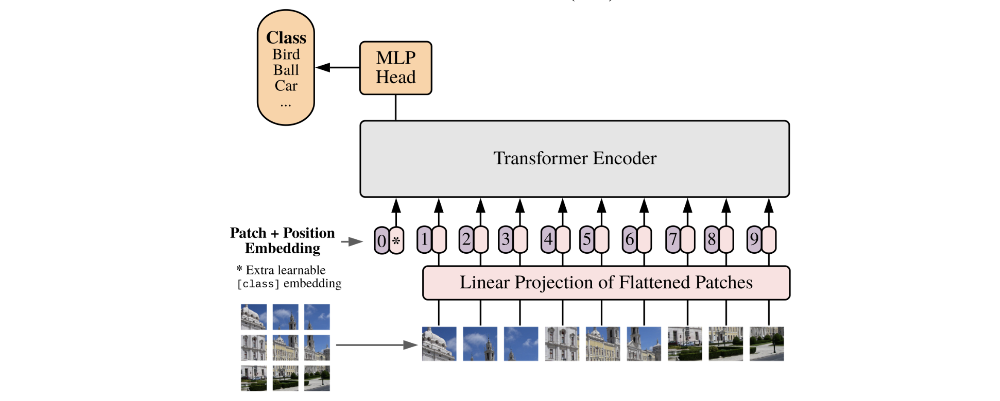
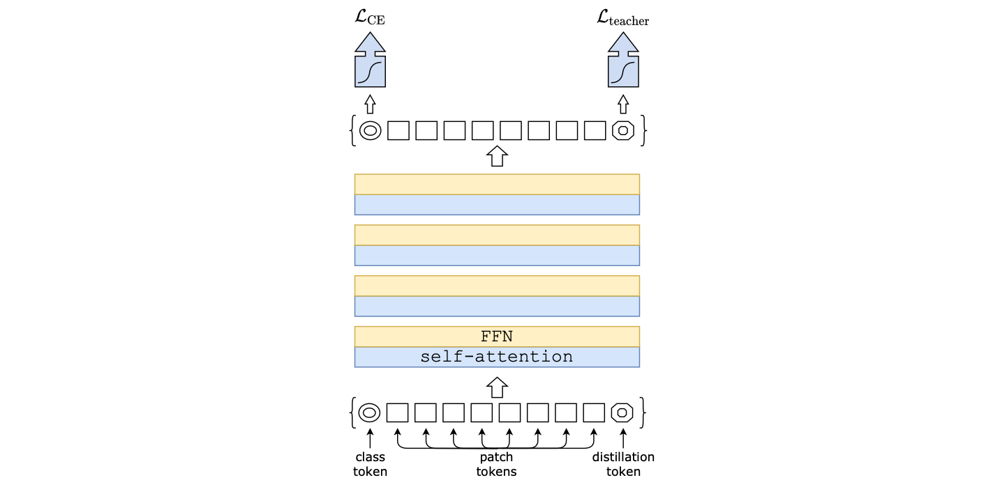
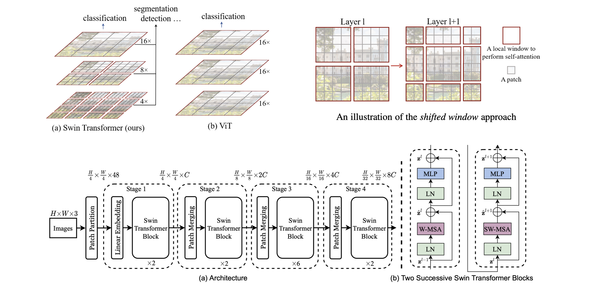
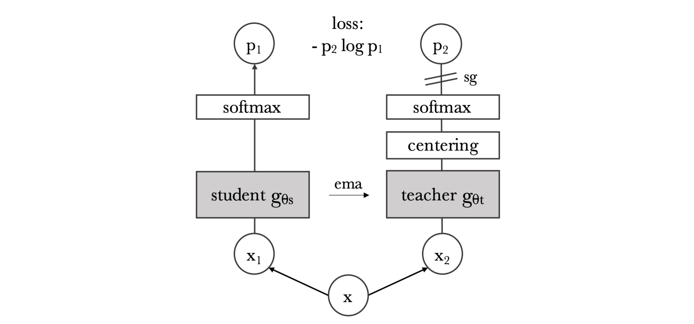
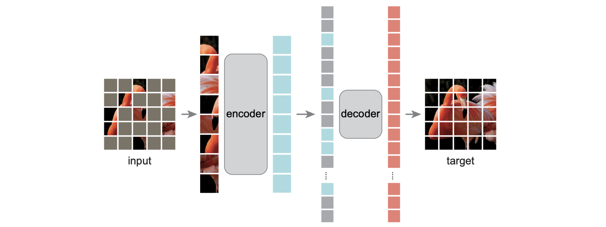
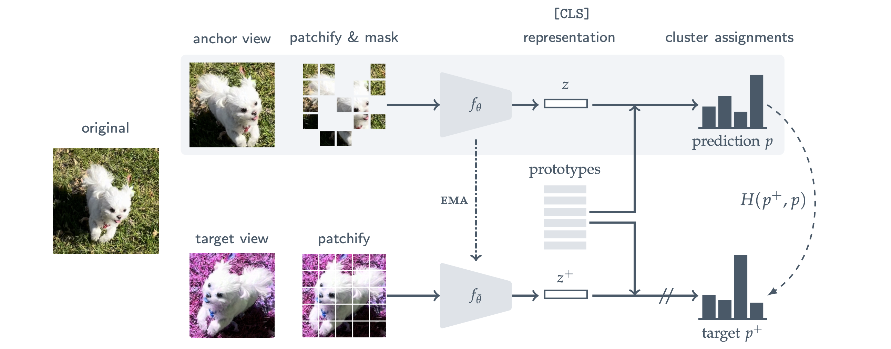

> A collection of ViT-related algorithms arranged in chronological order. Although the title says Variants of Vision Transformer, this post also covers papers that share the same architecture but differ only in training methods.

### Vision Transformer

Alexey Dosovitskiy, et al. "An Image is Worth 16x16 Words: Transformers for Image Recognition at Scale." (Oct 2020 / ICLR2021)

<i>Taken from Alexey Dosovitskiy, et al.</i>

1. The entire image is split into 16x16 patches. For example, a 48 x 48 image is divided into 9 patches: the 16 in `ViT-Base/16` refers to the patch size.
2. Each patch is flattened (16x16x3 = 768) and then converted into an embedding vector via linear projection, similar to how word embeddings are created.
3. A CLS token and positional embeddings are added to these embedding vectors, just like in BERT. Both are learnable parameters.
   - The CLS token has the same size as the patch embeddings and is concatenated with the 9 patch embeddings.
   - There are 9 + 1 = 10 positional embeddings in total, which are added (+) to the patch embeddings.
4. Each embedding vector is treated as a word token and fed as input to the transformer.
5. As in BERT, the final output of the CLS token is assumed to represent the output class for the image. Therefore, inference is performed by examining how the CLS embedding has changed at the transformer output.

### DeiT

Hugo Touvron, et al., "Training data-efficient image transformers & distillation through attention." (Dec 2020, ICML 2021)

<i>Taken from Hugo Touvron, et al.</i>

- ViT has less inductive bias compared to CNNs, but consequently requires a very large amount of training data.
- Therefore, the DeiT paper keeps the ViT architecture intact and introduces a distillation token, a teacher-student approach suited for transformers, enabling faster convergence.
- Distillation token: In addition to the CLS token in ViT, a distillation token is added, and the teacher model's output is used as the target for the distillation token.
  - Using a CNN-based model as the teacher yields good performance.

### Swin Transformer

Ze Liu, et al. "Swin transformer: Hierarchical vision transformer using shifted windows." (March 2021, ICCV 2021)

<i>Taken from Ze Liu, et al. </i>

- The original ViT does not properly incorporate image-specific properties. That is, since resolution and object scale vary across images, modeling that accounts for this is needed.
- Therefore, inductive biases of local windows and patch merging are applied to ViT.
  - While the original ViT uses the same 16x16x3 patch embeddings as input across all layers, Swin Transformer starts with 4x4x3 patches and progressively increases the window size through each layer.
  - Swin Transformer block: Contains window-based multi-head self-attention (W-MSA) and shifted window multi-head self-attention (SW-MSA).
  - To implement the Swin Transformer block, methods such as efficient batch computation and relative position bias are used; see the paper for details.
- Because different resolutions can be obtained at different layer hierarchies, it is highly applicable to detection and segmentation tasks. It would be worthwhile to compare it with FPN, another multi-resolution model.

### DINO

Mathilde Caron, et al. "Emerging properties in self-supervised vision transformers." (Apr 2021, ICCV 2021)

<i>Taken from Mathilde Caron, et al. </i>

- Key findings about self-supervised ViT:
  1. Self-supervised ViT features inherently contain information such as scene layout and object boundaries.
  2. Good kNN classifier performance is achieved without finetuning, linear classifiers, or data augmentation.
- The following methods are used to build a self-supervised ViT:
  1. ViT is trained in the manner of [BYOL](https://yuhodots.github.io/deeplearning/21-04-04/), i.e., using momentum updates.
  2. Unlike BYOL, L2 distance on normalized embeddings is not used; instead, a cross-entropy loss of the form $p_2\log p_1$ is used.
  3. Collapse is prevented solely through centering and sharpening of the momentum teacher output.

### Masked AutoEncoder (MAE)

Kaiming He, et al. "Masked autoencoders are scalable vision learners." (Nov 2021, CVPR 2022)

<i>Taken from Kaiming He, et al. </i>

- Masked image modeling (MIM) task.
- Rather than the conventional ViT training approach, performing SSL pre-training by reconstructing masked patches (like BERT) and then solving downstream tasks (e.g., classification) yields better results. While this is also possible with CNNs, it works better with ViT.
  - Approximately 75% of patches are masked, and masked patches are not included in the input, making training fast.
  - Reconstruction loss is applied only to masked patches.
- A related work is BEiT, which uses a dVAE-based image tokenizer to predict masked tokens, making it very similar to BERT.

### Masked Siamese Networks (MSN)

Mahmoud Assran, et al. "Masked siamese networks for label-efficient learning." (Apr 2022, ECCV 2022)

<i>Taken from Mahmoud Assran, et al. </i>

- Siamese Network: "[Siamese Neural Networks for One-shot Image Recognition](https://www.cs.cmu.edu/~rsalakhu/papers/oneshot1.pdf)"
  - Trains different views of the same image to have similar representations.
  - The same model (shared weights) is used for both input images.
  - However, collapse can occur, so recent works employ triplet or contrastive losses.
- Problems with MAE patch reconstruction:
  - MAE's reconstruction loss requires overly detailed low-level image modeling even for simple classification tasks.
  - This characteristic causes overfitting in low-shot fine-tuning.
- Masked Siamese Networks:
  - Trains the masked anchor view and unmasked target view to have similar output probability distributions.
  - Prototypes are learnable parameters used for cluster assignment (to produce probability distribution outputs). Since the number of classes is assumed to be unknown, the number of prototypes is a hyperparameter.
