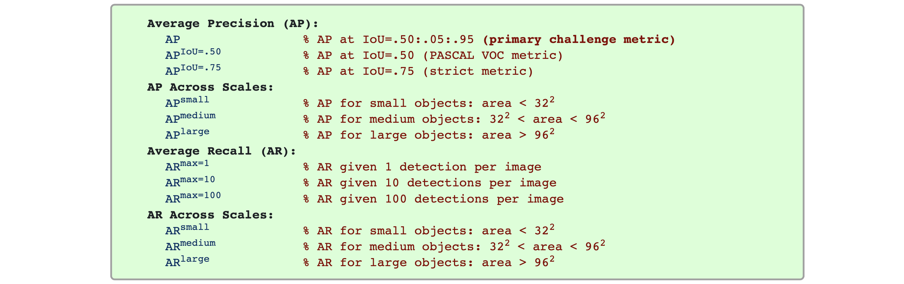
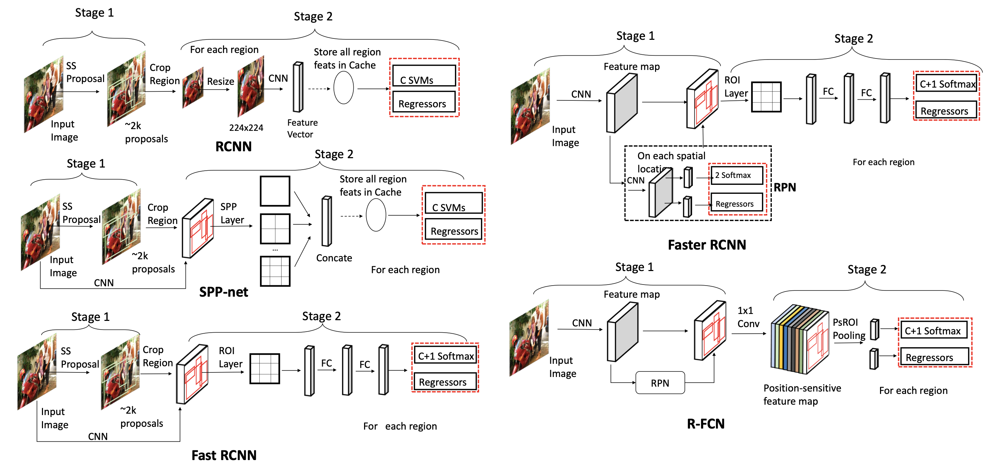
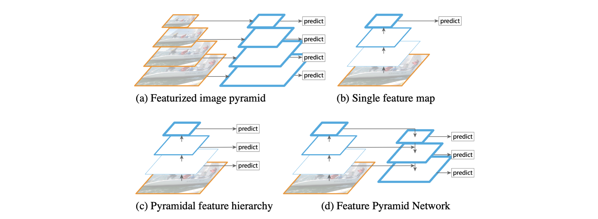
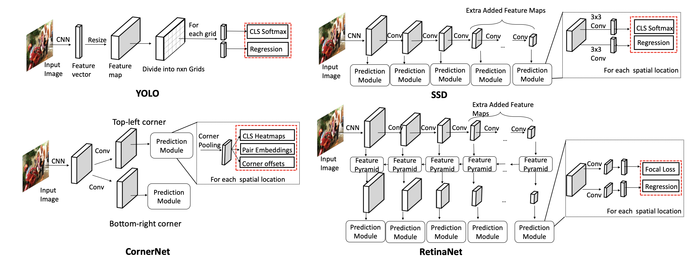
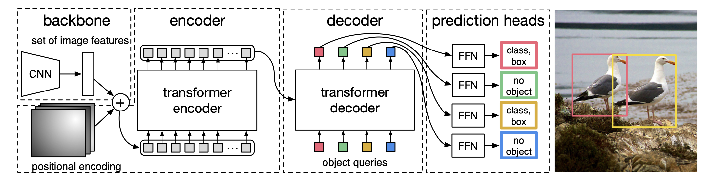
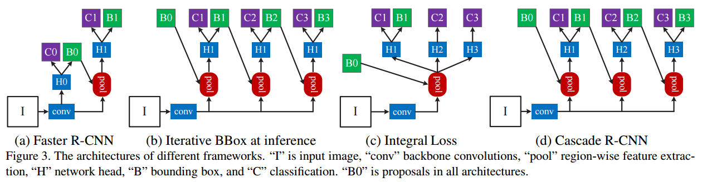
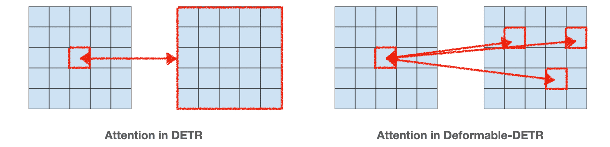

> A review of deep learning-based object detection algorithms. This post briefly summarizes well-known algorithms among two-stage and one-stage detectors. Comments on typos or inaccuracies are welcome.

### Introduction

- Localization: A task that identifies the position of an object in the form of a bounding box.
- Object detection: A task that classifies and localizes each of multiple objects within an image.
- RoI: Region of Interest
- Region proposal: Proposes regions likely to contain objects.
  - Selective search (e.g., Fast R-CNN): A method that measures similarity between adjacent regions and gradually merges them into larger regions.
  - Sliding window, Spatial anchor, RPN (e.g., Faster R-CNN): A method that slides windows of various sizes across the image to check whether an object exists at each position. [This YouTube video](https://www.youtube.com/watch?v=ZhvU7D_qKO8) provides an excellent explanation.
- Localization layer: A layer that proposes bbox positions, typically using a regressor.
- Classification layer: A layer that proposes the class of an object.
- RoI Pooling: Since proposals from the RPN have varying sizes, RoI pooling makes them all the same size (e.g., Output size = 7x7 pooled feature).
- RoIAlign: Used in Mask R-CNN (an instance segmentation model). The output size is the same as RoI Pooling, but the method of computing pooling values differs. Most subsequent works use RoIAlign.
- IoU (Intersection over Union): The ratio of overlap between the predicted bbox and the ground truth bbox.

$$
\text{IoU} = \frac{\text{Intersection of two bboxes}}{\text{Union of two bboxes}}
$$

```python
# Code by ChatGPT

def compute_iou(box, boxes):
    """
    Computes the IOU between a given box and a set of boxes.
    :param box: Numpy array with shape (4,) representing the coordinates of a bounding box.
    :param boxes: Numpy array with shape (N, 4) representing the coordinates of N bounding boxes.
    :return: Numpy array with shape (N,) containing the IOUs between the box and the N bounding boxes.
    """
    # Calculate coordinates of intersection boxes
    x1 = np.maximum(box[0], boxes[:, 0])
    y1 = np.maximum(box[1], boxes[:, 1])
    x2 = np.minimum(box[2], boxes[:, 2])
    y2 = np.minimum(box[3], boxes[:, 3])

    # Calculate area of intersection boxes and union boxes
    intersection = np.maximum(0.0, x2 - x1) * np.maximum(0.0, y2 - y1)
    area_box = (box[2] - box[0]) * (box[3] - box[1])
    area_boxes = (boxes[:, 2] - boxes[:, 0]) * (boxes[:, 3] - boxes[:, 1])
    union = area_box + area_boxes - intersection

    # Calculate IOU and return
    iou = intersection / union
    return iou
```

- Non-Maximum Suppression (NMS): A method that reduces bbox predictions to one (or a few) when multiple bboxes overlap while being classified as the same class.

```python
# Code by ChatGPT

def non_maximum_suppression(bounding_boxes, confidence_scores, overlap_threshold):
    """
    Implements Non-Maximum Suppression on a set of bounding boxes and corresponding confidence scores.
    :param bounding_boxes: Numpy array with shape (N, 4) representing the coordinates of the N bounding boxes.
    :param confidence_scores: Numpy array with shape (N,) representing the confidence scores for the N bounding boxes.
    :param overlap_threshold: Float representing the maximum allowed overlap between two bounding boxes.
    :return: List with the indices of the selected bounding boxes.
    """
    # Sort bounding boxes by their confidence scores (highest to lowest)
    sorted_indices = np.argsort(-confidence_scores)

    selected_indices = []
    while sorted_indices.size > 0:
        # Select bounding box with highest confidence score
        best_box_index = sorted_indices[0]
        selected_indices.append(best_box_index)

        # Compute the IOUs between the selected bounding box and the remaining boxes
        remaining_indices = sorted_indices[1:]
        overlaps = compute_iou(bounding_boxes[best_box_index], bounding_boxes[remaining_indices])

        # Discard boxes with IOU greater than overlap threshold
        non_overlapping_indices = np.where(overlaps <= overlap_threshold)[0]
        sorted_indices = remaining_indices[non_overlapping_indices]

    return selected_indices
```

##### Evaluation Metric

- Average Precision (AP .5): Considers IoU of 0.5 or above as true positive.
- 11-point interpolation and all-point interpolation methods:

$$
\begin{aligned}
& A P_{11}=\frac{1}{11} \sum_{R \in\{0,0.1,0.2, \ldots, 0.9,1\}} P_{\text {interp }}(R) \\
& {P}_{\text {interp }}({R})=\max _{\widetilde{{R}}: \widetilde{{R}} \geq {{R}}} {P}(\widetilde{{R}})
\end{aligned}
$$

$$
\begin{aligned}
& {A P}_{\text {all }}=\sum_n\left({R}_{n+1}-{R}_{{n}}\right) {P}_{\text {interp }}\left({R}_{n+1}\right) \\
& {P}_{\text {interp }}\left({R}_{n+1}\right)=\max _{\widetilde{{R}}: \widetilde{{R}} \geq {R}_{n+1}} {P}(\widetilde{{R}})
\end{aligned}
$$

- AP[.5:.05:.95]: Measures AP .5, AP .55, ..., AP .95 and averages them. This is the average of AP values computed using the all-point interpolation method, which represents the area under the Precision-Recall Curve.

- mean Average Precision: Since precision fundamentally refers to detection of a single object, mAP means computing AP[.5:.05:.95] for each class and averaging them.
  $$
  m A P=\frac{1}{N} \sum_{i=1}^N A P_i
  $$



<center><p><i>Taken from https://cocodataset.org/#detection-eval</i></p></center>

- Macro: A method of computing the "average of averages." macro precision = (precision 1 + precision 2 + ... + precision K) / K where K is the number of classes
- Micro: A method of computing the "overall average." micro precision = TP / (TP + FP)

### Two-Stage Detector

Generates region proposals first, then performs object classification and bbox regression. Therefore, it is slower but generally achieves better performance (though this is not necessarily the case with recent methods).



<center><p><i>Taken from  Wu, Xiongwei, Doyen Sahoo, and Steven CH Hoi.</i></p></center>

##### R-CNN (2014)[^1]

Region-Based Convolutional Neural Networks

1. Extract approximately 2,000 RoIs from the image using selective search. See [here](https://lilianweng.github.io/posts/2017-10-29-object-recognition-part-1/#selective-search) for an explanation of selective search.
2. Warp each RoI (i.e., transforming image regions to a fixed size).
3. Extract features from the warped images using a CNN.
4. Use the features to perform classification with SVMs and bbox prediction (i.e., {x, y, width, height}) with a regressor.

##### Fast R-CNN (2015)[^2]

1. Extract approximately 2,000 RoIs from the image using selective search (*same as R-CNN*).
2. Feed the input image directly into a CNN to extract a feature map. That is, the input image only needs to be forwarded through the CNN once.
3. RoI projection: Project each RoI to the feature map dimensions.
4. Perform RoI pooling: Apply max-pooling to each RoI region in the feature map to extract an NxN matrix.
5. Use the final features to perform classification with a softmax layer and bbox prediction with a regressor.

##### Faster R-CNN (2015)[^3]

The region proposal method of prior works was a bottleneck. By proposing an end-to-end architecture using RPN, performance was improved.

1. Feed the image into a CNN to extract a feature map.
2. Send the feature map to a region proposal network (RPN) to generate RoIs for the feature map.
   - The RPN basically uses a sliding window approach with multiple anchor boxes of different shapes.
   - The final layer of the RPN has a 2-softmax for determining whether an object is present and a regressor for proposing bboxes.
   - RoIs are generated based on the 2-softmax and regressor outputs and passed to the RoI pooling layer.
3. Perform RoI pooling.
4. Use the final features to perform classification with a softmax layer and bbox prediction with a regressor.

##### Recap.

|              | Conference   | Region proposal             | Classification layer | Localization layer |
| ------------ | ------------ | --------------------------- | -------------------- | ------------------ |
| R-CNN        | CVPR 2014    | Selective search (CPU)      | SVMs                 | Regressor          |
| Fast R-CNN   | ICCV 2015    | Selective search (CPU)      | Softmax              | Regressor          |
| Faster R-CNN | NeurIPS 2015 | Sliding window w. RPN (GPU) | Softmax              | Regressor          |

##### Feature Pyramid Networks (2017)[^4]

There has been much research aiming to improve object detection performance by maximally leveraging multi-resolution information, and FPN is one of them. It is used as the backbone for various object detection models to boost their performance.

- Featurized image pyramid: A method that resizes the input image to multiple scales and passes each through a CNN to obtain feature maps. Obviously very slow.
- Single feature map: Since only the last feature map is used for prediction, it likely cannot capture information about small objects well.
- Feature Pyramid Network (FPN)
  - Composed of bottom-up and top-down pathways.
  - In the top-down pathway, the previous layer's feature and the bottom-up feature are taken as input, added together, and then upsampled to produce a feature map. At each top-down pathway step, the feature map can be fed into an RPN (region proposal network) for model predictions.
  - In other words, using FPN enables extraction of multi-resolution features for better object detection.



<center><p><i>Taken from Tsung-Yi Lin, et al.</i></p></center>

```python
# Sample code from https://github.com/jwyang/fpn.pytorch/blob/master/lib/model/fpn/fpn.py#L159
...
def forward(self, im_data, im_info, gt_boxes, num_boxes):
    batch_size = im_data.size(0)

    im_info = im_info.data
    gt_boxes = gt_boxes.data
    num_boxes = num_boxes.data

    # Bottom-up
    c1 = self.RCNN_layer0(im_data)
    c2 = self.RCNN_layer1(c1)
    c3 = self.RCNN_layer2(c2)
    c4 = self.RCNN_layer3(c3)
    c5 = self.RCNN_layer4(c4)

    # Top-down
    p5 = self.RCNN_toplayer(c5)
    p4 = self._upsample_add(p5, self.RCNN_latlayer1(c4))
    p4 = self.RCNN_smooth1(p4)
    p3 = self._upsample_add(p4, self.RCNN_latlayer2(c3))
    p3 = self.RCNN_smooth2(p3)
    p2 = self._upsample_add(p3, self.RCNN_latlayer3(c2))
    p2 = self.RCNN_smooth3(p2)

    p6 = self.maxpool2d(p5)

    rpn_feature_maps = [p2, p3, p4, p5, p6]
    mrcnn_feature_maps = [p2, p3, p4, p5]

    rois, rpn_loss_cls, rpn_loss_bbox = self.RCNN_rpn(rpn_feature_maps, im_info, gt_boxes, num_boxes)
```

### One-Stage Detector

Performs object classification and bbox regression without pre-generated region proposals.



<center><p><i>Taken from  Wu, Xiongwei, Doyen Sahoo, and Steven CH Hoi.</i></p></center>

##### YOLO (2016)[^5]

1. Divide the image into an N x N grid (N=7).
2. Feed the image into a CNN to extract a feature vector.
3. Reshape the feature vector into an N x N x D feature map.
4. Each cell of the N x N grid corresponds to a single D-sized feature, which is used for (x, y, w, h, confidence score) and (class probabilities).

```python
# Sample code from https://github.com/motokimura/yolo_v1_pytorch/blob/master/yolo_v1.py
...
def forward(self, x):
    S, B, C = self.feature_size, self.num_bboxes, self.num_classes
    x = self.features(x)
    x = self.conv_layers(x)
    x = self.fc_layers(x)
    x = x.view(-1, S, S, 5 * B + C)
    return x
```

##### RetinaNet (2017)[^7]

- Uses FPN as the backbone.
- Proposes focal loss to address the imbalance between foreground and background. It has the effect of assigning more weight to hard examples than to easy negative examples.

$$
\begin{aligned}
&\text { Cross Entropy }=-\log \left(p_{t}\right) \\
&\text { Focal Loss }=-\left(1-p_{t}\right)^{\gamma} \log \left(p_{t}\right)
\end{aligned}
$$

##### DETR (2020)[^8]

- Prior works required too many hand-designed components like NMS or spatial anchors (RPN). Therefore, a simple architecture that drops customized layers is proposed.
- Bipartite matching (e.g., *Hungarian algorithm*): Previously, the set prediction problem was addressed indirectly using NMS and similar methods, but bipartite matching fixes the number of object outputs to N, directly predicting the set of detections.
  - For example, if N=10 and there are 2 objects, 8 should be predicted as no object.



<center><p><i>Taken from Nicolas Carion, et al.</i></p></center>

1. Extract image features using a CNN. The image feature is a feature map with shape $C \times H \times W$, where $C=2048$, and given image height $H_0$ and width $W_0$, $H, W = \frac{H_0}{32}, \frac{W_0}{32}$.
2. Add positional encoding to the image feature map and feed it into the transformer encoder.
3. Feed object queries and encoder output into the decoder. Here, there are N object queries (the max number of objects).
4. Feed each decoder output into a feed forward network to output whether an object exists, and if so, what the class and bbox are.
5. Perform bipartite matching (i.e., Hungarian algorithm) on the final prediction head outputs, then compute the loss to train the model. Class prediction loss and box loss using Generalized IoU are used.

### Quick Overview

- YOLO: A model developed for real-time object detection that processes the entire image at once to detect objects. Unlike the traditional sliding window approach, it processes the entire image through a single network, making it extremely fast. **Divides the input image into an SxS grid and outputs (x, y, w, h, confidence score) and (class probabilities) for each grid feature.**
- YOLOX: **Applies the anchor-free method to the YOLO model** to improve performance. Various other techniques are also applied (Decoupled head, SimOTA, multi-positives, etc.)
  - Anchor free: Reduces the 3 predictions per grid cell to 1 and directly predicts 4 values (left-top corner, height, width). Think of the FCOS approach.
- RCNN (Region-based Convolutional Neural Network): One of the first region proposal-based methods proposed for object detection. Generates multiple region proposals from the input image, then **applies a CNN to each region proposal to extract features and predicts object classes and locations based on them.**
- Cascade RCNN: A method that uses multiple stages of detectors to progressively improve detection accuracy. Each stage performs more refined detection based on objects detected in the previous stage. (1) **Generate region proposals with a detector trained at 0.5 IoU**, (2) **train a 0.6 IoU detector using the generated region proposals**, (3) **train a 0.7 IoU detector in the same manner**. (4) A 3-stage setup was found to be empirically suitable, and inference is also performed in a cascade manner. It is reportedly especially effective when object sizes vary widely or bounding box prediction is challenging.



- DETR: DETR introduces the Transformer architecture to object detection. First, **CNN backbone extracts C(2048)xHxW image features**. Then, 1x1 conv reduces C to 256, producing 256-dimensional HxW tokens. These are fed into the encoder once, and **encoder outputs and object queries undergo cross attention in the decoder**. The final object query outputs are used for prediction. It can perform accurate detection without additional steps like Region Proposals and enables end-to-end training.
- DN-DETR: Ambiguous bipartite matching in early training leads to slow convergence, so training is accelerated by denoising GT boxes with added noise.
- Deformable-DETR: Introduces a **Deformable Attention Mechanism**. Achieves faster convergence than DETR and improves detection performance for small objects.



- DINO (DETR with Improved Noise optimization): Introduces **Contrastive DeNoising Training**. For N GT boxes, positive and negative queries are generated, producing a total of 2N queries. For the same GT box, small noise lambda1 is added to positive samples and large noise lambda2 to negative samples. The model is trained to predict no object for negatives. Among DETR-based models, it achieves top-tier performance.
- BoxInst: A weakly-supervised instance segmentation method. Proposes a **projection loss term** (measures how similar the x and y axis projections of the model's mask predictions are to the box GT) and a **pairwise loss term** (claims that if two pixels have similar colors, they often share the same label, and encourages nearby pixels with similar colors to be predicted as the same object).

### References

##### Blog Posts

- https://lilianweng.github.io/posts/2017-12-31-object-recognition-part-3/
- https://lilianweng.github.io/posts/2018-12-27-object-recognition-part-4/

##### Papers

[^1]:Girshick, Ross, et al. "Rich feature hierarchies for accurate object detection and semantic segmentation." *Proceedings of the IEEE conference on computer vision and pattern recognition*. 2014.
[^2]: Girshick, Ross. "Fast r-cnn." *Proceedings of the IEEE international conference on computer vision*. 2015.
[^3]: Ren, Shaoqing, et al. "Faster r-cnn: Towards real-time object detection with region proposal networks." *Advances in neural information processing systems* 28 (2015).
[^4]: Lin, Tsung-Yi, et al. "Feature pyramid networks for object detection." *Proceedings of the IEEE conference on computer vision and pattern recognition*. 2017.
[^5]: Redmon, Joseph, et al. "You only look once: Unified, real-time object detection." *Proceedings of the IEEE conference on computer vision and pattern recognition*. 2016.
[^6]:Liu, Wei, et al. "Ssd: Single shot multibox detector." *Computer Vision–ECCV 2016: 14th European Conference, Amsterdam, The Netherlands, October 11–14, 2016, Proceedings, Part I 14*. Springer International Publishing, 2016.
[^7]: Lin, Tsung-Yi, et al. "Focal loss for dense object detection." *Proceedings of the IEEE international conference on computer vision*. 2017.
[^8]: Carion, Nicolas, et al. "End-to-end object detection with transformers." *Computer Vision–ECCV 2020: 16th European Conference, Glasgow, UK, August 23–28, 2020, Proceedings, Part I 16*. Springer International Publishing, 2020.
[^9]: Zou, Zhengxia, et al. "Object detection in 20 years: A survey." *Proceedings of the IEEE* (2023).
[^10]: Wu, Xiongwei, Doyen Sahoo, and Steven CH Hoi. "Recent advances in deep learning for object detection." *Neurocomputing*396 (2020): 39-64.
