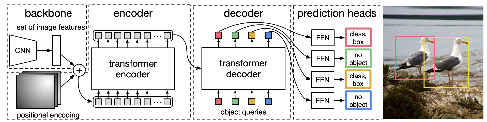
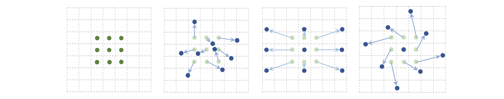
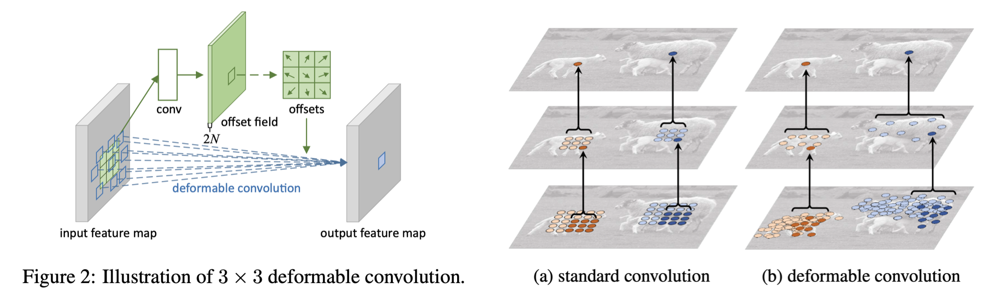
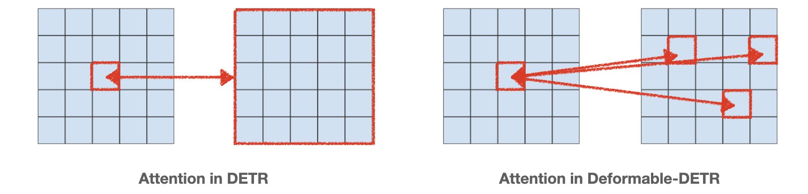
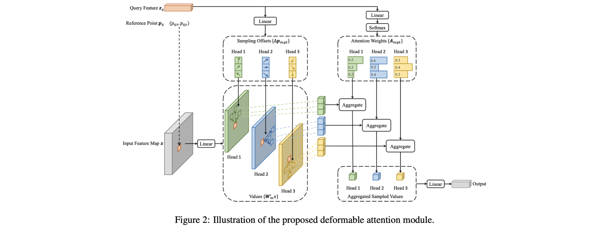
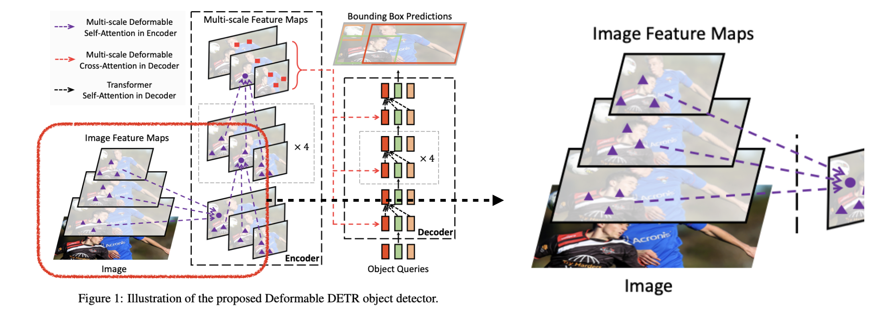
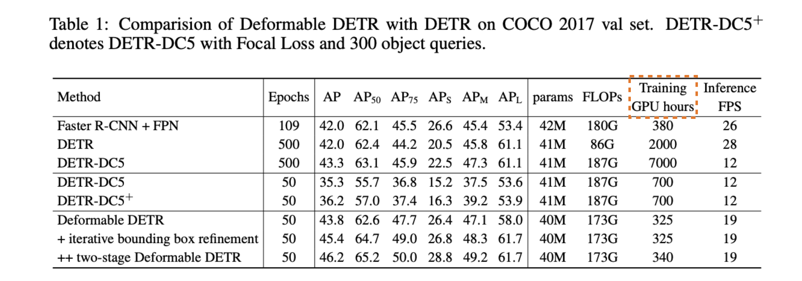
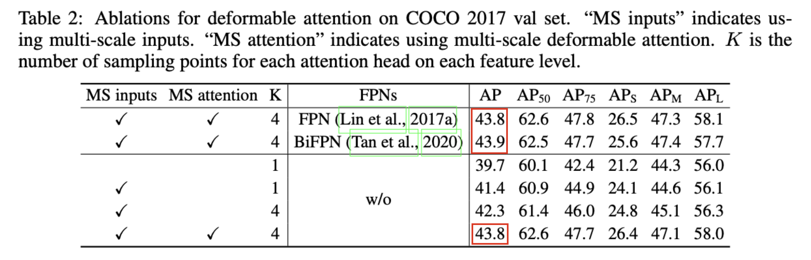

> A summary of "Deformable DETR: Deformable Transformers for End-to-End Object Detection," presented at ICLR 2021.

### Introduction

To understand Deformable DETR, one must first understand two prior works: DETR and the Deformable Convolutional Network. Below, we briefly cover these two techniques before moving on. (For basic terminology related to object detection, please refer to the [previous post](https://yuhodots.github.io/deeplearning/23-06-10/).)

##### DETR: Detection Transformer

CNN-based models commonly used in object detection required many hand-designed components such as NMS and RPN. Therefore, the authors of DETR proposed a new end-to-end model that eliminates customized layers like NMS and RPN by using Transformers and bipartite matching loss in the object detection domain. The overall architecture of DETR can be understood from the figure below.

<i>Taken from Carion, Nicolas, et al.</i>

1. First, image features are extracted using a CNN backbone. The image feature has a shape of $C(2048) \times H \times W$, and a 1x1 conv is used to reduce $C$ to 256, producing 256-dimensional $H\times W$ tokens.
2. Positional encoding is then added to the image feature map and fed into the transformer encoder. The encoder learns relationships among $H\times W$ pixels. Unlike CNNs, which only look at nearby pixels, the attention mechanism enables learning more global information.
3. Object queries and encoder output are fed into the decoder. Here, there are $N$ object queries (the maximum number of objects). The learnable object queries start without any specific meaning and are progressively updated in the decoder to aid model predictions.
4. Each decoder output is fed into a feed forward network to produce class predictions and bbox predictions.
5. Bipartite matching (i.e., the Hungarian algorithm) is used as the loss. The formula can be seen below. Similar to how the Hungarian algorithm is often used for clustering accuracy, it finds the optimal matching between predictions and ground truth and computes the loss for that matching. For example, if $N=100$, then in the example shown above, 2 should be predicted as bird and 98 should be predicted as no object.
6. Additionally, since no-object ground truth instances are relatively abundant, the loss weight for no-object predictions is scaled down to balance training.

$$
\hat{\sigma}=\underset{\sigma \in \mathfrak{S}_N}{\arg \min } \sum_i^N \mathcal{L}_{\text {match }}\left(y_i, \hat{y}_{\sigma(i)}\right)
\\ \mathcal{L}_{\text {Hungarian }}(y, \hat{y})=\sum_{i=1}^N\left[-\log \hat{p}_{\hat{\sigma}(i)}\left(c_i\right)+\mathbb{1}_{\left\{c_i \neq \varnothing\right\}} \mathcal{L}_{\text {box }}\left(b_i, \hat{b}_{\hat{\sigma}}(i)\right)\right]
$$

##### Deformable Convolutional Network

DCN is a concept proposed relatively long ago (2017). The authors of DCN point out that the convolution and pooling operations in conventional CNNs have fixed geometric structures, making it difficult to handle various deformations flexibly. To address this, they propose deformable convolutional layers and deformable RoI pooling layers for more flexible feature extraction.

<i>Taken from Jifeng Dai, et al.</i>

Looking at the figure, the first image shows the receptive field of a conventional CNN. If the receptive field were formed like the subsequent images, features could be extracted more flexibly for various shapes.

<i>Taken from Jifeng Dai, et al.</i>

Deformable Convolution operates as follows:

1. In the left figure, there is a new conv layer (shown in white) for computing offsets.
2. This new conv layer is applied to an offset field (a copy of the input feature map) to produce offsets.
3. Then, a conv operation with applied offsets is performed. That is, while the original conv operation is $\mathbf{y}\left(\mathbf{p}_0\right)=\sum_{\mathbf{p}_n \in \mathcal{R}} \mathbf{w}\left(\mathbf{p}_n\right) \cdot \mathbf{x}\left(\mathbf{p}_0+\mathbf{p}_n\right)$, the deformable conv operation is expressed as $\mathbf{y}\left(\mathbf{p}_0\right)=\sum_{\mathbf{p}_n \in \mathcal{R}} \mathbf{w}\left(\mathbf{p}_n\right) \cdot \mathbf{x}\left(\mathbf{p}_0+\mathbf{p}_n+\Delta \mathbf{p}_n\right)$.

<i>Taken from Jifeng Dai, et al.</i>

Deformable RoI Pooling operates as follows:

1. The input feature map is forwarded through an fc layer to produce offsets.
2. As with deformable convolution, RoI pooling with applied offsets is performed to obtain the final output.

### Deformable-DETR

Although DETR proposed a new approach to object detection, it still had several limitations.

First, DETR detected large objects well but performed significantly worse on small objects compared to previous detector algorithms. While DETR's attention module enables looking at distant pixels (which helps with large objects), it relies solely on the feature map from the backbone's last layer without utilizing multi-scale features, making small object detection difficult. Additionally, the training convergence speed was 10-20 times slower than Faster R-CNN, which was also a problem.

Therefore, the authors of Deformable-DETR propose a deformable attention module to speed up convergence while simultaneously leveraging multi-scale features to improve small object detection performance.

##### Deformable Attention Module

In the original DETR, attention is applied to all feature map positions as shown in the left figure. This results in high computational cost for attention computation. However, in Deformable-DETR, attention is performed only on a fixed number of sampling points as shown in the right figure. This type of operation is very similar to the deformable convolutional network described earlier.

<i>Taken from Xizhou Zhu, et al.</i>

$$
\operatorname{DeformAttn}\left(\boldsymbol{z}_q, \boldsymbol{p}_q, \boldsymbol{x}\right)=\sum_{m=1}^M \boldsymbol{W}_m\left[\sum_{k=1}^K A_{m q k} \cdot \boldsymbol{W}_m^{\prime} \boldsymbol{x}\left(\boldsymbol{p}_q+\Delta \boldsymbol{p}_{m q k}\right)\right]
$$

Let us look more closely at the encoder of Deformable-DETR. (The authors modified the encoder within the Transformer as shown in the figure above, but note that it differs from the conventional attention mechanism we are familiar with, so be careful not to get confused.)

1. The feature of a specific pixel (query feature) is fed into a linear layer ($2MK$) to produce $K$ offsets per attention head. Here, $M$ is the number of attention heads and $K$ is the number of sampling offsets.
2. A linear projection $W'$ is applied to each offset point, and these serve as values.
3. The query feature is then fed into a linear layer ($MK$) to produce softmax probabilities (attention scores) for each attention head.
4. For each attention head, the softmax probabilities are multiplied with the previously computed values to create aggregated sampled values.
5. These $M$ aggregated sampled values are fed into a final linear layer to produce a single updated feature, which is used as the updated query feature.

Strictly speaking, the above process cannot be called attention. This is because the attention scores are produced by a linear layer rather than computed from query-key interactions. However, the authors state that using attention was about 25% slower than using a linear layer, which is why they opted for the linear layer approach.

Despite the complex structure, it can be simply understood as "updating the feature of a specific reference point based on information from surrounding sampled offsets."

##### Multi-Scale Deformable Attention Module

Next, the authors introduce the Multi-Scale Deformable Attention Module, which applies multi-scale features to the Deformable Attention Module structure. There is not much that changes from the Deformable Attention Module. The only difference is that sampling of offset points is performed across feature maps from multiple layers.

<i>Taken from Xizhou Zhu, et al.</i>

$$
\operatorname{MSDeformAttn}\left(\boldsymbol{z}_q, \hat{\boldsymbol{p}}_q,\left\{\boldsymbol{x}^l\right\}_{l=1}^L\right)=\sum_{m=1}^M \boldsymbol{W}_m\left[\sum_{l=1}^L \sum_{k=1}^K A_{m l q k} \cdot \boldsymbol{W}_m^{\prime} \boldsymbol{x}^l\left(\phi_l\left(\hat{\boldsymbol{p}}_q\right)+\Delta \boldsymbol{p}_{m l q k}\right)\right]
$$

There are a few important points to note here. First, the channels of the multi-scale feature maps must be aligned to 256 across all layers. Since attention is performed based on sampled offsets obtained from multiple layers, this is a natural requirement. Second, because the scales differ across layers, the reference point $\hat p$ in the formula uses normalized values between (0, 0) and (1, 1), which undergo a re-scaling process to match each layer.

#####  Decoder of Deformable-DETR

Self-attention among object queries in the decoder is exactly the same as in the original DETR. However, the cross-attention between encoder output and object queries differs slightly from the original DETR.

1. First, the object query ($1, N, 256$) is passed through a linear layer to obtain a reference point ($1, N, 2$) for the object query. Since a reference point is needed for deformable attention but object queries do not have one, this step learns it.
2. Then, deformable attention is applied between the encoder output feature map and the object queries, and that completes the process.

##### Two Variants

Additionally, the authors introduce two variants in the paper.

- Iterative Bbox Refinement: The paper describes it as "each decoder layer refines the bounding boxes based on the predictions from the previous layer," but understanding the "Raft: Recurrent all-pairs field transforms for optical flow" paper is a prerequisite, so I was not able to fully understand it.
- Two-Stage Deformable DETR: Like two-stage object detectors, a module is first trained to produce region proposals, and the features where the RPN module suggests objects exist are used as object queries. While the original Deformable-DETR object queries are initialized without any meaning, in Two-Stage Deformable DETR they are initialized with better values.

### Experiments

<i>Taken from Xizhou Zhu, et al.</i>

Compared to DETR, clear improvements can be seen in ${AP}_{s}$ performance and convergence speed.

<i>Taken from Xizhou Zhu, et al.</i>

Naturally, it is also possible to use FPN, the most well-known method for multi-scale features, as the backbone. However, since multi-scale deformable attention already leverages multi-scale features, there was no significant performance difference between the two.

### DETR-based Detectors

Deformable-DETR also has its limitations. While it is an improved model over DETR, there is still no prior on the object queries, and it still uses bipartite matching as the training loss. In particular, bipartite matching is known to be unstable in the early stages of training, requiring further improvement.

Therefore, several follow-up studies have been proposed. First, DAB-DETR and DN-DETR proposed suitable priors for object queries and additional auxiliary losses beyond bipartite matching to further improve performance. Following that, DINO-DETR combined and improved upon the strengths of Deformable-DETR, DAB-DETR, and DN-DETR to achieve even higher performance.

In August of that year, a paper titled "DETR Doesn't Need Multi-Scale or Locality Design" was also proposed, arguing that multi-scale designs like Deformable-DETR are actually unnecessary. Those interested may want to take a look.

### Reference

- Jifeng Dai, et al. "Deformable convolutional networks." Proceedings of the IEEE international conference on computer vision. 2017.
- Carion, Nicolas, et al. "End-to-end object detection with transformers." European conference on computer vision. Cham: Springer International Publishing, 2020.
- Xizhou Zhu, et al. "Deformable DETR: Deformable Transformers for End-to-End Object Detection." International Conference on Learning Representations. 2021.

