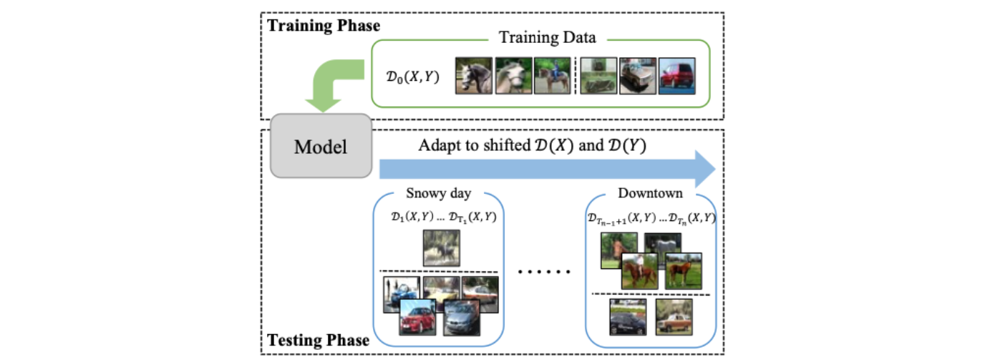
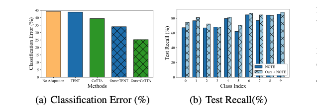
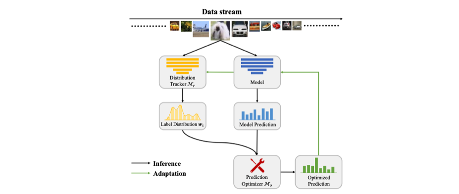
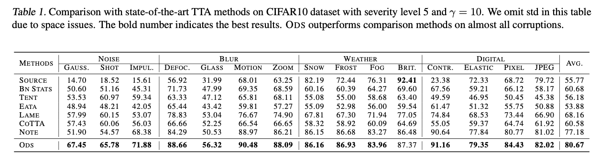
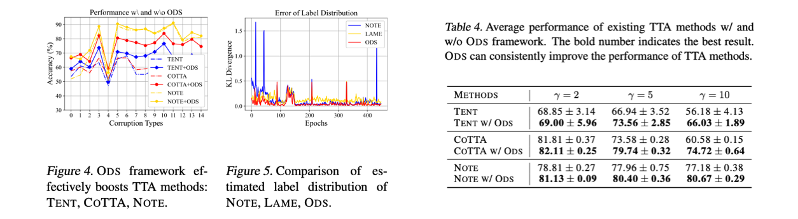

> A summary of the ICML 2023 oral paper, "ODS: Test-Time Adaptation in the Presence of Open-World Data Shift."

### Introduction

Test-time adaptation (TTA) refers to the task of adapting a source model $f_{\theta_0}$, trained on source data $D_0(X,Y)$, to test data that has undergone distribution shift from the source data.

<i>Taken from Zhi Zhou, et al.</i>

Typically, TTA settings assume only covariate shift with respect to $X$. However, this paper argues that label distribution shift with respect to $Y$ is also a frequently occurring problem in the real world and must be addressed, establishing a new problem setting called TTA with Open-world Data Shift (AODS).

In particular, in AODS where distribution shifts in both $X$ and $Y$ occur simultaneously, existing TTA algorithms (TENT, CoTTA) are shown to be ineffective or weak as illustrated in the figure below. To address AODS, the paper proposes a Distribution Tracker $\mathcal M_T$ and a Prediction Optimizer $\mathcal M_o$.

<i>Taken from Zhi Zhou, et al.</i>

### Problem and Analysis

##### Terminology

- $X,Y,Z$: Sample, labels, and feature representation, respectively
- $D_t(X)$, $D_t(Y)$: Covariate distribution, label distribution at timestamp $t$
- $w_{t,k}$: Estimated label distribution at $t$
- $BSE$: Balanced source error $\max _{y \in \mathcal{Y}} \mathcal{D}_0(\hat{Y} \neq y \mid Y=y)$. Represents the performance of $f_{\theta_t}$ on $D_0$.
- $\Delta_{C E}(\hat{Y})$: Conditional error gap $\max _{y \neq y^{\prime} \in \mathcal{Y}}\left|\mathcal{D}_0\left(\hat{Y}=y^{\prime} \mid Y=y\right)-\mathcal{D}_t\left(\hat{Y}=y^{\prime} \mid Y=y\right)\right|$. Indicates a large gap between the source error and the error at time $t$, and is used to evaluate the generalization performance of feature representations when a TTA algorithm is applied.
- $K$: number of classes

##### Problem Formulation

The goal of AODS is for the model to adapt well to time-varying $D_t(X)$ and $D_t(Y)$ and achieve good testing time performance.

1. Train a model on class-balanced source data $D_0(X,Y)$ and obtain $\theta_0$.
2. Deploy the model in a real environment where $D_t(X)$ and $D_t(Y)$ change over time (shifting occurs).
3. At each timestamp $t$, the model produces predictions and updates its parameters based on these predictions on unlabeled test data: $\theta_t$ to $\theta_{t+1}$.

##### Problem Analysis

When the estimated label distribution at time $t$ is $w_{t,k}$, the model prediction for label $k$ can generally be adjusted as follows. Essentially, the model's predictions are adjusted using $w_{t,k}$ as a prior. (It is expressed as a ln-sum on the logits rather than a product, but there is no significant difference.)
$$
\hat{Y}_o=\underset{y \in \mathcal{Y}}{\arg \max } f_{\theta_t}(Y=y \mid X)+\ln w_{t, k}
$$
The upper bound on the difference between the error on source data and the error at time $t$ for predictions adjusted based on $w_{t,k}$ is summarized as follows. The derivation is provided in Appendix A. While the precise meaning of each term is not entirely clear to me, the authors state that the first term of this theoretical analysis reveals that accurate estimation of $w_t$ is key to good ODS performance, and this insight inspired their algorithm design.
$$
C\left\|\mathbf{1}-\frac{\mathcal{D}_t(Y)}{\boldsymbol{w}_t}\right\|_1 B S E(\hat{Y})+2(K-1) \Delta_{C E}(\hat{Y})
$$

### ODS Adaptation

In ODS scenarios, directly fitting the model to the data leads to performance degradation, and using existing TTA methods as-is is a suboptimal approach as shown in the earlier figure. Therefore, the authors first estimate $w_t$ through a Distribution Tracker $\mathcal M_T$ module, then use a Prediction Optimizer $\mathcal M_o$ to optimize model predictions. The overall process can be seen in the figure below.

<i>Taken from Zhi Zhou, et al.</i>

First, the objective for ODS adaptation is as follows:
$$
\min _{\theta_t} \frac{1}{N_t} \sum_{i=1}^{N_t} \sum_{k=1}^K S\left(\boldsymbol{w}_t\right)_k f_{\theta_t}\left(Y=k \mid \boldsymbol{x}_i\right) \log f_{\theta_t}\left(Y=k \mid \boldsymbol{x}_i\right)
$$
Here $S(w_t)$ denotes $\operatorname{Normalize}\left({1}-{w}_t\right)$, which serves as a mechanism to weight each class inversely proportional to $w_t$. This enables balanced training even on unbalanced datasets.

The subsequent term represents entropy minimization. Since optimization in TTA refers to optimization on test data, class labels are naturally unavailable. Therefore, cross-entropy cannot be used and the model is trained in an unsupervised manner.

Additionally, this objective can be applied to other TTA methods as long as $w_t$ is available. Therefore, in the Experiments section, the authors also conduct experiments combining the ODS adaptation objective with other TTA methods.

##### Distribution Tracker $\mathcal M_T$

The first step for the ODS adaptation described above is estimating $w_t$. The simplest estimate of the label distribution is $w_t = \frac{1}{N_t} f_{\theta_0}(Y|x_i)$. That is, averaging the predictions of $f_{\theta_0}$ on the test data and using that as the estimate. However, in TTA settings where covariate shift in $X$ exists, directly using $\frac{1}{N_t} f_{\theta_0}(Y|x_i)$ is not ideal, so the authors propose a new method.

$$
\boldsymbol{w}_t=\frac{1}{N_t} \sum_{i=1}^{N_t} \boldsymbol{z}_i
$$
Here $z_i$ is an instance-wise label vector that is optimized to estimate the class label for each individual data sample. And $w_t$ is estimated as the mean of the $z_i$ collection. $z_i$ is optimized through the following equation:
$$
\min _{\boldsymbol{w}_t} \sum_{i=1}^{N_t}\left[\boldsymbol{z}_i^{\top} \log f_{\theta_0}\left(Y \mid \boldsymbol{x}_i\right)+\boldsymbol{z}_i^{\top} \log \boldsymbol{z}_i-\sum_{j=1}^{N_t} s_{i j} \boldsymbol{z}_i^{\top} \boldsymbol{z}_j\right]
$$
The second and third terms represent entropy minimization and a consistency term, respectively (I could not fully interpret the intent of the first term, so I skipped it). Here $s_{i,j}$ denotes the feature similarity of $f_{\theta_t}$ for $x_i, x_j$. In the actual implementation, the iterative solution approach used in LAME (Malik Boudiaf, et al. 2022) was employed.

$$
z_{i, k}^{(n+1)}=\frac{f_{\theta_0}\left(Y \mid \boldsymbol{x}_i\right) \exp \left(\sum_j s_{i, j} z_{j, k}^{(n)}\right)}{\sum_{k^{\prime}} f_{\theta_0}\left(Y \mid \boldsymbol{x}_i\right) \exp \left(\sum_j s_{i j} z_{j, k^{\prime}}^{(n)}\right)}
$$

##### Prediction Optimizer $\mathcal M_o$

The next step is to optimize the final predictions using $w_t$. Since we already have $w_t$, we could perform predictions using the formula mentioned earlier: $\hat{Y}_o=\underset{y \in \mathcal{Y}}{\arg \max } f_{\theta_t}(Y=y \mid X)+\ln w_{t, k}$. However, this approach causes performance degradation when there are many classes, so the following conservative approach is used instead.
$$
\hat{\boldsymbol{y}}_{i, k}=\frac{\sqrt{\boldsymbol{z}_{i, k} f_{\theta_t}\left(Y=k \mid \boldsymbol{x}_i\right)}}{\sum_{k^{\prime} \in \mathcal{Y}} \sqrt{\boldsymbol{z}_{i, k^{\prime}} f_{\theta_t}\left(Y=k^{\prime} \mid \boldsymbol{x}_i\right)}}
$$
Since this formula has a softmax form, it examines the relative dominance between different classes, producing relatively more stable prediction results compared to $\underset{y \in \mathcal{Y}}{\arg \max } f_{\theta_t}(Y=y \mid X)+\ln w_{t, k}$. Denoting the above formula as $\mathcal M_o$, the final result is obtained as $\hat Y_o = \mathcal M_o(f_{\theta_t}(Y=k|x), w_t)$ through $\mathcal M_o$ and $w_t$.

##### Summary

The entire process in order is as follows:

1. Prepare the source-trained model $f_{\theta_0}$ and the current adapted model $f_{\theta_t}$.
2. Use $f_{\theta_0}$ and $f_{\theta_t}$ to optimize $w_t = \frac{1}{N_t}\sum z_i$. Here $z_i$ is optimized by $\frac{f_{\theta_0}\left(Y \mid \boldsymbol{x}_i\right) \exp \left(\sum_j s_{i, j} z_{j, k}^{(n)}\right)}{\sum_{k^{\prime}} f_{\theta_0}\left(Y \mid \boldsymbol{x}_i\right) \exp \left(\sum_j s_{i j} z_{j, k^{\prime}}^{(n)}\right)}$, and $\theta_t$ is used when computing $s_{i,j}$.
3. After obtaining $$w_t$$, perform predictions via $\hat{\boldsymbol{y}}_{i, k}=\frac{\sqrt{\boldsymbol{z}_{i, k} f_{\theta_t}\left(Y=k \mid \boldsymbol{x}_i\right)}}{\sum_{k^{\prime} \in \mathcal{Y}} \sqrt{\boldsymbol{z}_{i, k^{\prime}} f_{\theta_t}\left(Y=k^{\prime} \mid \boldsymbol{x}_i\right)}}$.
4. Optimize $\theta_t$ based on the final predictions: $\min _{\theta_t} \frac{1}{N_t} \sum_{i=1}^{N_t} \sum_{k=1}^K S\left(\boldsymbol{w}_t\right)_k f_{\theta_t}\left(Y=k \mid \boldsymbol{x}_i\right) \log f_{\theta_t}\left(Y=k \mid \boldsymbol{x}_i\right)$. In the experiments, the test batch size is set to 64, and the model is updated after each forward pass on a test batch.
5. Repeat the above process as datasets (CIFAR-10-C, 100-C) arrive sequentially.

### Experiments

##### Dataset

The datasets used are CIFAR10-C and CIFAR100-C, which were also used in previous TTA methods. These are the CIFAR10/100 datasets with 15 types of corruption applied.

However, label distribution shift is additionally introduced by simply making certain major class samples N times more frequent than minor class samples. If the experimental results table shows $\gamma=5$, it means major class A has 5 times more samples than minor classes B, C, D.

##### Empirical Results

ODS shows performance superiority compared to existing TTA methods.

Furthermore, incorporating the ODS approach into other TTA methods can further boost their performance.

Performance increases as the Distribution Tracker $\mathcal M_T$ and Prediction Optimizer $\mathcal M_o$ are added. The table shows that adding $\mathcal M_o$ in particular is especially important.

### Reference

- Boudiaf, M., Mueller, R., Ben Ayed, I., and Bertinetto, L. Parameter-free online test-time adaptation. In Proceed- ings of the IEEE/CVF Conference on Computer Vision and Pattern Recognition, pp. 8344–8353, 2022.
- Zhi Zhou, et al. "ODS: Test-Time Adaptation in the Presence of Open-World Data Shift." ICML 2023.
- Taesik Gong, et al. "NOTE: Robust continual test-time adaptation against temporal correlation." *Advances in Neural Information Processing Systems* 35 (2022): 27253-27266.

