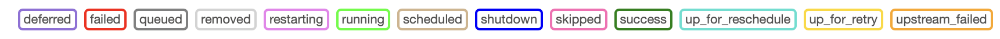
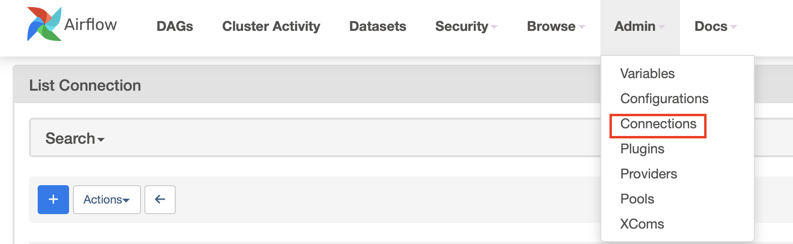
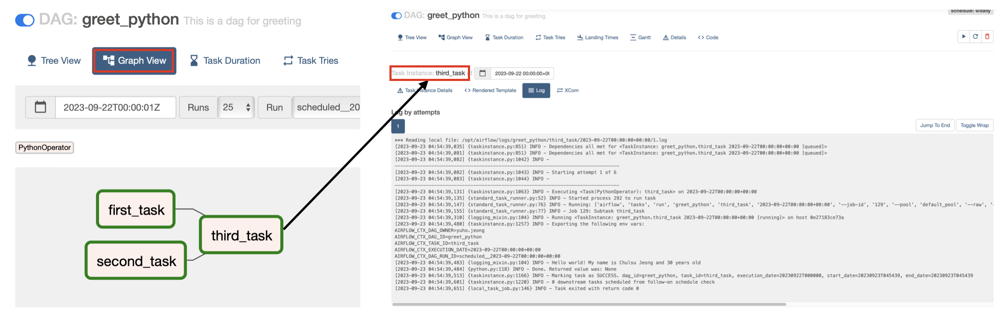

> Apache Airflow is a workflow management system created by Airbnb. This post covers basic examples and usage of Airflow DAGs.

### Basics

- DAG: A collection of Tasks
- Task: The basic unit of execution in Airflow DAGs
- Operator: A template for implementing Tasks. The most basic ones are BashOperator and PythonOperator, along with others such as SQL Operator and Http Operator
- Sensor: Periodically checks whether a specific condition is met for an external event
- XComs (i.e., cross-communications): XComs allow tasks to exchange information. JSON is supported, but large data such as DataFrames is not. Therefore, for large data, the common design pattern is to save it to a separate storage location and pass the storage path via XComs
- Task Lifecycle: `no_status` $\to$ Scheduler  $\to$ `{status}`  $\to$ Executor  $\to$ `{status}`  $\to$ Worker  $\to$ `{status}`



### Installation

You can either install Airflow via pip in a local virtual environment or pull the Airflow Docker image. Using Docker is recommended.

##### Airflow w. PIP Install

1. Check the Airflow version and download instructions from the [official repository](https://github.com/apache/airflow) and install it.
2. Set the environment variable: `export AIRFLOW_HOME=.`
3. Run the Airflow DB, web server, and scheduler respectively: `airflow db init`, `airflow webserver -p 8080`, `airflow scheduler`
4. Check user setup instructions with `airflow users create --help`, then set a username and password.
5. Access localhost:8080/ to verify that the web server is running properly.

#####  Airflow w. Docker

1. Download the compose file with the following command: `curl -Lf0 'https://airflow.apache.org/docs/apache-airflow/2.0.1/docker-compose.yaml"`
2. Create the default directories with: ``mkdir ./dags ./logs ./plugins``
3. Initialize and run the compose file in order: `docker-compose up airflow-init`, `docker-compose up -d`
4. Access localhost:8080/ to verify that the web server is running properly.
5. You can create a user via `airflow users create --help` in the webserver container. (Default user is name: airflow, passwd: airflow)

### DAGs

Setting the `AIRFLOW__CORE__LOAD_EXAMPLES` option to true in the `docker-compose.yaml` file allows you to view various DAG examples.

##### Example Code: Hello World!

Simple example code is also available [here](https://github.com/yuhodots/airflow/blob/main/dags/greet_python.py).

- `start_date`: The reference starting point. The actual execution begins at 'start_date + interval'
- `execution_date`: Not the actual execution date, but the time the schedule was attempted (historical name for what is called a *logical date*)
- `catchup`: Used when there is a gap between the current date and start date, requiring DAGs to also run for past data. When set to False, only the most recent DAG is executed
- `backfill`: Used to run DAGs whose scheduled times have already passed
- `retries`: Retries execution when a task fails
- `retry_delay`: Time to wait before retrying

```python
from datetime import datetime
from airflow import DAG
from airflow.operators.bash import BashOperator

default_args = {
  'owner': 'yuhodots',
  'retries': 5,
  'retry_delay': timedelta(minutes=2)
}

with DAG(
	dag_id='first_dag',
  default_args=default_args,
  description='first dag'
  start_date=datetime(2023, 9, 1, 2),
  schedule_interval='@daily'
) as dag:

  task1 = BashOperator(
  	task_id='first_task',
    bash_command="echo hello world, this is the first task!"
  )
  task2 = BashOperator(
  	task_id='second_task',
    bash_command="echo hello world, this is the second task!"
  )
  task1 >> task2	# same with `task1.set_downstream(task2)`
```

```python
from datetime import datetime
from airflow import DAG
from airflow.operators.python import PythonOperator

default_args = {
  'owner': 'yuhodots',
  'retries': 5,
  'retry_delay': timedelta(minutes=2)
}

def greet(name, age):
  print(f"Hello world! My name is {name} and {age} years old")

with DAG(
	dag_id='first_dag',
  default_args=default_args,
  description='first dag'
  start_date=datetime(2023, 9, 1, 2),
  schedule_interval='@daily'
) as dag:

  task1 = PythonOperator(
  	task_id='first_task',
    python_callable=greet,
    op_kwargs={'name': 'Yuho Jeong', 'age': 27}
  )

  task1
```

Instead of `with DAG (...) as dag:`, the following form is also possible.

```python
from airflow.decorators import dag
from airflow.operators.python import PythonOperator

def greet(name, age):
  print(f"Hello world! My name is {name} and {age} years old")

@dag(...)
def greet_dag():
    task1 = PythonOperator(
  		task_id='first_task',
    	python_callable=greet,
    	op_kwargs={'name': 'Yuho Jeong', 'age': 27}
  	)
    task1

dag = greet_dag()
```

##### XComs

Exchanging information between tasks via XComs is possible through the xcom_push and xcom_pull methods of the TaskInstance object.

```python
from airflow.decorators import dag
from airflow.operators.python import PythonOperator
from airflow.models import TaskInstance

def test_xcoms_push(ti: TaskInstance):
  ti.xcom_push(key="first_item", value=['first_item'])
  ti.xcom_push(key="second_item", value=['second_item'])

def test_xcoms_pull(ti: TaskInstance):
  item1 = ti.xcom_pull(key="first_item", task_ids="test_xcoms_push")
  item2 = ti.xcom_pull(key="second_item", task_ids="test_xcoms_push")
  print(item1, itme2)

@dag(...)
def dag_function():
    task1 = PythonOperator(
  		task_id='test_xcoms_push',
    	python_callable=test_xcoms_push,
  	)
    task2 = PythonOperator(
  		task_id='test_xcoms_pull',
    	python_callable=test_xcoms_pull,
  	)
    task1 >> task2

dag = dag_function()
```

##### Connection

You can configure connections in the Admin tab of the Webserver. Connections manage external connections and are typically used for connecting to DB servers, data lakes, etc., that reside in the cloud.



##### Graph View & Log

You can view the DAG structure at a glance through the graph view, and the execution results of each node can be checked in the log that appears when clicking on each node.



### Debugging

Add the following code at the very bottom of your DAG script file. This enables debugging in IDEs like VSCode! (with `.vscode/launch.json`)

```python
# with DAG(...) as dag:

if __name__ == "__main__":
    dag.test()
```

### Re-run

- Catchup runs past batch jobs when the DAG deployment occurs later than the start_date setting. Additionally, you can re-run previous batch jobs through backfill or clear
- Backfill command: `airflow dags backfill -s <START_DATE> -e <END_DATE> <DAG_ID>`
- Clear: Clear the desired batch job through the Airflow web UI

### References

The following resources are also worth referencing.

- Apache Airflow DAGs: https://airflow.apache.org/docs/apache-airflow/stable/core-concepts/dags.html
- Airflow Tutorial for Beginners - Full Course in 2 Hours 2022: https://www.youtube.com/watch?v=K9AnJ9_ZAXE&t=37s
- Google Gloud DAG documents: https://cloud.google.com/composer/docs/how-to/using/writing-dags?hl=ko
