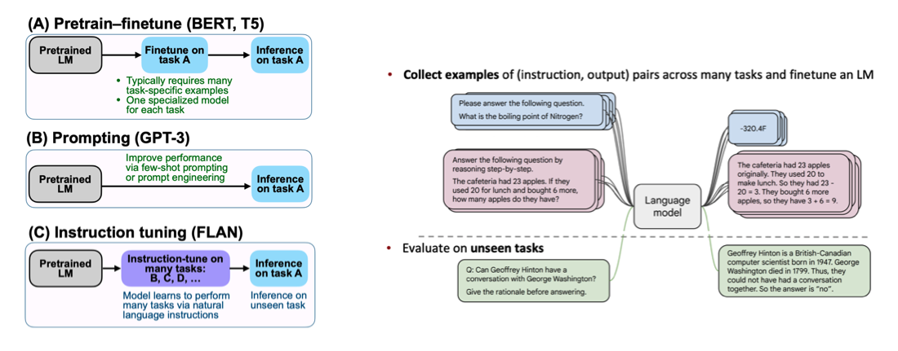
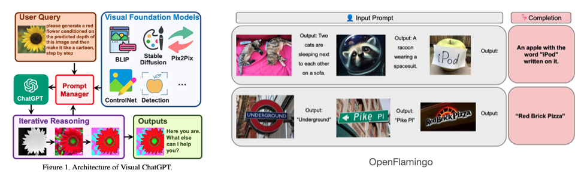
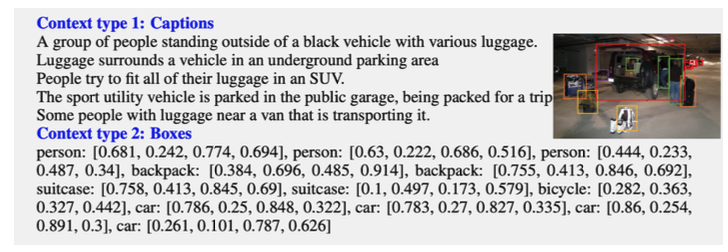
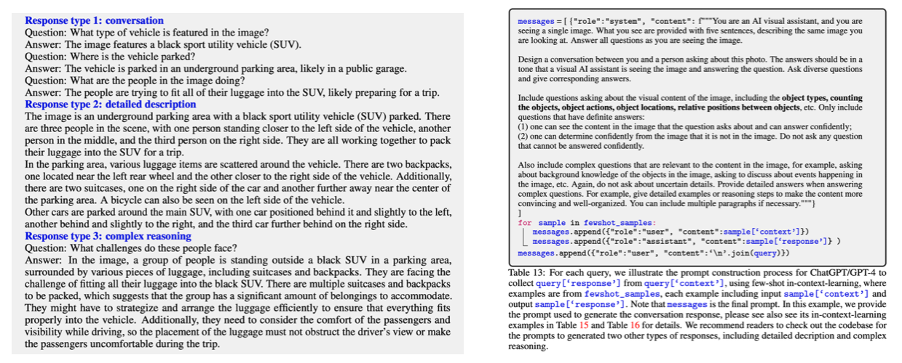
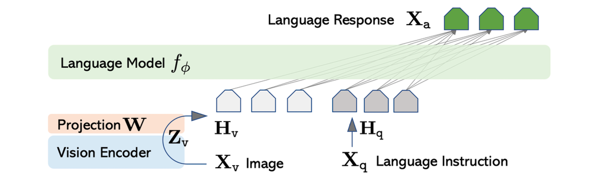
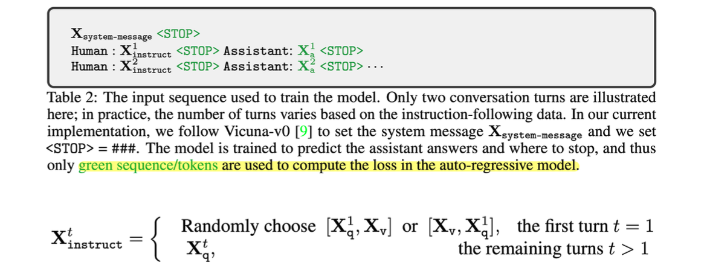
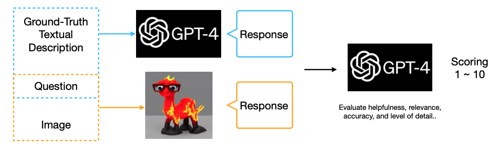
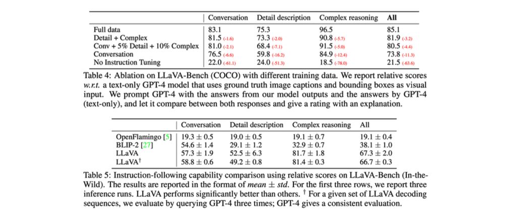
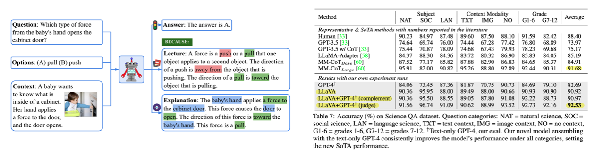

> This post summarizes the Visual Instruction Tuning paper, selected as an oral paper at NeurIPS 2023. Also known as LLaVA, it is the first paper in the multimodal learning field to attempt model training with an instruction tuning dataset consisting of image-text pairs.

### Introduction

Recently in the NLP field, many LLM models such as Alpaca, Vicuna, and GPT-4-LLM have emerged that use machine-generated instruction-following data to improve zero-shot performance. However, since these studies focus solely on language models, the authors of this paper propose a method for creating machine-generated instruction-following data and training models in the multimodal space.

Before diving in, let us first look at the contributions of this paper.

1. They created instruction-following data in the multimodal space.
2. They trained a large multimodal model using this data.
3. They provide a multimodal instruction-following benchmark for evaluation.
4. All of this is provided as open source.

### Related Works

Among related works, there is first instruction tuning. To leverage pre-trained LLMs for specific tasks, early approaches used the pretrain-finetune paradigm. First, the backbone was trained with masked language modeling (MLM), followed by fine-tuning for the target task. Subsequent studies also employed in-context learning, where appropriate few-shot prompts were provided to the model.

More recently, instruction tuning has become widely used, where instruct-response pair data for various tasks is provided for tuning. These instruction tuning approaches have achieved strong zero-shot performance.

Other related works include multimodal instruction-following agents and multimodal LLMs (Habitat, InstructPix2Pix, VisualChatGPT, OpenFlamingo, LLaMA-Adapter, etc.). However, these are either models/agents designed for only a single task or models that have not been tuned with vision-language instruction-following data, resulting in insufficient performance. This is what differentiates them from LLaVA.

### Multi-Modal Instruction-Following Data

##### Textual Description

This paper proposes leveraging GPT-4/ChatGPT to create multimodal instruction-following data. That is, GPT-4/ChatGPT is treated as a strong teacher, and their responses are used as ground truth. However, since GPT is fundamentally a text-only model, image inputs cannot be directly provided.

Therefore, the authors provide two additional types of information to GPT -- captions and bounding boxes -- to generate multimodal instruction-following data without image input. This allows GPT to respond as if it were viewing the image using text alone. The COCO dataset is used to provide the caption and bounding box information.

- Caption: Text that describes the visual scene from various perspectives.
- Bounding box: Provides (localizes) the position of objects in the scene in [x_min, y\_min, x\_max, y\_max] format.

##### Response Type

Three types of instruct-response pairs are generated based on textual descriptions.

- Conversation: Provides questions and answers about what objects are in the image, how many there are, where they are located, etc.
- Detailed description: Provides detailed explanations and descriptions of the image. (e.g., questions in the form of "Describe the following image in detail")
- Complex reasoning: While conversation and detailed description deal with questions and answers about visual context, complex reasoning provides questions and answers that require deeper thought or inference.

Examples of response types and prompts used for data generation can be found on the right side of the image below.

### Visual Instruction Tuning

##### Architecture

The model architecture consists of a combination of the Vicuna model $f_\phi$, CLIP visual encoder, and a projection layer $\mathbf W$. Vicuna was used because it showed the best instruction-following performance on language tasks at the time, and the projection layer was used to transform CLIP image features to match the word embedding space.

When using the created multimodal instruction-following data for actual training, it is provided in the form of multi-turn conversation data. The detailed approach is as follows.

1. A system message is provided first for prompt engineering.
2. Multi-turn data is constructed with alternating human instructions and assistant answers.
3. For the very first instruction, both text and image are provided, with the order of text and image randomly selected.
4. Loss is computed only for the stop token and assistant answers.

##### Two-Stage Training

Training is performed in two stages. First, pre-training for feature alignment is conducted. This stage is designed to align $ \mathbf H_v$ well with word embeddings. Not the entire dataset but only a filtered subset was used for training, and only single-turn conversation data was used. Only the projection matrix $\mathbf W$ is tuned while the remaining parameters are frozen. After this, end-to-end fine-tuning is performed. The CLIP visual encoder is frozen and the remaining parameters are tuned.

### Experiments

##### Multimodal Chatbot

This paper provides a multimodal chatbot and ScienceQA task as benchmarks for evaluating multimodal LLM performance. For the multimodal chatbot task, quantitatively evaluating answer quality is challenging. To address this, the authors propose a method for quantitative evaluation based on GPT-4.

The detailed method is as follows. Textual descriptions and questions are input to GPT-4 to obtain a response, and images and questions are input to LLaVA to obtain a response. These two responses are then input back to GPT-4, which scores how similar LLaVA's results are to GPT-4's. The results can be seen in the table below.

##### ScienceQA

Evaluation is also performed on the ScienceQA dataset. The ScienceQA dataset provides multimodal questions and multiple choices on science topics to measure how well a model selects the correct answer.

Here, two versions of GPT-4 and LLaVA ensemble are provided, and among them, GPT-4 judge shows higher performance than MM-CoT, the ScienceQA SoTA at the time.

- GPT-4 complement: If GPT-4 fails to answer, LLaVA provides the answer
- GPT-4 judge: If GPT-4 and LLaVA give different answers, both answers are collected and re-prompted to GPT-4

### References

[^1]:Jason Wei, et al. "Finetuned Language Models are Zero-Shot Learners." *International Conference on Learning Representations*. 2022.
[^2]: Anas Awadalla, et al. "Openflamingo: An open-source framework for training large autoregressive vision-language models." *arXiv preprint arXiv:2308.01390* (2023).
[^3]: Haotian Liu, et al. "Visual Instruction Tuning." NeurIPS 2023.
[^4]:  Pan Lu, et al., "Learn to Explain: Multimodal Reasoning via Thought Chains for Science Question Answering," The 36th Conference on Neural Information Processing Systems (NeurIPS), 2022.
