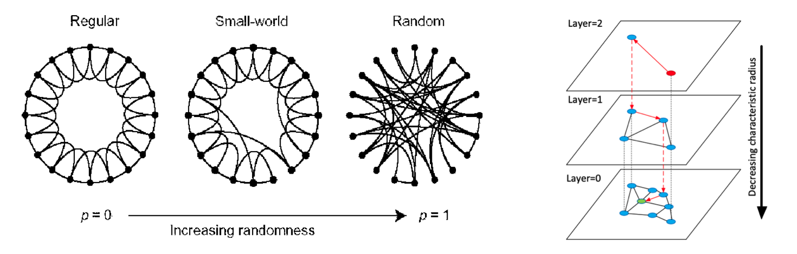

> To make data-driven decisions or integrate AI algorithms and rules into services, it is necessary to process various data, store it in databases, and run queries. This post covers vector DB usage, basic SQL query syntax, and visualization methods.

### Qdrant

- Qdrant should be seen as a vector search engine rather than a vector DB
- Qdrant $\to$ Collection $\to$ Shard $\to$ Segment. It would be useful to compare this with other search engines
- Collections: A set of points (vectors with a payload)
- Points: Composed of a vector and a payload (optional)
- Payload: Additional information that can be stored alongside a vector
- Search: Provides dot, cosine, and Euclidean similarity search by default
- Index: A payload index for improving filtering speed and a vector index for improving vector search speed

##### Vector Search with HNSW

HNSW is one of the vector search algorithms and is important for understanding how Qdrant works. The NHN Forward [presentation](https://www.youtube.com/watch?v=hCqF4tDPNBw) also provides a great explanation, which I referenced here.

- k-Nearest Neighbor: Computes the distance between the search target vector and all other vectors, returning the k nearest ones
- Approximate Nearest Neighbor (e.g., ANNOY): A tree-based ANN technique developed by Spotify that slightly reduces accuracy in exchange for faster search speed. Divides all vectors into multiple spaces to build a tree-structured data structure for searching. The data structure must be rebuilt whenever new data arrives, resulting in high build costs for data additions
- Hierarchical Navigable Small World: Influenced by the [Skip-list](https://en.wikipedia.org/wiki/Skip_list) and Navigable Small World concepts
  - Looking at the right side of the image below makes it easier to understand: for a green query starting from the red start point, think of it as descending to a deeper layer each time the nearest neighbor is found (greedy search)
  - Easy to add data; performance varies based on data distribution. Faster response time and higher recall for clustered data
- HNSW challenges: (1) Index build time is still required (2) Does not guarantee 100% accuracy/recall (3) Has a sequential read pattern making parallelization impossible. Qdrant uses quantization & oversampling to address these limitations
- Filterable HNSW (payload-based refinement): Implemented with in-place filtering since post-filtering and pre-filtering are inefficient

<center><p><i>Taken From, Yury A. Malkov, et al.</i></p></center>

##### Python qdrant client

1. Client initialization

```python
from qdrant_client import QdrantClient
from qdrant_client.http.models import Distance, VectorParams, PointStruct
from qdrant_client.http.models import Filter, FieldCondition, MatchValue
client = QdrantClient("localhost", port=6333)
```

2. Creating a collection

```python
client.create_collection(
    collection_name="test_collection",
    vectors_config=VectorParams(size=4, distance=Distance.DOT),
)
```

3. Adding vectors

```python
operation_info = client.upsert(
    collection_name="test_collection",
    wait=True,
    points=[
        PointStruct(id=1, vector=[0.05, 0.61, 0.76, 0.74], payload={"city": "Berlin"}),
        PointStruct(id=2, vector=[0.19, 0.81, 0.75, 0.11], payload={"city": "London"}),
        PointStruct(id=3, vector=[0.36, 0.55, 0.47, 0.94], payload={"city": "Moscow"}),
    ],
)
```

4. Running queries

```python
# run a query without filter
search_result = client.search(
    collection_name="test_collection", query_vector=[0.2, 0.1, 0.9, 0.7], limit=2
)

# run a query with filter
search_result = client.search(
    collection_name="test_collection",
    query_vector=[0.2, 0.1, 0.9, 0.7],
    query_filter=Filter(must=[FieldCondition(key="city", match=MatchValue(value="London"))]),
    limit=2,
)
```

### SQL

##### Basics

```
SELECT columns
FROM table
WHERE condition
GROUP BY grouping_criteria
ORDER BY sorting_criteria
LIKE string_condition
LIMIT output_count
	OFFSET exclude_first_N
	...;
```

##### Join

Join examples provided by ChatGPT for the `employees` table and the `departments` table

| employee_id | employee_name | department_id |
| ----------- | ------------- | ------------- |
| 1           | John Doe      | 101           |
| 2           | Jane Smith    | 102           |
| 3           | Mike Brown    | NULL          |

| department_id | department_name |
| ------------- | --------------- |
| 101           | Human Resources |
| 102           | Finance         |
| 103           | IT              |

- `INNER JOIN`: Returns records that have matching values in both tables

```sql
SELECT employees.employee_name, departments.department_name
FROM employees
INNER JOIN departments
	ON employees.department_id = departments.department_id;
```

| employee_name | department_name |
| ------------- | --------------- |
| John Doe      | Human Resources |
| Jane Smith    | Finance         |

- `LEFT JOIN` (LEFT OUTER JOIN): Returns all records from the left table and matching records from the right table

```sql
SELECT employees.employee_name, departments.department_name
FROM employees
LEFT JOIN departments
	ON employees.department_id = departments.department_id;
```

| employee_name | department_name |
| ------------- | --------------- |
| John Doe      | Human Resources |
| Jane Smith    | Finance         |
| Mike Brown    | NULL            |

- `RIGHT JOIN` (RIGHT OUTER JOIN): Returns all records from the right table and matching records from the left table

```sql
SELECT employees.employee_name, departments.department_name
FROM employees
RIGHT JOIN departments
	ON employees.department_id = departments.department_id;
```

| employee_name | department_name |
| ------------- | --------------- |
| John Doe      | Human Resources |
| Jane Smith    | Finance         |
| NULL          | IT              |

- `OUTER JOIN` (FULL OUTER JOIN): Returns all records that have a match in either the left or right table

```sql
SELECT employees.employee_name, departments.department_name
FROM employees
FULL OUTER JOIN departments
	ON employees.department_id = departments.department_id;
```

| employee_name | department_name |
| ------------- | --------------- |
| John Doe      | Human Resources |
| Jane Smith    | Finance         |
| Mike Brown    | NULL            |
| NULL          | IT              |

- `UNION`: Combines the result sets of each SELECT. All columns for UNION must have the same count, similar data types, and the same order.
  - `UNION` removes duplicate rows, so use `UNION ALL` to allow duplicates

```sql
SELECT employee_name FROM employees WHERE department_id = 101
UNION
SELECT employee_name FROM employees WHERE department_id = 102;
```

| employee_name |
| ------------- |
| John Doe      |
| Jane Smith    |

##### Advanced

- `LIKE`: '%' represents N characters, '_' represents a single character

- `GROUP BY`: Groups rows with the same values together. Often used with aggregate functions such as `COUNT()`, `MAX()`, `MIN()`, `SUM()`, `AVG()`
  - All columns in the SELECT statement must either be aggregate functions or exist in the GROUP BY clause
  - When used without aggregate functions as in the example below, it can be used to check unique rows with duplicates removed

```sql
select column1, column2, column3, column4
from schema.table
group by 1, 2, 3, 4
```

- `CASE WHEN condition THEN result1 ELSE result2 END`

```sql
SELECT
  employee_name,
  CASE
    WHEN department_id IS NULL THEN 'No Department'
    ELSE (SELECT department_name FROM departments WHERE department_id = employees.department_id)
  END AS department_status
FROM employees;
```

| employee_name | department_status |
| ------------- | ----------------- |
| John Doe      | Human Resources   |
| Jane Smith    | Finance           |
| Mike Brown    | No Department     |

- `WITH`: A clause that defines a named sub-query for use
  - The advantages of using WITH clauses are explained in great detail on [schatz37](https://schatz37.tistory.com/46)'s blog, and it is worth reading multiple times (the Materialize approach not only improves readability but also leads to query performance improvements)

```sql
WITH temp_table1 AS ( SELECT ... ),
WITH temp_table2 AS( SELECT ... )
SELECT * FROM temp_table1, temp_table2
```

- **Window function**: There are MAX, MIN, RANK, etc., but here is an example with ROW_NUMBER
  - `WINDOW_FUNCTION (ARGUMENTS) OVER ([PARTITION BY][ORDER BY][WINDOWING])`
  - When written as below, it allows you to pick only the most recently added data to the data warehouse among duplicate data (deduplication)

```sql
SELECT * FROM
(
  SELECT
  	some_data_column,
  	dw_load_timestamp,
  	row_number() OVER (
    	PARTITION BY some_data_column
      ORDER BY dw_load_timestamp DESC
    ) AS rn
  FROM some_table
)
WHERE rn = 1
```

- Other clauses include `SELECT INTO`, `INSERT INTO`, `EXISTS`, `HAVING`, `ANY`, `ALL`, etc.
- Key types: super key, candidate key, primary key, foreign key, composite key, alternate key
- Normalization: 1NF, 2NF, 3NF, BCNF
- Entity Relationship Diagrams (ERD) can be drawn using https://dbdiagram.io/home. In particular, creating junction (join) tables for many-to-many relationships is recommended
- Query Optimization: Examining the query plan shows how queries are executed and helps identify which parts need tuning
- Topics for further research: Constraints, Referential integrity, etc.

### NoSQL

##### MongoDB

```json
{
    "$and": [
        {
            "key_name1": {"$regex": "some_value1"}
        },
        {
            "key_name2": {
                "$not": {"$regex": "some_value2"}
            }
        },
        {
        		"key_name3": "some_value3"
        }
    ]
}
```

### Advanced Topics

Additional DB-related concepts are listed below, along with reference links.

- Master, Transaction, History tables
- Design pattern: ODS, DW, DM, ETL, CDC, EDW, OLAP
- Partitioning, Sharding, Replication, Indexing, Stored procedure
- ETL patterns: https://aws.amazon.com/ko/blogs/big-data/etl-and-elt-design-patterns-for-lake-house-architecture-using-amazon-redshift-part-1/
- Links
  - https://yannichoongs.tistory.com/232
  - https://aiday.tistory.com/123
  - https://code-lab1.tistory.com/202
  - https://hudi.blog/db-partitioning-and-sharding/

### References

- https://qdrant.tech/documentation/quick-start/
- [Qdrant: Getting Started with Qdrant](https://www.youtube.com/watch?v=lFMKUCNw5ac)
- [Qdrant: Image Classification with Qdrant Vector Semantic Search](https://www.youtube.com/watch?v=sNFmN16AM1o)
- [Qdrant: Open Source Vector Search Engine and Vector Database Andrey Vasnetsov](https://www.youtube.com/watch?v=lFMKUCNw5ac)
- [[NHN FORWARD 22] 대충? 거의 정확하다! 벡터 검색 엔진에 ANN HNSW 알고리즘 도입기 (feat. SWIG Golang)](https://www.youtube.com/watch?v=hCqF4tDPNBw)
- Yury A. Malkov, et al. "Efficient and robust approximate nearest neighbor search using Hierarchical Navigable Small World graphs"
