> This post, written as part of the Pseudo Lab 7th cohort 'Writing About Latest Research Trends in a Fun and Easy Way' group, is shared here. The topic of Weakly-Supervised Instance Segmentation was selected, and the article covers recent research trends in this area, targeting readers with a background in computer vision.

### Introduction

Representative problems in the field of computer vision include classification, object detection, and image segmentation.

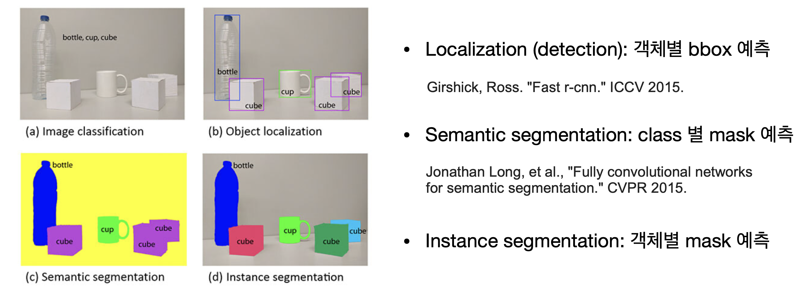

Among these, image segmentation -- which predicts per-object masks (regions where objects exist in an image) -- has several sub-categories.

- Semantic segmentation: The problem of predicting masks for each type of object in an image. For example, it involves predicting the mask for the region where cups exist, the mask for the region where cubes exist, and the mask for the region where plastic bottles exist, separately.
- Instance segmentation: The problem of predicting masks by separately segmenting even objects of the same type. For example, the mask for the first cube, the mask for the second cube, and the mask for the third cube must all be predicted separately even if they are of the same type.
- Panoptic segmentation: The problem of performing segmentation on backgrounds (stuff) as well as objects, while also predicting individual masks for each object.

Training deep learning models requires ground truth (GT) labels for the model to learn from. Segmentation GT consists of masks for regions where objects exist and class information for those objects. However, there are cases where less detailed information is used as ground truth, which is called 'weak supervision'. Types of weak supervision include bounding boxes, labeled points, and scribbles.

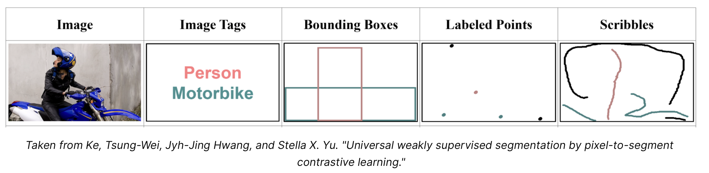

### Instance Segmentation

##### Unsupervised Methods

Based on the idea of 'how can we obtain object masks (contours) in an image through code?', related research has been ongoing since the 1990s.

Before deep learning, rather than updating models based on mask GT values, unsupervised learning methods were commonly used that separate regions and predict masks using information such as color, brightness, and texture within images.

- K-means clustering: Performs k-means clustering on pixels (or features). Image pixels (or features) belonging to the same cluster are treated as a single larger pixel unit called a super-pixel, and region segmentation is performed between super-pixels.
- Level-set methods: Updates a surface function based on a specific formula (energy function) and uses the final update result for segmentation.
- Graph Cuts (Boykov and Jolly, 2001): Treats the image as a graph, pixels as graph nodes, and connects graph nodes (i.e., pixels) judged to be similar to segment regions. The most famous follow-up paper is GrabCut (Carsten Rother, et al., 2004).
- Multiscale Combinatorial Grouping (MCG) (Pablo Arbela'ez, et al., 2014): Proposes a method that can handle multi-scale variations, since the scale of objects within an image varies depending on the image.

The most recently proposed Multiscale Combinatorial Grouping (MCG) algorithm operates in the following order.

1. Create multiple copies of the image at different sizes (resolutions) (image pyramid)
2. Form a contour map for each image at different resolutions. Color, brightness, texture, and other information are used to form the contour maps.
3. Resize them all to match. This yields multiple images with different contour maps but the same size, which are then appropriately merged into a single contour map.
4. Finally, the resulting contour map is appropriately grouped. (Using SVM, random forest, etc.)

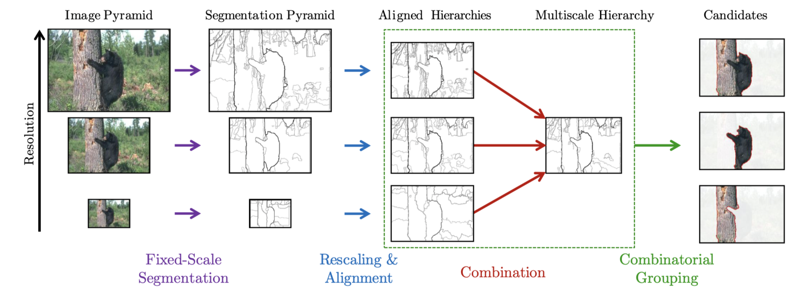

##### Deep Instance Segmentation

With the advancement of deep learning, attempts to apply deep learning to the segmentation field naturally increased. Early attempts to solve instance segmentation with deep learning can be found in Hariharan et al.'s 2014 paper "Simultaneous detection and segmentation (SDS)", which attempted to combine object detection and semantic segmentation into a single model.

The subsequent work Mask-RCNN also leverages object detection and semantic segmentation approaches to perform segmentation at the instance level. Specifically, it predicts masks for objects detected through object detection. Since the most prominent object detection model at the time of publication was Faster-RCNN (NeurIPS 2015), a mask head for mask prediction was added to the Faster-RCNN architecture.

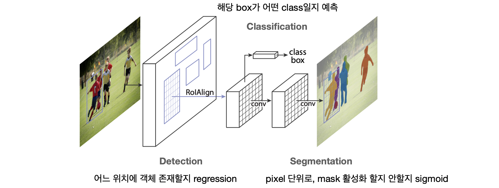

After Mask RCNN, many instance segmentation models have been developed. Among them, one notable paper that achieves strong performance and is frequently cited in follow-up research is "Conditional Convolutions for Instance Segmentation" (CondInst). In particular, subsequent works like BoxInst and BoxTeacher also adopted the CondInst model architecture.

Mask RCNN has the characteristic of sharing the mask head across multiple inputs. That is, the mask head is fixed as one, and only the input values to the mask head differ. However, in this case, when persons A and B are located very close together in the image, it is difficult to predict person B as background for person A. This is because the input values going into the mask head do not differ significantly. Therefore, the authors propose a method that allows the mask head to change dynamically based on the input.

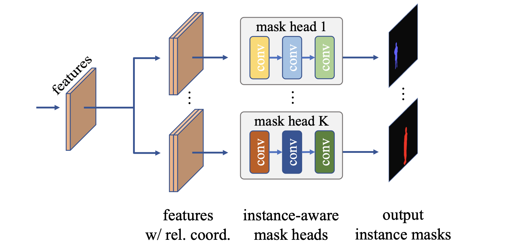

The operational sequence is as follows.

1. Feed the image input to the model to extract (multi-resolution) features.
2. Dynamically determine the mask head weights for each instance based on the features.
3. Generate mask predictions based on the mask head and features.

Mask RCNN required the process of first proposing where objects might exist, cropping those regions, and then performing mask prediction on the cropped images. However, since CondInst uses different mask heads for all inputs, mechanisms like cropping are no longer necessary.

### Weakly-Supervised Instance Segmentation

Image segmentation methods before deep learning were unsupervised learning approaches that did not require mask GT. However, after deep learning, applying supervised learning to segmentation created a problem. Training segmentation models requires mask GT, but creating mask GT took an average of 79.2 seconds per object (based on the COCO dataset). The cost was too high, so a less expensive labeling approach was needed.

##### Box-Supervised Methods

Papers that attempted to address this problem in the semantic segmentation field include BoxSup and Box2Seg. BoxSup (Jifeng Dai, et al., ICCV 2015) creates pseudo labels using box supervision and MCG, then trains FCN with these pseudo labels. Box2Seg (Viveka Kulharia, et al., ECCV 2020) applies GrabCut to box supervision to obtain mask predictions, which are used as pseudo labels.

Although BoxSup, Box2Seg, and others proposed methods to train segmentation models using bounding box information, they all relied on unsupervised learning methods like MCG or GrabCut, and did not propose new losses suitable for box supervision. Consequently, multiple detailed steps were required for training, and the approach was not a single unified framework. Therefore, the authors of BoxInst (Zhi Tian, CVPR 2021) proposed two loss terms suitable for box supervision, presenting a unified box-supervised method that does not require multiple steps.

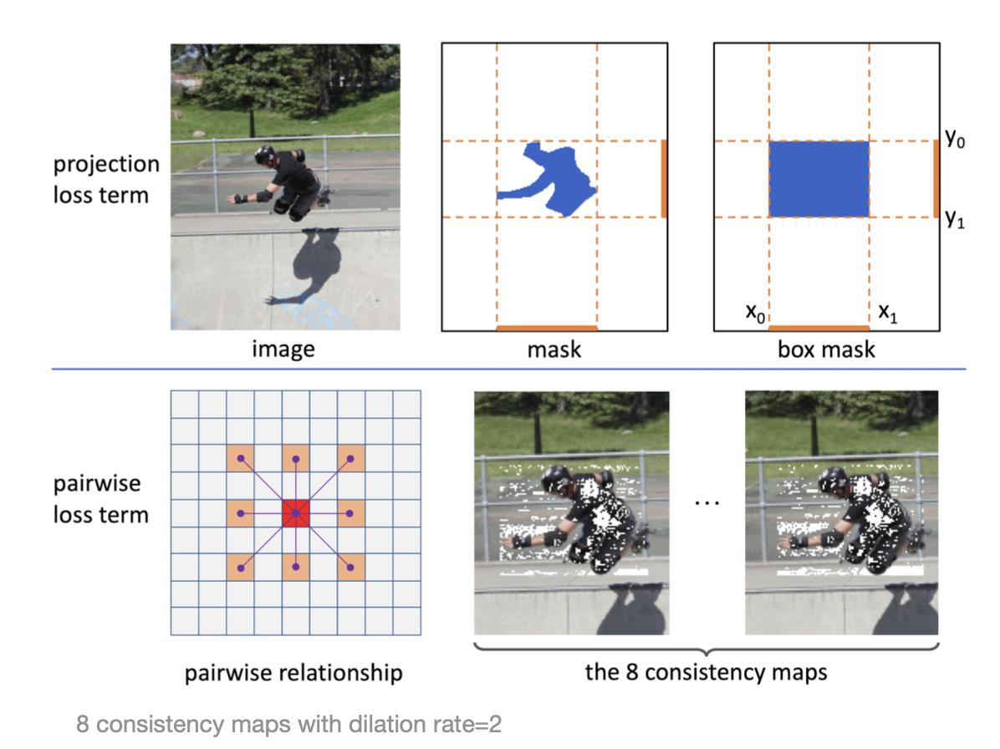

- Projection loss term: Measures how similar the x and y axis projections of the model's mask prediction are to the box GT.
- Pairwise loss term: Claims that when two pixels have similar colors, they tend to share the same label, and encourages nearby pixels with similar colors to be predicted as the same object.

The assumption in BoxInst (that 'similar colors indicate the same instance') is too simplistic, leading to cases where it fails to properly distinguish objects from the background. Therefore, the authors of BoxLevelSet (Wentong Li, et al., ECCV 2022) tried different approaches by bringing in the level set method, which had been occasionally used in the segmentation field. Instead of making predictions all at once, they use the level set method to progressively update mask predictions, and the final updated mask prediction is used as the model output.

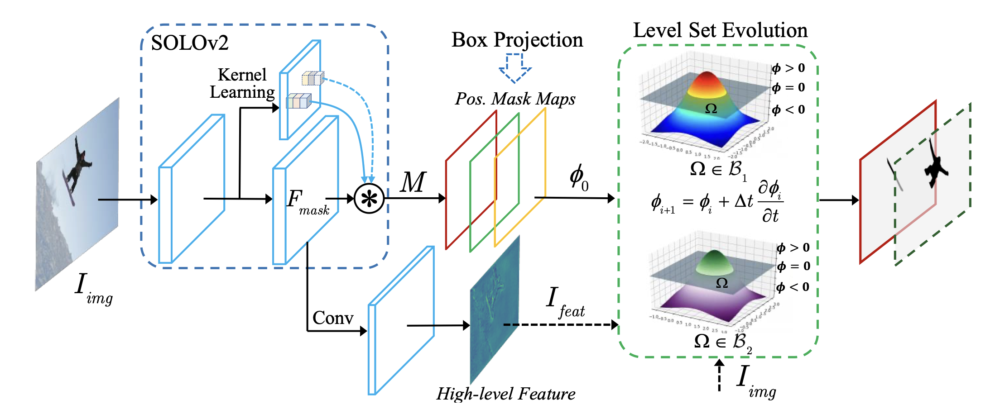

##### Box + Point-Supervised Methods

Although box-supervised methods like BoxInst already existed, performance was still insufficient. At the same time, using a fully-supervised approach was too costly. Therefore, the authors of Pointly-Supervised Instance Segmentation (Bowen Cheng, et al., CVPR 2022) proposed using point supervision in addition to box supervision, and suggested an efficient (fast) method for generating point supervision from box supervision.

1. When an annotator creates a bounding box, points are randomly placed within the bbox
2. The annotator then performs foreground and background labeling for these points
3. This process takes about 15 seconds per object -- about 5 times faster labeling compared to the fully supervised approach

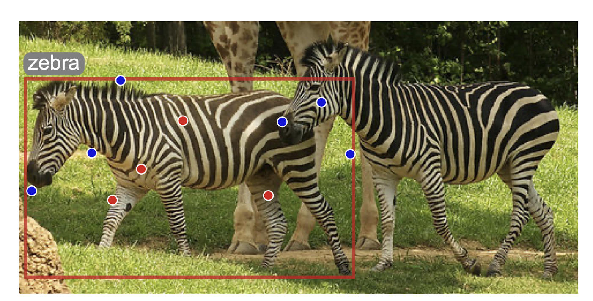

The authors then devised a method to make this point supervision applicable to all other instance segmentation pipelines. That is, they designed and proposed a method for computing mask loss using this point supervision. Through this method, they achieved approximately 94--98% of fully supervised performance.

1. Predictions are made the same way as existing instance segmentation models,
2. Then loss is computed for the GT points, where prediction points use bilinear interpolation of prediction masks. This method requires no structural changes to existing instance segmentation models

##### Point-Supervised Methods

There are also methods that train instance segmentation models using only points (though I have not read them).

- WISE-Net (Issam H Laradji, et al., ICIP 2020)
- BESTIE (Beomyoung Kim, et al., CVPR 2022)
- AttentionShift (Mingxiang Liao, et al., CVPR 2023)

### Semi-Supervised Methods w. Weak-Supervision

While BoxInst is effective, the time has come to consider whether model performance can be further improved without full supervision. On this matter, the authors of BoxTeacher (Tianheng Cheng, CVPR 2023) argue that generating 'high-quality pseudo labels' would help improve performance. Initially, they tried simply treating BoxInst's predictions as ground truth to train an instance segmentation model (labeled as self-training in the figure), but this resulted in lower performance than BoxInst, leading them to devise a different approach.

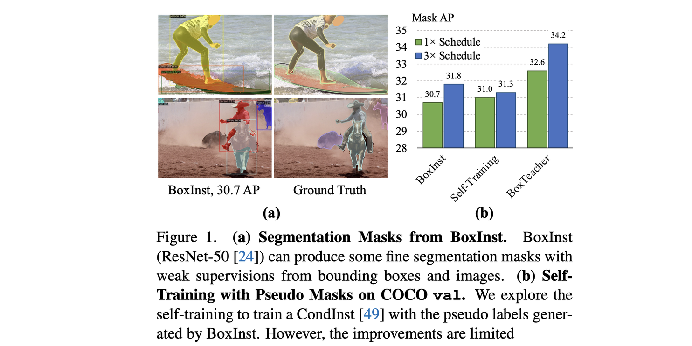

The newly proposed method is as follows.

1. Train models with a Teacher-Student architecture (using CondInst as the backbone) and apply strong augmentation to image inputs
2. Instead of using all model predictions as pseudo labels, filter and use only predictions that are sufficiently similar to box GT (high IoU) and show strong model confidence (high confidence) as pseudo labels
3. Additionally, design and apply a loss to reduce prediction noise

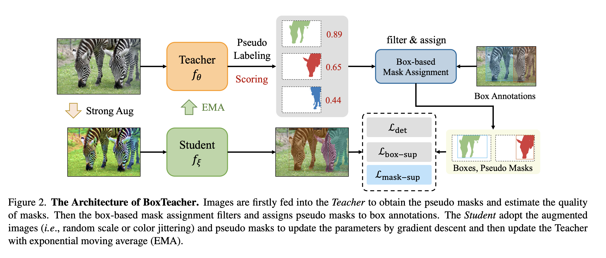

A study conducted concurrently with BoxTeacher is SIM (Ruihuang Li, et al., CVPR 2023), which also advocates creating pseudo-labels from predictions and performing self-training. It even uses the same backbone as BoxTeacher -- CondInst. The motivation of both papers is essentially identical.

Here too, the authors mention why BoxInst predictions cannot be directly used as pseudo labels. The pairwise affinity loss used in BoxInst has difficulty distinguishing foreground from background when they have similar colors. Accordingly, the authors thought that sharing knowledge at the semantic (class) level would improve quality, but naturally, semantic segmentation masks cannot distinguish individual objects. This is because semantic segmentation methods predict all objects of the same class as a single mask, regardless of whether they are different instances.

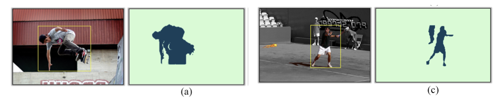

Therefore, the authors decided to create pseudo-labels using both semantic masks and instance masks. The general operation is as follows.

1. Prepare a well-trained instance segmentation model (CondInst or Mask2Former)
2. Predict semantic (class) masks using Class-wise Prototypes
3. Predict instance masks
4. Combine semantic masks and instance masks appropriately to obtain the final pseudo mask
5. Train the model using these pseudo masks
6. Additionally, use a data augmentation method called Copy-paste...

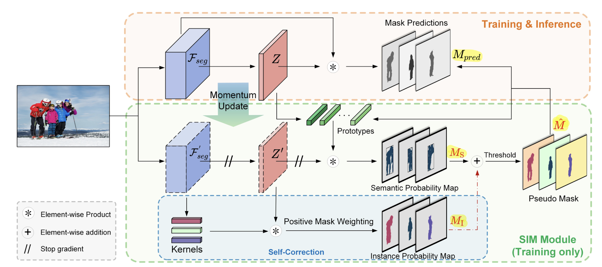

The problems that arise when creating pseudo-labels from instance segmentation model predictions are False-Negative (Missing) and False-Positive (Noise) cases. That is, the model may 'completely miss an object' or 'incorrectly identify the wrong region as an object'.

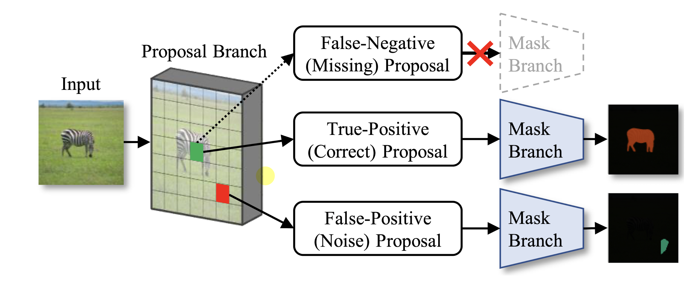

Therefore, the authors of The Devil is in the Points (Beomyoung Kim, et al., CVPR 2023) believed that resolving these two false cases would improve performance, and to this end, they leveraged point labels (which have low labeling cost).

1. If only 10% of the dataset is fully labeled, point supervision is provided for the remaining 90%. This part must be created by humans, but since it is one point per object, the cost is minimal
2. (Step 1): First train the Teacher network and a module called MaskRefineNet using fully-labeled data.
   - MaskRefineNet: A network that takes the `Teacher's mask prediction`, `image`, and `Instance Point` as inputs to refine mask predictions. In other words, it uses point labels to update masks to better predictions!
   - During Teacher training, since point supervision does not exist in the dataset, the center point of the mask prediction is used as the input point
   - During Student training, point supervision from the dataset is used
3. (Step 2): Refine the Teacher's predictions using MaskRefineNet, then use the refined masks as pseudo-labels
4. Additionally, an adaptive strategy is proposed to further refine pseudo labels

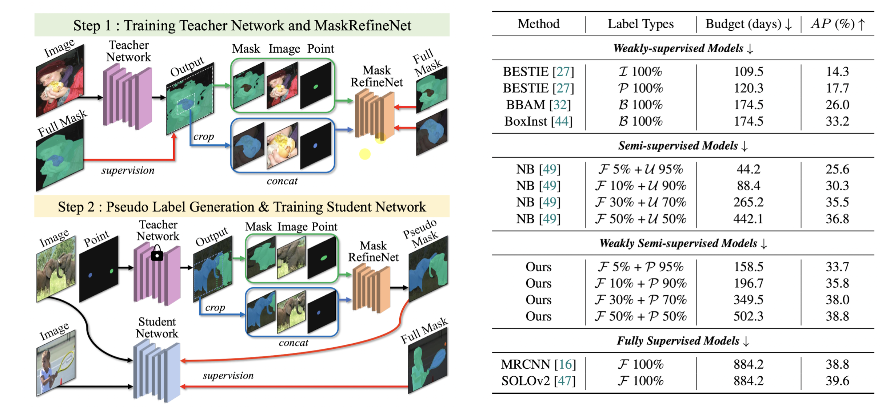

As a result, fully-supervised method performance was achieved using only 50% fully-supervised data. (However, it should be noted that the remaining 50% was additionally provided with point supervision). Furthermore, using only 5% of the data, the method significantly surpassed the existing semi-supervised SoTA.

### References

- Boykov, Yuri Y., and M-P. Jolly. "Interactive graph cuts for optimal boundary & region segmentation of objects in ND images." *Proceedings eighth IEEE international conference on computer vision. ICCV 2001*. Vol. 1. IEEE, 2001.
- Rother, Carsten, Vladimir Kolmogorov, and Andrew Blake. "" GrabCut" interactive foreground extraction using iterated graph cuts." *ACM transactions on graphics (TOG)* 23.3 (2004): 309-314.
- Pablo Arbelaez, et al. "Multiscale combinatorial grouping." *Proceedings of the IEEE conference on computer vision and pattern recognition*. 2014.
- Bharath Hariharan, et al. "Simultaneous detection and segmentation." *Computer Vision--ECCV 2014: 13th European Conference, Zurich, Switzerland, September 6-12, 2014, Proceedings, Part VII 13*. Springer International Publishing, 2014.
- Kaiming He, et al. "Mask r-cnn." *Proceedings of the IEEE international conference on computer vision*. 2017.
- Zhi Tian, Chunhua Shen, and Hao Chen. "Conditional convolutions for instance segmentation." *Computer Vision--ECCV 2020: 16th European Conference, Glasgow, UK, August 23--28, 2020, Proceedings, Part I 16*. Springer International Publishing, 2020.
- Jifeng Dai, Kaiming He, and Jian Sun. "Boxsup: Exploiting bounding boxes to supervise convolutional networks for semantic segmentation." *Proceedings of the IEEE international conference on computer vision*. 2015.
- Viveka Kulharia, et al. "Box2seg: Attention weighted loss and discriminative feature learning for weakly supervised segmentation." *European Conference on Computer Vision*. Cham: Springer International Publishing, 2020.
- Zhi Tian, et al. "Boxinst: High-performance instance segmentation with box annotations." *Proceedings of the IEEE/CVF Conference on Computer Vision and Pattern Recognition*. 2021.
- Wentong Li, et al. "Box-supervised instance segmentation with level set evolution." *European conference on computer vision*. Cham: Springer Nature Switzerland, 2022.
- Bowen Cheng, Omkar Parkhi, and Alexander Kirillov. "Pointly-supervised instance segmentation." *Proceedings of the IEEE/CVF Conference on Computer Vision and Pattern Recognition*. 2022.
- Tianheng Cheng, et al. "Boxteacher: Exploring high-quality pseudo labels for weakly supervised instance segmentation." *Proceedings of the IEEE/CVF Conference on Computer Vision and Pattern Recognition*. 2023.
- Ruihuang Li, et al. "SIM: Semantic-aware Instance Mask Generation for Box-Supervised Instance Segmentation." *Proceedings of the IEEE/CVF Conference on Computer Vision and Pattern Recognition*. 2023.
- Beomyoung Kim, et al. "The Devil is in the Points: Weakly Semi-Supervised Instance Segmentation via Point-Guided Mask Representation." *Proceedings of the IEEE/CVF Conference on Computer Vision and Pattern Recognition*. 2023.
