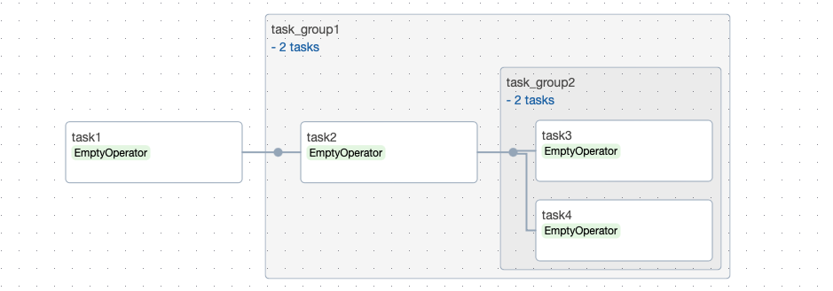
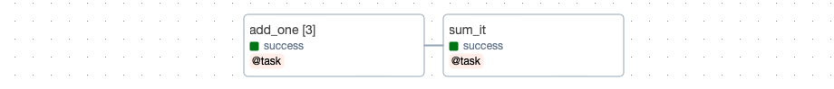
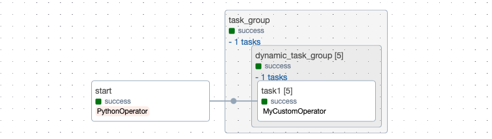

### TaskGroups

When writing Airflow DAGs and connecting multiple tasks, the graph view can become quite complex. To address this, Airflow provides a feature called TaskGroup that helps organize tasks into hierarchical groups. As shown in the sample code below, you can easily use it via the `task_group` decorator.

```python
@dag(dag_id="hello_world", start_date=datetime(2023, 12, 1, tzinfo=pendulum.timezone("Asia/Seoul")))
def hello_world():
    task1 = EmptyOperator(task_id="task1")
    @task_group(group_id="task_group1")
    def task_group1():
        task2 = EmptyOperator(task_id="task2")

        @task_group(group_id="task_group2")
        def task_group2():
            task3 = EmptyOperator(task_id="task3")
            task4 = EmptyOperator(task_id="task4")
            [task3, task4]

        [task2 >> task_group2()]

    [task1 >> task_group1()]

dag = hello_world()
```

In the Airflow graph UI, you can click on the task group to expand and collapse its internal elements.



### Dynamic Task Mapping

Another useful feature is dynamic task mapping. When you want to dynamically create parallel tasks based on data at runtime without needing to know the number of tasks in advance, you can use dynamic task mapping. In my case, I use dynamic task mapping when batch processing data across multiple conditions in ETL processes.

As shown in the sample code, you can easily use it via the `expand()` method. The example below is from the official Airflow documentation.

```python
@dag(dag_id="dynamic_dag", start_date=datetime(2023, 12, 1, tzinfo=pendulum.timezone("Asia/Seoul")))
def dynamic_dag():
    @task
    def add_one(x: int):
        return x + 1

    @task
    def sum_it(values):
        total = sum(values)
        print(f"Total was {total}")

    added_values = add_one.expand(x=[1, 2, 3])
    sum_it(added_values)

dag = dynamic_dag()
```



### Dynamic Task Mapping with TaskGroups

In the same way, dynamic task mapping is also possible not only for tasks but also for task groups.

```python
def set_mapped_args():
    dummy_mapped_args = [1, 2, 3, 4, 5]
    Variable.set("output_of_start", dummy_mapped_args, serialize_json=True)

@dag(
    dag_id="dynamic_task_group_dag",
    schedule="0 0 * * *",  # i.e., daily
    catchup=False,
    start_date=datetime(2023, 12, 1, tzinfo=pendulum.timezone("Asia/Seoul"))
)
def dynamic_task_group_dag():
    start = PythonOperator(
        task_id="start",
        python_callable=set_mapped_args,
    )

    @task_group(group_id="task_group")
    def task_group_node():
        mapped_args = Variable.get("output_of_start", default_var=[], deserialize_json=True)

        @task_group(group_id="dynamic_task_group")
        def dynamic_task_group_node(mapped_args):
            task1 = MyCustomOperator(task_id='task1', mapped_args=mapped_args)
            task1

        if mapped_args:
            dynamic_task_group_node.expand(mapped_args=mapped_args)

    [start >> task_group_node()]

dag = dynamic_task_group_dag()
```



However, there is an important caveat: values passed to a task group via expand are actually MappedArgument objects, not real values, until the DAG is executed. The real values can only be resolved when the task group is actually running. In my case, I wrote DAG code that obtains real values at runtime by using the resolve method of MappedArgument, as shown below.

```python
from airflow.models.baseoperator import BaseOperator

class MyCustomOperator(BaseOperator):

    def __init__(self, mapped_args, **kwargs) -> None:
        super().__init__(**kwargs)
        self.mapped_args = mapped_args

    def execute(self, context):
        self.cur_value = self.mapped_args.resolve(context)
```

### Reference

- https://airflow.apache.org/docs/apache-airflow/stable/authoring-and-scheduling/dynamic-task-mapping.html#dynamic-task-mapping
- https://airflow.apache.org/docs/apache-airflow/stable/authoring-and-scheduling/dynamic-task-mapping.html#dynamic-task-mapping
- https://airflow.apache.org/docs/apache-airflow/stable/core-concepts/dags.html#taskgroups
