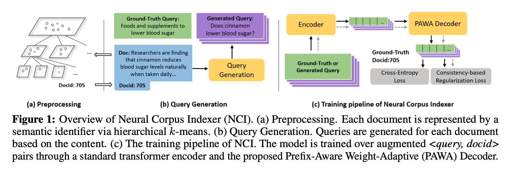
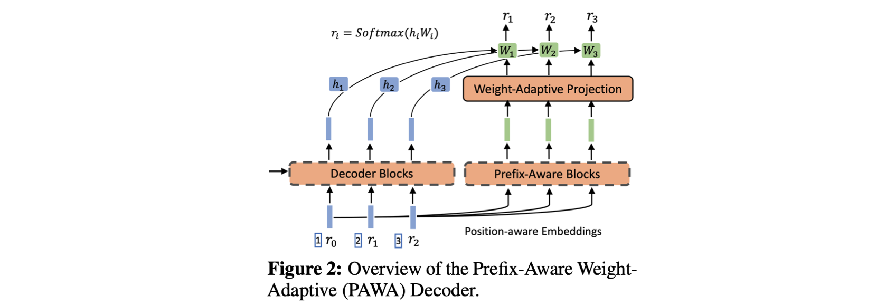
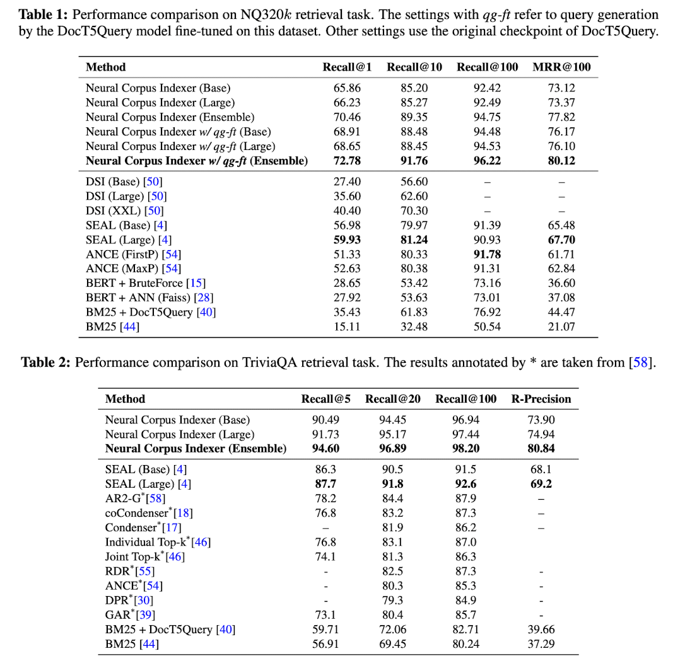

> This post summarizes the paper 'A Neural Corpus Indexer for Document Retrieval' presented at NeurIPS 2022.

### Introduction

Document retrieval and ranking are key stages in web search engines. This paper proposes an end-to-end deep learning approach for document retrieval and achieves significant performance improvements over previous methods.

Document retrieval is generally divided into term-based methods and semantic-based methods. Term-based methods, such as TF-IDF, have difficulty extracting semantic information from documents, and similar documents using different words may fail to be retrieved. For semantic-based methods, the most representative approach is ANN (Approximate Nearest Neighbor) based on search query and document representations, but this also struggles to capture all the semantics of a document in a single vector and requires expressing queries and documents in the same space.

Therefore, the authors of this paper propose several sophisticated methods to address these shortcomings and achieve high performance.

1. Semantic identifier: Uses hierarchical k-means to create identifiers (docids) that effectively capture document semantics.
2. Query generation: Generates queries that well represent documents and uses them for model training.
3. Prefix-aware weight-adaptive decoder: Adjusts decoder weights according to the hierarchy level.
4. Consistency-based regularization loss: Prevents over-fitting during training.

### Neural Corpus Indexer

<i>Taken From Wang et al.</i>

The Neural Corpus Indexer (NCI) is a sequence-to-sequence model. NCI takes a search query as input and outputs a document identifier (docid). Therefore, model training is performed on a large number of \<query, docid\> pairs.

##### Document Representation with Semantic Identifiers

First, a docid must be assigned to every document. The authors wanted similar documents to have close docids, so they employed hierarchical clustering.

All documents are first vectorized using BERT. Then, hierarchical k-means clustering is applied to these document vectors. With $r_i \in [0,k)$ and the routing path defined as $l=\{r_0, r_1, ..., r_m\}$, every document can be represented as a tree structure starting from root $r_0$. To illustrate, docid=012 and docid=013 are documents that belong to the same cluster at levels 0 and 1. The authors report that $k=30, c=30$ was used in all experiments, where $c$ is the number of documents in a single cluster.

##### Query Generation

To accurately find the correct document identifier from only a search query as input, one must consider how the vector can recognize document semantics and generate identifiers.

To achieve this, document semantics need to be well conveyed to the model during training. The authors propose a query generation step that takes document information as input and produces multiple queries. Here, DocT5Query and Document As Query methods were used, and the generated queries are utilized in the training loss (used in both cross-entropy and consistency-based loss).

##### Prefix-Aware Weight-Adaptive Decoder

<i>Taken From Wang et al.</i>

The process of predicting a docid for a given input query is expressed by the following equation.
$$
p(l \mid x, \theta)=\prod_{i=1}^m p\left(r_i \mid x, r_1, r_2, \ldots, r_{i-1}, \theta_i\right)
$$
Just as $5_2$ and $5_3$ differ in $3_15_25_3$, and $1_11_25_3$ and $2_14_25_3$ are different from each other, to recognize that tokens change depending on the tree level and prefix, identifiers like $3_15_25_3$ are first represented in the form (1,3)(2,5)(3,5).

Then, to enable the decoder to recognize different prefixes, a weight $W_{ada}$ that varies according to the prefix is created, multiplied with the token embedding, and softmax is applied to produce the docid at each tree level.
$$
W_{a d a}^i=\text { AdaptiveDecoder }\left(e ; r_1, r_2, \ldots, r_{i-1}\right) W_i
$$

##### Training and Inference

During training, consistency-based regularization and cross-entropy loss are applied to both search queries and document queries generated through query generation to train the model.
$$
\mathcal{L}_{\text {reg }}=-\log \frac{\exp \left(\operatorname{sim}\left(\mathbf{z}_{i, 1}, \mathbf{z}_{i, 2}\right) / \tau\right)}{\sum_{k=1, k \neq 2}^{2 Q} \exp \left(\operatorname{sim}\left(\left(\mathbf{z}_{i, 1}, \mathbf{z}_{i, k}\right) / \tau\right)\right.}
$$

$$
\mathcal{L}(\theta)=\sum_{(q, d) \in \mathcal{D}}\left(\log p(d \mid E(q), \theta)+\alpha \mathcal{L}_{r e g}\right)
$$

During inference, the query embedding is first extracted through the encoder network, and then beam search is performed in the decoder network. An explanation of beam search can be found [here](https://en.wikipedia.org/wiki/Beam_search), and detailed pseudocode is available in Appendix B3 of the paper.

### Experiments

The Natural Questions and TriviaQA datasets were used, consisting of 320k and 78k query-document pairs respectively. The metrics used were Recall@N, MRR (Mean Reciprocal Rank), and R-precision, all of which measure how well documents are retrieved for a given query.

<i>Taken From Wang et al.</i>

### Conclusion

While NCI achieved significant performance improvements, several limitations remain. First, at real web scale (as opposed to open datasets), the number of documents is much larger, requiring greater model capacity. Second, fast inference speed is required for real-time usage. Finally, adding new documents to the system is cumbersome. Each time a document is added, the semantic identifiers for all documents need to be reassigned through hierarchical clustering.
